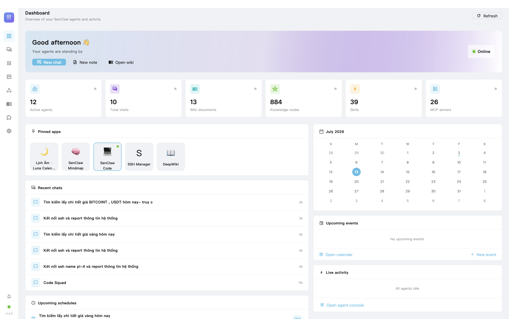
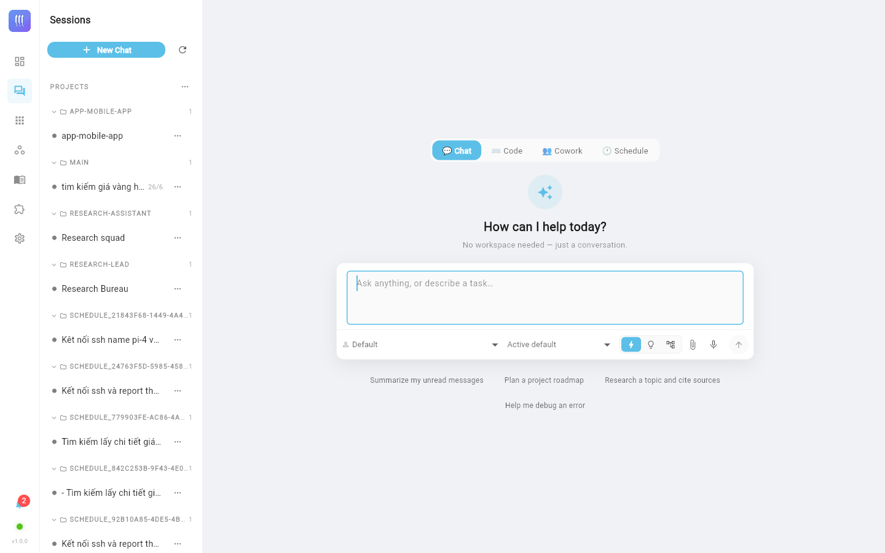
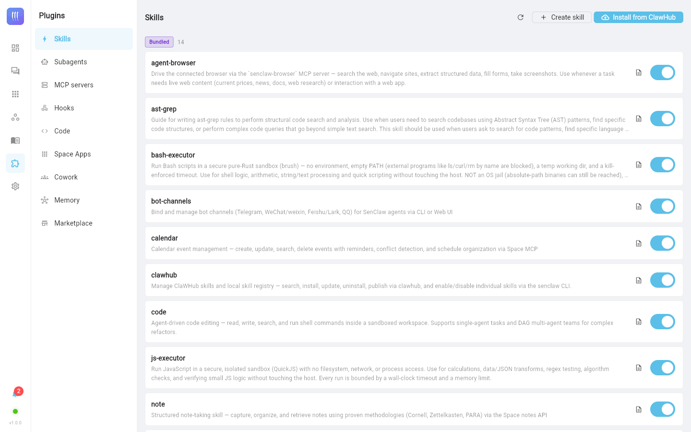
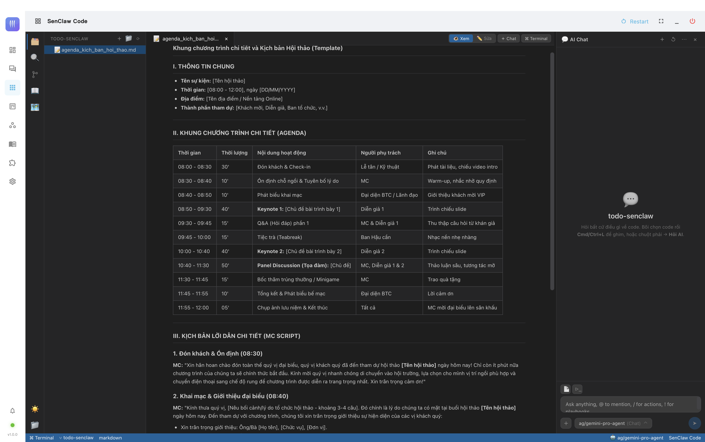

<p align="center">
  
</p>

<h1 align="center">SenClaw</h1>

<p align="center">
  <em>A general-purpose framework for personal AI agents.</em>
</p>

<p align="center">
  <a href="https://github.com/NortonBen/SenClaw/releases/latest"></a>
  <a href="https://github.com/NortonBen/SenClaw/actions/workflows/desktop.yml"></a>
  <a href="LICENSE"></a>
</p>

<p align="center">
  <strong>English</strong> · <a href="README.vi.md">Tiếng Việt</a>
</p>

SenClaw provides the runtime machinery around large language models: permissions, memory, scheduling, multi-agent orchestration, channel adapters, Space Apps, local model support, and a desktop app. It turns a raw model provider or local model into a practical personal AI system.

---

## About

SenClaw is a **local-first personal AI workstation**: a single Rust daemon that hosts your agents, and a native Flutter desktop app that supervises it. Your data — chats, notes, calendar, memories, wiki — lives in SQLite under `~/.senclaw/` on your machine; the model can be a cloud provider **or run fully offline** on Apple Silicon via MLX.

What that adds up to:

- **One assistant, everywhere** — talk to the same agents from the desktop app, Telegram / Feishu / QQ, the mobile app (relay), or the browser extension.
- **Agents that do real work** — tool permissions with human-in-the-loop approval, Plan mode, and DAG multi-agent teams (Cowork) for larger tasks.
- **Memory that compounds** — a cognitive knowledge graph plus curated `memory/*.md` files that are consolidated automatically when context is compacted, and recalled into future turns.
- **A personal Space** — notes, calendar with reminders that fire as native notifications, and recurring schedules that run agents on cron.
- **Space Apps** — installable full-stack mini-apps (SSH Manager, DeepWiki, Email, …) that ship their own UI, MCP tools, and skills.
- **Local models** — native MLX inference for LLMs (Gemma, Qwen, DeepSeek, …), Whisper speech-to-text, TTS, OCR, and embeddings — no GPU cloud required.

### Screenshots

| Dashboard | Chat |
| --- | --- |
|  |  |

| Plugins (Skills / MCP / Subagents) | Space (Notes · Calendar · Schedules) |
| --- | --- |
|  |  |

---

## Highlights

- **Personal agent runtime**: agent lifecycle, tool permissions, clarification flow, workspace state, and per-agent personas.
- **Memory and knowledge**: hybrid FTS/vector memory, curated auto-memory, daily logs, and a Git-backed personal wiki.
- **Multi-agent orchestration**: DAG team execution, virtual workers, dispatch bridge, and subagent support.
- **Scheduled work**: notification, script, agent, and script-plus-agent task modes.
- **Multi-channel gateway**: Telegram, Feishu/Lark, QQ, WeChat, WebSocket, HTTP API, and Web UI.
- **Space Apps**: isolated micro-apps such as SSH Manager, DeepWiki, Email, Google Workspace, and Test Manager that expose tools through MCP.
- **Local AI options**: MLX/Candle local inference, local embeddings, OCR, Whisper speech-to-text, and local TTS.
- **Desktop app**: native Flutter app (macOS/Windows/Linux/web) that supervises the daemon as a child process.

---

## Quick Start

### 1. Clone

```bash
git clone https://github.com/NortonBen/SenClaw.git
cd SenClaw
```

### 2. Build the Web UI

```bash
cd web
npm install
npm run build
cd ..
```

### 3. Build and run the daemon

```bash
cargo run
```

For an optimized build:

```bash
cargo build --release
./target/release/senclaw
```

Then open the Web UI:

```bash
open http://127.0.0.1:18788
```

On Linux, open the same URL in your browser manually if `open` is unavailable.

---

## Configuration

SenClaw can start in Web UI-only mode, but agent runs need at least one LLM profile. On first launch, open:

```text
Settings -> LLM
```

Add a provider profile such as OpenAI, Anthropic, DeepSeek, Qwen, OpenRouter, Ollama, or a compatible API endpoint. The profile is stored in:

```text
~/.senclaw/config.json
```

Channel and runtime settings can be configured through `.env`:

```bash
cp .env.example .env
```

Common values:

```env
TELEGRAM_BOT_TOKEN=
ADMIN_TELEGRAM_USER_ID=
FEISHU_APP_ID=
FEISHU_APP_SECRET=
QQ_APP_ID=
QQ_APP_SECRET=
GATEWAY_UI_PORT=18788
GATEWAY_PORT=18789
MAX_CONCURRENT_AGENTS=5
MAX_MESSAGES_PER_GROUP=100
SCHEDULER_INTERVAL_SEC=60
```

If channel tokens are left empty, SenClaw can still be used from the Web UI.

---

## Common Commands

```bash
# Check Rust code
cargo check

# Run Rust tests
cargo test

# Run the daemon
cargo run

# Run with local model features used by the Makefile
make run

# Run an optimized local-model build
make run-release

# Start the Web UI dev server
make run-web

# Build the browser extension
make build-extension
```

---

## Desktop App

SenClaw ships a native **Flutter** desktop app in `desktop_app/` (macOS / Windows / Linux / web). It replaces the former Tauri shell: instead of embedding a WebView, it talks to the daemon directly over HTTP/WebSocket and **supervises the `senclaw` daemon as a child process** (spawns the bundled binary, streams its logs, restarts it on demand).

On launch the app shows a **startup gate**: if a daemon is already running it opens straight into the UI; otherwise it spawns the bundled daemon, waits until the HTTP API answers, then switches to the main screen (with a retryable error screen if the daemon can't start).

```bash
# Development (runs the Flutter app; it adopts a running daemon or spawns one)
make app-dev

# Production bundle (builds the daemon with the full Apple-Silicon feature set
# — MLX LLM, Whisper ASR, TTS, OCR Metal, embeddings — and bundles the binary
# into Contents/Resources so the supervisor can launch it)
make app-build          # macOS
make app-build-windows  # Windows
make app-build-linux    # Linux
make app-build-web      # web

# Install the freshly-built .app into /Applications and launch it (macOS)
make app-install
```

---

## Runtime Layout

By default, SenClaw stores runtime data under the user's home directory:

```text
~/.senclaw/
├── senclaw.db
├── config.json
├── dispatch-state.json
└── workspace-state-{folder}.json

~/senclaw/
├── agents/{folder}/
│   ├── SOUL.md
│   ├── memory/
│   └── .sema/sessions/
├── workspace/{folder}/
└── wiki/
```

Most paths can be overridden through `.env` or `~/.senclaw/config.json`.

---

## Project Structure

```text
SenClaw/
├── src/                    # Rust daemon and core runtime
│   ├── agent/              # Agent lifecycle, permissions, personas, dispatch
│   ├── channels/           # Telegram, Feishu/Lark, QQ, WeChat adapters
│   ├── gateway/            # HTTP, WebSocket, routing, UI server
│   ├── mcp/                # MCP servers exposed to agents
│   ├── memory/             # FTS/vector memory, curated memory, daily logs
│   ├── scheduler/          # Cron, interval, and one-shot tasks
│   ├── local_model/        # MLX/Candle local model support
│   ├── code_graph/         # Tree-sitter code indexing
│   ├── code_engine/        # Code-oriented agent runtime
│   ├── plugins/            # Plugin support
│   └── wiki/               # Git-backed knowledge base
├── web/                    # React + Vite Web UI (legacy; served by the daemon)
├── desktop_app/            # Flutter desktop app (macOS/Windows/Linux/web)
├── apps/                   # Space Apps
├── app-space-sdk/          # SDK for building Space Apps
├── examples/               # Example apps and SDK usage
├── skills/                 # Bundled skills
├── docs/                   # Architecture and feature docs
└── senclaw-extension-chrome/ # Chrome extension
```

---

## Documentation

| Document | Description |
|---|---|
| [Quick Start](docs/QUICK_START.md) | Setup, runtime layout, and usage notes. |
| [Architecture](docs/ARCHITECTURE.md) | System layers, startup flow, and data flow. |
| [Memory](docs/memory.md) | Memory design and retrieval flow. |
| [DAG Team](docs/DAG_Team.md) | Multi-agent task decomposition and execution. |
| [Space Apps](docs/workspace-feature-design.md) | How Space Apps are designed and registered. |
| [Code Knowledge Graph](docs/code-knowledge-graph.md) | Tree-sitter based code indexing. |
| [Prompt Injection Security](docs/prompt-injection-security.md) | Security notes for tool and prompt boundaries. |

---

## Development Notes

SenClaw is primarily a Rust workspace. The Web UI is a React/Vite application under `web/`, and several Space Apps have their own package manifests under `apps/`.

Useful feature builds:

```bash
# Local embeddings
cargo build --features local-embed

# Local embeddings with Apple Silicon Metal
cargo build --features local-embed-metal

# Local Candle runtime
cargo build --features local-candle

# Local MLX runtime
cargo build --features local-mlx
```

Some local model, OCR, audio, and TTS features require platform-specific dependencies. Start with `cargo check` or the default `cargo run` path before enabling optional heavy features.

---

## Contributing

Issues, pull requests, experiments, and design discussions are welcome. Please keep changes focused, document behavior that affects users, and include tests for risky runtime changes.

---

## License

[MIT](LICENSE)

---

## Acknowledgments

SenClaw is a Rust rewrite that grew out of — and is deeply inspired by — [**SemaClaw**](https://github.com/midea-ai/SemaClaw) (midea-ai), the original TypeScript multi-channel AI agent gateway. It runs on the [sema-code-core](https://github.com/midea-ai/sema-code-core) agent runtime.

SenClaw also integrates with the [ClaWHub](https://github.com/openclaw/clawhub) plugin marketplace and takes inspiration from [OpenClaw](https://github.com/openclaw/openclaw), the [Model Context Protocol](https://modelcontextprotocol.io), and the broader open-source agent tooling ecosystem.
