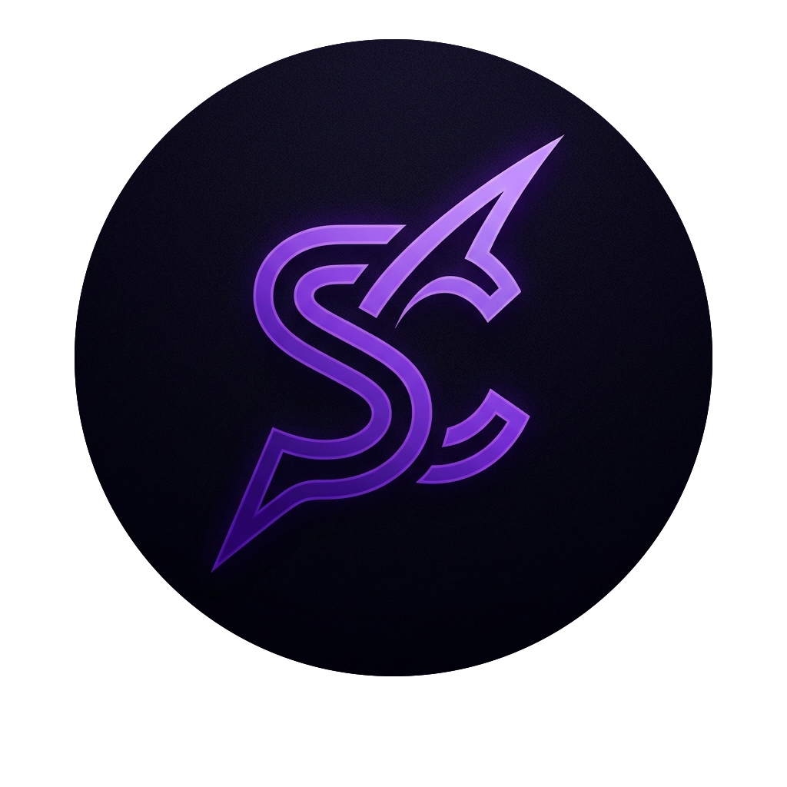

<p align="center">
  
</p>

<h1 align="center">SenClaw</h1>

<p align="center">
  <em>A general-purpose framework for personal AI agents.</em><br />
  <em>Một framework đa năng để xây dựng AI agent cá nhân.</em>
</p>

<p align="center">
  <a href="https://github.com/midea-ai/SenClaw/releases/latest"></a>
  <a href="https://github.com/midea-ai/SenClaw/actions/workflows/desktop.yml"></a>
  <a href="LICENSE"></a>
</p>

<p align="center">
  <strong>English</strong> · <strong>Tiếng Việt</strong>
</p>

SenClaw provides the runtime machinery around large language models: permissions, memory, scheduling, multi-agent orchestration, channel adapters, Space Apps, local model support, and a Web UI. It turns a raw model provider or local model into a practical personal AI system.

SenClaw cung cấp lớp hạ tầng chạy quanh mô hình ngôn ngữ lớn: phân quyền, bộ nhớ, tác vụ định kỳ, điều phối nhiều agent, kết nối nhiều kênh chat, Space Apps, mô hình chạy cục bộ và Web UI. Mục tiêu là biến một model provider hoặc local model thành một hệ thống AI cá nhân có thể dùng hằng ngày.

---

## Highlights / Điểm nổi bật

- **Personal agent runtime**: agent lifecycle, tool permissions, clarification flow, workspace state, and per-agent personas.
  **Runtime cho agent cá nhân**: quản lý vòng đời agent, quyền dùng tool, luồng hỏi lại người dùng, trạng thái workspace và persona riêng cho từng agent.
- **Memory and knowledge**: hybrid FTS/vector memory, daily logs, and a Git-backed personal wiki.
  **Bộ nhớ và tri thức**: bộ nhớ lai FTS/vector, nhật ký hằng ngày và wiki cá nhân quản lý bằng Git.
- **Multi-agent orchestration**: DAG team execution, virtual workers, dispatch bridge, and subagent support.
  **Điều phối nhiều agent**: chạy team theo DAG, virtual workers, dispatch bridge và hỗ trợ subagent.
- **Scheduled work**: notification, script, agent, and script-plus-agent task modes.
  **Tác vụ định kỳ**: hỗ trợ chế độ thông báo, script, agent và script kết hợp agent.
- **Multi-channel gateway**: Telegram, Feishu/Lark, QQ, WeChat, WebSocket, HTTP API, and Web UI.
  **Gateway đa kênh**: Telegram, Feishu/Lark, QQ, WeChat, WebSocket, HTTP API và Web UI.
- **Space Apps**: isolated micro-apps such as SSH Manager, Email, Google Workspace, Browser, and Test Manager that expose tools through MCP.
  **Space Apps**: các micro-app tách biệt như SSH Manager, Email, Google Workspace, Browser và Test Manager, cung cấp tool qua MCP.
- **Local AI options**: MLX/Candle local inference, local embeddings, OCR, Whisper-style audio, and local TTS features.
  **Tùy chọn AI cục bộ**: inference bằng MLX/Candle, embedding cục bộ, OCR, audio kiểu Whisper và TTS local.
- **Desktop app**: Tauri shell for packaging SenClaw as a desktop application.
  **Ứng dụng desktop**: dùng Tauri để đóng gói SenClaw thành app desktop.

---

## Quick Start / Chạy nhanh

### 1. Clone / Tải mã nguồn

```bash
git clone https://github.com/midea-ai/SenClaw.git
cd SenClaw
```

### 2. Build the Web UI / Build giao diện Web

```bash
cd web
npm install
npm run build
cd ..
```

### 3. Build and run the daemon / Build và chạy daemon

```bash
cargo run
```

For an optimized build:

Để build bản tối ưu:

```bash
cargo build --release
./target/release/senclaw
```

Then open the Web UI:

Sau đó mở Web UI:

```bash
open http://127.0.0.1:18788
```

On Linux, open the same URL in your browser manually if `open` is unavailable.

Trên Linux, nếu không có lệnh `open`, hãy mở URL trên bằng trình duyệt.

---

## Configuration / Cấu hình

SenClaw can start in Web UI-only mode, but agent runs need at least one LLM profile. On first launch, open:

SenClaw có thể chạy ở chế độ chỉ Web UI, nhưng các phiên agent cần ít nhất một cấu hình LLM. Sau khi chạy lần đầu, mở:

```text
Settings -> LLM
```

Add a provider profile such as OpenAI, Anthropic, DeepSeek, Qwen, OpenRouter, Ollama, or a compatible API endpoint. The profile is stored in:

Thêm một provider như OpenAI, Anthropic, DeepSeek, Qwen, OpenRouter, Ollama hoặc endpoint tương thích. Cấu hình được lưu tại:

```text
~/.senclaw/config.json
```

Channel and runtime settings can be configured through `.env`:

Các thiết lập kênh chat và runtime có thể cấu hình qua `.env`:

```bash
cp .env.example .env
```

Common values:

Một số giá trị thường dùng:

```env
TELEGRAM_BOT_TOKEN=
ADMIN_TELEGRAM_USER_ID=
FEISHU_APP_ID=
FEISHU_APP_SECRET=
QQ_APP_ID=
QQ_APP_SECRET=
GATEWAY_UI_PORT=18788
GATEWAY_PORT=18789
MAX_CONCURRENT_AGENTS=5
MAX_MESSAGES_PER_GROUP=100
SCHEDULER_INTERVAL_SEC=60
```

If channel tokens are left empty, SenClaw can still be used from the Web UI.

Nếu không cấu hình token cho các kênh chat, SenClaw vẫn có thể dùng qua Web UI.

---

## Common Commands / Lệnh thường dùng

```bash
# Check Rust code
cargo check

# Run Rust tests
cargo test

# Run the daemon
cargo run

# Run with local model features used by the Makefile
make run

# Run an optimized local-model build
make run-release

# Start the Web UI dev server
make run-web

# Build the browser extension
make build-extension
```

```bash
# Kiểm tra code Rust
cargo check

# Chạy test Rust
cargo test

# Chạy daemon
cargo run

# Chạy với các feature local model theo Makefile
make run

# Chạy bản tối ưu cho local model
make run-release

# Chạy Web UI ở chế độ dev
make run-web

# Build browser extension
make build-extension
```

---

## Desktop App / Ứng dụng desktop

SenClaw includes a Tauri desktop shell in `src-tauri/`.

SenClaw có desktop shell Tauri trong `src-tauri/`.

```bash
# Development
make app-dev

# Production bundle
make app-build
```

`make app-build` builds the Web UI, builds the `senclaw` sidecar binary, places it under `src-tauri/binaries/`, and runs `cargo tauri build`.

`make app-build` sẽ build Web UI, build binary sidecar `senclaw`, đặt nó vào `src-tauri/binaries/`, rồi chạy `cargo tauri build`.

---

## Runtime Layout / Cấu trúc dữ liệu runtime

By default, SenClaw stores runtime data under the user's home directory:

Mặc định SenClaw lưu dữ liệu runtime trong home directory:

```text
~/.senclaw/
├── senclaw.db
├── config.json
├── dispatch-state.json
└── workspace-state-{folder}.json

~/senclaw/
├── agents/{folder}/
│   ├── SOUL.md
│   ├── memory/
│   └── .sema/sessions/
├── workspace/{folder}/
└── wiki/
```

Most paths can be overridden through `.env` or `~/.senclaw/config.json`.

Hầu hết đường dẫn có thể ghi đè qua `.env` hoặc `~/.senclaw/config.json`.

---

## Project Structure / Cấu trúc dự án

```text
SenClaw/
├── src/                    # Rust daemon and core runtime
│   ├── agent/              # Agent lifecycle, permissions, personas, dispatch
│   ├── channels/           # Telegram, Feishu/Lark, QQ, WeChat adapters
│   ├── gateway/            # HTTP, WebSocket, routing, UI server
│   ├── mcp/                # MCP servers exposed to agents
│   ├── memory/             # FTS/vector memory and daily logs
│   ├── scheduler/          # Cron, interval, and one-shot tasks
│   ├── local_model/        # MLX/Candle local model support
│   ├── code_graph/         # Tree-sitter code indexing
│   ├── code_engine/        # Code-oriented agent runtime
│   ├── plugins/            # Plugin support
│   └── wiki/               # Git-backed knowledge base
├── web/                    # React + Vite Web UI
├── src-tauri/              # Tauri desktop app
├── apps/                   # Space Apps
├── app-space-sdk/          # SDK for building Space Apps
├── examples/               # Example apps and SDK usage
├── skills/                 # Bundled skills
├── docs/                   # Architecture and feature docs
└── senclaw-extension-chrome/ # Chrome extension
```

---

## Documentation / Tài liệu

| Document | English | Tiếng Việt |
|---|---|---|
| [Quick Start](docs/QUICK_START.md) | Setup, runtime layout, and usage notes. | Cài đặt, cấu trúc runtime và ghi chú sử dụng. |
| [Architecture](docs/ARCHITECTURE.md) | System layers, startup flow, and data flow. | Các lớp hệ thống, luồng khởi động và luồng dữ liệu. |
| [Memory](docs/memory.md) | Memory design and retrieval flow. | Thiết kế bộ nhớ và luồng truy xuất. |
| [DAG Team](docs/DAG_Team.md) | Multi-agent task decomposition and execution. | Phân rã và thực thi tác vụ nhiều agent. |
| [Space Apps](docs/workspace-feature-design.md) | How Space Apps are designed and registered. | Cách thiết kế và đăng ký Space Apps. |
| [Code Knowledge Graph](docs/code-knowledge-graph.md) | Tree-sitter based code indexing. | Lập chỉ mục code bằng Tree-sitter. |
| [Prompt Injection Security](docs/prompt-injection-security.md) | Security notes for tool and prompt boundaries. | Ghi chú bảo mật cho ranh giới tool và prompt. |

---

## Development Notes / Ghi chú phát triển

SenClaw is primarily a Rust workspace. The Web UI is a React/Vite application under `web/`, and several Space Apps have their own package manifests under `apps/`.

SenClaw chủ yếu là một Rust workspace. Web UI là ứng dụng React/Vite trong `web/`, còn một số Space Apps có manifest riêng trong `apps/`.

Useful feature builds:

Một số build feature hữu ích:

```bash
# Local embeddings
cargo build --features local-embed

# Local embeddings with Apple Silicon Metal
cargo build --features local-embed-metal

# Local Candle runtime
cargo build --features local-candle

# Local MLX runtime
cargo build --features local-mlx
```

Some local model, OCR, audio, and TTS features require platform-specific dependencies. Start with `cargo check` or the default `cargo run` path before enabling optional heavy features.

Một số feature cho local model, OCR, audio và TTS cần dependency riêng theo nền tảng. Nên bắt đầu bằng `cargo check` hoặc `cargo run` mặc định trước khi bật các feature nặng.

---

## Contributing / Đóng góp

Issues, pull requests, experiments, and design discussions are welcome. Please keep changes focused, document behavior that affects users, and include tests for risky runtime changes.

Bạn có thể đóng góp bằng issue, pull request, thử nghiệm hoặc thảo luận thiết kế. Hãy giữ thay đổi gọn theo mục tiêu, ghi lại hành vi có ảnh hưởng tới người dùng và thêm test cho các thay đổi runtime có rủi ro.

---

## License / Giấy phép

[MIT](LICENSE) © AIRC Sema Team

---

## Acknowledgments / Ghi nhận

SenClaw integrates with the [ClaWHub](https://github.com/openclaw/clawhub) plugin marketplace and is inspired by [OpenClaw](https://github.com/openclaw/openclaw), the [Model Context Protocol](https://modelcontextprotocol.io), and the broader open-source agent tooling ecosystem.

SenClaw tích hợp với marketplace plugin [ClaWHub](https://github.com/openclaw/clawhub), lấy cảm hứng từ [OpenClaw](https://github.com/openclaw/openclaw), [Model Context Protocol](https://modelcontextprotocol.io) và hệ sinh thái công cụ agent mã nguồn mở.
