# SemaClaw Architecture & Design Document

> Tài liệu phân tích kiến trúc và luồng hoạt động của SemaClaw (TypeScript reference implementation `src-old/`).

---

## 1. Tổng quan hệ thống

SemaClaw là một **multi-agent orchestration framework** chạy trên [sema-code-core](https://github.com/midea-ai/sema-code-core). Nó kết nối nhiều kênh chat (Telegram, Feishu, QQ, WeChat) vào các AI agent, cung cấp quản lý bộ nhớ, lập lịch tác vụ, wiki, và Web UI real-time.

### 1.1. Các thành phần chính

| Layer | Module | Vai trò |
|-------|--------|---------|
| **Channels** | `telegram.ts`, `feishu.ts`, `qq.ts`, `wechat.ts` | Kết nối các nền tảng chat, chuẩn hóa message về `IncomingMessage` |
| **Gateway** | `MessageRouter.ts`, `GroupManager.ts`, `TriggerChecker.ts`, `CommandDispatcher.ts` | Định tuyến message, quản lý group, phát hiện trigger, xử lý lệnh admin |
| **Agent** | `AgentPool.ts`, `GroupQueue.ts`, `SessionBridge.ts`, `PermissionBridge.ts`, `SendBridge.ts` | Vòng đời agent, hàng đợi tin nhắn, prompt builder, cầu nối quyền |
| **Dispatch** | `DispatchBridge.ts`, `PersonaRegistry.ts`, `VirtualWorkerPool.ts` | Điều phối DAG task, quản lý persona agent ảo, tạo agent tạm thời |
| **Scheduler** | `TaskScheduler.ts` | Lập lịch cron/interval/once, 5 chế độ context |
| **Memory** | `MemoryManager.ts`, `fts-search.ts`, `embedding.ts`, `chunker.ts`, `query-rewrite.ts` | FTS5 full-text search + vector similarity, lập chỉ mục, tìm kiếm lai |
| **MCP** | `mcpHelper.ts` + 8 MCP servers | Công cụ cho agent: schedule, workspace, memory, dispatch, send, virtual, feishu-wiki, admin |
| **DB** | `db/db.ts` | SQLite (WAL mode): groups, channel_messages, scheduled_tasks, task_run_logs, router_state |
| **Wiki** | `WikiManager.ts` | Knowledge base quản lý bởi git |
| **ClawHub** | `auth.ts`, `client.ts`, `lockfile.ts`, `signal.ts` | Marketplace kỹ năng cho agent |
| **Web UI** | `WebSocketGateway.ts`, `UIServer.ts` | WebSocket real-time + HTTP REST API + React frontend |
| **CLI** | `cli/commands/` | Quản lý channel, skills, clawhub, wiki qua dòng lệnh |

---

## 2. Kiến trúc tổng thể

```mermaid
graph TB
    subgraph "External Channels"
        TG[Telegram]
        FS[Feishu/Lark]
        QQ[QQ Bot]
        WX[WeChat iLink]
    end

    subgraph "Channel Adapters"
        TGC[TelegramChannel]
        FSC[FeishuChannel]
        QQC[QQChannel]
        WXC[WeChatChannel]
    end

    subgraph "Gateway Layer"
        MR[MessageRouter]
        GM[GroupManager]
        TC[TriggerChecker]
        CD[CommandDispatcher]
    end

    subgraph "Agent Layer"
        GQ[GroupQueue]
        AP[AgentPool]
        SB[SessionBridge]
        PB[PermissionBridge]
        SndB[SendBridge]
    end

    subgraph "Dispatch Layer"
        DBr[DispatchBridge]
        PR[PersonaRegistry]
        VWP[VirtualWorkerPool]
    end

    subgraph "Infrastructure"
        DB[(SQLite)]
        TS[TaskScheduler]
        MM[MemoryManager]
        WM[WikiManager]
        WSG[WebSocketGateway]
        UI[UIServer]
    end

    subgraph "MCP Servers"
        MCP_SCH[schedule-server]
        MCP_WS[workspace-server]
        MCP_MEM[memory-server]
        MCP_DIS[dispatch-server]
        MCP_SND[send-server]
        MCP_VRT[virtual-server]
        MCP_FW[feishu-wiki-server]
        MCP_ADM[admin-server]
    end

    TG --> TGC
    FS --> FSC
    QQ --> QQC
    WX --> WXC

    TGC & FSC & QQC & WXC -->|IncomingMessage| MR
    MR --> GM
    MR --> TC
    MR --> CD
    MR -->|enqueue| GQ
    MR --> DB

    GQ -->|dequeue| AP
    AP --> SB
    AP --> PB
    AP --> SndB
    AP -->|reply| TGC & FSC & QQC & WXC

    AP <--> MCP_SCH & MCP_WS & MCP_MEM & MCP_DIS & MCP_SND & MCP_VRT & MCP_FW & MCP_ADM

    DBr --> PR
    DBr --> VWP
    DBr <--> DB

    TS --> DB
    TS --> GQ

    MM --> DB

    WSG --> UI
    WSG <--> AP
    WSG <--> MR
```

---

## 3. Luồng khởi động (Startup Sequence)

Trình tự khởi động được định nghĩa trong `src-old/index.ts::main()`:

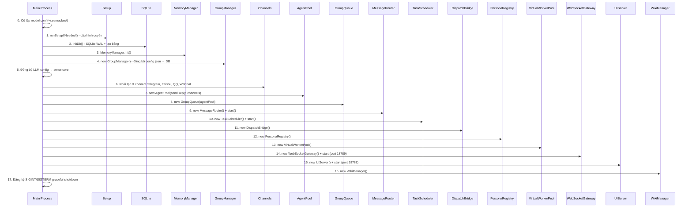

---

## 4. Luồng xử lý tin nhắn chính

Đây là luồng quan trọng nhất: từ khi người dùng gửi tin nhắn đến khi agent phản hồi.

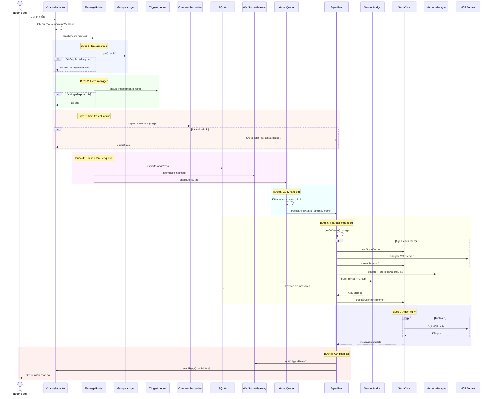

---

## 5. Hệ thống Agent

### 5.1. AgentPool — Quản lý vòng đời Agent

Mỗi group có **một** instance `SemaCore` riêng, được tạo lười (lazy init).

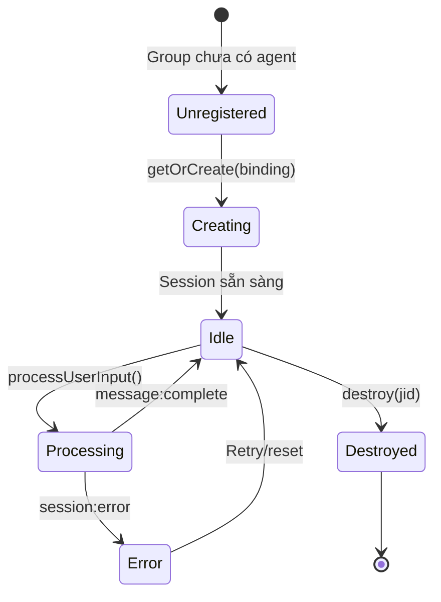

### 5.2. GroupQueue — Hàng đợi tin nhắn

- **Per-group FIFO**: Mỗi group có một hàng đợi riêng, đảm bảo thứ tự tin nhắn
- **Global concurrency cap**: Giới hạn số agent xử lý đồng thời (`MAX_CONCURRENT_AGENTS`, mặc định 5)
- Tin nhắn đến khi agent đang bận được xếp hàng và xử lý tuần tự

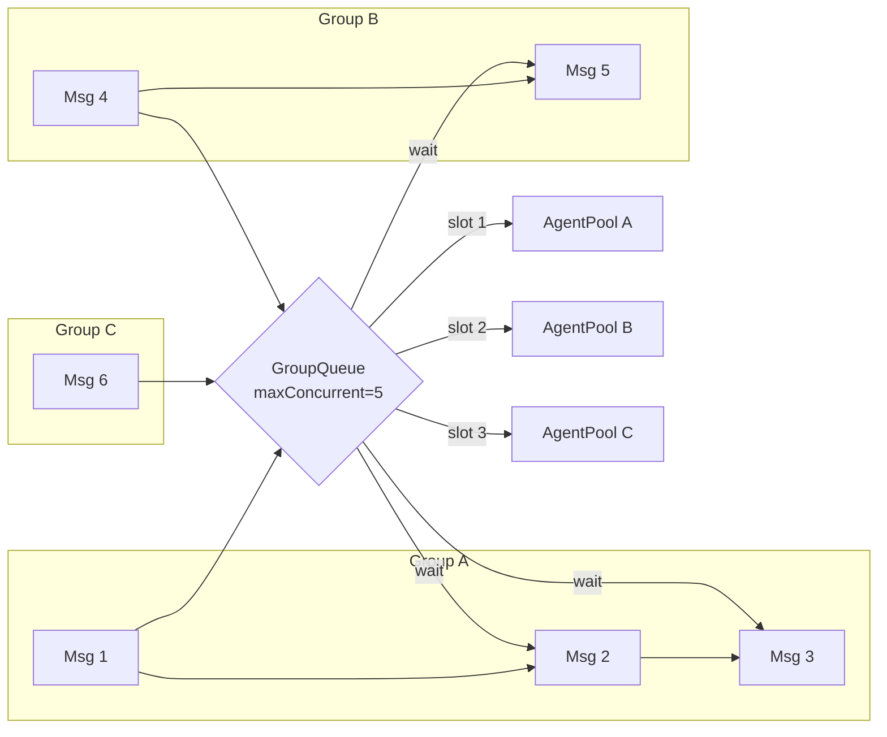

### 5.3. SessionBridge — Xây dựng Prompt

Chuyển đổi lịch sử tin nhắn từ SQLite thành XML prompt cho SemaCore:

```
DB messages → XML format → Prompt gửi vào SemaCore
```

Bao gồm:
- Lịch sử hội thoại gần đây (tối đa `maxMessagesPerGroup`, mặc định 100)
- System prompt từ file cấu hình agent
- Dispatch context hint (nếu có dispatch task đang chạy)
- Memory search results (nếu bật pre-retrieval)

---

## 6. Hệ thống Dispatch (Điều phối DAG Task)

Cho phép main agent phân tách công việc lớn thành các task con, phân công cho sub-agent và virtual agent.

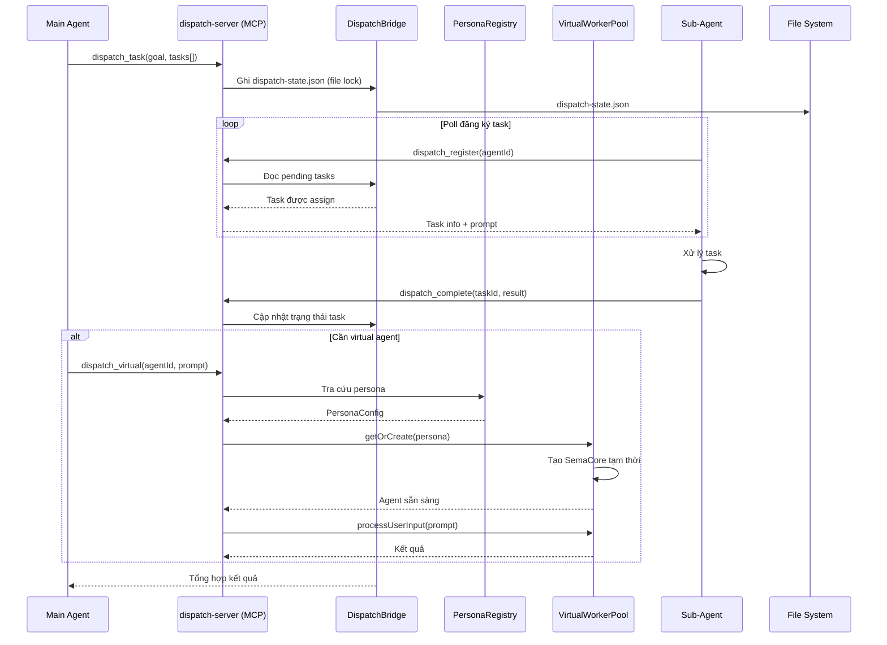

### 6.1. Cấu trúc Dispatch State

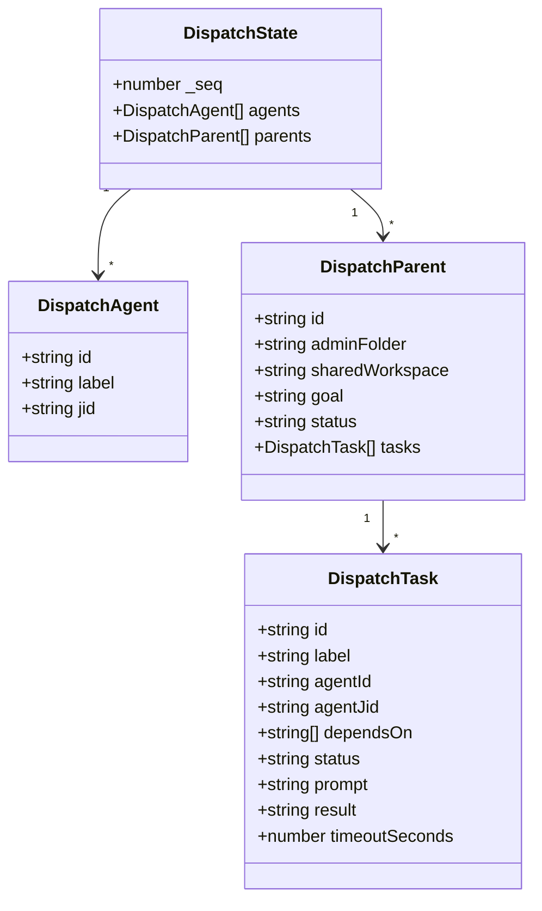

---

## 7. TaskScheduler — Lập lịch tác vụ

### 7.1. 5 Chế độ Context

```mermaid
flowchart TD
    TS[TaskScheduler.tick()] --> DB[getDueTasks() từ SQLite]
    DB --> CHECK{contextMode?}

    CHECK -->|notify| NOTIFY[Gửi trực tiếp prompt text<br/>qua channel, không cần agent]
    CHECK -->|isolated| ISO[Khởi tạo SemaCore tạm thời<br/>Không có lịch sử chat]
    CHECK -->|group| GRP[Tái sử dụng SemaCore<br/>của group, có context]
    CHECK -->|script| SCR[Chạy bash script<br/>Gửi stdout/stderr]
    CHECK -->|script-agent| SCA[Chạy bash script<br/>Inject output vào prompt<br/>Gửi vào isolated agent]

    NOTIFY --> CH[Gửi qua channel]
    ISO & GRP & SCA --> AP[AgentPool xử lý]
    SCR --> CH
    AP --> CH
```

### 7.2. Chu kỳ lập lịch

1. `TaskScheduler` poll SQLite mỗi `SCHEDULER_INTERVAL_SEC` giây (mặc định 60s)
2. Tìm task có `next_run <= now()` và `status = 'active'`
3. Tính `next_run` tiếp theo (cron parser / interval / once → completed)
4. Enqueue vào `GroupQueue` để xử lý qua `AgentPool`
5. Ghi log vào `task_run_logs`

---

## 8. Memory System

### 8.1. Kiến trúc tìm kiếm

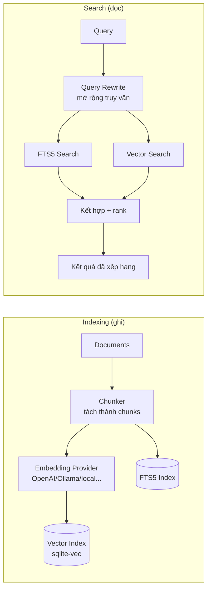

### 8.2. Pre-retrieval

Khi bật `SEMACLAW_PRE_RETRIEVAL=true`:
- Trước mỗi lần agent xử lý, MemoryManager tự động tìm kiếm các chunks liên quan
- Kết quả được inject vào prompt dưới dạng context bổ sung
- Có thể lọc theo `searchMinScore` (mặc định 0.5) và giới hạn `searchMaxResults` (mặc định 5)

### 8.3. Embedding Providers

| Provider | Model mặc định | Dimensions |
|----------|---------------|------------|
| `openai` | text-embedding-3-small | 1536 |
| `openrouter` | openai/text-embedding-3-small | 1536 |
| `ollama` | nomic-embed-text | 1536 |
| `local` | Xenova/transformers.js | 384 |
| `none` | (chỉ FTS5) | — |

---

## 9. Permission Bridge (Cầu nối quyền)

Khi agent cần quyền để thực thi tool (Bash, Write, WebFetch...), hệ thống sẽ:

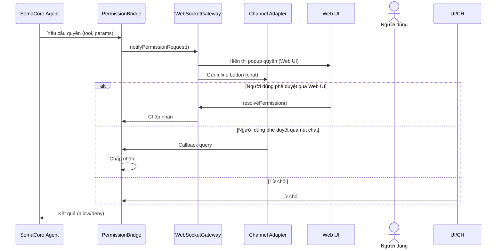

---

## 10. WebSocket Gateway & UI Server

### 10.1. Kiến trúc giao tiếp real-time

```mermaid
flowchart TB
    subgraph "Main Process (port 18789)"
        WSG[WebSocketGateway<br/>ws://127.0.0.1:18789]
    end

    subgraph "Main Process (port 18788)"
        UI[UIServer<br/>HTTP + REST API<br/>http://127.0.0.1:18788]
    end

    subgraph "Web Browser"
        React[React SPA]
        WS[WebSocket Client]
    end

    React -->|HTTP GET| UI
    UI -->|Static files| React
    React -->|WebSocket connect| WSG
    WSG -->|Push events| React

    WSG -.->|Events| React
    Note right of React: incoming_msg<br/>agent_reply<br/>agent_state<br/>permission_request<br/>ask_question_request<br/>agent_todos<br/>agent_compacting<br/>dispatch_update
```

### 10.2. REST API Endpoints (UIServer)

| Endpoint | Mô tả |
|----------|-------|
| `GET /api/config` | Cấu hình groups, channels |
| `GET /api/llm-config` | Cấu hình LLM models |
| `GET /api/skills` | Danh sách skills |
| `GET /api/wiki/tree` | Cây thư mục wiki |
| `GET /api/wiki/page` | Nội dung trang wiki |
| `POST /api/agent/command` | Gửi lệnh admin |
| `GET /api/groups` | Danh sách groups |
| `POST /api/permission/resolve` | Phê duyệt/từ chối quyền |

---

## 11. Hệ thống MCP Servers

Tất cả MCP server chạy dưới dạng **subprocess riêng biệt**, giao tiếp với main process qua **stdio transport**.

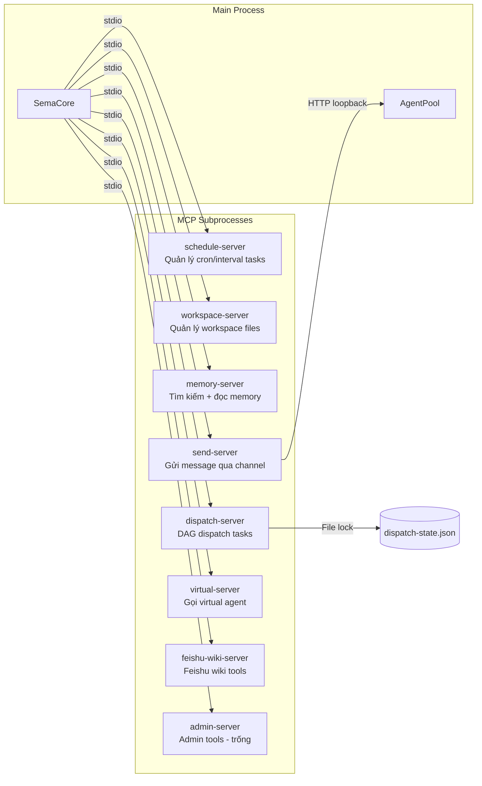

### 11.1. Cơ chế giao tiếp đặc biệt

| Cơ chế | Mô tả |
|--------|-------|
| **stdio** | Giao tiếp chính giữa SemaCore và MCP subprocess |
| **HTTP loopback** | Send-server gửi message qua HTTP đến SendBridge trong main process |
| **File lock** | DispatchBridge và dispatch-server chia sẻ `dispatch-state.json` qua file locking |
| **fs.watchFile** | Workspace tool ghi state file, AgentPool theo dõi thay đổi |

---

## 12. Cấu trúc thư mục dữ liệu

```
~/.semaclaw/                         # Thư mục cấu hình hệ thống
  semaclaw-model.conf                # LLM model config (cô lập với sema-core khác)
  semaclaw.db                        # SQLite database (WAL mode)
  config.json                        # Cấu hình groups, channels, LLM
  dispatch-state.json                # Trạng thái dispatch tasks
  managed/skills/                    # Skills cài từ ClawHub
  workspace-state-{folder}.json      # Trạng thái workspace từng agent

~/semaclaw/                          # Thư mục dữ liệu người dùng
  agents/{folder}/                   # Mỗi group một folder
    CLAUDE.md                        # Agent persona
    .sema/sessions/                  # Session state
    memory/                          # Memory index
  workspace/{folder}/                # Workspace files cho từng agent
  wiki/                              # Git-backed knowledge base
  virtual-agents/                    # *.md persona files cho virtual agent
```

---

## 13. Luồng dữ liệu tổng quát

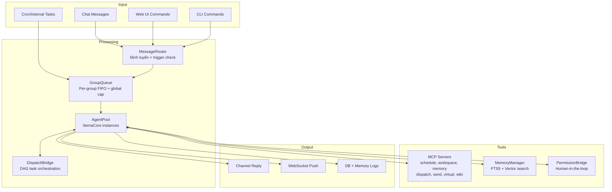

---

## 14. Luồng tương tác LLM của Agent

### 14.1. Tổng quan

SemaClaw **không trực tiếp gọi LLM API**. Nó sử dụng **SemaCore** engine (thư viện `sema-core`) làm trung gian. SemaCore chịu trách nhiệm:

- Gọi LLM API (Claude API, OpenAI, v.v.) với cấu hình từ `~/.semaclaw/semaclaw-model.conf`
- Quản lý Prompt Cache (automatic caching theo Anthropic specification)
- Quản lý Tool Use loop (MCP tools)
- Quản lý session state, context compaction
- Sinh event system để lớp trên (AgentPool) phản ứng

```mermaid
flowchart TB
    subgraph "SemaClaw (src-old/)"
        AP[AgentPool]
        GQ[GroupQueue]
        SB[SessionBridge]
        PB[PermissionBridge]
        MCP[MCP Servers<br/>stdio subprocess]
    end

    subgraph "sema-core (external library)"
        SC[SemaCore Engine]
        SESSION[Session Manager]
        TOOLS[Tool Use Loop]
        CACHE[Prompt Cache]
        COMPACT[Context Compactor]
    end

    subgraph "LLM Provider"
        API[Claude API / OpenAI API]
    end

    subgraph "Storage"
        SESS_DIR[(~/.sema/sessions/)]
        MCONF[(semaclaw-model.conf)]
    end

    GQ -->|enqueue task| AP
    AP -->|processUserInput(prompt)| SC
    SC --> SESSION
    SC --> TOOLS
    SC --> CACHE
    SC --> COMPACT
    TOOLS <-->|stdio| MCP
    SC <-->|HTTP| API
    SESSION --> SESS_DIR
    SC --> MCONF
    SC -->|Events| AP
    AP -->|broadcastReply| CH[Channel]
```

### 14.2. SemaCore Events — Cơ chế bất đồng bộ

SemaCore giao tiếp với AgentPool **hoàn toàn qua events**. Đây là mẫu thiết kế cốt lõi:

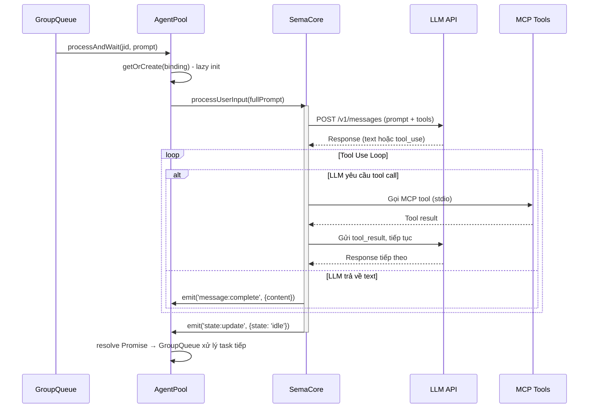

### 14.3. Các Event chính

| Event | Mô tả | Hành động của AgentPool |
|-------|-------|------------------------|
| `message:complete` | LLM đã sinh xong 1 message (text hoàn chỉnh) | `broadcastReply()` gửi tới Channel + WebSocket |
| `state:update` | Thay đổi trạng thái agent (`processing`, `idle`, `paused`) | `idle` → resolve Promise; `processing` → reset timeout; `paused` → treo timer |
| `session:error` | Lỗi session (API error, network, v.v.) | Retry (transient), hoặc interrupt (network), hoặc destroy (fatal) |
| `todos:update` | Agent cập nhật task list (TodoWrite tool) | Forward tới WebSocket Gateway |
| `compact:start` | Bắt đầu nén context | Disable nút pause trên Web UI |
| `compact:exec` | Context đã được nén xong | Báo MemoryManager đánh dấu file cần reindex |
| `tool:permission:request` | Agent cần quyền chạy tool (Bash, Write...) | PermissionBridge gửi inline button tới user |
| `ask:question:request` | Agent cần hỏi user (AskUserQuestion tool) | PermissionBridge gửi câu hỏi tới user |

### 14.4. Vòng đời xử lý LLM

```mermaid
stateDiagram-v2
    [*] --> Creating: getOrCreate()
    Creating --> Idle: createSession() OK
    Creating --> Error: createSession() fail

    Idle --> Processing: processUserInput(prompt)

    state Processing {
        [*] --> LLM_Call: Gửi prompt
        LLM_Call --> Tool_Call: LLM yêu cầu tool
        Tool_Call --> LLM_Call: Tool result
        LLM_Call --> Text_Response: LLM trả text

        --
        LLM_Call --> Permission_Wait: Cần quyền
        Permission_Wait --> LLM_Call: User chấp nhận/từ chối
        --
        LLM_Call --> Compacting: Context đầy
        Compacting --> LLM_Call: Compact xong
    end

    Processing --> Idle: state:update → idle
    Processing --> Retry: Transient error (5 lần)
    Retry --> Processing: Retry sau 3s
    Processing --> Interrupted: Network error
    Processing --> Destroyed: Fatal error

    Interrupted --> Processing: User gửi tiếp
    Idle --> Processing: Có message mới
    Idle --> Destroyed: destroy()
```

### 14.5. Prompt Construction (Xây dựng prompt)

Prompt gửi vào LLM được xây dựng qua nhiều tầng:

```mermaid
flowchart LR
    subgraph "Tầng 1: SessionBridge"
        DB_MSG[(DB Messages<br/>từ lastAgentTimestamp)]
        XML[Format XML]
        DB_MSG --> XML
    end

    subgraph "Tầng 2: Memory Pre-retrieval (optional)"
        MEM_SEARCH[MemoryManager.search()]
        MEM_FILTER[Lọc score + today]
        MEM_FMT[Format kết quả]
        MEM_SEARCH --> MEM_FILTER --> MEM_FMT
    end

    subgraph "Tầng 3: Dispatch Context"
        DISP_HINT[buildDispatchResumeHint()]
    end

    subgraph "Tầng 4: System Prompt"
        SYS[CLAUDE.md + Agent persona]
    end

    subgraph "Tầng 5: SemaCore Engine"
        FINAL[Prompt cuối cùng<br/>XML messages + memory + dispatch + system]
        TOOLS2[Tool definitions<br/>(MCP tools + built-in tools)]
        CACHE_CHECK{Prompt Cache<br/>có hit?}
    end

    XML --> FINAL
    MEM_FMT -.->|nếu bật pre-retrieval| FINAL
    DISP_HINT -.->|nếu có dispatch đang chạy| FINAL
    SYS --> FINAL
    FINAL --> CACHE_CHECK
    TOOLS2 --> CACHE_CHECK
    CACHE_CHECK -->|Cache hit| LLM_CALL[LLM API Call<br/>rẻ hơn, nhanh hơn]
    CACHE_CHECK -->|Cache miss| LLM_CALL
```

**Chi tiết từng tầng:**

1. **SessionBridge** — Đọc các message mới từ SQLite (sau `lastAgentTimestamp`), format thành XML `<messages><message sender="..." time="...">...</message></messages>`

2. **Memory Pre-retrieval** (bật/tắt qua `SEMACLAW_PRE_RETRIEVAL`) — Tự động tìm kiếm memory chunks liên quan đến nội dung tin nhắn, inject vào prompt dưới dạng `<memory>...</memory>`. Lọc bỏ file log hôm nay (đang được ghi, nội dung không ổn định).

3. **Dispatch Context** — Nếu admin agent có dispatch tasks đang chạy, inject reminder text để tránh agent tạo lại task trùng lặp.

4. **System Prompt** — Từ file `CLAUDE.md` trong thư mục agent + persona mặc định của SemaCore.

5. **SemaCore Engine** — Kết hợp tất cả thành prompt cuối cùng, đính kèm tool definitions, kiểm tra Prompt Cache.

### 14.6. Prompt Cache

SemaCore tự động quản lý **Anthropic Prompt Caching**. Cơ chế:

- SemaCore đánh dấu các phần tĩnh của prompt (system prompt, tool definitions) bằng `cache_control: { type: "ephemeral" }`
- Các phần động (message history mới, kết quả memory search) không được cache
- Cache TTL: 5 phút. Nếu session idle > 5 phút, cache hết hạn và phải tạo mới
- Cache hit → giảm 90% chi phí token input

```
Prompt gửi lên LLM:
┌─────────────────────────────────────────┐
│ System Prompt (CLAUDE.md)    ← CACHED   │
├─────────────────────────────────────────┤
│ Tool Definitions (MCP tools) ← CACHED   │
├─────────────────────────────────────────┤
│ Skill Definitions            ← CACHED   │
├─────────────────────────────────────────┤
│ Message History (XML)        ← dynamic  │
├─────────────────────────────────────────┤
│ Memory Context (nếu có)      ← dynamic  │
├─────────────────────────────────────────┤
│ Dispatch Hint (nếu có)       ← dynamic  │
├─────────────────────────────────────────┤
│ User Message mới nhất        ← dynamic  │
└─────────────────────────────────────────┘
```

### 14.7. Tool Use Loop

Khi LLM quyết định gọi tool, SemaCore thực hiện vòng lặp:

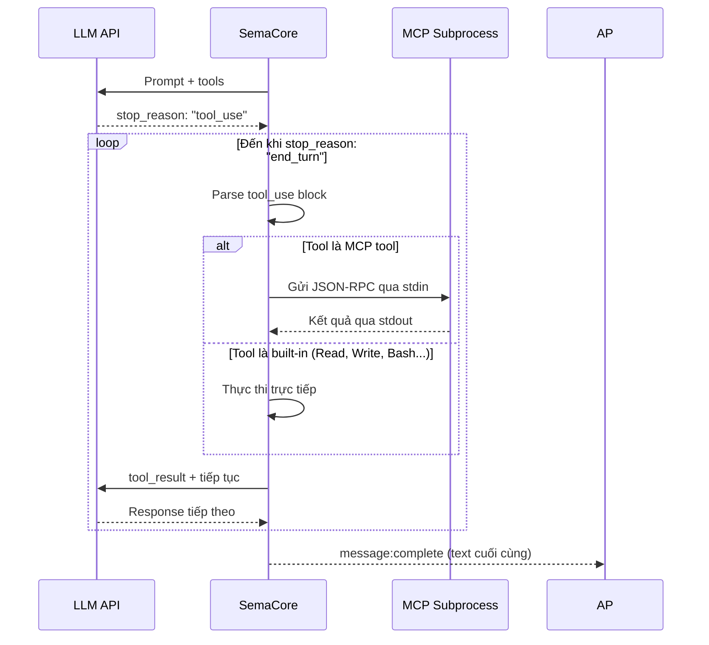

**Các tool được cấp cho agent:**

| Nhóm | Tools | Nguồn |
|------|-------|-------|
| **File System** | `Read`, `Write`, `Edit`, `Glob`, `Grep` | Built-in SemaCore |
| **Execution** | `Bash` | Built-in SemaCore (bị giới hạn bởi `allowedPaths`) |
| **Task Management** | `TodoWrite` | Built-in SemaCore |
| **Interaction** | `AskUserQuestion`, `ExitPlanMode` | Built-in SemaCore |
| **Skills** | `Skill` | Built-in SemaCore |
| **Schedule** | `schedule_add`, `schedule_list`, `schedule_pause`, `schedule_delete` | schedule-server MCP |
| **Workspace** | `workspace_switch`, `workspace_current` | workspace-server MCP |
| **Memory** | `memory_search`, `memory_get` | memory-server MCP |
| **Dispatch** | `dispatch_task`, `dispatch_register`, `dispatch_complete`, `dispatch_list` | dispatch-server MCP |
| **Send** | `send_message` | send-server MCP |
| **Virtual** | `run_persona` | virtual-server MCP |
| **Feishu Wiki** | Feishu wiki tools | feishu-wiki-server MCP |

### 14.8. Các chế độ Agent & LLM

SemaClaw có **4 chế độ** sử dụng LLM, mỗi chế độ có đặc điểm session khác nhau:

```mermaid
flowchart TB
    subgraph "Group Agent (chế độ chính)"
        G_DIR[Session lưu trên disk<br/>~/.sema/sessions/]
        G_CTX[Có lịch sử chat đầy đủ<br/>từ DB messages]
        G_CACHE[Prompt Cache ấm<br/>nếu idle < 5 phút]
        G_PERM[Cần PermissionBridge<br/>cho tool nguy hiểm]
        G_LIFE[Sống suốt vòng đời group]
    end

    subgraph "Isolated Agent (scheduled task)"
        I_DIR[Session ảo<br/>không lưu disk]
        I_CTX[Chỉ có task prompt<br/>không lịch sử chat]
        I_CACHE[Luôn cache miss<br/>(session mới)]
        I_PERM[Bỏ qua permission]
        I_LIFE[Tạo → Chạy → Hủy]
    end

    subgraph "Virtual Agent (persona)"
        V_DIR[Session tạm<br/>dùng chung agent dir]
        V_CTX[System prompt từ<br/>persona *.md file]
        V_CACHE[Có thể cache<br/>nếu dùng lại persona]
        V_PERM[Kế thừa permission<br/>từ main agent]
        V_LIFE[Tạo → Chạy → Hủy]
    end

    subgraph "Dispatch Agent (sub-agent)"
        D_DIR[Session tạm<br/>workspace override]
        D_CTX[Chỉ có task prompt<br/>từ dispatch_task]
        D_CACHE[Luôn cache miss]
        D_PERM[Kế thừa permission<br/>admin (skip)]
        D_LIFE[Sống đến khi<br/>task complete]
    end
```

### 14.9. Xử lý lỗi LLM

```mermaid
flowchart TD
    ERR[Session Error] --> CLASS{Phân loại lỗi}

    CLASS -->|Transient| TRANS["'terminated'<br/>'Unexpected event order'<br/>'API_RESPONSE_ERROR'<br/>'API response format error'<br/>'Premature close'<br/>'missing finish_reason'"]
    CLASS -->|Network| NET["code: 'NETWORK_ERROR'"]
    CLASS -->|Fatal| FATAL["Các lỗi khác"]

    TRANS --> CHECK{retriesLeft > 0?}
    CHECK -->|Yes| DELAY[Đợi 3 giây]
    DELAY --> RETRY[Retry processAndWait<br/>giữ nguyên session + history]
    CHECK -->|No| DESTROY1[destroy agent]

    NET --> INTERRUPT[interruptSession()<br/>giữ session context]
    INTERRUPT --> NOTIFY[Gửi thông báo lỗi<br/>cho user]
    NOTIFY --> IDLE[Agent về idle<br/>user có thể tiếp tục]

    FATAL --> DESTROY2[destroy agent]
    DESTROY1 --> NOTIFY2[Gửi thông báo reset]
    DESTROY2 --> NOTIFY2
```

**Chiến lược retry:**
- **Transient errors**: Retry tối đa 5 lần, mỗi lần cách 3 giây. Giữ nguyên session (bảo toàn prompt cache + lịch sử hội thoại)
- **Network errors**: Không destroy. Gọi `interruptSession()` giữ lại toàn bộ context (bao gồm tool results đã thực thi). User có thể tiếp tục từ chỗ bị ngắt
- **Fatal errors**: Destroy agent, tạo mới vào lần tiếp theo

### 14.10. Timeout & Watchdog

```mermaid
sequenceDiagram
    participant AP as AgentPool
    participant SC as SemaCore

    AP->>AP: processAndWait() → tạo timer 30 phút

    loop Mỗi khi có activity
        SC->>AP: state:update (processing)
        AP->>AP: resetTimer() — đặt lại 30 phút
    end

    alt Agent idle đúng hạn
        SC->>AP: state:update (idle)
        AP->>AP: Clear timer → resolve Promise
    else Timeout sau 30 phút không activity
        AP->>AP: destroy agent
        AP->>AP: reject Promise
        AP->>AP: GroupQueue nhận lỗi → xử lý task tiếp
    else Permission đang chờ
        Note over AP: Mỗi lần gửi/nhận permission<br/>đều gọi resetTimer()
        Note over AP: Tránh timeout khi user<br/>chưa kịp phản hồi
    end
```

**Tham số timeout:**
- `AGENT_TIMEOUT_MS` = 30 phút (phải lớn hơn `max dispatch_task runtime` mặc định 600s)
- Timer reset mỗi khi có `state:update` với state khác `idle` (tức là agent đang hoạt động)
- PermissionBridge gọi `notifyActivity()` mỗi khi gửi/nhận permission — reset timer để tránh timeout khi chờ user

### 14.11. Compaction (Nén context)

Khi context quá dài (vượt context window của LLM), SemaCore tự động nén:

1. SemaCore emit `compact:start` → Web UI disable nút pause
2. SemaCore tự động tóm tắt các phần cũ của hội thoại
3. Tạo session mới với context đã nén + phần đuôi gần đây
4. SemaCore emit `compact:exec` → Web UI enable nút pause
5. AgentPool đánh dấu file daily memory log để MemoryManager reindex

### 14.12. Cấu hình LLM Model

Cấu hình model được lưu trong `~/.semaclaw/semaclaw-model.conf` (format của sema-core):

- **Cô lập hoàn toàn** với các ứng dụng sema-core khác (như sema-code editor)
- Khi khởi động, nếu chưa có file, SemaClaw copy từ `~/.sema/model.conf` (nếu tồn tại)
- Có thể cấu hình model khác nhau cho từng group qua `config.json` → sync vào sema-core ModelManager
- **Thinking mode** có thể bật/tắt real-time qua Web UI (không cần khởi động lại agent)

---

## 15. Tổng kết các mẫu thiết kế

| Pattern | Áp dụng | Mô tả |
|---------|---------|-------|
| **Dependency Injection** | `index.ts` → tất cả module | Các module nhận dependency qua constructor, không tự khởi tạo |
| **Lazy Initialization** | `AgentPool.getOrCreate()` | SemaCore chỉ được tạo khi có message đầu tiên |
| **Observer** | Channel `onMessage()`, Event callbacks | Message routing và event propagation |
| **Command** | `CommandDispatcher` | Admin commands được dispatch theo pattern |
| **Strategy** | `TriggerChecker` | Chiến lược trigger khác nhau theo group type |
| **Singleton** | `MemoryManager`, `GroupManager` | Một instance duy nhất trong suốt vòng đời |
| **Producer-Consumer** | `GroupQueue` | Message producer (router) → consumer (agent pool) |
| **Adapter** | `IChannel` implementations | Mỗi nền tảng chat có adapter riêng |
| **Bridge** | `PermissionBridge`, `SendBridge`, `SessionBridge` | Cầu nối giữa các layer |
| **MCP Subprocess** | Tất cả MCP servers | Mỗi tool chạy trong process riêng, giao tiếp qua stdio |

---

## 16. Cơ sở dữ liệu

### 16.1. Schema chính

```sql
-- Groups: ánh xạ chat JID → agent folder
CREATE TABLE groups (
  jid TEXT PRIMARY KEY,
  folder TEXT NOT NULL,
  name TEXT,
  channel TEXT DEFAULT '',
  is_admin INTEGER DEFAULT 0,
  requires_trigger INTEGER DEFAULT 1,
  allowed_tools TEXT,          -- JSON array hoặc NULL
  allowed_paths TEXT,          -- JSON array hoặc NULL
  allowed_work_dirs TEXT,      -- JSON array hoặc NULL
  bot_token TEXT,
  max_messages INTEGER,
  last_active TEXT,
  added_at TEXT NOT NULL
);

-- Messages: lịch sử hội thoại FIFO
CREATE TABLE channel_messages (
  message_id TEXT PRIMARY KEY,
  chat_jid TEXT NOT NULL,
  sender_jid TEXT,
  sender_name TEXT,
  content TEXT,
  timestamp TEXT NOT NULL,
  is_from_me INTEGER DEFAULT 0,
  is_bot_reply INTEGER DEFAULT 0,
  reply_to_id TEXT,
  media_type TEXT
);

-- Scheduled tasks
CREATE TABLE scheduled_tasks (
  id TEXT PRIMARY KEY,
  group_folder TEXT NOT NULL,
  chat_jid TEXT,
  prompt TEXT NOT NULL,
  schedule_type TEXT NOT NULL,   -- 'cron'|'interval'|'once'
  schedule_value TEXT NOT NULL,
  context_mode TEXT DEFAULT 'isolated',
  script_command TEXT,
  next_run TEXT,
  last_run TEXT,
  last_result TEXT,
  status TEXT DEFAULT 'active',
  created_at TEXT NOT NULL
);

-- Task run logs
CREATE TABLE task_run_logs (
  id INTEGER PRIMARY KEY AUTOINCREMENT,
  task_id TEXT NOT NULL,
  run_at TEXT NOT NULL,
  duration_ms INTEGER,
  status TEXT,                   -- 'success'|'error'
  result TEXT,
  error TEXT
);
```

---

*Tài liệu được tạo từ phân tích `src-old/` (TypeScript reference implementation). Phiên bản Rust (`src/`) đang trong quá trình port và có thể có khác biệt.*
