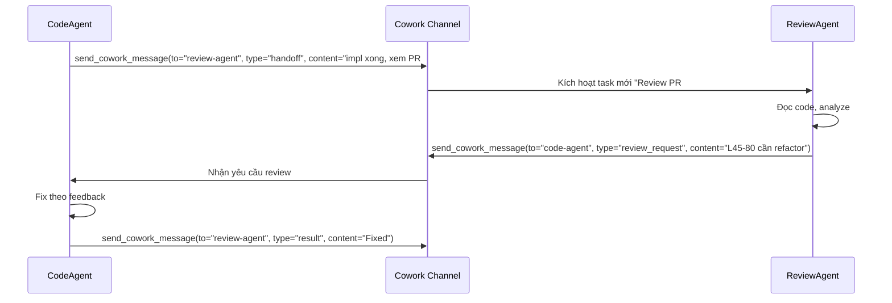
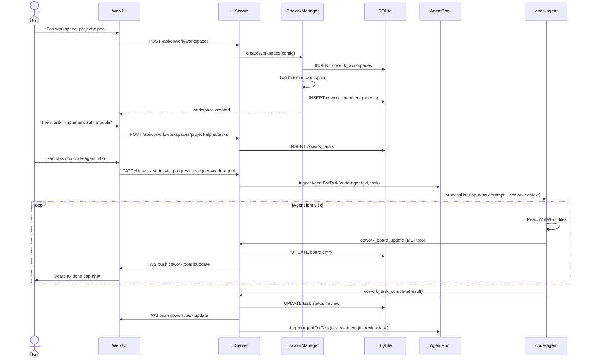
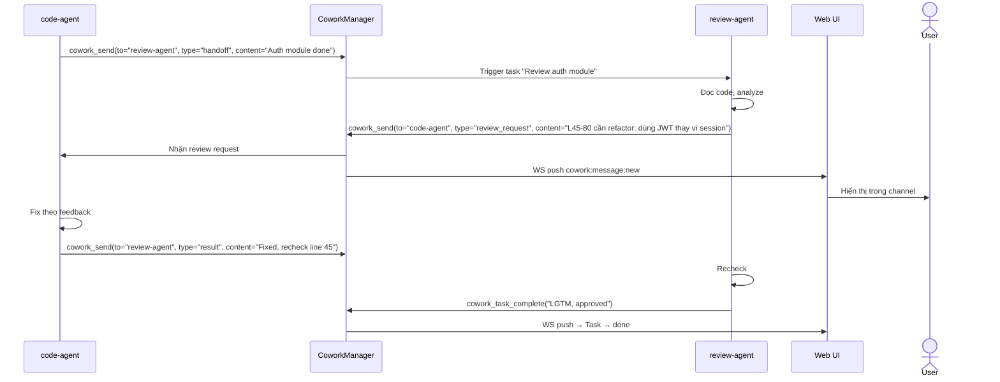

# Cowork Space — Thiết kế tính năng chi tiết

> Tài liệu phân tích và thiết kế Cowork Space cho SemaClaw — không gian cộng tác đa agent cho nhóm người dùng.

---

## 1. Tổng quan & Định vị

**Cowork Space** là tính năng cho phép nhiều agent (hoặc nhiều người dùng + agent) cùng làm việc trong một **không gian chia sẻ có cấu trúc**. Khác với DAG Dispatch (điều phối tự động từ một admin agent), Cowork hướng đến **sự cộng tác có chủ đích** — con người chỉ định workspace, gán vai trò, theo dõi tiến độ và can thiệp khi cần.

### 1.1. Khác biệt so với tính năng hiện có

| | DAG Dispatch | Cowork Space |
|---|---|---|
| **Khởi tạo** | Admin agent tự động tạo | Người dùng khởi tạo thủ công |
| **Scope** | Một task lớn → nhiều subtask | Nhiều task song song, nhiều phiên |
| **Thời gian sống** | Tạm thời (xong là hủy) | Lâu dài (workspace tồn tại qua nhiều session) |
| **Người kiểm soát** | Agent admin | Người dùng + agent |
| **Visibility** | Ẩn với user | Dashboard đầy đủ real-time |
| **Đa người dùng** | Không | Có (multi-user collaboration) |
| **Chia sẻ context** | Qua `<prerequisites>` XML | Board chung, memory chung |

### 1.2. Use cases chính

1. **Team project**: Nhiều agent (code, review, test, doc) cùng làm một dự án phần mềm
2. **Research workflow**: Agent nghiên cứu + tổng hợp + phản biện làm việc song song
3. **Content pipeline**: Agent viết, biên tập, kiểm tra fact, dịch thuật — dây chuyền có cấu trúc
4. **Pair programming AI**: Người dùng làm việc cùng agent như đồng nghiệp — thấy được những gì agent đang làm

---

## 2. Khái niệm cốt lõi

### 2.1. Workspace

**Workspace** là đơn vị tổ chức cơ bản của Cowork. Mỗi workspace có:
- Một thư mục làm việc chung trên filesystem (`~/semaclaw/workspace/{name}/`)
- Danh sách **member** (agent hoặc người dùng)
- **Board** chia sẻ (context chung, tài liệu, ghi chú)
- **Channel** giao tiếp nội bộ giữa các member
- **Task board** quản lý công việc
- **Memory pool** chung (FTS5 + vector index)

```
Workspace "project-alpha"
├── board/              ← Shared Knowledge Board (pinned docs)
│   ├── brief.md        ← Project brief
│   ├── guidelines.md   ← Coding standards
│   └── progress.md     ← Accumulated context
├── tasks/              ← Task board (structured to-do)
├── memory/             ← Shared vector + FTS5 index
├── workspace-files/    ← Filesystem agents work on
└── channel/            ← Inter-agent message log
```

### 2.2. Member & Vai trò

| Vai trò | Mô tả | Quyền |
|---------|-------|-------|
| **Owner** | Người tạo workspace | Toàn bộ quyền |
| **Admin** | Agent hoặc người dùng quản lý | Thêm/xóa member, gán task |
| **Worker** | Agent thực thi task | Đọc board, nhận task, ghi kết quả |
| **Reviewer** | Agent hoặc người kiểm tra | Đọc kết quả, approve/reject |
| **Observer** | Người dùng theo dõi | Chỉ đọc, không tương tác |

> **Quan trọng**: Role chỉ định *quyền hạn*, không định nghĩa *công việc cụ thể*. Một agent có role `worker` vẫn không tự biết mình cần làm gì, theo chuẩn nào, khi nào bắt đầu, hay bàn giao cho ai. Đó là nhiệm vụ của **Member Spec** (xem 2.2.1).

### 2.2.1. Member Spec — Đặc tả công việc chi tiết

**Member Spec** là bộ mô tả đầy đủ về vai trò công việc của một agent trong workspace cụ thể. Nó tồn tại *độc lập* với CLAUDE.md của agent đó — cùng một agent có thể có Member Spec khác nhau trong từng workspace.

Member Spec gồm 4 nhóm thông tin:

---

#### Nhóm 1 — Định danh & Persona

Mô tả agent *là ai* trong workspace này, hành xử theo phong cách nào.

```yaml
persona: |
  Bạn là senior backend engineer của team project-alpha.
  Chuyên về Rust + axum. Ưu tiên correctness và performance.
  Viết code rõ ràng, không dùng unwrap() trong production path.
  Luôn viết unit test cho mọi hàm public.
```

Đây là **workspace-scoped system prompt addon** — được inject thêm vào system prompt base của agent, không ghi đè CLAUDE.md gốc.

---

#### Nhóm 2 — Trách nhiệm (Responsibilities)

Danh sách cụ thể những gì agent này *chịu trách nhiệm* trong workspace.

```yaml
responsibilities:
  - Implement các task có tag "backend" hoặc "api"
  - Viết unit test và integration test cho code mình tạo ra
  - Fix bug được gán bởi review-agent sau review cycle
  - Cập nhật Board section "progress" sau mỗi feature hoàn thành
  - Không can thiệp vào code trong subdir của test-agent
```

Khác với task (công việc đơn lẻ), responsibilities là **nhiệm vụ thường trực** — định nghĩa phạm vi hoạt động của agent.

---

#### Nhóm 3 — Triggers (Điều kiện kích hoạt)

Khi nào agent *tự động* bắt đầu làm việc mà không cần gán thủ công.

```yaml
triggers:
  - type: task_assigned
    condition: "assignee == me"           # có task mới được gán cho mình
  - type: message_received
    from: review-agent
    message_type: handoff                 # review-agent gửi handoff về fix
  - type: task_status_changed
    status: done                          # done | in_progress | blocked
    assignee: code-agent                 # optional: chỉ trigger khi task được gán cho member này
    to: review-agent                     # member nhận task mới
    only_if_result_contains: "fix"       # optional: chỉ trigger nếu result chứa text này
    unless_result_contains: "complete"    # optional: không trigger nếu result chứa text này
  - type: board_updated
    section: guidelines                   # guidelines thay đổi → đọc lại và adjust
  - type: schedule
    cron: "0 9 * * *"                     # mỗi sáng: check backlog, tự lấy task
```

**Chi tiết trigger `task_status_changed`:**
- `status`: Bắt buộc. Trạng thái task để kích hoạt trigger (`done`, `in_progress`, hoặc `blocked`)
- `to`: Bắt buộc. ID của member sẽ nhận task mới được tạo
- `assignee`: Tùy chọn. Chỉ kích hoạt khi task được gán cho member này (mặc định: bất kỳ member nào)
- `only_if_result_contains`: Tùy chọn. Chỉ kích hoạt nếu kết quả task chứa chuỗi này (case-insensitive)
- `unless_result_contains`: Tùy chọn. Không kích hoạt nếu kết quả task chứa chuỗi này (case-insensitive)

Trigger này tạo task mới thông qua DAG dispatch khi task chuyển trạng thái, cho phép workflow tự động dựa trên tiến độ task.

Triggers cho phép workflow chạy tự động mà không cần user gán từng task thủ công.

---

#### Nhóm 4 — Handoff Rules (Quy tắc bàn giao)

Khi agent hoàn thành công việc, bàn giao *như thế nào*, *cho ai*, *kèm thông tin gì*.

```yaml
handoff:
  - when: task_complete
    to: review-agent
    type: review_request
    message_template: |
      Task "{{ task.title }}" hoàn thành.
      Files thay đổi: {{ changed_files }}
      Test results: {{ test_summary }}
      Điểm cần review đặc biệt: {{ notes }}

  - when: blocked
    to: owner
    type: alert
    message_template: |
      Bị blocked ở task "{{ task.title }}".
      Lý do: {{ block_reason }}
      Cần: {{ needed_from }}

  - when: needs_clarification
    to: admin
    type: clarification
```

---

#### Nhóm 5 — Acceptance Criteria & Output Format

Tiêu chí để coi một task là *done*, và format của kết quả đầu ra.

```yaml
acceptance_criteria:
  - Tất cả unit test pass (cargo test)
  - Không có clippy warning (cargo clippy -- -D warnings)
  - File được sửa phải có comment giải thích nếu logic phức tạp
  - Không introduce new unwrap() calls

output:
  format: markdown
  required_sections:
    - "## Summary"        # tóm tắt những gì đã làm
    - "## Files Changed"  # danh sách file thay đổi
    - "## Test Results"   # kết quả test
    - "## Notes"          # ghi chú cho reviewer
  attach_diff: true       # đính kèm diff khi handoff
```

---

#### Nhóm 6 — SLA & Giới hạn

Ràng buộc thời gian và tài nguyên.

```yaml
sla:
  max_duration_per_task_minutes: 60   # task quá 60 phút → tự báo blocked
  max_token_per_task: 50000           # vượt ngưỡng → compact + báo cáo
  escalate_after_blocked_minutes: 30  # blocked 30 phút không giải quyết → escalate

limits:
  max_file_size_write_kb: 500         # không ghi file > 500KB một lần
  allowed_bash_commands:              # chỉ được chạy các lệnh này
    - "cargo build"
    - "cargo test"
    - "cargo clippy"
    - "git diff"
```

---

#### Schema đầy đủ của Member Spec

```typescript
interface MemberSpec {
  memberId: string;           // agentFolder
  workspaceId: string;
  role: MemberRole;
  subdir: string;

  // Nhóm 1 — Persona
  persona?: string;           // workspace-scoped system prompt addon

  // Nhóm 2 — Responsibilities
  responsibilities: string[]; // danh sách nhiệm vụ thường trực

  // Nhóm 3 — Triggers
  triggers: Trigger[];

  // Nhóm 4 — Handoff
  handoff: HandoffRule[];

  // Nhóm 5 — Output
  acceptanceCriteria: string[];
  outputFormat?: {
    format: 'markdown' | 'json' | 'plain';
    requiredSections?: string[];
    attachDiff?: boolean;
  };

  // Nhóm 6 — SLA
  sla?: {
    maxDurationPerTaskMinutes?: number;
    maxTokenPerTask?: number;
    escalateAfterBlockedMinutes?: number;
  };
  limits?: {
    maxFileSizeWriteKb?: number;
    allowedBashCommands?: string[];
    deniedTools?: string[];
  };
}

type Trigger =
  | { type: 'task_assigned'; condition?: string }
  | { type: 'message_received'; from: string; message_type: MessageType }
  | { type: 'task_status_changed'; status: TaskStatus; assignee?: string }
  | { type: 'board_updated'; section: string }
  | { type: 'schedule'; cron: string };

interface HandoffRule {
  when: 'task_complete' | 'blocked' | 'needs_clarification' | 'error';
  to: string;               // memberId hoặc role ('owner', 'admin')
  type: MessageType;
  messageTemplate?: string; // Mustache template
}
```

---

#### Cách Member Spec được inject vào agent prompt

Mỗi khi agent trong workspace được kích hoạt, system prompt được xây dựng theo thứ tự:

```
┌──────────────────────────────────────────────────┐
│ 1. CLAUDE.md gốc của agent (base persona)        │ ← cached
├──────────────────────────────────────────────────┤
│ 2. Member Spec — persona (workspace addon)        │ ← cached
├──────────────────────────────────────────────────┤
│ 3. Member Spec — responsibilities & handoff rules │ ← cached
├──────────────────────────────────────────────────┤
│ 4. Cowork Board (brief, guidelines, decisions)    │ ← semi-static
├──────────────────────────────────────────────────┤
│ 5. Task board snapshot (current tasks)            │ ← dynamic
├──────────────────────────────────────────────────┤
│ 6. Recent channel messages                        │ ← dynamic
├──────────────────────────────────────────────────┤
│ 7. Task hiện tại được assign                      │ ← dynamic
└──────────────────────────────────────────────────┘
```

Ví dụ prompt được inject:

```xml
<!-- Lớp 2: workspace persona addon -->
<workspace_persona>
Trong workspace "project-alpha", bạn là senior backend engineer.
Chuyên về Rust + axum. Không dùng unwrap() trong production path.
Luôn viết unit test cho mọi hàm public.
</workspace_persona>

<!-- Lớp 3: responsibilities & rules -->
<member_spec>
  <responsibilities>
    - Implement task có tag "backend" hoặc "api"
    - Viết unit test và integration test cho code mình tạo ra
    - Không can thiệp vào subdir của test-agent
  </responsibilities>
  <handoff_rules>
    Khi hoàn thành task: gửi review_request cho review-agent với summary + changed_files + test_results
    Khi bị blocked > 30 phút: gửi alert cho owner với lý do và cần gì
  </handoff_rules>
  <acceptance_criteria>
    - cargo test phải pass
    - cargo clippy không có warning
    - Không có unwrap() mới
  </acceptance_criteria>
  <sla>Tối đa 60 phút/task. Token budget: 50,000/task.</sla>
</member_spec>
```

---

#### Lưu trữ Member Spec

Member Spec được lưu trong DB, thay thế schema `cowork_members` tối giản hiện tại:

### 2.3. Task trong Cowork

Task trong Cowork khác với DAG dispatch task:
- **Persistent**: Tồn tại cho đến khi done/archived, không bị xóa sau phiên
- **Assignable**: Có thể gán lại giữa các agent
- **Commentable**: Người dùng và agent đều có thể comment
- **Linked**: Có thể link đến task khác, branch git, file, ticket ngoài

### 2.4. Channel (Kênh giao tiếp nội bộ)

Mỗi workspace có một **internal channel** — một luồng tin nhắn có cấu trúc giữa:
- Agent với agent (handoff, review request, clarification)
- Người dùng với agent (chỉ thị, phản hồi)
- Hệ thống với tất cả (status update, event log)

---

## 3. Các tính năng chi tiết

### 3.1. Shared Agent Workspace *(In Progress)*

**Mô tả**: Nhiều agent cùng trỏ vào một thư mục làm việc chung, có thể đọc/ghi file của nhau.

**Cơ chế hoạt động**:
- Owner tạo workspace, chọn thư mục gốc
- Gán agent vào workspace: mỗi agent nhận một `workingDir` trỏ về workspace directory
- Agent có `sub-directory` riêng (`workspace/{name}/agents/{agent-folder}/`) để tránh conflict
- Shared area: `workspace/{name}/shared/` — tất cả agent có thể đọc/ghi

**Conflict resolution**:
- Agent không được ghi đồng thời vào cùng một file (lock cấp file)
- Ghi qua API thay vì trực tiếp → gateway xử lý queue và merge
- Ghi vào file riêng trước → merge sau khi review

**Config mẫu** (role-only — tối thiểu, không khuyến khích):
```json
{
  "workspace": "project-alpha",
  "members": [
    { "agentFolder": "code-agent", "role": "worker", "subdir": "impl" },
    { "agentFolder": "review-agent", "role": "reviewer", "subdir": "review" },
    { "agentFolder": "test-agent", "role": "worker", "subdir": "tests" }
  ],
  "sharedDir": "~/semaclaw/workspace/project-alpha/shared"
}
```

> Chỉ khai báo role là **không đủ** — agent sẽ không biết cụ thể mình cần làm gì. Xem **Member Spec (2.2.1)** để khai báo đầy đủ responsibilities, triggers, handoff rules, acceptance criteria và SLA.

---

### 3.2. Shared Knowledge Board *(Planned)*

**Mô tả**: Board chứa các tài liệu được ghim, visible với tất cả member. Agent đọc board khi xây dựng prompt, người dùng có thể cập nhật board bất cứ lúc nào.

**Các loại entry trên Board**:

| Loại | Mô tả | Cập nhật bởi |
|------|-------|--------------|
| **Brief** | Mục tiêu project, context tổng thể | Owner |
| **Guidelines** | Quy tắc, conventions, constraints | Admin |
| **Progress** | Tổng hợp tiến độ, quyết định đã đưa ra | Agent tự cập nhật |
| **Reference** | Links, file paths, external resources | Bất kỳ member |
| **Decisions** | Bản ghi các quyết định quan trọng | Admin, Reviewer |

**Tích hợp vào prompt**:
- Board được inject vào `<cowork_context>` block trong system prompt của mỗi agent
- Chỉ inject phần liên quan (lọc theo tag, recency)
- Agent có MCP tool `board_update(section, content)` để cập nhật Board sau mỗi nhiệm vụ quan trọng

**Ví dụ prompt injection**:
```xml
<cowork_context workspace="project-alpha">
  <brief>Xây dựng REST API cho hệ thống inventory management</brief>
  <guidelines>
    - Dùng Rust + axum
    - Tất cả endpoint phải có test integration
    - Không dùng unwrap() trong production code
  </guidelines>
  <recent_decisions>
    [2026-05-01] Chọn SQLite thay PostgreSQL để đơn giản hóa deployment
    [2026-05-01] Auth dùng JWT với RSA-256
  </recent_decisions>
</cowork_context>
```

---

### 3.3. Inter-Agent Messaging *(Planned)*

**Mô tả**: Agent có thể gửi message có cấu trúc đến agent khác trong cùng workspace — không qua người dùng, không qua LLM của agent nhận.

**Các loại message**:

| Type | Mô tả | Ví dụ |
|------|-------|-------|
| `handoff` | Chuyển giao task + context | "Implement xong, review đây" |
| `review_request` | Yêu cầu review cụ thể | "Review file auth.rs lines 45-80" |
| `clarification` | Hỏi thêm thông tin | "Timeout nên là bao nhiêu?" |
| `result` | Trả kết quả cho agent yêu cầu | JSON result của subtask |
| `status` | Update trạng thái công việc | "Đang chạy tests, ETA 5 phút" |
| `alert` | Cảnh báo cần xử lý ngay | "Build failed, cần fix trước khi merge" |

**MCP tools cho agent**:
```
send_cowork_message(to: agentId, type: MessageType, content: string, attachments?: FileRef[])
read_cowork_messages(filter?: { from?, type?, since? })
wait_for_message(from: agentId, type: MessageType, timeout: number)
```

**Luồng Inter-Agent handoff**:


---

### 3.4. Cowork Task Board *(Planned)*

**Mô tả**: Kanban-style task board với state machine rõ ràng, integrated với agent lifecycle.

**State machine của task**:
```
backlog → todo → in_progress → review → done
                     ↓
                  blocked
                     ↓
                in_progress
```

**Task schema**:
```typescript
interface CoworkTask {
  id: string;                    // "cwtask-20260501-0001"
  workspaceId: string;
  title: string;
  description: string;
  status: TaskStatus;
  assignee?: string;             // agentFolder hoặc "user"
  reviewer?: string;
  priority: 'low' | 'medium' | 'high' | 'critical';
  tags: string[];
  dependsOn: string[];           // task IDs
  attachments: FileRef[];        // links đến file, PR, commit
  comments: Comment[];
  createdAt: string;
  updatedAt: string;
  dueAt?: string;
  estimatedMs?: number;
  actualMs?: number;
}
```

**MCP tools cho agent**:
```
task_list(workspace: string, filter?: { status?, assignee? })
task_update(taskId: string, update: Partial<CoworkTask>)
task_comment(taskId: string, content: string)
task_assign(taskId: string, to: string)
task_complete(taskId: string, result: string)
```

**Tích hợp với agent lifecycle**:
- Khi agent nhận task, status tự động → `in_progress`
- Khi agent idle, status kiểm tra xem task đã complete chưa → nếu có → `review`
- Reviewer approve → `done`, reject → `in_progress` + thêm comment feedback
- Timeout → `blocked` + alert owner

---

### 3.5. Session Recording & Replay *(Planned)*

**Mô tả**: Ghi lại toàn bộ quá trình cộng tác — mọi message, tool call, file change — để có thể replay và audit.

**Những gì được ghi**:
- Mỗi message LLM (input + output, kể cả thinking nếu bật)
- Mọi tool call + result (Bash, Read, Write, Edit, MCP tools)
- File diffs (từng lần Write/Edit)
- Inter-agent messages
- Permission requests + responses
- Board updates
- Task status transitions
- Token usage + latency

**Cấu trúc recording**:
```
recordings/
└── {workspace}/
    └── {date}/
        ├── session-{id}.jsonl       ← Event stream (JSONL, 1 event/line)
        ├── session-{id}-diffs.tar   ← File diffs (compressed)
        └── session-{id}-meta.json   ← Summary (token count, duration, ...)
```

**Replay trong Web UI**:
- Timeline scrubber: kéo thời gian để xem trạng thái tại bất kỳ thời điểm nào
- Step-through: nút forward/backward theo từng action
- Agent filter: chỉ xem events của một agent cụ thể
- Diff viewer: xem file đã thay đổi như thế nào tại mỗi bước
- Cost breakdown: xem token usage và chi phí từng agent

---

### 3.6. Cowork Memory Pool *(Planned)*

**Mô tả**: Shared memory (FTS5 + vector) được tất cả agent trong workspace chia sẻ — thay vì mỗi agent có memory riêng biệt.

**Hai lớp memory**:

| Lớp | Scope | Mô tả |
|-----|-------|-------|
| **Private** | Per-agent | Memory riêng của từng agent (hiện tại) |
| **Shared** | Per-workspace | Knowledge chung, được index theo workspace |

**Auto-indexing**:
- Mỗi khi agent tạo/sửa file trong workspace → tự động chunk + embed → shared pool
- Inter-agent messages quan trọng → index vào shared pool
- Board updates → luôn index ngay lập tức

**Pre-retrieval cho agent**:
- Trước mỗi turn, search shared pool + private pool, merge + deduplicate
- Tag `[shared]` cho kết quả từ pool chung để agent biết nguồn

**MCP tools**:
```
memory_shared_search(query: string, workspace: string, maxResults?: number)
memory_shared_add(content: string, tags?: string[])
memory_shared_link(memoryId: string, taskId: string)
```

---

### 3.7. Real-time Cowork Dashboard *(Planned)*

**Mô tả**: Trang Web UI hiển thị toàn bộ hoạt động của workspace theo thời gian thực.

**Các section trong dashboard**:

```
┌──────────────────────────────────────────────────────────┐
│  Workspace: project-alpha          [Active] [Settings]   │
├─────────────┬─────────────┬─────────────┬────────────────┤
│  AGENTS     │  TASKS      │  CHANNEL    │  BOARD         │
│  ──────     │  ──────     │  ──────     │  ──────        │
│  code-agent │  [●] 3 todo │  10:23 code │  Brief         │
│  ● thinking │  [○] 1 done │  → review:  │  Guidelines    │
│             │             │  "PR ready" │  Progress      │
│  review-age │  [▶] 1 WIP  │             │  Decisions     │
│  ○ idle     │             │  10:24 rev  │                │
│             │  [!] 1 block│  → code:    │                │
│  test-agent │             │  "Fix L45"  │                │
│  ● running  │             │             │                │
│    tests... │             │             │                │
└─────────────┴─────────────┴─────────────┴────────────────┘
│  ACTIVITY STREAM                    Token usage: 45k/100k│
│  10:25 test-agent: running integration tests...          │
│  10:24 review-agent: review_request → code-agent         │
│  10:23 code-agent: Edit auth.rs [+45/-12 lines]          │
└──────────────────────────────────────────────────────────┘
```

**Real-time updates qua WebSocket**:
- `cowork:agent:state` — agent thay đổi trạng thái
- `cowork:task:update` — task thay đổi status/assignee
- `cowork:message:new` — tin nhắn mới trong channel
- `cowork:board:update` — board được cập nhật
- `cowork:file:change` — file trong workspace thay đổi
- `cowork:memory:indexed` — chunk mới được index vào shared pool

---

### 3.8. Workspace Permissions & Safety *(Planned)*

**Mô tả**: Quản lý quyền chi tiết cho từng agent trong workspace — ai được đọc/ghi file gì, chạy lệnh gì.

**Permission model**:

```json
{
  "workspace": "project-alpha",
  "defaultPermissions": {
    "allowedTools": ["Read", "Write", "Edit", "Bash", "Grep", "Glob"],
    "allowedPaths": ["~/semaclaw/workspace/project-alpha/"],
    "allowedWorkDirs": ["~/semaclaw/workspace/project-alpha/shared/"]
  },
  "memberPermissions": {
    "review-agent": {
      "allowedTools": ["Read", "Grep", "Glob"],
      "denyTools": ["Bash", "Write"]
    },
    "test-agent": {
      "extraAllowedCommands": ["cargo test", "npm test", "pytest"]
    }
  }
}
```

**Human-in-the-loop cho workspace**:
- Các action nguy hiểm (xóa file, deploy, git push) → luôn yêu cầu owner approve
- Owner có thể thiết lập "auto-approve" cho lệnh cụ thể sau lần đầu
- Audit log đầy đủ mọi quyết định được approve/deny

---

### 3.9. Workspace Templates *(Planned)*

**Mô tả**: Template sẵn có để nhanh chóng tạo workspace với cấu hình phù hợp cho từng loại dự án.

**Các template tích hợp sẵn**:

| Template | Agents | Dùng cho |
|----------|--------|----------|
| **Software Dev** | Code, Review, Test, Doc | Phát triển phần mềm |
| **Research** | Researcher, Synthesizer, Critic | Nghiên cứu, phân tích |
| **Content** | Writer, Editor, Fact-check, Translator | Tạo nội dung |
| **Data Analysis** | Collector, Analyst, Visualizer, Reporter | Phân tích dữ liệu |
| **Blank** | — | Tự cấu hình |

**Template schema** (đầy đủ Member Spec):
```yaml
# .sema/workspace-templates/software-dev.yaml
name: Software Development
description: "Multi-agent software development workflow"

members:
  - agentFolder: code-agent        # gán agent này vào workspace
    role: worker
    subdir: impl

    # Nhóm 1 — Persona (workspace-scoped, bổ sung vào CLAUDE.md gốc)
    persona: |
      Trong workspace này, bạn là senior backend engineer.
      Ưu tiên correctness và performance. Luôn viết unit test cho hàm public.

    # Nhóm 2 — Responsibilities (nhiệm vụ thường trực)
    responsibilities:
      - Implement task có tag "backend" hoặc "feature"
      - Viết unit test và integration test cho code của mình
      - Fix bug được gán sau review cycle
      - Cập nhật Board "progress" sau mỗi feature hoàn thành
      - Không can thiệp vào subdir của test-agent

    # Nhóm 3 — Triggers (khi nào tự động bắt đầu)
    triggers:
      - type: task_assigned
        condition: "assignee == me"
      - type: message_received
        from: review-agent
        message_type: handoff

    # Nhóm 4 — Handoff (bàn giao cho ai, như thế nào)
    handoff:
      - when: task_complete
        to: review-agent
        type: review_request
        message_template: |
          Task "{{ task.title }}" xong.
          Files: {{ changed_files }}
          Tests: {{ test_summary }}
          Notes: {{ notes }}
      - when: blocked
        to: owner
        type: alert
        message_template: "Blocked: {{ block_reason }}. Cần: {{ needed_from }}"

    # Nhóm 5 — Acceptance criteria & output
    acceptance_criteria:
      - cargo test pass
      - cargo clippy không có warning
      - Không có unwrap() mới trong production path
    output:
      format: markdown
      required_sections: ["## Summary", "## Files Changed", "## Test Results", "## Notes"]
      attach_diff: true

    # Nhóm 6 — SLA & limits
    sla:
      max_duration_per_task_minutes: 60
      max_token_per_task: 50000
      escalate_after_blocked_minutes: 30
    limits:
      allowed_bash_commands: ["cargo build", "cargo test", "cargo clippy", "git diff"]

  - agentFolder: review-agent
    role: reviewer
    subdir: review
    persona: |
      Senior engineer chuyên review code về correctness, security, performance.
      Đưa ra feedback cụ thể, actionable. Không approve nếu thiếu test.
    responsibilities:
      - Review code từ code-agent khi nhận handoff
      - Ghi quyết định review quan trọng vào Board "decisions"
      - Approve hoặc reject với lý do rõ ràng
    triggers:
      - type: message_received
        from: code-agent
        message_type: review_request
    handoff:
      - when: task_complete
        to: code-agent
        type: result
        message_template: "LGTM. {{ approval_notes }}"
      - when: needs_clarification
        to: code-agent
        type: review_request
        message_template: "Cần fix: {{ issues }}"
    acceptance_criteria:
      - Đã đọc toàn bộ diff
      - Kiểm tra test coverage
      - Ghi nhận quyết định quan trọng vào Board
    limits:
      denied_tools: ["Write", "Edit", "Bash"]   # reviewer chỉ đọc

  - agentFolder: test-agent
    role: worker
    subdir: tests
    persona: |
      QA engineer chuyên viết test toàn diện.
      Tập trung vào edge cases, error paths, concurrent scenarios.
    responsibilities:
      - Viết integration test cho feature mới sau khi review-agent approve
      - Chạy full test suite khi được yêu cầu
      - Báo cáo coverage và failed tests
    triggers:
      - type: task_status_changed
        status: done
        assignee: code-agent        # code-agent done → test-agent bắt đầu viết test
    handoff:
      - when: task_complete
        to: review-agent
        type: status
        message_template: "Test coverage: {{ coverage }}%. {{ failed_count }} failed."
    acceptance_criteria:
      - Test coverage >= 80%
      - Không có flaky test
    limits:
      allowed_bash_commands: ["cargo test", "cargo tarpaulin", "pytest", "npm test"]

board:
  sections:
    - type: brief
      title: "Project Brief"
      template: "Mô tả project và mục tiêu..."
    - type: guidelines
      title: "Development Guidelines"
      template: |
        - Language/framework: ...
        - Coding conventions: ...
        - Testing requirements: ...
    - type: decisions
      title: "Architecture Decisions"
      template: "(decisions sẽ được ghi tự động bởi review-agent)"
```

---

### 3.10. Scheduled Tasks trong Cowork *(Planned)*

**Mô tả**: Tích hợp TaskScheduler hiện có vào workspace — cho phép tạo task định kỳ gắn với workspace context, không phải với một group chat cụ thể.

#### Vấn đề với Scheduler hiện tại

TaskScheduler hiện tại (`scheduled_tasks` table) gắn task với `chat_jid` — nghĩa là kết quả agent chạy task đó sẽ reply vào một group chat. Điều này không phù hợp với Cowork vì:
- Task scheduled không nhất thiết cần reply vào chat
- Không có cơ chế cập nhật task board, board, hay shared memory khi task chạy xong
- Không theo dõi được lịch sử chạy theo ngữ cảnh dự án

#### Cowork Scheduled Tasks — Các loại

| Loại | Cron/Interval/Once | Context | Ví dụ |
|------|--------------------|---------|-------|
| **Workspace Routine** | Cron | `workspace` | Mỗi sáng thứ 2: tóm tắt progress tuần trước vào Board |
| **Task Trigger** | Interval | `task` | Mỗi 30 phút: check CI status → update task nếu pass/fail |
| **Checkpoint** | Once | `workspace` | Sau 3 ngày: kiểm tra các task bị blocked, cảnh báo owner |
| **Auto-Assign** | Cron | `workspace` | Mỗi ngày: quét backlog, auto-assign task ưu tiên cao |
| **Sync** | Interval | `workspace` | Mỗi 15 phút: index file thay đổi vào shared memory |
| **Cleanup** | Cron | `workspace` | Cuối tuần: archive task done > 7 ngày, tạo summary |

#### Schema bổ sung

```sql
-- Cowork scheduled tasks (extends existing scheduled_tasks)
CREATE TABLE cowork_scheduled_tasks (
  id TEXT PRIMARY KEY,
  workspace_id TEXT NOT NULL,
  title TEXT NOT NULL,
  prompt TEXT NOT NULL,
  schedule_type TEXT NOT NULL,   -- 'cron' | 'interval' | 'once'
  schedule_value TEXT NOT NULL,  -- cron expression, interval ms, hoặc datetime
  context_mode TEXT DEFAULT 'workspace', -- 'workspace' | 'agent' | 'script' | 'script-agent'
  target_agent TEXT,             -- agentFolder nếu context_mode='agent'
  script_command TEXT,           -- nếu context_mode='script*'
  notify_channel INTEGER DEFAULT 1, -- gửi kết quả vào cowork channel?
  update_board TEXT,             -- section board cần update (nếu có)
  create_task_on_result INTEGER DEFAULT 0, -- tạo cowork task mới từ kết quả?
  next_run TEXT,
  last_run TEXT,
  last_result TEXT,
  status TEXT DEFAULT 'active',  -- 'active' | 'paused' | 'done'
  created_by TEXT NOT NULL,
  created_at TEXT NOT NULL
);
```

#### Context modes trong Cowork

Kế thừa 5 context modes của TaskScheduler, thêm `workspace` mode mới:

| Mode | Mô tả | Agent dùng |
|------|-------|-----------|
| `workspace` | *(mới)* Agent được inject đầy đủ cowork context — board, task board, recent messages | Agent đặc biệt `workspace-scheduler-agent`, không gắn với group cụ thể |
| `agent` | Chạy trong context của một agent member cụ thể trong workspace | Agent member được chỉ định |
| `isolated` | SemaCore tạm thời, không có context | SemaCore fresh |
| `script` | Chạy bash, gửi output vào cowork channel | — |
| `script-agent` | Chạy bash, inject output vào agent prompt | SemaCore tạm thời |

#### `workspace` context mode — Chi tiết

Đây là mode đặc trưng của Cowork, không có trong Scheduler hiện tại. Khi chạy:

```xml
<cowork_context workspace="project-alpha">
  <brief>...</brief>
  <guidelines>...</guidelines>
  <recent_decisions>...</recent_decisions>
</cowork_context>

<task_board>
  <task id="cwtask-001" status="in_progress" assignee="code-agent">Implement auth</task>
  <task id="cwtask-002" status="blocked" assignee="test-agent">Write tests</task>
  <task id="cwtask-003" status="todo" assignee="unassigned">Write docs</task>
</task_board>

<recent_channel_messages last="20">
  [code-agent → review-agent]: "PR #42 ready for review"
  [review-agent → code-agent]: "LGTM, approved"
</recent_channel_messages>

<scheduled_task>
  Tóm tắt tiến độ tuần này và cập nhật section "progress" trên Board
</scheduled_task>
```

Agent sẽ:
1. Đọc đầy đủ context workspace
2. Thực hiện task (tóm tắt, phân tích, kiểm tra, etc.)
3. Tùy config: `board_update`, `cowork_send` (notify channel), hoặc `task_update`

#### MCP tools bổ sung cho scheduled context

```
cowork_schedule_add(workspaceId, title, prompt, scheduleType, scheduleValue, options)
cowork_schedule_list(workspaceId)
cowork_schedule_pause(scheduleId)
cowork_schedule_delete(scheduleId)
cowork_schedule_run_now(scheduleId)   ← trigger thủ công từ Web UI
```

#### Web UI — Scheduled Tasks panel trong Cowork

```
┌─────────────────────────────────────────────────────────────────┐
│  Workspace: project-alpha > Scheduled Tasks          [+ New]    │
├─────────────────────────────────────────────────────────────────┤
│  ● Weekly Progress Report          every Mon 09:00   [Run] [⏸] │
│    → Update board "progress"       Last: 2026-04-28 ✓          │
│                                                                  │
│  ● CI Status Check                 every 30 min      [Run] [⏸] │
│    → Notify channel on fail        Last: 2026-05-01 ✓          │
│                                                                  │
│  ● Backlog Auto-Assign             every day 08:00   [Run] [⏸] │
│    → Assign high-priority tasks    Last: 2026-05-01 ✓          │
│                                                                  │
│  ○ Archive done tasks              every Sun 23:00   [Run] [▶] │
│    → Paused by owner               Last: never                  │
└─────────────────────────────────────────────────────────────────┘
```

Mỗi scheduled task trong UI có:
- Trạng thái (active/paused), nút Run ngay, Pause/Resume
- Lần chạy cuối + kết quả (success/fail)
- Lần chạy tiếp theo
- Liên kết đến kết quả trong cowork channel

#### Ví dụ cấu hình thực tế

```json
[
  {
    "title": "Weekly Progress Report",
    "scheduleType": "cron",
    "scheduleValue": "0 9 * * 1",
    "contextMode": "workspace",
    "prompt": "Đọc task board và channel 7 ngày qua. Tóm tắt: task nào done, task nào blocked, điểm đáng chú ý. Cập nhật board section 'progress'.",
    "updateBoard": "progress",
    "notifyChannel": true
  },
  {
    "title": "CI Status Check",
    "scheduleType": "interval",
    "scheduleValue": "1800000",
    "contextMode": "script-agent",
    "scriptCommand": "cd ~/semaclaw/workspace/project-alpha/shared && cargo test 2>&1 | tail -20",
    "prompt": "Phân tích kết quả CI. Nếu có test fail, tạo task mới gán cho code-agent với chi tiết lỗi.",
    "createTaskOnResult": true,
    "notifyChannel": true
  },
  {
    "title": "Stale Task Alert",
    "scheduleType": "cron",
    "scheduleValue": "0 17 * * *",
    "contextMode": "workspace",
    "prompt": "Kiểm tra task nào ở trạng thái 'in_progress' quá 2 ngày mà không có update. Gửi alert vào channel, tag assignee."
  }
]
```

#### Tích hợp với Scheduler hiện có

Cowork scheduled tasks **không** dùng bảng `scheduled_tasks` (bảng hiện tại gắn với `chat_jid`). Thay vào đó:

- Bảng riêng `cowork_scheduled_tasks` với `workspace_id`
- TaskScheduler được mở rộng để poll cả hai bảng
- Khi chạy `workspace` mode: inject cowork context thay vì group chat history
- Kết quả không reply vào chat mà ghi vào channel / board / task theo config

```
TaskScheduler.tick()
  → getDueTasks()         ← existing: scheduled_tasks
  → getCoworkDueTasks()   ← new: cowork_scheduled_tasks
  → executeCoworkTask(task)
      → buildWorkspaceContext(workspaceId)
      → runAgent(prompt + context)
      → handleResult(updateBoard?, notifyChannel?, createTask?)
```

---

## 4. Kiến trúc kỹ thuật

### 4.1. Data model (SQLite)

```sql
-- Workspaces
CREATE TABLE cowork_workspaces (
  id TEXT PRIMARY KEY,              -- "ws-project-alpha"
  name TEXT NOT NULL UNIQUE,
  description TEXT,
  status TEXT DEFAULT 'active',     -- 'active' | 'archived'
  root_dir TEXT NOT NULL,           -- filesystem path
  owner TEXT NOT NULL,              -- jid hoặc user
  created_at TEXT NOT NULL,
  updated_at TEXT NOT NULL
);

-- Workspace members (agents + users) — bao gồm đầy đủ Member Spec
CREATE TABLE cowork_members (
  workspace_id TEXT NOT NULL,
  member_id TEXT NOT NULL,            -- agentFolder hoặc user id
  member_type TEXT NOT NULL,          -- 'agent' | 'user'
  role TEXT NOT NULL,                 -- 'owner' | 'admin' | 'worker' | 'reviewer' | 'observer'
  jid TEXT,                           -- nếu là agent: group jid
  subdir TEXT,                        -- working subdir trong workspace

  -- Member Spec: Nhóm 1 — Persona
  persona TEXT,                       -- workspace-scoped system prompt addon

  -- Member Spec: Nhóm 2 — Responsibilities
  responsibilities TEXT,              -- JSON array of strings

  -- Member Spec: Nhóm 3 — Triggers
  triggers TEXT,                      -- JSON array of Trigger objects

  -- Member Spec: Nhóm 4 — Handoff
  handoff_rules TEXT,                 -- JSON array of HandoffRule objects

  -- Member Spec: Nhóm 5 — Output
  acceptance_criteria TEXT,           -- JSON array of strings
  output_format TEXT,                 -- JSON object (format, requiredSections, attachDiff)

  -- Member Spec: Nhóm 6 — SLA & Limits
  sla TEXT,                           -- JSON object (maxDurationMinutes, maxToken, escalateAfter)
  limits TEXT,                        -- JSON object (maxFileSizeKb, allowedBashCommands, deniedTools)

  joined_at TEXT NOT NULL,
  updated_at TEXT NOT NULL,
  PRIMARY KEY (workspace_id, member_id)
);

-- Knowledge Board entries
CREATE TABLE cowork_board_entries (
  id TEXT PRIMARY KEY,
  workspace_id TEXT NOT NULL,
  section TEXT NOT NULL,            -- 'brief' | 'guidelines' | 'progress' | 'reference' | 'decisions'
  title TEXT,
  content TEXT NOT NULL,
  author TEXT NOT NULL,             -- agent hoặc user
  pinned INTEGER DEFAULT 0,
  tags TEXT,                        -- JSON array
  created_at TEXT NOT NULL,
  updated_at TEXT NOT NULL
);

-- Tasks
CREATE TABLE cowork_tasks (
  id TEXT PRIMARY KEY,
  workspace_id TEXT NOT NULL,
  title TEXT NOT NULL,
  description TEXT,
  status TEXT DEFAULT 'todo',       -- 'backlog'|'todo'|'in_progress'|'review'|'done'|'blocked'
  assignee TEXT,
  reviewer TEXT,
  priority TEXT DEFAULT 'medium',
  depends_on TEXT,                  -- JSON array of task IDs
  attachments TEXT,                 -- JSON array of FileRef
  created_by TEXT NOT NULL,
  created_at TEXT NOT NULL,
  updated_at TEXT NOT NULL,
  due_at TEXT,
  completed_at TEXT
);

-- Task comments
CREATE TABLE cowork_task_comments (
  id INTEGER PRIMARY KEY AUTOINCREMENT,
  task_id TEXT NOT NULL,
  author TEXT NOT NULL,
  content TEXT NOT NULL,
  created_at TEXT NOT NULL
);

-- Inter-agent messages
CREATE TABLE cowork_messages (
  id TEXT PRIMARY KEY,
  workspace_id TEXT NOT NULL,
  from_member TEXT NOT NULL,
  to_member TEXT,                   -- NULL = broadcast
  message_type TEXT NOT NULL,       -- 'handoff'|'review_request'|'clarification'|'result'|'status'|'alert'
  content TEXT NOT NULL,
  attachments TEXT,                 -- JSON array
  task_id TEXT,                     -- liên kết task (nếu có)
  is_read INTEGER DEFAULT 0,
  created_at TEXT NOT NULL
);

-- Session recordings
CREATE TABLE cowork_recording_sessions (
  id TEXT PRIMARY KEY,
  workspace_id TEXT NOT NULL,
  started_at TEXT NOT NULL,
  ended_at TEXT,
  event_count INTEGER DEFAULT 0,
  total_tokens INTEGER DEFAULT 0,
  agents TEXT                       -- JSON array of agentFolders
);
```

### 4.2. MCP Server: `cowork-server`

MCP server mới, expose các tool sau cho agent:

```typescript
// Workspace context
cowork_workspace_info()             → WorkspaceInfo
cowork_board_read(section?: string) → BoardEntry[]
cowork_board_update(section: string, content: string)

// Tasks
cowork_task_list(filter?: TaskFilter) → CoworkTask[]
cowork_task_get(taskId: string)       → CoworkTask
cowork_task_update(taskId: string, update: TaskUpdate)
cowork_task_complete(taskId: string, result: string)
cowork_task_comment(taskId: string, content: string)

// Messaging
cowork_send(to: string, type: MessageType, content: string, attachments?: FileRef[])
cowork_messages(filter?: MessageFilter) → CoworkMessage[]
cowork_wait_message(from: string, type: string, timeoutMs: number) → CoworkMessage

// Shared memory
cowork_memory_search(query: string, maxResults?: number) → MemoryResult[]
cowork_memory_add(content: string, tags?: string[])
```

### 4.3. WebSocket events mới

```typescript
// Cowork-specific WS events
interface CoworkAgentStateEvent {
  type: 'cowork:agent:state';
  workspaceId: string;
  agentId: string;
  state: 'idle' | 'processing' | 'paused';
  currentTask?: string;
}

interface CoworkTaskUpdateEvent {
  type: 'cowork:task:update';
  workspaceId: string;
  task: CoworkTask;
  changedBy: string;
}

interface CoworkMessageEvent {
  type: 'cowork:message:new';
  workspaceId: string;
  message: CoworkMessage;
}

interface CoworkBoardUpdateEvent {
  type: 'cowork:board:update';
  workspaceId: string;
  entry: BoardEntry;
  action: 'created' | 'updated' | 'deleted';
}

interface CoworkFileChangeEvent {
  type: 'cowork:file:change';
  workspaceId: string;
  agentId: string;
  filePath: string;
  changeType: 'create' | 'edit' | 'delete';
  diff?: string;
}
```

### 4.4. REST API endpoints mới

```
GET    /api/cowork/workspaces                    → list workspaces
POST   /api/cowork/workspaces                    → create workspace
GET    /api/cowork/workspaces/:id                → workspace detail
PATCH  /api/cowork/workspaces/:id                → update workspace
DELETE /api/cowork/workspaces/:id                → archive workspace

GET    /api/cowork/workspaces/:id/members              → list members (kèm Member Spec)
POST   /api/cowork/workspaces/:id/members              → add member với Member Spec đầy đủ
GET    /api/cowork/workspaces/:id/members/:mid         → get member + Member Spec
PATCH  /api/cowork/workspaces/:id/members/:mid         → cập nhật Member Spec (persona, responsibilities, ...)
PATCH  /api/cowork/workspaces/:id/members/:mid/role    → đổi role
DELETE /api/cowork/workspaces/:id/members/:mid         → remove member

GET    /api/cowork/workspaces/:id/board          → get board
PATCH  /api/cowork/workspaces/:id/board/:section → update section

GET    /api/cowork/workspaces/:id/tasks          → list tasks
POST   /api/cowork/workspaces/:id/tasks          → create task
PATCH  /api/cowork/workspaces/:id/tasks/:tid     → update task
POST   /api/cowork/workspaces/:id/tasks/:tid/comments → add comment

GET    /api/cowork/workspaces/:id/messages       → get channel messages
GET    /api/cowork/workspaces/:id/recordings     → list recordings
GET    /api/cowork/workspaces/:id/recordings/:rid → get recording
```

---

## 5. Luồng hoạt động end-to-end

### 5.1. Tạo Workspace và bắt đầu cộng tác



### 5.2. Inter-agent review flow



---

## 6. Roadmap phát triển

### Q2 2026 — Foundation

- [ ] `CoworkManager` module (Rust, port từ spec này)
- [ ] SQLite schema: `cowork_workspaces`, `cowork_members` (với Member Spec columns), `cowork_board_entries`, `cowork_tasks`
- [ ] REST API: workspace CRUD, task CRUD, board CRUD, member spec CRUD
- [ ] `cowork-server` MCP với tools cơ bản (workspace_info, board_read/write, task_*)
- [ ] WebSocket events: `cowork:agent:state`, `cowork:task:update`, `cowork:board:update`
- [ ] Web UI: CoworkPage với workspace list, task board, board viewer
- [ ] **Member Spec**: lưu trữ, inject persona addon vào system prompt, inject responsibilities/handoff rules
- [ ] **Trigger engine**: poll triggers, kích hoạt agent khi điều kiện thỏa
- [ ] Shared filesystem setup + per-agent subdir isolation
- [ ] Inject `<cowork_context>` + `<member_spec>` vào agent prompt (7 lớp prompt)
- [ ] **Scheduled Tasks — Phase 1**: bảng `cowork_scheduled_tasks`, TaskScheduler poll cowork tasks, `workspace` context mode, MCP tools `cowork_schedule_*`

### Q3 2026 — Communication & Collaboration

- [ ] Inter-agent messaging: `cowork_messages` table, `cowork_send/read` MCP tools
- [ ] Cowork channel trong Web UI (real-time message stream)
- [ ] Shared Memory Pool: shared FTS5 + vector index per workspace
- [ ] Auto-indexing file changes vào shared pool
- [ ] Task dependency resolution (không start task B nếu A chưa done)
- [ ] **Trigger Engine mở rộng**: `task_status_changed`, `board_updated`, `schedule` triggers
- [ ] **Handoff automation**: agent tự gửi message theo handoff rules khi task complete/blocked
- [ ] **Acceptance criteria runner**: chạy check tự động trước khi cho phép complete
- [ ] **SLA watchdog**: cảnh báo / escalate khi vượt thời gian hoặc token budget
- [ ] Workspace Templates: Software Dev, Research, Content, Data Analysis (kèm Member Spec mẫu đầy đủ)
- [ ] Web UI: Member Spec editor (form/YAML) cho từng agent trong workspace
- [ ] Agent permissions per workspace (deny/allow tools từ Member Spec limits)
- [ ] Board: pinned entries, tagging, filter by section
- [ ] **Scheduled Tasks — Phase 2**: `script` và `script-agent` context mode, `createTaskOnResult`, Scheduled Tasks panel trong Web UI

### Q4 2026 — Intelligence & Analytics

- [ ] Session Recording: event stream JSONL, file diff archive
- [ ] Replay UI: timeline scrubber, step-through, agent filter, diff viewer
- [ ] Cost breakdown per agent per workspace
- [ ] Analytics: thời gian agent mỗi task, token efficiency, bottleneck detection
- [ ] Smart handoff: agent tự đề xuất handoff khi phát hiện task phù hợp hơn cho agent khác
- [ ] Workspace health score: cảnh báo khi token usage cao, agent bị stuck, task bị block lâu
- [ ] **Scheduled Tasks — Phase 3**: Stale task alerts, auto-assign từ backlog, CI integration tự động, scheduled cleanup + archiving
- [ ] Multi-user collaboration: nhiều người dùng cùng theo dõi workspace
- [ ] Export: recording → markdown report, task board → CSV

---

## 7. So sánh với tính năng Chat hiện tại

Chat là tính năng cốt lõi của SemaClaw — một người dùng nhắn tin với một agent trong một group. Cowork được thiết kế để giải quyết những hạn chế cụ thể mà Chat không thể đáp ứng.

### 7.1. Bảng so sánh trực tiếp

| Chiều | Chat (hiện tại) | Cowork Space |
|-------|----------------|--------------|
| **Số agent** | 1 agent / group | N agent / workspace |
| **Context** | Session của agent đó, lịch sử chat | Board chung, memory chung, inter-agent messages |
| **Khởi tạo công việc** | User nhắn tin, agent phản hồi | User tạo task → assign → agent tự lấy việc |
| **Visibility** | User thấy reply cuối của agent | User thấy mọi agent đang làm gì real-time |
| **Phối hợp agent** | Qua DAG dispatch (agent tự điều phối) | Qua channel + task board (user + agent cùng điều phối) |
| **Vòng đời** | Khi nào user nhắn thì agent chạy | Agent có thể chủ động nhận task, hoạt động độc lập |
| **Kết quả** | Text reply trong chat | File thực sự, task completed, board được cập nhật |
| **Audit** | Xem lại message history | Recording đầy đủ từng step, file diff, token cost |
| **Đa người dùng** | Nhóm chat (cùng group JID) | Workspace có role phân quyền rõ ràng |
| **File system** | Agent làm việc trong folder của group | Shared filesystem, sub-dir per agent, conflict resolution |
| **Memory** | Private memory của từng agent | Private + Shared memory pool per workspace |
| **Cấu trúc công việc** | Không có (free-form conversation) | Kanban task board, dependencies, status tracking |

### 7.2. Khi nào dùng Chat vs. Cowork

**Dùng Chat khi:**
- Yêu cầu một lần, không cần theo dõi tiến độ
- Cần phản hồi nhanh, tương tác qua lại
- Công việc đơn giản, một agent xử lý đủ
- Đang brainstorm, khám phá — chưa có cấu trúc rõ ràng
- Dùng trên Telegram / Feishu / QQ (không có Web UI)

**Dùng Cowork khi:**
- Dự án kéo dài nhiều ngày, nhiều phiên làm việc
- Cần nhiều agent chuyên biệt phối hợp
- Cần audit trail (ai làm gì, lúc nào, tốn bao nhiêu token)
- Nhiều người dùng cùng theo dõi / can thiệp
- Kết quả là deliverable thực (code, báo cáo, dataset) — không phải chỉ text reply

### 7.3. Hạn chế của Chat mà Cowork giải quyết

**Hạn chế 1 — Mù thông tin giữa các agent**

Trong Chat, nếu có nhiều agent (nhiều group), mỗi agent không biết agent kia đang làm gì. DAG dispatch giải quyết phần nào nhưng chỉ trong một turn của admin agent.

Cowork: Board chung, channel chung → tất cả agent đều có đầy đủ context của nhau ở mọi thời điểm.

**Hạn chế 2 — Công việc bị mất khi đổi chủ đề**

Trong Chat, khi user hỏi câu khác, context trước đó có thể bị đẩy ra ngoài window (compaction) hoặc đơn giản là agent "quên" nhiệm vụ chưa hoàn thành.

Cowork: Task tồn tại độc lập với session — agent có thể bị interrupt, restart, thay thế bằng agent khác, task vẫn còn đó.

**Hạn chế 3 — Không thấy được quá trình**

Trong Chat, user chỉ thấy kết quả cuối (text reply). Không biết agent đã đọc file nào, chạy lệnh gì, mất bao nhiêu token, mất bao nhiêu thời gian.

Cowork: Dashboard real-time + Recording → user có thể xem từng bước như đứng bên cạnh agent làm việc.

**Hạn chế 4 — Không có checkpoint review**

Trong Chat, agent hoàn thành task và reply — user phải tự đọc và phán xét. Không có cơ chế "agent A làm xong, agent B review trước khi deliver".

Cowork: Task board với status `review`, reviewer agent tự động được kích hoạt khi task chuyển sang review state.

**Hạn chế 5 — Knowledge không tích lũy giữa các task**

Trong Chat, mỗi lần user bắt đầu task mới, agent phải được nhắc lại context (dự án là gì, conventions gì, quyết định nào đã được đưa ra trước đó).

Cowork: Board `decisions` + shared memory pool → agent luôn có đầy đủ context lịch sử của dự án mà không cần user nhắc lại.

### 7.4. Tích hợp hai luồng — không phải thay thế

Chat và Cowork hoạt động song song, bổ sung nhau:

```
┌─────────────────────────────────────────────────────┐
│                    SemaClaw                         │
│                                                     │
│  ┌──────────────────┐    ┌────────────────────────┐ │
│  │   CHAT (Groups)  │    │  COWORK (Workspaces)   │ │
│  │                  │    │                        │ │
│  │  Telegram group  │◄──►│  workspace-alpha        │ │
│  │  Feishu group    │    │  ├── code-agent         │ │
│  │  QQ group        │    │  ├── review-agent       │ │
│  │                  │    │  └── test-agent         │ │
│  │  Quick Q&A       │    │                        │ │
│  │  Brainstorm      │    │  Long-running projects │ │
│  │  Simple tasks    │    │  Structured workflows  │ │
│  └──────────────────┘    └────────────────────────┘ │
│           │                          │              │
│           └──────────┬───────────────┘              │
│                      ▼                              │
│              Shared: DB, Memory, MCP, Scheduler     │
└─────────────────────────────────────────────────────┘
```

**Crossover use cases**:
- User nhắn trong Telegram → "status dự án alpha?" → admin agent query Cowork API → reply tóm tắt
- Cowork task hoàn thành → thông báo qua Feishu group của owner
- User phê duyệt permission request từ Cowork agent → nhấn nút trong Telegram

---

## 8. Điểm khác biệt với các sản phẩm tương tự

| Feature | SemaClaw Cowork | Linear | Notion AI | GitHub Copilot Workspace |
|---------|----------------|--------|-----------|--------------------------|
| AI agent làm task tự động | ✅ | ❌ | Giới hạn | Giới hạn |
| Inter-agent messaging | ✅ | ❌ | ❌ | ❌ |
| Real-time agent visibility | ✅ | ❌ | ❌ | ❌ |
| Session replay | ✅ | ❌ | ❌ | ❌ |
| Shared vector memory | ✅ | ❌ | ❌ | ❌ |
| Self-hosted | ✅ | ❌ | ❌ | ❌ |
| Tích hợp chat (TG, Feishu...) | ✅ | ❌ | ❌ | ❌ |
| Human-in-the-loop permissions | ✅ | N/A | N/A | Giới hạn |

---

## 8. Tích hợp với hệ thống hiện có

### 8.1. Tái sử dụng DAG Dispatch

Cowork **không thay thế** DAG dispatch — hai hệ thống bổ sung nhau:

- **DAG Dispatch**: Agent admin tự quyết định phân chia task, thực thi tự động, vòng đời ngắn
- **Cowork**: Người dùng thiết kế workflow, agent thực thi theo hướng dẫn, vòng đời dài

Khi cần, Cowork task có thể **kích hoạt DAG dispatch** nội bộ:
```
cowork_task "Build feature X"
  → agent nhận task
  → agent gọi dispatch_task để phân chia sub-tasks tự động
  → kết quả sub-tasks aggregate → cowork_task_complete
```

### 8.2. Tích hợp với Memory

Shared Memory Pool của Cowork dùng cùng cơ sở hạ tầng (FTS5 + sqlite-vec) với Memory system hiện có. Chỉ thêm:
- Field `workspace_id` vào memory tables
- Search filter theo `workspace_id`
- Permission check: chỉ agent trong workspace mới đọc được shared memory

### 8.3. Tích hợp với Scheduler

Cowork mở rộng TaskScheduler hiện có qua bảng `cowork_scheduled_tasks` riêng (xem chi tiết tính năng **3.10**). TaskScheduler poll cả hai bảng trong mỗi tick — scheduled task của Cowork chạy trong `workspace` context mode mới, không gắn với `chat_jid`.

Kết quả của task có thể đi vào 3 đích thay vì reply chat:
- Cập nhật Board section cụ thể
- Gửi vào cowork channel (notify)
- Tạo cowork task mới từ kết quả phân tích

### 8.4. Tích hợp với ClawHub

Workspace Templates có thể được publish lên ClawHub để cộng đồng chia sẻ:
```
clawhub install workspace-template/software-dev-advanced
```

---

*Tài liệu này là spec thiết kế — implementation sẽ bắt đầu từ Q2 2026 theo roadmap.*
