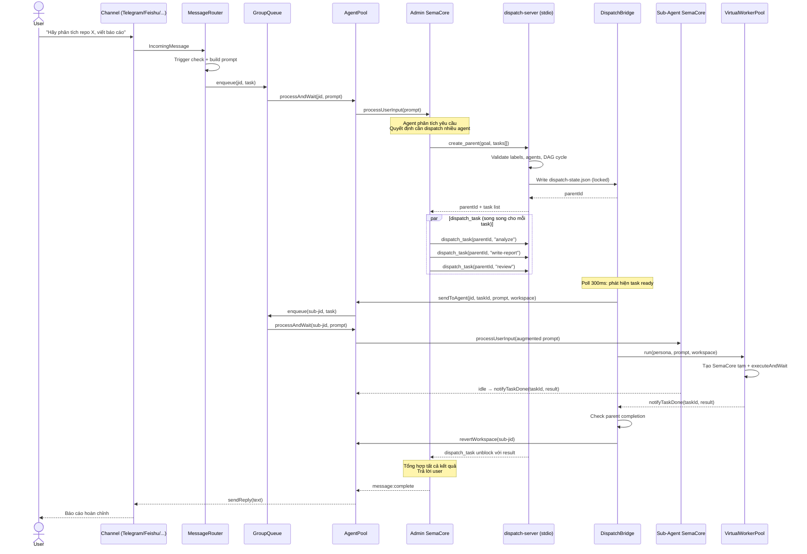
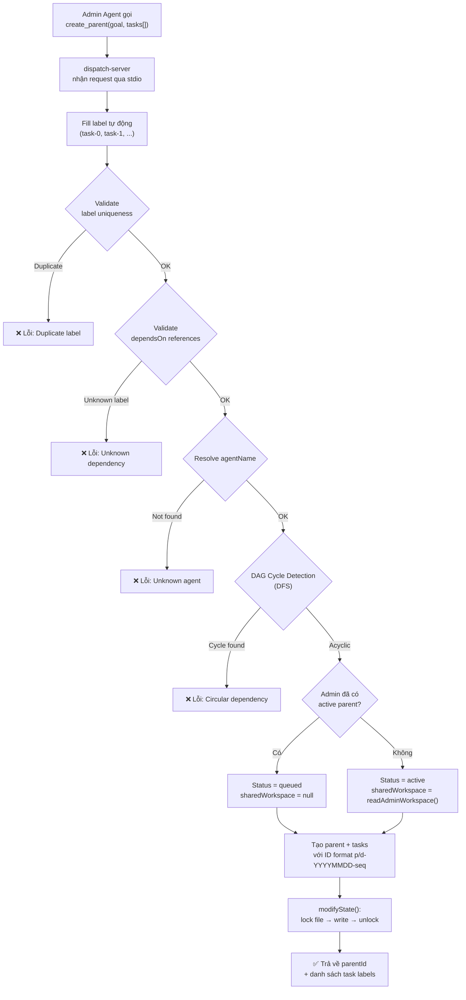
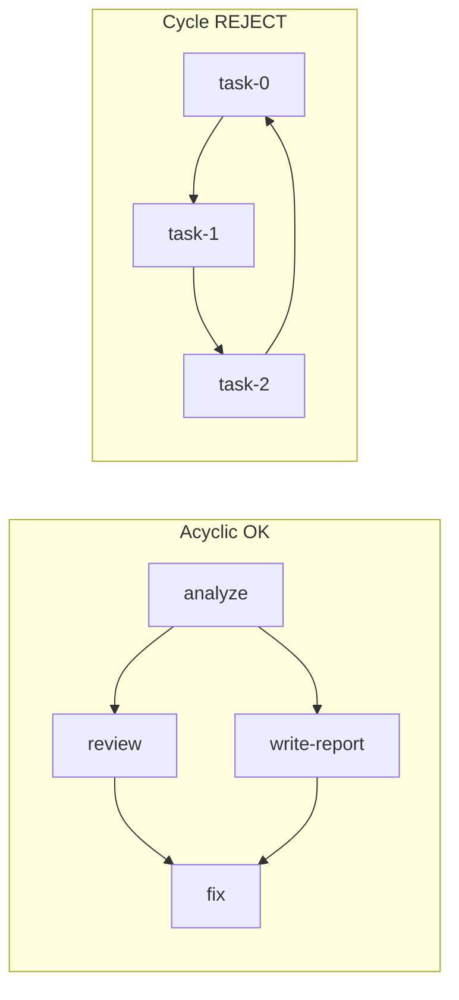
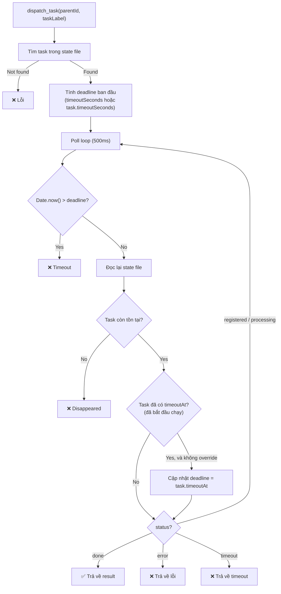
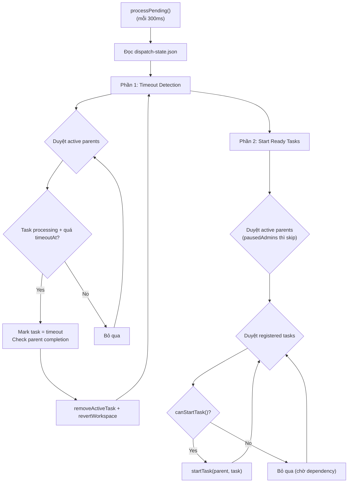
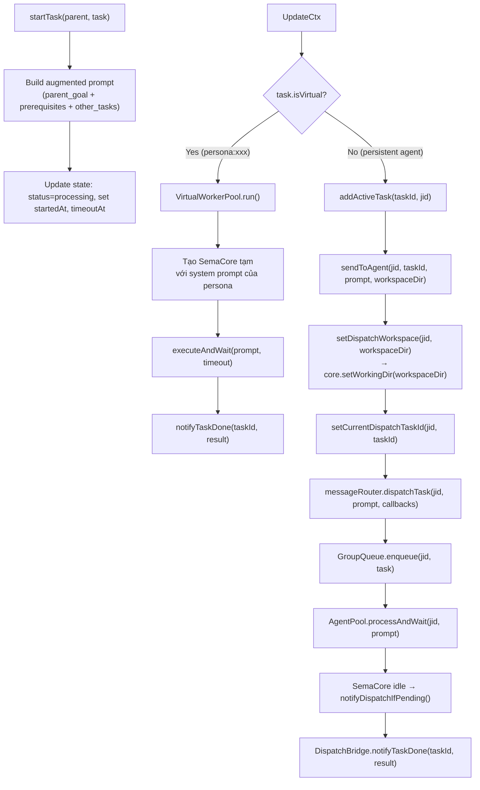
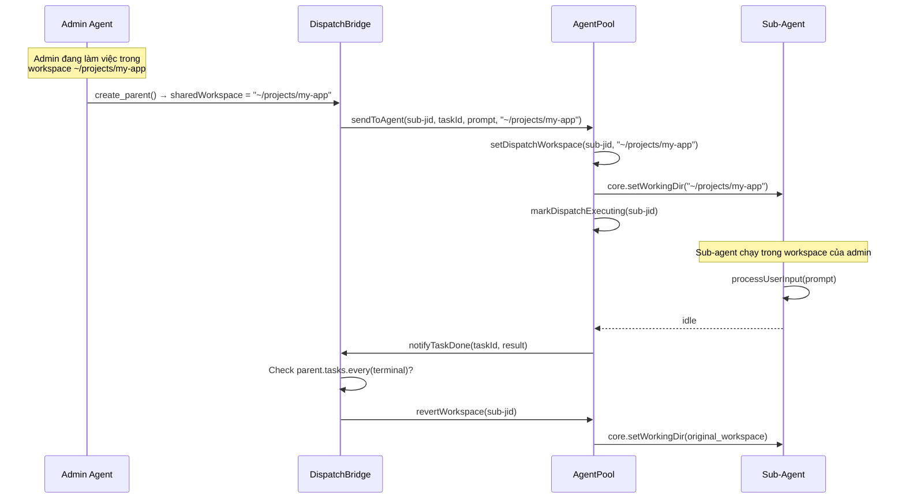
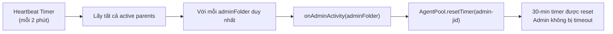
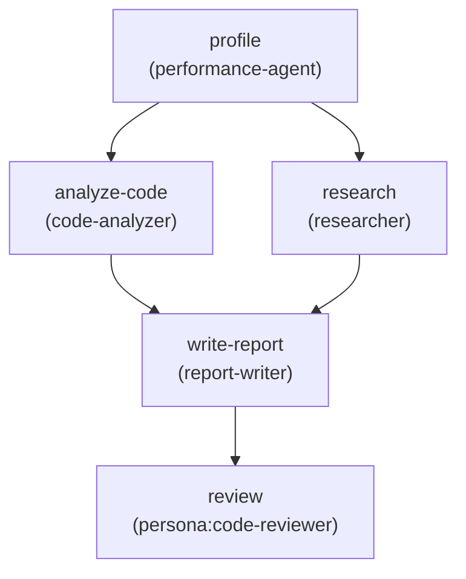

# DAG Team — Luồng Chat & Dispatch Task

Tài liệu mô tả cách SemaClaw thực hiện dispatch nhiều agent song song theo mô hình DAG (Directed Acyclic Graph), từ lúc admin agent nhận lệnh cho đến khi tổng hợp kết quả.

---

## 1. Tổng quan kiến trúc

```
┌──────────────────────────────────────────────────────────────────────┐
│                        Main Process (index.ts)                       │
│                                                                      │
│  ┌──────────────┐   ┌─────────────────┐   ┌──────────────────────┐  │
│  │  AgentPool   │   │  DispatchBridge │   │  GroupQueue          │  │
│  │              │   │                 │   │  (per-jid FIFO)      │  │
│  │ processAndWait  │  poll 300ms      │   │                      │  │
│  │ SemaCore     │   │  startTask()    │   │  enqueue → drain     │  │
│  └──────┬───────┘   └────────┬────────┘   └──────────┬───────────┘  │
│         │                    │                        │              │
│         │          ┌─────────┴─────────┐              │              │
│         │          │ dispatch-state.json│              │              │
│         │          └─────────┬─────────┘              │              │
│         │                    │                        │              │
│  ┌──────┴────────────────────┴────────────────────────┴──────────┐  │
│  │                    MCP Subprocess (stdio)                       │  │
│  │  ┌─────────────────┐  ┌─────────────────┐                      │  │
│  │  │ dispatch-server │  │   Admin Agent   │                      │  │
│  │  │                 │  │   (SemaCore)    │                      │  │
│  │  │ create_parent   │  │                 │                      │  │
│  │  │ dispatch_task   │  │  gọi MCP tools  │                      │  │
│  │  │ list_agents     │  │  qua stdio      │                      │  │
│  │  └─────────────────┘  └─────────────────┘                      │  │
│  └────────────────────────────────────────────────────────────────┘  │
│                                                                      │
│  ┌──────────────────────────────────────────────────────────────┐   │
│  │  Sub-Agents (SemaCore instances, per-jid)                    │   │
│  │  ┌──────┐  ┌──────┐  ┌──────┐  ┌──────────────────────┐     │   │
│  │  │ Dev  │  │Review│  │ Test │  │ Virtual Personas      │     │   │
│  │  │Agent │  │Agent │  │Agent │  │ (VirtualWorkerPool)   │     │   │
│  │  └──────┘  └──────┘  └──────┘  └──────────────────────┘     │   │
│  └──────────────────────────────────────────────────────────────┘   │
└──────────────────────────────────────────────────────────────────────┘
```

### Các thành phần chính

| Thành phần | Vai trò | Chạy ở đâu |
|---|---|---|
| **Admin Agent** | SemaCore instance của admin, gọi `create_parent` + `dispatch_task` | Main process, MCP subprocess (stdio) |
| **dispatch-server** | MCP server xử lý 3 tool: `list_agents`, `create_parent`, `dispatch_task` | Subprocess riêng, giao tiếp stdio |
| **DispatchBridge** | Poll + schedule task, quản lý DAG dependencies, timeout, heartbeat | Main process |
| **dispatch-state.json** | File trạng thái shared giữa DispatchBridge và dispatch-server | `~/.semaclaw/dispatch-state.json` |
| **AgentPool** | Quản lý SemaCore instances, workspace switching, timeout | Main process |
| **GroupQueue** | FIFO queue per-jid + global concurrency cap | Main process |
| **VirtualWorkerPool** | Tạo SemaCore tạm thời cho virtual persona agents | Main process |

---

## 2. Luồng chat tổng thể



---

## 3. Chi tiết create_parent

### 3.1 Cấu trúc dữ liệu

```typescript
// dispatch-state.json
interface DispatchState {
  _seq: number;                    // ID sequence counter
  agents: DispatchAgent[];         // Danh sách persistent agents
  parents: DispatchParent[];       // Các parent task groups
}

interface DispatchParent {
  id: string;                      // "p-20260428-0001"
  adminFolder: string;             // Admin agent folder (để lookup workspace)
  sharedWorkspace: string | null;  // Workspace của admin lúc activation
  goal: string;                    // Mục tiêu tổng thể
  status: 'queued' | 'active' | 'done';
  createdAt: string;
  completedAt: string | null;
  tasks: DispatchTask[];           // DAG subtasks
}

interface DispatchTask {
  id: string;                      // "d-20260428-0002"
  label: string;                   // Unique label trong parent (dùng cho dependsOn)
  agentId: string;                 // Folder (persistent) hoặc "persona:name" (virtual)
  agentJid: string;                // JID của persistent agent ("" cho virtual)
  dependsOn: string[];             // Labels của task phải hoàn thành trước
  status: 'registered' | 'processing' | 'done' | 'error' | 'timeout';
  prompt: string;
  result: string | null;
  timeoutSeconds: number;
  isVirtual?: boolean;
  personaName?: string;
  // ... timestamps
}
```

### 3.2 Luồng create_parent



### 3.3 ID Format

```
Parent:  p-YYYYMMDD-{seq:04d}    ví dụ: p-20260428-0001
Task:    d-YYYYMMDD-{seq:04d}    ví dụ: d-20260428-0002
```

`_seq` tăng toàn cục trong state file — mỗi lần tạo parent/task mới đều lấy next seq.

### 3.4 DAG Cycle Detection (DFS)



Thuật toán DFS với `visited` + `inStack` sets:
- `visited`: node đã duyệt xong toàn bộ subtree → skip
- `inStack`: node đang nằm trên đường đi hiện tại → nếu gặp lại → **cycle detected**
- Duyệt từng task chưa visited, chạy DFS. Nếu DFS trả về `true` cho bất kỳ task nào → có cycle.

```typescript
function detectCycle(tasks: Array<{ label: string; dependsOn: string[] }>): string | null {
  const visited = new Set<string>();
  const inStack = new Set<string>();

  const dfs = (label: string): boolean => {
    if (inStack.has(label)) return true;   // Cycle!
    if (visited.has(label)) return false;  // Đã duyệt rồi
    visited.add(label);
    inStack.add(label);
    const task = tasks.find(t => t.label === label);
    for (const dep of task?.dependsOn ?? []) {
      if (dfs(dep)) return true;
    }
    inStack.delete(label);
    return false;
  };

  for (const task of tasks) {
    if (!visited.has(task.label) && dfs(task.label)) return task.label;
  }
  return null;
}
```

---

## 4. Chi tiết dispatch_task

### 4.1 Cơ chế blocking poll

`dispatch_task` là một **blocking MCP call**: admin agent gọi nó và chờ cho đến khi task hoàn thành (hoặc timeout). Trong thời gian chờ, nó poll `dispatch-state.json` mỗi 500ms.



### 4.2 Điểm quan trọng: deadline động

Deadline được cập nhật động khi task bắt đầu chạy (có `timeoutAt`):

```
Ban đầu:    deadline = now + timeoutSeconds (ước tính)
Khi start:  deadline = task.timeoutAt (chính xác từ lúc thực sự bắt đầu)
```

Điều này tránh timeout sớm cho các task phải chờ dependency (có thể ở trạng thái `registered` nhiều phút trước khi được schedule).

### 4.3 Admin agent gọi song song

Admin agent (SemaCore) gọi `dispatch_task` cho **tất cả task cùng lúc** qua MCP tool calls song song:

```
Tool calls trong cùng 1 turn:
  → dispatch_task("p-20260428-0001", "analyze")
  → dispatch_task("p-20260428-0001", "write-report")
  → dispatch_task("p-20260428-0001", "review")
```

Mỗi call block riêng, chờ cho đến khi task tương ứng hoàn thành. DispatchBridge đảm bảo các task có dependency không bắt đầu cho đến khi dependency hoàn thành.

---

## 5. DispatchBridge — Engine chính

### 5.1 Poll loop (300ms)

DispatchBridge chạy 3 interval timers:

| Timer | Chu kỳ | Nhiệm vụ |
|---|---|---|
| `pollInterval` | 300ms | `processPending()` — timeout detection + start ready tasks |
| `heartbeatInterval` | 2 phút | `heartbeatActiveAdmins()` — reset admin timeout timer |
| `cleanupInterval` | 10 phút | `cleanup()` — xóa parents đã done quá 1 giờ |

### 5.2 processPending() chi tiết



### 5.3 canStartTask() — Điều kiện khởi động

```typescript
canStartTask(task: DispatchTask, allTasks: DispatchTask[]): boolean {
  // 1. Tất cả dependencies đã đạt terminal state?
  if (!this.isReady(task, allTasks)) return false;

  // 2. Virtual agent: kiểm tra persona concurrency limit
  if (task.isVirtual && task.personaName) {
    const pool = this.virtualWorkerPool;
    const registry = this.personaRegistry;
    if (!pool || !registry) return false;
    const persona = registry.get(task.personaName);
    if (!persona) return false;
    return pool.getActiveCount(task.personaName) < persona.maxConcurrent;
  }

  // 3. Persistent agent: chỉ 1 task processing mỗi jid
  return !this.hasActiveTasks(task.agentJid);
}
```

**Terminal states** (được coi là hoàn thành): `done`, `error`, `timeout`

> Policy "tiếp tục": error/timeout không chặn downstream tasks — chúng được coi là đã hoàn thành (dù thất bại).

### 5.4 startTask() — Inject context và gửi prompt

Đây là nơi prompt được augment với context từ parent và các task khác:

```xml
<parent_goal>Phân tích repo và viết báo cáo tổng hợp</parent_goal>

<prerequisites>
  <task label="analyze" agent="code-analyzer" status="done">
    <prompt>Phân tích cấu trúc thư mục và các module chính</prompt>
    <result>Repo có 3 module chính: auth, api, ui. Auth dùng JWT,...</result>
  </task>
</prerequisites>

<other_tasks>
  <task label="review" agent="code-reviewer" status="registered">
    Review báo cáo trước khi gửi
  </task>
</other_tasks>

Viết báo cáo dựa trên phân tích trên
```

Gồm 3 phần context:
1. **`<parent_goal>`**: Mục tiêu tổng thể (cho mọi task)
2. **`<prerequisites>`**: Kết quả của các task dependency (có label nằm trong `dependsOn`)
3. **`<other_tasks>`**: Trạng thái các task khác không phải dependency (để agent có toàn cảnh)

### 5.5 Hai đường dẫn thực thi



---

## 6. Workspace switching trong dispatch

Một tính năng quan trọng: sub-agent tạm thời chuyển sang workspace của admin khi thực thi dispatch task.



**Cơ chế:**
- `sharedWorkspace` được đọc từ file `workspace-state-{adminFolder}.json` lúc parent được activate
- DispatchBridge truyền `workspaceDir` qua `sendToAgent` callback
- AgentPool lưu override trong `dispatchWorkspaceOverrides` Map
- Khi tất cả task của sub-jid hoàn thành, gọi `revertWorkspace` để khôi phục workspace gốc

---

## 7. Heartbeat — Chống timeout admin

### Vấn đề

Admin agent chạy trong `processAndWait` với timeout 30 phút. Khi admin gọi `dispatch_task` (blocking MCP call), không có event `state:update` nào từ SemaCore trong suốt thời gian chờ → timer 30 phút có thể fire, giết admin agent trong khi dispatch vẫn đang chạy.

### Giải pháp



```typescript
// DispatchBridge
private heartbeatActiveAdmins(): void {
  const state = this.readState();
  const activeAdminFolders = new Set(
    state.parents
      .filter(p => p.status === 'active')
      .map(p => p.adminFolder)
  );
  for (const folder of activeAdminFolders) {
    this.onAdminActivity?.(folder);  // → AgentPool.resetTimer()
  }
}

// AgentPool (trong bindEvents)
bridge.setAdminActivityCallback((adminFolder: string) => {
  for (const [jid, binding] of this.bindings) {
    if (binding.folder === adminFolder) {
      this.notifyActivity(jid);  // resetTimer()
      break;
    }
  }
});
```

Ngoài ra, mỗi khi subtask complete/error, admin activity cũng được gọi:
```typescript
// Trong notifyTaskDone / notifyTaskError:
if (taskAdminFolder) this.onAdminActivity?.(taskAdminFolder);
```

---

## 8. Active task tracking

DispatchBridge duy trì 2 data structure để theo dõi task đang chạy:

```typescript
// Primary index: taskId → jid
private activeTasks = new Map<string, string>();

// Secondary index: jid → Set<taskId>
private activeAgentTasks = new Map<string, Set<string>>();
```

**Dùng để:**
- `hasActiveTasks(jid)`: Kiểm tra xem persistent agent có đang chạy dispatch task nào không → quyết định có start task mới không
- `notifyTaskDone(taskId)`: Tìm jid từ taskId → xóa khỏi cả 2 indexes
- `notifyReply(jid, text)`: Fallback — tìm task processing sớm nhất của jid để mark done

---

## 9. Admin lifecycle hooks

### 9.1 Pause/Resume

```
pauseAdmin(adminFolder):
  → pausedAdmins.add(adminFolder)
  → processPending() sẽ skip toàn bộ parent của admin này
  → Trả về danh sách sub-jids đang chạy (để caller có thể pause sub-agents)

resumeAdmin(adminFolder):
  → pausedAdmins.delete(adminFolder)
  → processPending() tiếp tục schedule bình thường
```

### 9.2 Cancel (khi admin agent stop)

```
cancelAdminParents(adminFolder):
  → Duyệt tất cả active/queued parents của admin
  → Virtual tasks: virtualWorkerPool.cancelTask(taskId)
  → Persistent tasks: removeActiveTask(taskId), mark error
  → Đánh dấu parent = done
  → pausedAdmins.delete(adminFolder)
  → Trả về danh sách sub-jids (caller stop các sub-agents này)
```

### 9.3 Cleanup

```
cleanup() (chạy mỗi 10 phút):
  → Xóa parents có status=done và completedAt > 1 giờ
```

---

## 10. Virtual Agent trong DAG

Virtual agents (persona) được tích hợp trực tiếp vào DAG dispatch:

### 10.1 Khai báo

```json
{
  "label": "code-review",
  "agentName": "persona:code-reviewer",
  "prompt": "Review code changes",
  "dependsOn": ["implement"]
}
```

### 10.2 Cơ chế

- Không có jid (jid = ""), không dùng GroupQueue
- Concurrency control qua `VirtualWorkerPool.activeCounts` + `persona.maxConcurrent`
- Mỗi virtual task tạo một SemaCore instance tạm thời
- Chạy non-blocking: `.run().then(...).catch(...)`
- Không tracked trong `activeTasks` Map (không cần — concurrency managed riêng)
- Timeout managed bởi VirtualWorkerPool (có AbortController riêng)

### 10.3 Khác biệt với persistent agent

| | Persistent Agent | Virtual Persona |
|---|---|---|
| JID | Có (tg:xxx, feishu:xxx, ...) | Không (virtual:{taskId}) |
| SemaCore | Dùng chung instance, tái sử dụng | Tạo mới mỗi task, hủy sau khi xong |
| Workspace | Switch tạm → revert | Dùng sharedWorkspace trực tiếp |
| Concurrency | 1 task/jid | Theo persona.maxConcurrent |
| Queue | GroupQueue (FIFO) | VirtualWorkerPool.activeCounts |
| Timeout | DispatchBridge poll loop | AbortController trong executeAndWait |
| Permission | Kế thừa admin config | Bind PermissionBridge riêng |

---

## 11. File locking

Cả DispatchBridge và dispatch-server đều đọc/ghi `dispatch-state.json`. Để tránh race condition, sử dụng file lock:

```typescript
modifyState(fn: (state: DispatchState) => void): void {
  const lockPath = statePath + '.lock';

  // Spin lock: thử 50 lần, mỗi lần cách 10ms
  for (let i = 0; i < 50; i++) {
    try {
      fs.writeFileSync(lockPath, String(process.pid), { flag: 'wx' });
      locked = true;
      break;
    } catch {
      // Busy wait ~10ms
      const until = Date.now() + 10;
      while (Date.now() < until) { /* spin */ }
    }
  }

  // Stale lock detection: nếu process trong lock file đã chết → force delete
  if (!locked) {
    const lockPid = parseInt(fs.readFileSync(lockPath, 'utf-8'), 10);
    try {
      process.kill(lockPid, 0);  // Probe: process còn sống?
      // Process còn sống → lock valid, skip
    } catch {
      // Process đã chết → stale lock, force delete + retry
      fs.unlinkSync(lockPath);
      fs.writeFileSync(lockPath, String(process.pid), { flag: 'wx' });
      locked = true;
    }
  }

  // Cleanup: luôn xóa lock trong finally
  try {
    const state = this.readState();
    fn(state);
    this.writeState(state);
  } finally {
    try { fs.unlinkSync(lockPath); } catch { /* ignore */ }
  }
}
```

---

## 12. Tóm tắt các ID và format

| ID | Format | Ví dụ | Ý nghĩa |
|---|---|---|---|
| Parent ID | `p-YYYYMMDD-NNNN` | `p-20260428-0001` | Định danh một nhóm task |
| Task ID | `d-YYYYMMDD-NNNN` | `d-20260428-0003` | Định danh một subtask |
| Task Label | String | `analyze`, `write-report` | Tên gợi nhớ trong parent (dùng cho dependsOn) |
| Agent ID | Folder hoặc `persona:name` | `code-analyzer`, `persona:reviewer` | Persistent agent hoặc virtual persona |
| Admin Folder | String | `main` | Folder của admin agent |

---

## 13. Cấu hình liên quan

| Biến môi trường | Mặc định | Ý nghĩa |
|---|---|---|
| `SEMACLAW_DISPATCH_STATE_PATH` | `~/.semaclaw/dispatch-state.json` | File trạng thái dispatch |
| `SEMACLAW_ADMIN_FOLDER` | (required) | Admin folder cho dispatch-server |
| `SEMACLAW_AGENTS_CONFIG_DIR` | `~/.semaclaw/virtual-agents/` | Thư mục chứa persona configs |
| `SEMACLAW_MAX_CONCURRENT` | (từ config.json) | Global concurrency limit |
| `AGENT_TIMEOUT_MS` | 30 phút | Hardcoded timeout cho processAndWait |

---

## 14. Ví dụ hoàn chỉnh

### Input từ user

```
"Hãy phân tích hiệu năng của repo X, đề xuất cải tiến, và viết báo cáo"
```

### Admin agent phân tích và gọi create_parent

```json
{
  "goal": "Phân tích hiệu năng repo X và tạo báo cáo cải tiến",
  "tasks": [
    {
      "label": "profile",
      "agentName": "performance-agent",
      "prompt": "Chạy profiler trên repo X, tìm bottleneck",
      "dependsOn": []
    },
    {
      "label": "analyze-code",
      "agentName": "code-analyzer",
      "prompt": "Phân tích các hot path trong code dựa trên kết quả profile",
      "dependsOn": ["profile"]
    },
    {
      "label": "research",
      "agentName": "researcher",
      "prompt": "Research các best practices và giải pháp cho các bottleneck đã tìm thấy",
      "dependsOn": ["profile"]
    },
    {
      "label": "write-report",
      "agentName": "report-writer",
      "prompt": "Tổng hợp phân tích và research thành báo cáo markdown",
      "dependsOn": ["analyze-code", "research"]
    },
    {
      "label": "review",
      "agentName": "persona:code-reviewer",
      "prompt": "Review báo cáo, kiểm tra tính chính xác và khả thi",
      "dependsOn": ["write-report"]
    }
  ],
  "timeoutSeconds": 900
}
```

### DAG visualization



### Timeline thực thi

```
T=0s    create_parent → parent active
        DispatchBridge poll: profile ready → start
        (analyze-code, research chờ profile)

T=5s    admin gọi dispatch_task("profile"), dispatch_task("analyze-code"),
        dispatch_task("research"), dispatch_task("write-report"),
        dispatch_task("review") — tất cả song song

T=120s  profile done → analyze-code + research unblocked
        DispatchBridge poll: analyze-code + research ready → start

T=180s  analyze-code done → chờ research

T=200s  research done → write-report unblocked
        DispatchBridge poll: write-report ready → start

T=300s  write-report done → review unblocked
        DispatchBridge poll: review (virtual) ready → start

T=400s  review done → tất cả task hoàn thành
        Parent status → done
        dispatch_task của admin unblock với results

T=401s  Admin tổng hợp và trả lời user
```

---

## 15. Các điểm cần lưu ý khi port sang Rust

1. **File locking**: `src/mcp/dispatch_server.rs` đã port cơ chế lock với spin + stale detection dùng `libc::kill(0)`. `#[cfg(unix)]` cho platform portability.

2. **Poll loop**: DispatchBridge cần chạy async loop (tokio interval) thay vì `setInterval`.

3. **VirtualWorkerPool trait**: Đã định nghĩa `VirtualWorkerPool` trait trong `src/mcp/virtual_server.rs` — cần implement thực tế với SemaCore.

4. **sendToAgent callback**: Cần inject qua kênh message passing (tokio mpsc) thay vì closure trực tiếp.

5. **Heartbeat**: Cần gửi event reset timeout qua mpsc channel đến AgentPool.

6. **State consistency**: Đảm bảo `modifyState` atomic — Rust version đã dùng spin lock + stale lock detection giống TS.
