# Luồng chat agent

Tài liệu này mô tả end-to-end luồng chat agent của SenClaw: từ Web UI hoặc channel adapter,
qua WebSocket/MessageRouter/GroupQueue/AgentPool, vào ZenCore, rồi quay lại UI bằng các event realtime.
Tài liệu tập trung vào luồng chat thường; phần dispatch/DAG team được nhắc ở các điểm giao nhau.

## Bức Tranh Tổng Quan

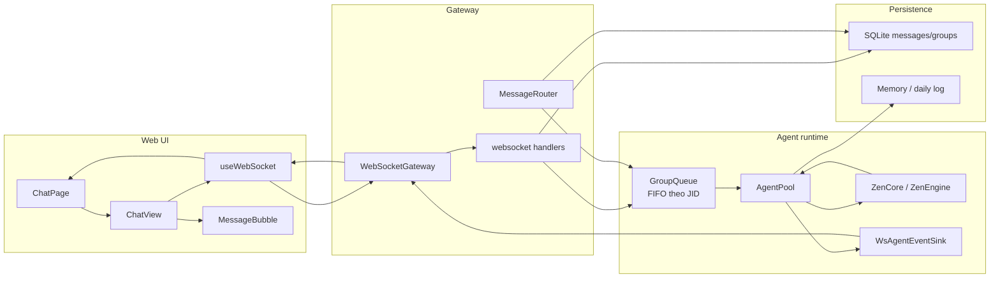

Các file chính:

- UI chat: `web/src/pages/ChatPage.tsx`, `web/src/components/ChatView.tsx`,
  `web/src/components/MessageBubble.tsx`.
- WebSocket hook: `web/src/hooks/useWebSocket.ts`.
- WebSocket server: `src/gateway/websocket_gateway/handlers.rs`,
  `src/gateway/websocket_gateway/notify.rs`, `src/gateway/websocket_gateway/gateway.rs`.
- Channel router: `src/gateway/message_router.rs`.
- Agent lifecycle: `src/agent/agent_pool/pool.rs`.
- Daemon wiring: `src/lib.rs`.

## Khởi Tạo UI Và Subscribe

Khi Web UI mount, `useWebSocket()` mở kết nối tới `ws://127.0.0.1:<wsPort>`.
Sau `auth:ok`, hook lấy danh sách groups/channels/agents/bindings. Khi có groups, UI tự subscribe
admin group để nhận snapshot admin và các event broadcast admin.

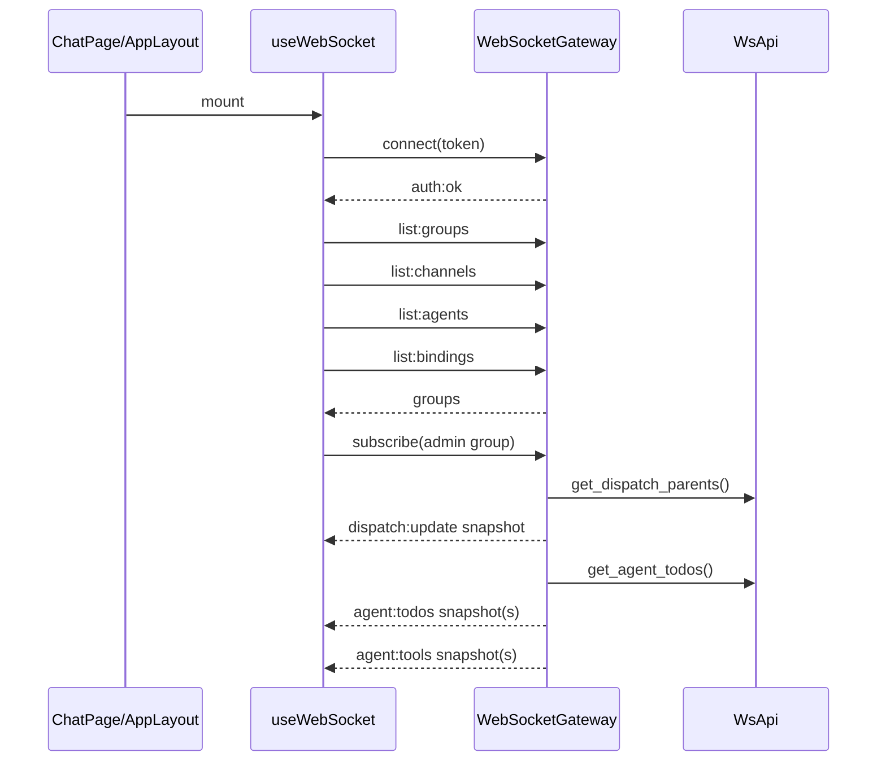

`ChatPage` chọn group đầu tiên, ưu tiên admin group. Khi user chọn group trong sidebar,
`ChatPage` gọi `ws.subscribe(jid)` nếu chưa subscribe. Khi có dispatch active/queued,
`ChatPage` gọi `subscribeAll()` để UI cũng nhận chat transcript của các child agents.

## Luồng Gửi Tin Nhắn Từ Web UI

Khi agent idle, nút action trong `ChatView` là Send. User gửi bằng Enter hoặc nút send:

1. `ChatView` gọi `onSend(text)`.
2. `ChatPage` truyền thành `ws.sendMessage(selectedJid, text)`.
3. `useWebSocket` thêm optimistic message local vào `messages[jid]`.
4. Hook gửi frame `{ type: "message", groupJid, text }`.
5. Backend `handle_message_send()` validate auth, group, command, rồi persist message vào DB.
6. Backend gọi `state.api.enqueue_and_process(&group_jid, &group, &text)`.
7. Daemon implementation đưa job vào `GroupQueue`.
8. Job gọi `AgentPool::process_and_wait()`.

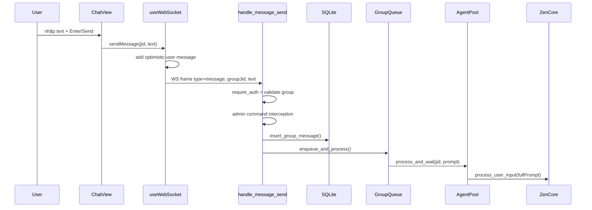

Lưu ý:

- Web message được persist trong `handle_message_send()` để lần sau `history:load` vẫn có user message.
- Nếu client là admin và text là command (`/reset`, v.v.), `dispatch_command()` xử lý trước và có thể
  trả `agent:reply` ngay, không đi qua AgentPool.
- Pending binding (`:pending:`) không cho chat từ UI cho tới khi channel thật hoàn tất binding.

## Luồng Tin Nhắn Từ Channel Adapter

Tin nhắn từ Telegram/Feishu/QQ/WeChat/App không đi qua `handle_message_send()`.
Nó đi vào `MessageRouter::handle_message()` dưới dạng `IncomingMessage`.

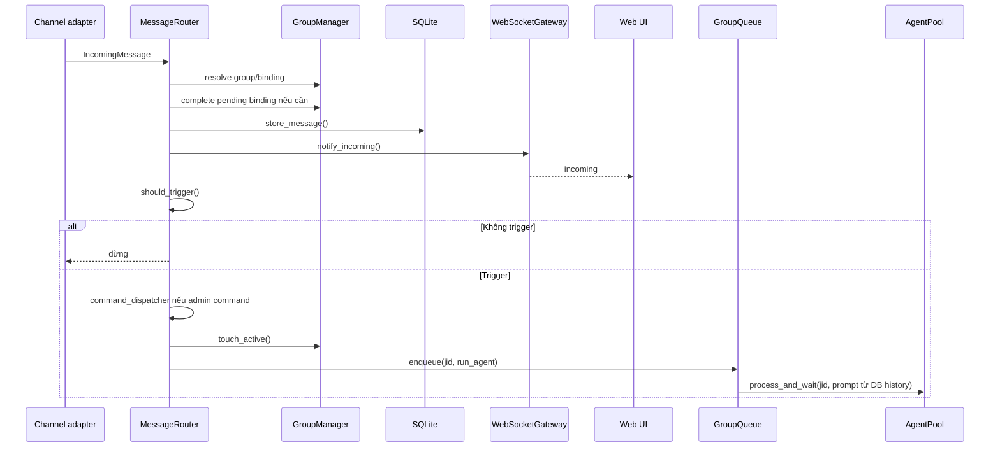

Điểm khác với Web UI:

- Router luôn persist incoming message trước, rồi mới trigger check.
- `notify_incoming()` broadcast tới các UI đang subscribe group để thấy message realtime.
- Nếu `requires_trigger` không thỏa, agent không chạy nhưng message vẫn lưu trong history.

## Build Prompt Và FIFO Theo Group

`GroupQueue` đảm bảo mỗi `jid` chỉ chạy một job chat tại một thời điểm. Điều này tránh hai message
cùng group làm race session/context.

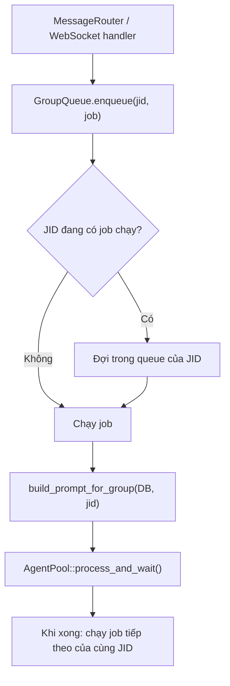

Với channel message, `run_agent()` gọi `build_prompt_for_group()` để lấy prompt từ DB history.
Sau khi `process_and_wait()` hoàn tất, router ghi `last_agent_timestamp` để đánh dấu cursor xử lý.

Với Web UI message, `handle_message_send()` truyền text mới vào `enqueue_and_process()`.
Implementation daemon vẫn đưa về AgentPool path, còn history đã được persist trước đó.

## AgentPool Và ZenCore

`AgentPool::process_and_wait_inner()` là trung tâm của vòng đời một lượt agent:

1. `get_or_create(group)` tạo hoặc lấy core/session hiện có cho JID.
2. Có thể inject memory pre-retrieval vào prompt nếu config bật.
3. Ghi daily log role user.
4. Đăng ký event bridge cho `state:update`, `session:error`, abort và reset timer.
5. Bật typing indicator.
6. Gọi `core_api.process_user_input(jid, full_prompt)` non-blocking.
7. Chờ event `Idle`, `Error`, `Reset`, `Abort`, hoặc timeout.
8. Cleanup registrations, tắt typing indicator.

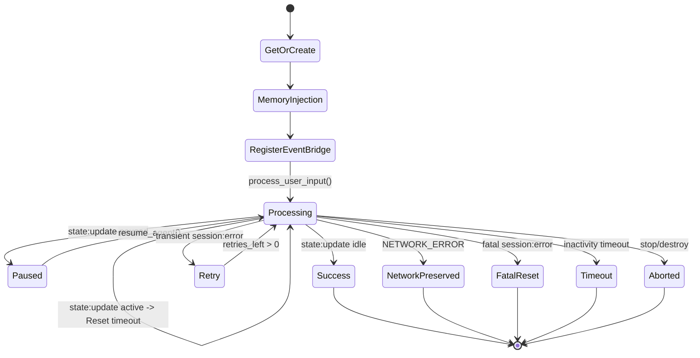

Event loop chính:

| Event | Nguồn | Hành động |
| --- | --- | --- |
| `Idle` | `state:update` từ core | resolve lượt chat, cleanup |
| `Reset` | `state:update` active hoặc permission/activity | reset inactivity timer |
| `Error(data)` | `session:error` | retry/network/fatal theo phân loại |
| `Abort` | `stop_agent()` / destroy | dừng lượt đang chờ |
| `Timeout` | timer `AGENT_TIMEOUT_MS` | destroy, notify dispatch error nếu có |

## Core Events Đi Ngược Lên UI

Khi `ZenCore` phát event, `AgentPool::bind_events()` đã đăng ký các handler persistent theo JID.
Các handler này vừa cập nhật state nội bộ, vừa forward qua `WsAgentEventSink` tới WebSocket.

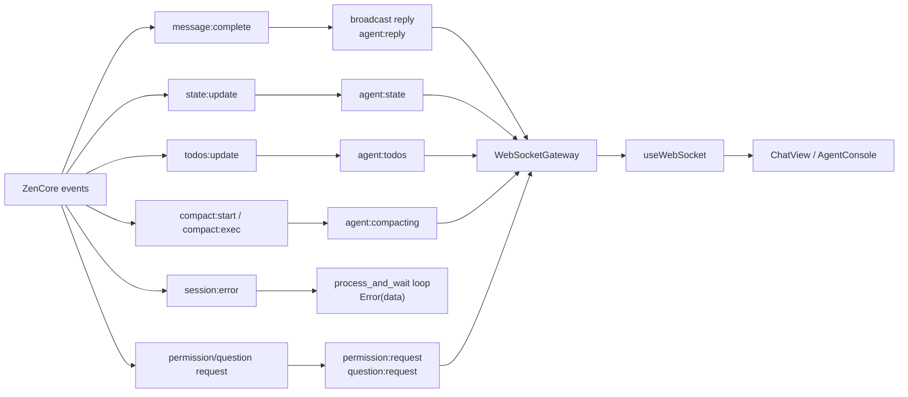

Các event UI nhận trong `useWebSocket.ts`:

- `incoming`: thêm message `other` nếu không phải `isFromMe`.
- `history:load`: thay messages của group bằng history từ backend.
- `agent:reply`: thêm message role `agent`.
- `agent:state`: cập nhật `agentStates[groupJid]`; `ChatView` đổi Ready/Thinking/Paused.
- `agent:compacting`: disable pause khi compacting.
- `agent:usage`: cập nhật token usage trên header chat.
- `permission:request` và `question:request`: thêm card tương tác vào message list.
- `permission:resolved` và `question:resolved`: cập nhật card đã xử lý.
- `agent:todos`: cập nhật Agent Console, không nằm trực tiếp trong transcript chat.

## Render Trên ChatView

`ChatView` là component render transcript và input state.

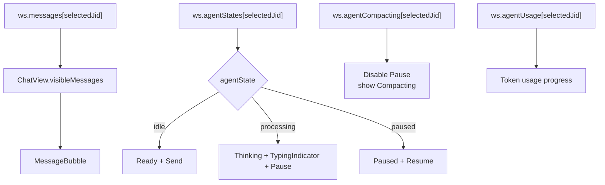

Input rules:

- Idle: Enter gửi message; Shift+Enter xuống dòng.
- Processing: textarea disabled, nút action là Pause.
- Paused: textarea cho phép nhập follow-up instruction, nút action là Resume.
- IME/bộ gõ đang composing thì không gửi để tránh Enter bị bắt nhầm.
- Reset session luôn hiển thị ở header; nếu agent active, reset sẽ terminate lượt đang chạy.

## Pause, Resume, Stop

UI gửi frame `agent:control` cho pause/resume/stop. Backend yêu cầu client đã subscribe group đó trước khi
được control agent.

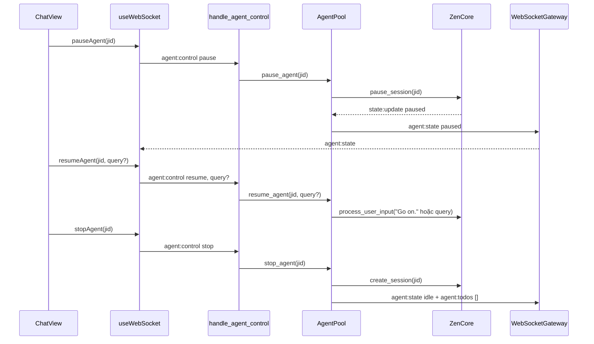

Pause/resume có thêm nhánh dispatch:

- Nếu admin agent đang điều phối DAG, pause sẽ gọi `DispatchBridge::pause_admin(folder)` và pause các
  child JID đang có active abort.
- Resume sẽ gọi `DispatchBridge::resume_admin(folder)` và gửi `"Go on."` cho các child JID đã pause.
- Stop admin sẽ cancel dispatch parents và đệ quy stop child subagents.

## Permission Và Question Cards

Tool permission và AskUserQuestion đi qua card trong chat transcript.

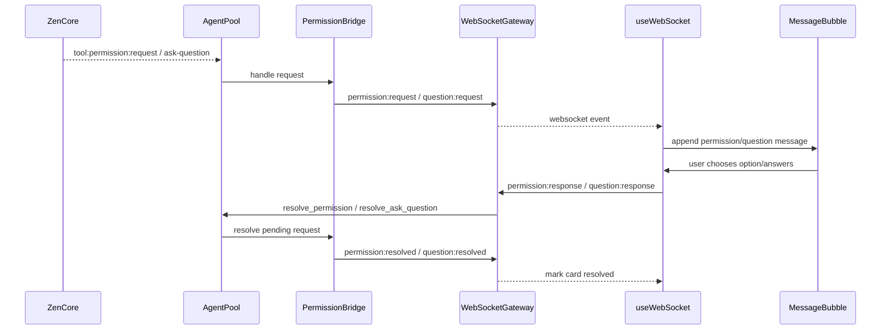

Những cards này nằm trong `messages[jid]`, vì vậy `AgentConsole` cũng có thể scan toàn bộ messages để hiện
`Pending Permissions` tập trung.

## Compacting Và Usage

Khi core compact context:

- `compact:start` -> `agent:compacting { isCompacting: true }`.
- `compact:exec` -> `agent:compacting { isCompacting: false }`.
- UI disable pause trong lúc compacting để tránh dừng giữa quá trình ghi lại context.

`agent:usage` được broadcast tới all authenticated clients, keyed bằng `agentJid`.
`ChatView` hiển thị token usage nếu `ws.agentUsage[selectedJid]` có dữ liệu.

## Dispatch Child Task Đi Qua Luồng Chat

Khi một DAG task target persistent agent, `DispatchBridge` không gọi core trực tiếp. Nó dùng lại luồng chat:

1. Bridge build augmented prompt.
2. Daemon set workspace override, map `jid -> task_id`, mark `dispatch_executing`.
3. Job được enqueue vào `GroupQueue`.
4. AgentPool chạy `process_and_wait()` như chat thường.
5. Khi core `message:complete`, reply được lưu vào `last_dispatch_replies`.
6. Khi core `state:update idle`, AgentPool gọi `DispatchBridge::notify_task_done(task_id, reply)`.
7. DispatchBridge mutate state và phát `dispatch:update`.

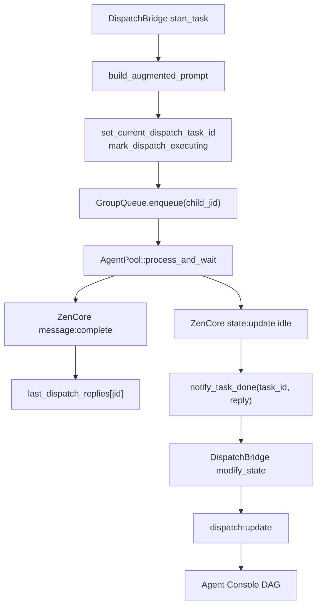

Điều này giải thích vì sao child agent vẫn có transcript riêng trong Chat UI nếu UI đã subscribe group/JID đó.

## Các Event WebSocket Liên Quan Đến Chat

| Event | Backend phát từ | UI xử lý ở | Ý nghĩa |
| --- | --- | --- | --- |
| `incoming` | `MessageRouter -> notify_incoming()` | `useWebSocket` | Message từ channel adapter |
| `history:load` | subscribe/history handlers | `useWebSocket` | Load transcript persisted |
| `agent:reply` | `AgentPool -> WsAgentEventSink` | `useWebSocket` | Reply của agent |
| `agent:state` | `state:update` core event | `useWebSocket` | `idle`, `processing`, `paused`, ... |
| `agent:compacting` | compact events | `useWebSocket` | Context compacting đang chạy |
| `agent:usage` | usage callback | `useWebSocket` | Token usage |
| `permission:request` | PermissionBridge | `useWebSocket` | Card approve/deny |
| `question:request` | AskQuestion bridge | `useWebSocket` | Card trả lời câu hỏi |
| `permission:resolved` | PermissionBridge | `useWebSocket` | Mark permission card resolved |
| `question:resolved` | AskQuestion bridge | `useWebSocket` | Mark question card resolved |
| `agent:todos` | `todos:update` core event | `useWebSocket` | Agent Console todos |
| `dispatch:update` | DispatchBridge | `useWebSocket` | DAG workflow state |

## Debug Checklist

Khi chat không chạy hoặc UI không thấy reply:

1. Web UI có `auth:ok` và `groups` chưa.
2. Group đã được subscribe chưa (`subscribed` event).
3. Với Web UI send: backend có vào `handle_message_send()` và persist DB không.
4. Với channel send: `MessageRouter` có log `Triggering agent` hay bị `Trigger check failed`.
5. `GroupQueue` có đang bị job trước cùng JID giữ không.
6. `AgentPool` có log `process_user_input start jid=...` không.
7. Core có phát `message:complete` và `state:update idle` không.
8. `WsAgentEventSink` có gọi `notify_agent_reply` / `notify_agent_state` không.
9. UI có nhận `agent:reply` / `agent:state` trong browser console không.
10. Nếu là dispatch child task, kiểm tra thêm `dispatch_task_map`, `dispatch_executing`,
    và `dispatch:update`.

## Ranh Giới Với Tài Liệu Dispatch

Tài liệu này mô tả luồng chat agent thường và các điểm giao với dispatch child task.
Chi tiết sâu về `dispatch:update`, `agent:todos`, `task:backlog`, MCP dispatch server và Agent Console debug
nằm trong `docs/notify-dispatch-flow.md`.
