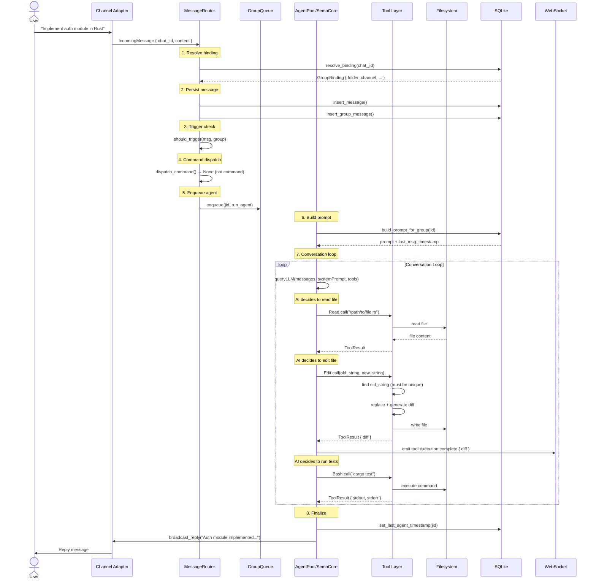
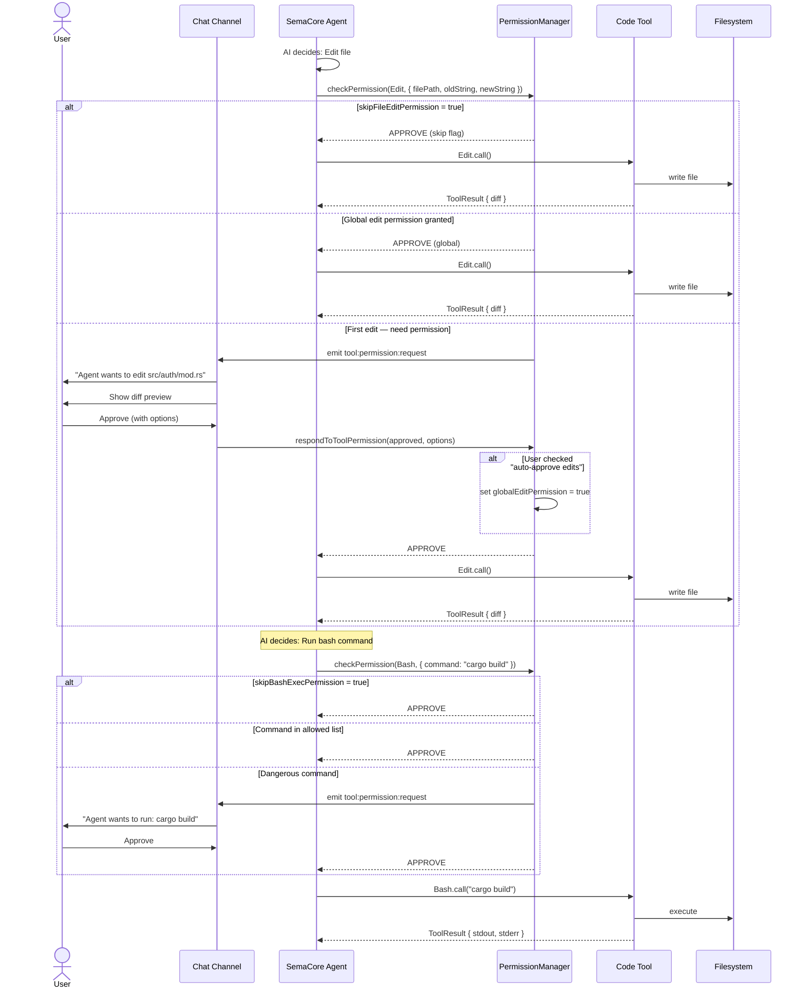

# SemaClaw Code Editing — Tài liệu luồng chính chi tiết

> Tổng hợp từ các tài liệu thiết kế: COWORK_DESIGN.md, core.md, vscode-extensions-research.md, memory.md
>
> Tài liệu mô tả chi tiết các luồng hoạt động chính của tính năng code editing trong SemaClaw.

---

## 1. Kiến trúc tổng thể

### 1.1. Các tầng tham gia code editing

```
┌──────────────────────────────────────────────────────────────────────────┐
│                        SemaClaw Code Editing Stack                        │
│                                                                          │
│  ┌─────────────────────────────────────────────────────────────────┐    │
│  │                    INPUT LAYER                                   │    │
│  │  Telegram │ Feishu │ QQ │ WeChat │ Web UI │ VS Code (planned)   │    │
│  └──────────────────────────┬──────────────────────────────────────┘    │
│                             │                                           │
│  ┌──────────────────────────▼──────────────────────────────────────┐    │
│  │                    GATEWAY LAYER                                 │    │
│  │  MessageRouter → trigger check → command dispatch → GroupQueue   │    │
│  └──────────────────────────┬──────────────────────────────────────┘    │
│                             │                                           │
│  ┌──────────────────────────▼──────────────────────────────────────┐    │
│  │                    AGENT LAYER                                   │    │
│  │  AgentPool → SemaCore Engine → Conversation Loop                 │    │
│  │  ┌──────────────────────────────────────────────────────────┐   │    │
│  │  │ TOOL LAYER (sema-core)                                    │   │    │
│  │  │ Read │ Write │ Edit │ Bash │ Glob │ Grep │ Task │ Skill  │   │    │
│  │  └──────────────────────────────────────────────────────────┘   │    │
│  └──────────────────────────┬──────────────────────────────────────┘    │
│                             │                                           │
│  ┌──────────────────────────▼──────────────────────────────────────┐    │
│  │                    PERSISTENCE LAYER                             │    │
│  │  SQLite (messages, tasks, memory) │ Git (wiki) │ Filesystem      │    │
│  └─────────────────────────────────────────────────────────────────┘    │
│                             │                                           │
│  ┌──────────────────────────▼──────────────────────────────────────┐    │
│  │                    NOTIFICATION LAYER                            │    │
│  │  WebSocket events │ Channel reply │ Memory indexing │ Recording  │    │
│  └─────────────────────────────────────────────────────────────────┘    │
└──────────────────────────────────────────────────────────────────────────┘
```

### 1.2. Tool inventory trong code editing

| Tool | Source | Type | Chức năng |
|------|--------|------|-----------|
| **Read** | sema-core | Read-only | Đọc file (text, image, PDF, notebook) |
| **Write** | sema-core | Write | Ghi file mới hoặc ghi đè toàn bộ |
| **Edit** | sema-core | Write | String replacement chính xác + sinh diff |
| **Bash** | sema-core | Write | Chạy shell command (build, test, git) |
| **Glob** | sema-core | Read-only | Tìm file theo pattern |
| **Grep** | sema-core | Read-only | Tìm kiếm nội dung qua ripgrep |
| **Task** | sema-core | Write | Dispatch sub-agent |
| **Skill** | sema-core | Write | Gọi skill |
| **TodoWrite** | sema-core | Write | Quản lý todo list |
| **NotebookEdit** | sema-core | Write | Sửa Jupyter notebook |

### 1.3. Permission model trong code editing

```
Permission Check Flow:
┌──────────────┐     ┌──────────────────┐     ┌─────────────────┐
│ Tool Call    │────►│ PermissionMgr    │────►│ Config Check    │
│ (Write/Edit/ │     │ hasPermissions   │     │ skipFileEdit?   │
│  Bash)       │     │ ToUseTool()      │     │ skipBashExec?   │
└──────────────┘     └────────┬─────────┘     └────────┬────────┘
                              │                        │
                     ┌────────▼─────────┐              │
                     │ Global Edit      │              │
                     │ Permission?      │              │
                     └────┬────────┬────┘              │
                          │YES     │NO                 │
                          ▼        ▼                   ▼
                   ┌──────────┐ ┌──────────────┐ ┌──────────┐
                   │ AUTO      │ │ PERMISSION   │ │ AUTO     │
                   │ APPROVE   │ │ REQUEST →    │ │ APPROVE  │
                   │ (đã từng  │ │ User/Host    │ │ (skip    │
                   │  approve) │ │ approves?    │ │  flag)   │
                   └──────────┘ └──┬───────┬───┘ └──────────┘
                                   │YES    │NO
                                   ▼       ▼
                             ┌────────┐ ┌────────┐
                             │ EXEC   │ │ REJECT │
                             └────────┘ └────────┘
```

---

## 2. Luồng chính: Từ tin nhắn đến thay đổi code

### 2.1. Luồng end-to-end (Single agent, Chat mode)



### 2.2. Luồng Edit tool — Chi tiết

Đây là tool quan trọng nhất trong code editing, thực hiện string replacement chính xác.

```
Edit Tool Flow:
═══════════════════════════════════════════════════════════════

INPUT:  old_string = "fn old_name() { ... }"
        new_string = "fn new_name() { ... }"
        file_path  = "src/auth/mod.rs"

STEP 1 — VALIDATE
─────────────────
  ├── Kiểm tra file_path nằm trong allowed_paths
  ├── Kiểm tra file_path nằm trong working_dir
  └── Nếu không → reject

STEP 2 — READ FILE
─────────────────
  ├── Đọc toàn bộ nội dung file hiện tại
  └── Lưu bản snapshot trước khi sửa

STEP 3 — FIND & VERIFY UNIQUENESS
──────────────────────────────────
  ├── Tìm old_string trong file content
  ├── Nếu không tìm thấy → ERROR: "old_string not found"
  ├── Nếu tìm thấy > 1 lần → ERROR: "old_string not unique"
  └── Nếu tìm thấy đúng 1 lần → tiếp tục

STEP 4 — REPLACE
─────────────────
  ├── Thay thế old_string bằng new_string
  └── Sinh unified diff

STEP 5 — WRITE
─────────────────
  ├── Ghi nội dung mới vào file
  └── Trả về ToolResult { diff, filePath }

STEP 6 — NOTIFY
─────────────────
  ├── emit tool:execution:complete { diff }
  ├── WebSocket push → Web UI hiển thị diff
  └── Nếu trong Cowork → cowork:file:change event

OUTPUT: ToolResult {
          title: "Edited src/auth/mod.rs",
          content: "+45/-12 lines\n\n```diff\n...```"
        }
```

### 2.3. Luồng Write tool — Chi tiết

```
Write Tool Flow:
═══════════════════════════════════════════════════════════════

INPUT:  file_path = "src/auth/mod.rs"
        content   = "// new file content..."

STEP 1 — VALIDATE
─────────────────
  ├── Kiểm tra file_path nằm trong allowed_paths
  ├── Nếu file đã tồn tại → đọc snapshot cũ
  └── Nếu không → tạo mới

STEP 2 — WRITE
─────────────────
  ├── Tạo thư mục cha nếu chưa tồn tại
  ├── Ghi nội dung vào file
  └── Sinh diff nếu file đã tồn tại

STEP 3 — NOTIFY
─────────────────
  ├── emit tool:execution:complete { diff? }
  └── WebSocket push

OUTPUT: ToolResult {
          title: "Wrote src/auth/mod.rs",
          content: "File created/modified successfully"
        }
```

---

## 3. Luồng Cowork Code Editing

### 3.1. Kiến trúc Cowork cho code editing

```
┌──────────────────────────────────────────────────────────────────┐
│                    Cowork Workspace "project-alpha"               │
│                                                                  │
│  ┌─────────────┐  ┌─────────────┐  ┌─────────────┐              │
│  │ code-agent  │  │review-agent │  │ test-agent  │              │
│  │ (worker)    │  │ (reviewer)  │  │ (worker)    │              │
│  │ subdir: impl│  │ subdir: rev │  │ subdir: test│              │
│  └──────┬──────┘  └──────┬──────┘  └──────┬──────┘              │
│         │                │                │                      │
│         └────────────────┼────────────────┘                      │
│                          │                                       │
│  ┌───────────────────────▼──────────────────────────────────┐   │
│  │              Shared Filesystem                            │   │
│  │  workspace/project-alpha/                                 │   │
│  │  ├── shared/          ← tất cả agent đọc/ghi              │   │
│  │  ├── agents/                                               │   │
│  │  │   ├── code-agent/impl/    ← code-agent workspace       │   │
│  │  │   ├── review-agent/rev/   ← review-agent workspace     │   │
│  │  │   └── test-agent/test/    ← test-agent workspace       │   │
│  │  ├── board/            ← Knowledge Board                  │   │
│  │  └── memory/           ← Shared memory index              │   │
│  └──────────────────────────────────────────────────────────┘   │
│                                                                  │
│  ┌──────────────────────────────────────────────────────────┐   │
│  │              Cowork Services                              │   │
│  │  Channel │ Task Board │ Board │ Memory Pool │ Recording  │   │
│  └──────────────────────────────────────────────────────────┘   │
└──────────────────────────────────────────────────────────────────┘
```

### 3.2. Luồng end-to-end: Multi-agent code development

```mermaid
sequenceDiagram
    actor User
    participant UI as Web UI
    participant CW as CoworkManager
    participant Router as MessageRouter
    participant Code as code-agent
    participant Review as review-agent
    participant Test as test-agent
    participant FS as Shared Filesystem
    participant Board as Knowledge Board
    participant Mem as Shared Memory

    User->>UI: Create workspace + add agents + create task
    UI->>CW: POST workspace + POST members + POST task
    CW-->>UI: Workspace ready
    
    User->>UI: Start task "Implement auth module"
    UI->>CW: task_update(status=in_progress, assignee=code-agent)
    
    Note over CW: Trigger: task_assigned → code-agent
    CW->>Router: dispatch_task(code-agent-jid, taskPrompt + coworkContext)
    Router->>Code: processUserInput(prompt)
    
    Note over Code: Code-agent builds prompt with 7 layers:
    Note over Code: CLAUDE.md → MemberSpec → Board → TaskBoard → Channel → Memory → Task
    
    loop Code-agent làm việc
        Code->>FS: Read existing codebase
        Code->>Code: Plan implementation
        
        loop Implement features
            Code->>FS: Write/Edit source files
            Code->>FS: Bash("cargo build")
            
            Note over Code: Update Board with progress
            Code->>Board: cowork_board_update("progress", "Auth module: 60% done")
            Board->>UI: WS push cowork:board:update
            
            Note over Code: Index new code into shared memory
            Code->>Mem: memory_shared_add(fileContent, tags=["auth", "backend"])
        end
        
        Code->>FS: Bash("cargo test")
        Code->>FS: Bash("cargo clippy")
    end
    
    Note over Code: Acceptance criteria met → complete
    Code->>CW: cowork_task_complete("Auth module done. Files: +3, ~250 lines")
    
    Note over Code: Handoff rule: task_complete → review_request
    Code->>CW: cowork_send(to="review-agent", type="review_request", 
                          content="Auth module ready for review",
                          attachments=[diff_files])
    
    CW->>UI: WS push cowork:task:update (status=review)
    CW->>UI: WS push cowork:message:new
    
    Note over CW: Trigger: task_status_changed=review → review-agent
    CW->>Router: dispatch_task(review-agent-jid, reviewPrompt)
    Router->>Review: processUserInput(review context)
    
    Review->>FS: Read changed files
    Review->>FS: Read diff
    
    alt Review finds issues
        Review->>CW: cowork_send(to="code-agent", type="review_request",
                                content="L45-80: use JWT instead of session")
        CW->>Code: Trigger: message_received from review-agent
        Code->>FS: Fix issues
        Code->>CW: cowork_send(to="review-agent", type="result", content="Fixed")
    end
    
    Review->>CW: cowork_task_complete("LGTM. Approved.")
    Review->>Board: cowork_board_update("decisions", "Auth uses JWT with RSA-256")
    
    Note over CW: Trigger: task_status_changed=done (code-agent) → test-agent
    CW->>Router: dispatch_task(test-agent-jid, testPrompt)
    Router->>Test: processUserInput(test context)
    
    Test->>FS: Write integration tests
    Test->>FS: Bash("cargo test --all")
    Test->>CW: cowork_task_complete("Test coverage: 85%. All pass.")
```

### 3.3. Luồng Cross-agent File Change Notification

Học từ JCode: khi một agent sửa file, các agent khác đã đọc file đó được thông báo.

```
Cross-agent File Tracking:
═══════════════════════════════════════════════════════════════

File Access Registry (in-memory):
  HashMap<FilePath, Vec<AgentSession>>

Agent A: Read "src/auth/mod.rs"
────────────────────────────────
  registry.insert("src/auth/mod.rs", AgentA)

Agent B: Edit "src/auth/mod.rs"  
────────────────────────────────
  registry.lookup("src/auth/mod.rs") → [AgentA]
  → Notify AgentA: "File you read was modified by Agent B"
  → Cowork channel message: system → AgentA
  
Agent C: Read "src/auth/mod.rs" (sau khi Agent B sửa)
────────────────────────────────────────────
  registry.update("src/auth/mod.rs", AgentC)
  → AgentA vẫn trong registry (đã đọc trước đó)
  → AgentC được thêm vào

Agent B: Edit "src/auth/mod.rs" lần 2
─────────────────────────────────────
  registry.lookup("src/auth/mod.rs") → [AgentA, AgentC]
  → Notify AgentA + AgentC

Flow:
  Agent Edit File
    → Tool layer emits tool:execution:complete
    → CoworkManager intercepts
    → Queries File Access Registry
    → For each registered agent (excluding editor):
        → Send cowork message: type=file_changed
        → Agent sees: "⚠️ src/auth/mod.rs was modified by code-agent"
```

---

## 4. Luồng Permission & Human-in-the-Loop

### 4.1. Permission flow cho code editing



### 4.2. Permission levels

| Level | Trigger | Scope | Duration |
|-------|---------|-------|----------|
| **Per-tool deny** | User explicitly denies | Single tool call | One-time |
| **Per-tool approve** | User approves once | Single tool call | One-time |
| **Global edit permission** | User checks "auto-approve edits" | All Write/Edit tools | Until session reset |
| **Skip flags** | Config: skipFileEditPermission | Specific tool category | Config-based |
| **Allowed commands list** | Config: allowedBashCommands | Specific bash commands | Config-based |

---

## 5. Luồng Agent Prompt Building cho Code Editing

### 5.1. Single agent (Chat mode)

```
Prompt Construction:
═══════════════════════════════════════════════════════════════

Layer 1 — CLAUDE.md gốc (base persona)
────────────────────────────────────────
  Đọc từ agent folder config
  Chứa: system prompt gốc của agent, coding style, conventions

Layer 2 — Agent config
────────────────────────────────────────
  allowed_tools, allowed_paths, allowed_work_dirs
  max_messages, requires_trigger

Layer 3 — Chat history
────────────────────────────────────────
  Lấy từ DB: last N messages của group
  Format: UserMessage + AssistantMessage (cả tool calls)

Layer 4 — Current message
────────────────────────────────────────
  Message mới nhất từ user (kèm mentions, reply context)

FINAL PROMPT → AgentPool → SemaCore.processUserInput()
```

### 5.2. Cowork agent (Multi-agent mode)

```
Prompt Construction (7 layers):
═══════════════════════════════════════════════════════════════

Layer 1 — CLAUDE.md gốc (base persona)
────────────────────────────────────────
  [CACHED] System prompt gốc của agent

Layer 2 — Member Spec: persona
────────────────────────────────────────
  [CACHED] Workspace-scoped system prompt addon
  "Trong workspace project-alpha, bạn là senior backend engineer..."

Layer 3 — Member Spec: responsibilities & handoff rules
─────────────────────────────────────────────────────────
  [CACHED] Nhiệm vụ thường trực + quy tắc bàn giao
  <member_spec>
    <responsibilities>Implement task có tag backend...</responsibilities>
    <handoff_rules>Khi complete → gửi review_request cho review-agent</handoff_rules>
    <acceptance_criteria>cargo test pass, cargo clippy no warnings</acceptance_criteria>
  </member_spec>

Layer 4 — Cowork Board
────────────────────────────────────────
  [SEMI-STATIC] Brief, guidelines, recent decisions
  <cowork_context workspace="project-alpha">
    <brief>Xây dựng REST API cho inventory management</brief>
    <guidelines>Dùng Rust + axum, không unwrap()</guidelines>
    <recent_decisions>Chọn SQLite thay PostgreSQL</recent_decisions>
  </cowork_context>

Layer 5 — Task Board snapshot
────────────────────────────────────────
  [DYNAMIC] Current tasks + status
  <task_board>
    <task id="cwtask-001" status="in_progress" assignee="me">Implement auth</task>
    <task id="cwtask-002" status="review" assignee="review-agent">Review auth</task>
  </task_board>

Layer 6 — Recent channel messages
────────────────────────────────────────
  [DYNAMIC] Last 20 messages in Cowork channel
  <recent_messages>
    [review-agent → code-agent]: "LGTM, approved"
    [code-agent → review-agent]: "Fixed JWT issue, recheck please"
  </recent_messages>

Layer 7 — Current task
────────────────────────────────────────
  [DYNAMIC] Task được assign hiện tại
  <current_task>
    Title: Implement auth module
    Description: Create JWT-based authentication with RSA-256...
    Acceptance criteria: cargo test pass, no unwrap(), coverage >= 80%
    Depends on: -
  </current_task>

FINAL PROMPT → AgentPool → SemaCore.processUserInput()
```

---

## 6. Luồng File Operations — Conflict Resolution

### 6.1. File lock trong Cowork

```
File Lock Mechanism:
═══════════════════════════════════════════════════════════════

Lock Table (in-memory or DB):
  file_lock: HashMap<FilePath, LockInfo>
  
  LockInfo {
      holder: AgentId,
      acquired_at: Timestamp,
      mode: ReadShared | WriteExclusive,
      readers: Vec<AgentId>,
  }

WRITE Flow:
───────────
  Agent A wants to EDIT "src/auth/mod.rs"
  
  1. Check lock
     ├── No lock → acquire WriteExclusive
     └── Has lock:
         ├── WriteExclusive by Agent B → BLOCK, wait or error
         └── ReadShared by others → upgrade to WriteExclusive (wait readers)

  2. Execute edit
     └── Write file

  3. Release lock

READ Flow:
──────────
  Agent B wants to READ "src/auth/mod.rs"
  
  1. Check lock
     ├── No lock → acquire ReadShared
     ├── ReadShared by others → join readers
     └── WriteExclusive by Agent A → READ ALLOWED (read uncommitted)
         └── Register Agent B in file access registry

  2. Read file

CONFLICT RESOLUTION:
─────────────────────
  Conflict Type          │ Resolution
  ───────────────────────┼─────────────────────────────────
  Write-Write conflict   │ Queue: second writer waits
  Write-Read conflict    │ Read allowed (reads current version)
  Read-Write notification│ Notify readers after write
  Merge conflict         │ Human-in-the-loop: ask user to resolve
```

### 6.2. Git worktree isolation (Planned — học từ JCode)

```
Worktree Isolation:
═══════════════════════════════════════════════════════════════

Khi spawn agent trong Cowork:
  
  1. Create git worktree
     git worktree add ~/.senclaw/worktrees/{session_id} main
  
  2. Agent works in isolated worktree
     working_dir = ~/.senclaw/worktrees/{session_id}/
     
  3. No conflict with other agents
     Each agent has own worktree → no file lock needed
     
  4. On task complete:
     git add -A
     git commit -m "Agent {name}: {task_title}"
     
  5. Merge back to main:
     git checkout main
     git merge {session_branch}
     
  6. Cleanup:
     git worktree remove ~/.senclaw/worktrees/{session_id}
     git branch -D {session_branch}

Advantages:
  - Complete isolation → zero file conflicts
  - Full git history per agent
  - Easy rollback: just delete worktree
  - Merge review: PR-style review before merging to main
```

---

## 7. Luồng Code Indexing & Memory

### 7.1. Auto-indexing sau khi code thay đổi

```
Code Change → Memory Index Flow:
═══════════════════════════════════════════════════════════════

Agent EDIT/WRITE file
  │
  ▼
Tool Layer: tool:execution:complete event
  │
  ├──► WebSocket: notify UI of file change
  │
  └──► MemoryManager: auto-index hook
       │
       ├── 1. Detect changed files
       │     - Read diff from Edit tool output
       │     - Or detect via file watcher
       │
       ├── 2. Read new file content
       │
       ├── 3. Chunk text
       │     - Split by function/struct boundaries (Rust)
       │     - Split by class/function boundaries (TS/Python)
       │     - Max chunk size: ~1000 tokens
       │     - Overlap: ~200 tokens
       │
       ├── 4. Generate embeddings
       │     - Provider: OpenAI / OpenRouter / Ollama / Local
       │     - Batch: N chunks per API call
       │
       ├── 5. Write to DB
       │     - FTS5 index (full-text search, BM25)
       │     - Vector index (cosine similarity, sqlite-vec)
       │     - If Cowork: tag with workspace_id
       │
       └── 6. Notify
             - WebSocket: cowork:memory:indexed
             - Cowork channel: system message

Shared Memory vs Private Memory:
  ┌────────────────────────────────────────────────────────┐
  │ Type    │ Scope     │ Searchable by      │ Tagged with │
  ├─────────┼───────────┼────────────────────┼─────────────┤
  │ Private │ Per-agent │ Only this agent    │ —           │
  │ Shared  │ Per-workspace │ All workspace members │ workspace_id │
  └────────────────────────────────────────────────────────┘
```

### 7.2. Memory retrieval trong code editing

```
Memory Retrieval for Code Agent:
═══════════════════════════════════════════════════════════════

Before each agent turn:

1. Extract search query
   ├── From current task description
   ├── From recent conversation
   └── From file paths being discussed

2. Search shared memory (if in Cowork)
   ├── FTS5 BM25: keyword match on code + comments
   ├── Vector cosine: semantic similarity on embeddings
   └── Hybrid: merge + deduplicate + score

3. Search private memory
   ├── Same pipeline, scoped to agent

4. Merge results
   ├── Shared results tagged [shared]
   ├── Private results tagged [private]
   └── Sort by composite score

5. Inject into prompt
   <memory_context>
     <shared>
       - [shared] auth module uses JWT with RSA-256 (src/auth/jwt.rs)
       - [shared] Decision: PostgreSQL was rejected in favor of SQLite
     </shared>
     <private>
       - [private] Previous implementation of login endpoint at src/auth/login.rs
     </private>
   </memory_context>
```

---

## 8. Luồng Session Recording & Replay

### 8.1. Recording flow cho code editing

```
Recording Data Flow:
═══════════════════════════════════════════════════════════════

Every action during code editing is recorded:

┌─────────────────────────────────────────────────────────────┐
│                    Recording Pipeline                        │
│                                                              │
│  Event Source           Recording Layer       Storage        │
│  ────────────           ───────────────       ───────        │
│                                                              │
│  Message (LLM I/O)  →   formatMessage()  →   JSONL events   │
│  Tool Call          →   formatToolCall() →   JSONL events   │
│  Tool Result        →   formatToolResult()→   JSONL events   │
│  File Diff          →   captureDiff()    →   diffs.tar      │
│  Permission         →   formatPerm()     →   JSONL events   │
│  Board Update       →   formatBoard()    →   JSONL events   │
│  Task Transition    →   formatTask()     →   JSONL events   │
│  Token Usage        →   formatUsage()    →   JSONL events   │
│  Inter-agent Msg    →   formatMsg()      →   JSONL events   │
│                                                              │
│  Storage Structure:                                          │
│  recordings/{workspace}/{date}/                              │
│  ├── session-{id}.jsonl       ← Event stream (1 line/event) │
│  ├── session-{id}-diffs.tar   ← File diffs (compressed)     │
│  └── session-{id}-meta.json   ← Summary (tokens, duration)  │
└─────────────────────────────────────────────────────────────┘

JSONL Format (1 line per event):
{"ts":"2026-05-01T10:23:45.123Z","type":"tool:edit","agent":"code-agent",
 "file":"src/auth/mod.rs","diff":"+45/-12","summary":"Added JWT validation"}
{"ts":"2026-05-01T10:23:46.456Z","type":"tool:bash","agent":"code-agent",
 "command":"cargo build","exitCode":0,"stdout":"Compiling..."}
{"ts":"2026-05-01T10:23:50.789Z","type":"message:complete","agent":"code-agent",
 "tokens":{"input":1500,"output":300},"cost":0.015}
```

### 8.2. Replay flow

```
Replay in Web UI:
═══════════════════════════════════════════════════════════════

LOAD:
  1. Load meta.json → summary (token count, duration, agents)
  2. Load session-{id}.jsonl → all events
  3. Parse diffs.tar → file changes at each step

RENDER:
  ┌──────────────────────────────────────────────────────────┐
  │  Session Replay: project-alpha / 2026-05-01               │
  │  Duration: 12m 34s  │  Tokens: 15,420  │  Cost: $0.23    │
  ├──────────────────────────────────────────────────────────┤
  │  Timeline: ████░░░░░░░░░░░░░░░░░░░░░░░  [◀◀ ▶ ▶▶]       │
  │  10:23:45                                              │
  │                                                          │
  │  ┌─ Current Step ──────────────────────────────────┐    │
  │  │  code-agent: Edit src/auth/mod.rs                │    │
  │  │  +45 -12 lines                                   │    │
  │  │  ┌──────────────────────────────────────────┐    │    │
  │  │  │ Diff Viewer                               │    │    │
  │  │  │ - fn old_auth() {                         │    │    │
  │  │  │ + fn new_auth() {                         │    │    │
  │  │  │ +   // JWT validation                     │    │    │
  │  │  │ +   use jwt::validate;                    │    │    │
  │  │  └──────────────────────────────────────────┘    │    │
  │  └──────────────────────────────────────────────────┘    │
  │                                                          │
  │  Activity Stream (filtered: code-agent):                 │
  │  10:23:45  [Edit]  src/auth/mod.rs        +45/-12       │
  │  10:23:46  [Bash]  cargo build            ✓ exit 0      │
  │  10:23:50  [LLM]   Message complete        1500→300 tok  │
  └──────────────────────────────────────────────────────────┘

CONTROLS:
  - Timeline scrubber: drag to any time point
  - Step forward/backward: next/prev event
  - Speed: 1x, 2x, 5x, 10x
  - Agent filter: show/hide specific agents
  - Event type filter: show/hide specific events
  - Jump to: specific file change, specific tool call
```

---

## 9. Luồng Scheduled Code Tasks

### 9.1. Scheduled task flow trong Cowork

```
Scheduled Code Task Lifecycle:
═══════════════════════════════════════════════════════════════

CREATE:
  User → Web UI → POST /api/cowork/workspaces/:id/scheduled-tasks
  {
    "title": "CI Status Check",
    "scheduleType": "interval",
    "scheduleValue": "1800000",          // 30 minutes
    "contextMode": "script-agent",
    "scriptCommand": "cd workspace && cargo test 2>&1 | tail -20",
    "prompt": "Analyze CI results. Create task if tests fail.",
    "createTaskOnResult": true,
    "notifyChannel": true
  }

EXECUTE:
  TaskScheduler.tick() (every 10s)
    │
    ├── getCoworkDueTasks()
    │     SELECT * FROM cowork_scheduled_tasks
    │     WHERE status = 'active' AND next_run <= now()
    │
    ├── For each due task:
    │     │
    │     ├── contextMode = "script-agent":
    │     │     1. Run script: cargo test 2>&1
    │     │     2. Inject output into agent prompt
    │     │     3. Agent analyzes results
    │     │     4. If failures + createTaskOnResult:
    │     │          Create cowork task for code-agent
    │     │
    │     ├── contextMode = "workspace":
    │     │     1. Build full cowork context (7-layer prompt)
    │     │     2. Agent executes task
    │     │     3. If notifyChannel: post result to channel
    │     │     4. If updateBoard: update specified section
    │     │
    │     └── ...
    │
    └── Update next_run based on schedule

EXAMPLE TASKS:
  ┌────────────────────────────────────────────────────────────┐
  │ Task                  │ Schedule    │ Result Action        │
  ├────────────────────────┼─────────────┼──────────────────────┤
  │ CI Status Check        │ every 30min │ Create task on fail  │
  │ Weekly Progress Report │ Mon 9am     │ Update Board section │
  │ Stale Task Alert       │ daily 5pm   │ Notify channel       │
  │ Backlog Auto-Assign    │ daily 8am   │ Assign tasks         │
  │ Code Index Sync        │ every 15min │ Index changed files  │
  │ Cleanup Archives       │ Sun 11pm    │ Archive done tasks   │
  └────────────────────────────────────────────────────────────┘
```

---

## 10. Luồng WebSocket Events trong Code Editing

### 10.1. Event map

```
WebSocket Event Flow:
═══════════════════════════════════════════════════════════════

Client subscribes → ws_subscribe(types: ["tool:*", "cowork:*"])
  │
  ▼
Event Sources                    WS Events                     UI Update
─────────────                    ─────────                     ─────────
  
Agent: Edit file                 tool:execution:complete       Diff viewer
  │                              { diff, filePath }            updates
  ▼
  
Agent: Run bash                  tool:execution:complete       Terminal output
  │                              { stdout, stderr, exitCode }  panel updates
  ▼
  
Agent: Read file                 tool:execution:complete       File viewer
  │                              { filePath, content }         (optional)
  ▼
  
Cowork: Task status change       cowork:task:update            Task board
  │                              { task, changedBy }           moves card
  ▼
  
Cowork: Board update             cowork:board:update           Board section
  │                              { entry, action }             refreshes
  ▼
  
Cowork: Agent message            cowork:message:new            Channel
  │                              { from, type, content }       chat updates
  ▼
  
Cowork: File changed             cowork:file:change            File tree
  │                              { agentId, filePath, diff }   indicator
  ▼
  
Cowork: Memory indexed           cowork:memory:indexed         Memory stats
  │                              { chunks, filePath }          badge update
  ▼
  
Agent: State change              agent:state                   Agent status
  │                              { state, currentTask }        indicator
  ▼
  
Agent: Streaming text            agent:chunk                   Chat message
  │                              { delta, msgId }              live updates
  ▼
  
Agent: Todos update              agent:todos                   Todo panel
                                 { todos }
```

### 10.2. Throttle strategy

Học từ Sema Code VSCode (3s throttle cho sub-agent updates):

```
Throttle Rules:
═══════════════

Event Type            Throttle          Rationale
──────────            ────────          ─────────
agent:chunk           NO throttle       Streaming must be real-time
tool:execution:*      NO throttle       User needs immediate feedback
cowork:task:update    500ms             Task board updates can batch
cowork:board:update   500ms             Board updates can batch
cowork:message:new    NO throttle       Messages should be instant
cowork:file:change    1s                File changes batch per file
cowork:memory:indexed 5s                Indexing is batch operation
agent:state           1s                State changes per agent
```

---

## 11. Luồng khởi tạo & Cleanup

### 11.1. Agent startup cho code editing

```
Agent Startup Sequence:
═══════════════════════════════════════════════════════════════

1. Message arrives → MessageRouter.handle_incoming()
   │
   ├── resolve_binding() → GroupBinding
   │     └── Xác định: agent folder, channel, permissions
   │
   ├── store_message() → DB
   │
   ├── should_trigger() → true
   │
   └── group_queue.enqueue(jid, run_agent)

2. run_agent() starts:
   │
   ├── build_prompt_for_group(db, jid)
   │     ├── Get last N messages from DB
   │     ├── Build conversation history
   │     └── Return (prompt, last_msg_timestamp)
   │
   ├── If Cowork: inject 7-layer context
   │
   └── agent_api.process_and_wait(jid, group, prompt)

3. AgentPool.process_and_wait():
   │
   ├── Create/find SemaCore session for jid
   │     └── session_id = jid (per-group session)
   │
   ├── Build system prompt:
   │     ├── Base: CLAUDE.md
   │     ├── Agent config: allowed_tools, paths
   │     └── Cowork addon: persona + responsibilities + board
   │
   ├── Build tools:
   │     ├── Default built-in tools
   │     ├── Filter by allowed_tools from config
   │     ├── Add MCP tools (cowork_server, workspace_server)
   │     └── Apply useTools filter
   │
   └── semaCore.processUserInput(prompt)
         └── Conversation loop begins

4. Conversation loop:
   │
   ├── queryLLM() → AssistantMessage
   │     ├── Streaming: emit chunk events
   │     └── Complete: emit message:complete
   │
   ├── Run tools (concurrent or serial)
   │     ├── Permission check per tool
   │     └── Execute + emit tool:execution:complete
   │
   └── Recurse until done or interrupted
```

### 11.2. Agent cleanup

```
Agent Cleanup:
═══════════════════════════════════════════════════════════════

After agent finishes:
  1. set_last_agent_timestamp(jid, timestamp)
  2. Release GroupQueue slot for this jid
  3. SemaCore session stays alive (reused for next message)

On JID migration:
  1. agent_api.destroy(old_jid)
     └── Clean up SemaCore session for old JID
  2. Create new session for new JID

On workspace archive:
  1. Stop all scheduled tasks for workspace
  2. Release file locks held by workspace agents
  3. Optionally: archive recordings, clean up worktrees
```

---

## 12. Luồng lỗi & Recovery

### 12.1. Error handling trong code editing

```
Error Handling Matrix:
═══════════════════════════════════════════════════════════════

ERROR                    DETECTION           HANDLING
─────                    ─────────           ────────

Edit: old_string         Tool layer          Return error to LLM
  not found              find fails          LLM re-reads file + retries

Edit: old_string         Tool layer          Return error to LLM
  not unique             count > 1           LLM uses more context

Bash: command timeout    Tool layer          Kill process
                        timeout exceeded     Return partial output

Bash: build fails        exit code != 0      Return stderr to LLM
                                             LLM diagnoses + fixes

File write conflict      Lock manager        Queue or return error
                        lock held            LLM waits or skips

Permission denied        PermissionMgr       Return error to LLM
                        user rejected        LLM tries alternative

Context exceeded         queryLLM            Auto-compact or
                        ContextLengthError   truncate old messages

LLM API error            queryLLM            Retry (exponential
                        5xx / network        backoff) or fail

Interrupt (user cancel)  AbortController     Stop, save partial
                        signal               work, return status

Agent crash              PID tracking        Detect, mark crashed
                        (JCode pattern)      Save checkpoint, notify
```

### 12.2. Crash recovery (Planned — học từ JCode)

```
Crash Detection & Recovery:
═══════════════════════════════════════════════════════════════

DETECTION:
  On startup / health check:
    1. Check last_pid in session
    2. Try kill(pid, 0) to probe process
       ├── alive → not crashed  
       └── dead → crashed
    3. Fallback: if last_active > 120s → suspect crashed

RECOVERY:
  If crash detected:
    1. Mark session as crashed
    2. Preserve partial work:
       ├── Last journal entries (messages, tool calls)
       ├── File changes (git diff since last checkpoint)
       └── Task state (current task, status)
    3. Notify user: "Agent crashed. Partial work preserved."
    4. Offer options:
       ├── Resume: reload session + continue
       ├── Discard: start fresh
       └── Review: show what was done before crash

CHECKPOINT:
  Auto-checkpoint every N tool calls (configurable, default 20):
    - Save full session snapshot
    - Git commit current state
    - Update last_checkpoint timestamp
```

---

## 13. Tổng kết: Các luồng chính

| # | Luồng | Section | Mô tả |
|---|-------|---------|-------|
| 1 | **Message → Code change** | 2.1 | Từ tin nhắn user đến file được sửa |
| 2 | **Edit tool** | 2.2 | String replacement chính xác + diff |
| 3 | **Write tool** | 2.3 | Tạo mới / ghi đè file |
| 4 | **Multi-agent Cowork** | 3.2 | Nhiều agent phối hợp code |
| 5 | **Cross-agent notification** | 3.3 | Thông báo khi file bị thay đổi |
| 6 | **Permission flow** | 4.1 | Human-in-the-loop approve/deny |
| 7 | **Prompt building (Chat)** | 5.1 | 4-layer prompt cho single agent |
| 8 | **Prompt building (Cowork)** | 5.2 | 7-layer prompt cho multi-agent |
| 9 | **File lock** | 6.1 | Conflict resolution trong workspace |
| 10 | **Git worktree isolation** | 6.2 | Isolated workspace per agent |
| 11 | **Code indexing** | 7.1 | Auto-index vào memory sau khi edit |
| 12 | **Memory retrieval** | 7.2 | Search + inject context vào prompt |
| 13 | **Session recording** | 8.1 | Ghi lại mọi action |
| 14 | **Session replay** | 8.2 | Xem lại trong Web UI |
| 15 | **Scheduled tasks** | 9.1 | Tự động CI check, progress report |
| 16 | **WebSocket events** | 10.1 | Real-time UI updates |
| 17 | **Agent startup** | 11.1 | Khởi tạo agent cho code editing |
| 18 | **Error handling** | 12.1 | Xử lý lỗi các loại |
| 19 | **Crash recovery** | 12.2 | Phát hiện + phục hồi sau crash |

---

*Tài liệu tổng hợp từ COWORK_DESIGN.md, core.md, vscode-extensions-research.md, memory.md — ngày 2026-05-01.*
