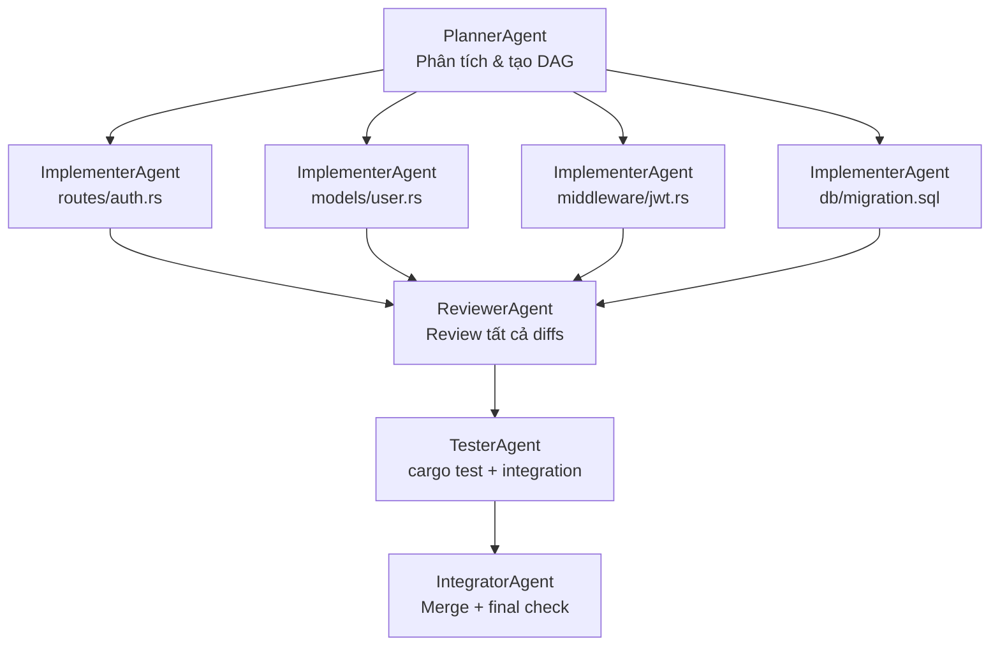

# Thiết kế tính năng Code cho SenClaw

> Tài liệu nghiên cứu kỹ thuật — tháng 5/2026
>
> Nguồn tham khảo: [yasasbanukaofficial/claude-code](https://github.com/yasasbanukaofficial/claude-code) · [ammaarreshi/gemma-chat](https://github.com/ammaarreshi/gemma-chat) · [ast-grep.github.io](https://ast-grep.github.io)

---

## Mục lục

1. [Tổng quan kiến trúc](#1-tổng-quan-kiến-trúc)
2. [Vòng lặp agent](#2-vòng-lặp-agent)
3. [Tối ưu token với ast-grep](#3-tối-ưu-token-với-ast-grep)
4. [Các tool cần thiết](#4-các-tool-cần-thiết)
5. [Áp dụng chỉnh sửa code](#5-áp-dụng-chỉnh-sửa-code)
6. [Tích hợp vào SenClaw](#6-tích-hợp-vào-senclaw)
7. [Kết luận và đề xuất](#7-kết-luận-và-đề-xuất)
8. [DAG Team cho tác vụ Code phức tạp](#8-dag-team-cho-tác-vụ-code-phức-tạp)
9. [Bổ sung File Tools — so sánh với claude-code](#9-bổ-sung-file-tools--so-sánh-với-claude-code)
10. [Knowledge Graph cho Code — từ GitNexus](#10-knowledge-graph-cho-code--từ-gitnexus)

---

## 1. Tổng quan kiến trúc

### 1.1 Bài học từ claude-code (Anthropic)

Repository `yasasbanukaofficial/claude-code` là mã nguồn bị lộ của Anthropic Claude Code CLI — một agent code chuyên nghiệp viết bằng TypeScript. Kiến trúc của nó gồm:

```
src/
├── main.tsx          # CLI entry point (React/Ink terminal UI)
├── QueryEngine.ts    # Quản lý vòng lặp hội thoại + gọi LLM
├── Tool.ts           # Base class cho tất cả tools
├── tools/            # 40+ tool implementations
│   ├── FileReadTool, FileWriteTool, FileEditTool
│   ├── BashTool, REPLTool
│   ├── GrepTool, GlobTool, LSPTool
│   └── WebFetchTool, WebSearchTool, MCPTool ...
├── coordinator/      # Multi-agent orchestration (Swarm pattern)
└── services/         # MCP, OAuth, Analytics
```

**QueryEngine** là trái tim của hệ thống: nó duy trì lịch sử hội thoại (`mutableMessages`), xây dựng system prompt từ nhiều lớp (memory, persona, instructions), và chạy vòng lặp `submitMessage()` — một async generator gọi LLM, nhận phản hồi tool-use, thực thi tool, rồi nạp kết quả ngược vào context.

### 1.2 Bài học từ gemma-chat (Ammaar Reshi)

`ammaarreshi/gemma-chat` là ứng dụng Electron chạy local LLM (Google Gemma 4) qua MLX trên Apple Silicon. Điểm đáng học:

- **Vòng lặp agent tối giản**: tối đa 40 vòng per turn, parser XML đơn giản thay JSON function-calling (phù hợp model nhỏ hơn).
- **Sandboxed workspace**: mỗi conversation có filesystem riêng — tránh sai lầm ghi đè file thật.
- **Streaming + live preview**: file được flush xuống disk mỗi 450ms trong khi model đang generate — người dùng thấy kết quả ngay.
- **System prompt mạnh**: bắt buộc model phải emit `write_file` action ngay trong lần respond đầu tiên, tránh tình trạng "chỉ đưa kế hoạch".

### 1.3 Mô hình kiến trúc đề xuất cho SenClaw "Code"

```
┌────────────────────────────────────────────────────────────┐
│  Web UI (React)  ←→  WebSocketGateway  ←→  CodeAgent       │
└────────────────────────────────────────────────────────────┘
         │                                      │
   Canvas / Preview                    ┌────────┴────────┐
   FileTree viewer                     │  CodeSession    │
   Terminal output                     │  - workspace    │
                                       │  - history      │
                                       │  - tool_runner  │
                                       └────────┬────────┘
                                                │
                                     ┌──────────┴──────────┐
                                     │  MCP: code_server   │
                                     │  (axum + tools)     │
                                     └──────────┬──────────┘
                                                │
                                    ┌───────────┴───────────┐
                                    │  ast-grep index cache  │
                                    │  (skeleton store)      │
                                    └───────────────────────┘
```

SenClaw đã có sẵn `workspace_server.rs` (MCP), `tools/` (bash, read, write, edit, grep, glob), và `gateway/ui_server`. Tính năng **Code** chủ yếu là thêm:

1. `src/mcp/code_server.rs` — MCP server mới expose các code-specific tools
2. `src/agent/code_session.rs` — quản lý CodeSession với workspace sandbox
3. `web/src/components/space/code/` — UI components (Canvas, FileTree, Terminal)
4. Tích hợp ast-grep vào context-building pipeline

---

## 2. Vòng lặp agent

### 2.1 Thiết kế cốt lõi

Vòng lặp agent cho code editing cần giải quyết hai bài toán: (a) giữ context đủ nhỏ để model xử lý hiệu quả, (b) không để agent "lạc lối" vô hạn. Thiết kế đề xuất:

```
                    ┌─────────────────┐
  user_message ──▶  │  plan_step      │ ◀─── system_prompt
                    └────────┬────────┘
                             │ (có thể có tool calls)
                    ┌────────▼────────┐
                    │  execute_tools  │
                    │  (parallel ok)  │
                    └────────┬────────┘
                             │
                    ┌────────▼────────┐
                    │  observe &      │
                    │  update context │
                    └────────┬────────┘
                             │
                    ┌────────▼────────┐
              ┌─NO──│  task_done?     │
              │     └────────┬────────┘
              │              │ YES
              ▼              ▼
         (next iter)    final_reply ──▶ user
         max: 40
```

### 2.2 Pseudocode trong Rust

```rust
pub async fn run_code_agent(
    session: &mut CodeSession,
    user_msg: &str,
) -> Result<AgentResult> {
    session.push_user(user_msg);
    let context = build_context(session).await?;  // dùng ast-grep ở đây

    for _round in 0..MAX_ROUNDS {
        let response = llm_call(&context, &session.history).await?;

        match response {
            Response::ToolUse(calls) => {
                let results = execute_tools_parallel(calls, session).await?;
                session.push_tool_results(results);
            }
            Response::Text(text) if is_final(&text) => {
                return Ok(AgentResult::Done(text));
            }
            Response::Text(text) => {
                session.push_assistant(text);
            }
        }
    }
    Err(anyhow!("max rounds exceeded"))
}
```

### 2.3 System prompt cho code agent

```
Bạn là một kỹ sư phần mềm chuyên nghiệp đang làm việc trên codebase.
Workspace hiện tại: {workspace_path}
Ngôn ngữ chính: {primary_lang}

Quy tắc:
1. Luôn đọc file trước khi chỉnh sửa (dùng read_file)
2. Viết diff nhỏ, tập trung — không rewrite toàn bộ file trừ khi cần thiết
3. Sau mỗi thay đổi, chạy lint/test nếu có thể
4. Giải thích ngắn gọn mỗi hành động trước khi thực hiện

Code skeleton của project:
{ast_grep_skeleton}
```

---

## 3. Tối ưu token với ast-grep

Đây là phần **quan trọng nhất** trong thiết kế tính năng Code. Khi làm việc với codebase lớn, không thể gửi toàn bộ nội dung file vào context của LLM — cả về chi phí lẫn chất lượng.

### 3.1 Vấn đề cần giải quyết

| Cách tiếp cận | Token usage | Chất lượng |
|---------------|-------------|------------|
| Gửi toàn bộ file | Rất cao (~50K+) | Tốt nhưng tốn kém |
| Chỉ gửi file liên quan | Trung bình | Dễ bỏ sót dependency |
| Gửi skeleton + chunks | Thấp (~5-10K) | Tốt nếu skeleton đủ |
| Grep text đơn giản | Thấp nhưng không cấu trúc | Kém (không hiểu AST) |

ast-grep giải quyết vấn đề này: phân tích AST để trích xuất **skeleton** (chữ ký hàm, khai báo struct/class, imports) — không cần gửi body của từng hàm.

### 3.2 Những gì ast-grep có thể trích xuất

**Function signatures** (không có body):
```
fn process_message(msg: &Message, ctx: &Context) -> Result<Response>
pub async fn send_reply(chat_id: i64, text: &str) -> Result<()>
```

**Struct/class/enum declarations**:
```
pub struct CodeSession { workspace: PathBuf, history: Vec<Message>, ... }
enum ToolResult { Success(String), Error(String) }
```

**Import/use statements**:
```
use crate::mcp::manager::McpManager;
use tokio::sync::Mutex;
```

**Call graphs** (hàm nào gọi hàm nào):
```
run_code_agent → build_context → extract_skeleton
run_code_agent → execute_tools_parallel → bash_tool::run
```

### 3.3 Chiến lược Index → Skeleton → Chunks

```
Phase 1: INDEX (khi mở workspace)
  ast-grep scan toàn bộ project
  → lưu skeleton vào SQLite cache
  → invalidate khi file thay đổi (mtime check)

Phase 2: EXTRACT SKELETON (khi bắt đầu task)
  Query skeleton cache cho các file có khả năng liên quan
  Skeleton = signatures + imports + struct defs (KHÔNG có body)
  → ~200-500 tokens per file thay vì 2000-10000

Phase 3: SEND RELEVANT CHUNKS (khi LLM cần chi tiết)
  LLM đọc skeleton → quyết định file nào cần đọc đầy đủ
  → gọi read_file chỉ cho files thực sự cần thiết
  → tiết kiệm 70-90% tokens so với gửi tất cả
```

### 3.4 Pattern ast-grep cho Rust

```bash
# Trích xuất tất cả function signatures (không body)
ast-grep run \
  --pattern 'fn $NAME($$$PARAMS) $$$RET' \
  --lang rust \
  --json=stream \
  src/

# Trích xuất pub struct declarations
ast-grep run \
  --pattern 'pub struct $NAME { $$$FIELDS }' \
  --lang rust \
  --json=stream \
  src/

# Trích xuất use/mod declarations
ast-grep run \
  --pattern 'use $$$PATH;' \
  --lang rust \
  --json=stream \
  src/

# Rule config dạng YAML (dùng với ast-grep scan):
# rules/rust-skeleton.yaml
id: rust-fn-sig
language: Rust
rule:
  pattern: fn $NAME($$$PARAMS) $$$RET_TYPE { $$$BODY }
message: "Function: $NAME"
```

### 3.5 Pattern ast-grep cho TypeScript

```bash
# Function declarations và arrow functions
ast-grep run \
  --pattern 'function $NAME($$$PARAMS): $RET { $$$BODY }' \
  --lang typescript \
  --json=stream \
  src/

# Class declarations
ast-grep run \
  --pattern 'class $NAME { $$$BODY }' \
  --lang typescript \
  --json=stream \
  src/

# Import statements
ast-grep run \
  --pattern 'import $$$ITEMS from "$MODULE"' \
  --lang typescript \
  --json=stream \
  src/

# Interface definitions
ast-grep run \
  --pattern 'interface $NAME { $$$BODY }' \
  --lang typescript \
  --json=stream \
  src/
```

**Rule YAML cho TypeScript**:
```yaml
id: ts-class-skeleton
language: TypeScript
rule:
  pattern: class $NAME $$$EXTENDS { $$$BODY }
# Chỉ trả về tên class + extends, không trả body
```

### 3.6 Pattern ast-grep cho Python

```bash
# Function definitions
ast-grep run \
  --pattern 'def $NAME($$$PARAMS): $$$BODY' \
  --lang python \
  --json=stream \
  .

# Class definitions
ast-grep run \
  --pattern 'class $NAME($$$BASES): $$$BODY' \
  --lang python \
  --json=stream \
  .

# Import statements
ast-grep run \
  --pattern 'from $MODULE import $$$ITEMS' \
  --lang python \
  --json=stream \
  .
```

### 3.7 Ví dụ output JSON của ast-grep

```json
{
  "file": "src/mcp/code_server.rs",
  "range": { "start": { "line": 42, "column": 0 }, "end": { "line": 42, "column": 58 } },
  "text": "pub async fn handle_read_file(path: &str) -> Result<String>",
  "metaVariables": {
    "NAME": "handle_read_file",
    "PARAMS": "path: &str",
    "RET_TYPE": "-> Result<String>"
  }
}
```

Output này có thể được parse và lưu vào SQLite để build skeleton nhanh.

### 3.8 Skeleton format gửi cho LLM

```
=== FILE: src/mcp/code_server.rs ===
IMPORTS:
  use crate::tools::{ReadTool, WriteTool, BashTool};
  use anyhow::Result;

STRUCTS:
  pub struct CodeServer { session: Arc<Mutex<CodeSession>> }

FUNCTIONS:
  pub async fn handle_read_file(path: &str) -> Result<String>   [line 42]
  pub async fn handle_write_file(path: &str, content: &str) -> Result<()>   [line 58]
  pub async fn handle_bash(cmd: &str, timeout_secs: u64) -> Result<String>   [line 74]
  async fn validate_path(path: &str, workspace: &Path) -> Result<()>   [line 91]

=== FILE: src/agent/code_session.rs ===
...
```

Toàn bộ skeleton này chỉ tốn ~500-800 tokens cho một project trung bình, thay vì 30,000-100,000 tokens nếu gửi đầy đủ.

---

## 4. Các tool cần thiết

Dựa trên phân tích claude-code và gemma-chat, tính năng Code cần tối thiểu 8 tools:

### 4.1 Bảng tool definitions

| Tool | Input | Output | Ghi chú |
|------|-------|--------|---------|
| `read_file` | `path: &str, start_line?: u32, end_line?: u32` | Nội dung file (hoặc đoạn) | Hỗ trợ đọc từng đoạn để tiết kiệm tokens |
| `write_file` | `path: &str, content: &str` | `ok` / lỗi | Tạo mới hoặc ghi đè hoàn toàn |
| `edit_file` | `path: &str, old_str: &str, new_str: &str` | `ok` / lỗi | Thay thế chính xác đoạn text |
| `bash` | `cmd: &str, timeout_secs: u64` | stdout + stderr + exit_code | Chạy trong sandbox workspace |
| `search_code` | `pattern: &str, lang?: &str, path?: &str` | Danh sách matches với vị trí | Dùng ast-grep phía dưới |
| `glob` | `pattern: &str` | Danh sách file paths | Tìm file theo glob pattern |
| `get_skeleton` | `path?: &str` | AST skeleton | Trả về skeleton đã index |
| `list_files` | `dir: &str` | Cây thư mục | Tree view giới hạn depth |

### 4.2 Định nghĩa tool trong Rust (MCP JSON Schema)

```rust
// src/mcp/code_server.rs

pub fn tool_definitions() -> Vec<ToolDef> {
    vec![
        ToolDef {
            name: "read_file",
            description: "Đọc nội dung file. Chỉ định start_line/end_line để đọc đoạn cụ thể.",
            input_schema: json!({
                "type": "object",
                "properties": {
                    "path": { "type": "string" },
                    "start_line": { "type": "integer", "minimum": 1 },
                    "end_line": { "type": "integer", "minimum": 1 }
                },
                "required": ["path"]
            }),
        },
        ToolDef {
            name: "edit_file",
            description: "Thay thế chính xác một đoạn text trong file. old_str phải unique trong file.",
            input_schema: json!({
                "type": "object",
                "properties": {
                    "path": { "type": "string" },
                    "old_str": { "type": "string" },
                    "new_str": { "type": "string" }
                },
                "required": ["path", "old_str", "new_str"]
            }),
        },
        ToolDef {
            name: "search_code",
            description: "Tìm kiếm code bằng AST pattern (ast-grep). Tốt hơn grep text thông thường.",
            input_schema: json!({
                "type": "object",
                "properties": {
                    "pattern": { "type": "string" },
                    "language": { "type": "string", "enum": ["rust","typescript","python","go"] },
                    "path": { "type": "string", "default": "." }
                },
                "required": ["pattern"]
            }),
        },
        // ... các tools khác
    ]
}
```

### 4.3 Security: path traversal protection

Mọi tool thao tác file phải validate path nằm trong workspace sandbox:

```rust
fn validate_path(path: &str, workspace: &Path) -> Result<PathBuf> {
    let abs = workspace.join(path).canonicalize()
        .map_err(|_| anyhow!("File not found: {path}"))?;
    if !abs.starts_with(workspace) {
        return Err(anyhow!("Path traversal denied: {path}"));
    }
    Ok(abs)
}
```

---

## 5. Áp dụng chỉnh sửa code

### 5.1 Ba chiến lược edit

**Chiến lược 1: Exact string replacement** (đơn giản, được ưa chuẩn)

Cách này claude-code dùng với `FileEditTool`. Model tìm đoạn code cần sửa, trả về `old_str` chính xác (có thể bao gồm vài dòng context) và `new_str` mới:

```rust
pub async fn apply_edit(path: &Path, old_str: &str, new_str: &str) -> Result<()> {
    let content = tokio::fs::read_to_string(path).await?;
    if content.matches(old_str).count() != 1 {
        return Err(anyhow!(
            "old_str phải xuất hiện đúng 1 lần trong file (tìm thấy: {})",
            content.matches(old_str).count()
        ));
    }
    let updated = content.replace(old_str, new_str);
    tokio::fs::write(path, updated).await?;
    Ok(())
}
```

Yêu cầu `old_str` unique là quan trọng — nếu có nhiều match, tool trả lỗi và yêu cầu model thêm context xung quanh.

**Chiến lược 2: Unified diff patch**

Phù hợp khi model cần chỉnh nhiều vị trí trong cùng file:

```
--- a/src/lib.rs
+++ b/src/lib.rs
@@ -42,7 +42,8 @@
 pub fn process() {
-    let result = old_fn();
+    let result = new_fn();
+    tracing::info!("processed: {:?}", result);
 }
```

```rust
pub async fn apply_patch(path: &Path, diff: &str) -> Result<()> {
    // Dùng crate `diffy` để parse unified diff
    let original = tokio::fs::read_to_string(path).await?;
    let patched = diffy::apply(&original, &diffy::Patch::from_str(diff)?)?;
    tokio::fs::write(path, patched).await?;
    Ok(())
}
```

**Chiến lược 3: Full rewrite**

Chỉ dùng cho file mới hoặc khi model cần rewrite toàn bộ (ví dụ tạo file mới). Gemma-chat dùng cách này làm mặc định vì đơn giản hơn cho model nhỏ.

### 5.2 Undo / rollback

Mỗi CodeSession giữ stack các snapshot trước khi edit:

```rust
pub struct CodeSession {
    pub workspace: PathBuf,
    pub history: Vec<ChatMessage>,
    // Git-backed undo: mỗi tool call tạo một commit nhỏ
    pub git_enabled: bool,
}

impl CodeSession {
    pub async fn checkpoint(&self, msg: &str) -> Result<()> {
        if self.git_enabled {
            // git add -A && git commit -m "checkpoint: {msg}"
            bash(&self.workspace, &format!(
                "git add -A && git commit -m 'checkpoint: {}' --allow-empty", msg
            )).await?;
        }
        Ok(())
    }

    pub async fn rollback(&self, steps: u32) -> Result<()> {
        bash(&self.workspace, &format!("git reset --hard HEAD~{}", steps)).await?;
        Ok(())
    }
}
```

Git được init tự động khi tạo workspace mới — mỗi tool call thành công tạo một commit, cho phép rollback sạch sẽ.

### 5.3 Hiển thị diff cho user

Sau mỗi edit thành công, gửi diff đến UI để người dùng thấy thay đổi:

```rust
pub async fn show_diff(path: &Path, before: &str, after: &str) -> String {
    let patch = diffy::create_patch(before, after);
    format!("```diff\n{}\n```", patch)
}
```

---

## 6. Tích hợp vào SenClaw

### 6.1 Nơi tích hợp

SenClaw đã có sẵn các thành phần cần thiết:

| Thành phần hiện có | Vai trò trong Code feature |
|-------------------|---------------------------|
| `src/mcp/workspace_server.rs` | Mở rộng hoặc tạo `code_server.rs` riêng |
| `src/tools/` (bash, read, write, edit, grep, glob) | Reuse, chỉ cần wrap trong CodeSession context |
| `src/gateway/ui_server/` | Thêm WebSocket event types cho code |
| `src/mcp/space_server.rs` | Code sessions có thể lưu trong Space |
| `web/src/components/space/` | Thêm `code/` subdirectory cho UI |

### 6.2 File cần tạo/sửa

```
THÊM MỚI:
src/mcp/code_server.rs          # MCP server với 8 tools
src/agent/code_session.rs       # CodeSession struct + lifecycle
web/src/components/space/code/
  ├── CodeView.tsx              # Main layout (Canvas + Chat + FileTree)
  ├── FileTree.tsx              # Hiển thị cây file workspace
  ├── CodeCanvas.tsx            # Preview / live output
  └── useCodeSession.ts         # Hook quản lý WebSocket + state

SỬA:
src/mcp/mod.rs                  # pub mod code_server;
src/lib.rs                      # khởi động code_server trong run_daemon()
web/src/hooks/useSpace.ts       # thêm code session types
```

### 6.3 WebSocket events

```rust
// Thêm vào src/proto.rs hoặc gateway/mod.rs
#[derive(Serialize, Deserialize)]
#[serde(tag = "type")]
pub enum CodeEvent {
    ToolCall { tool: String, args: Value },
    ToolResult { tool: String, output: String, duration_ms: u64 },
    FileChanged { path: String, diff: String },
    AgentMessage { text: String, is_final: bool },
    Error { message: String },
}
```

### 6.4 Tích hợp ast-grep

ast-grep có thể được dùng theo hai cách:

**Cách 1: Gọi CLI** (đơn giản, không cần binding):
```rust
use tokio::process::Command;

pub async fn extract_skeleton(workspace: &Path, lang: &str) -> Result<Vec<SkeletonEntry>> {
    let output = Command::new("ast-grep")
        .args(["run", "--lang", lang,
               "--pattern", "fn $NAME($$$) $$$",
               "--json=stream",
               "."])
        .current_dir(workspace)
        .output()
        .await?;
    // parse JSONL output
    parse_skeleton_output(&output.stdout)
}
```

**Cách 2: Dùng crate `ast-grep-core`** (tốt hơn cho production):
```toml
# Cargo.toml
[dependencies]
ast-grep-core = "0.38"
ast-grep-language = "0.38"
```

```rust
use ast_grep_core::{AstGrep, Pattern};
use ast_grep_language::SupportLang;

pub fn extract_functions(code: &str, lang: SupportLang) -> Vec<String> {
    let sg = AstGrep::new(code, lang);
    let pattern = Pattern::new("fn $NAME($$$PARAMS) $$$RET { $$$BODY }", lang);
    sg.root().find_all(pattern)
        .map(|m| {
            let name = m.get_env().get_match("NAME").unwrap().text().to_string();
            let params = m.get_env().get_match("PARAMS").map(|p| p.text().to_string())
                .unwrap_or_default();
            format!("fn {}({})", name, params)
        })
        .collect()
}
```

### 6.5 Luồng hoàn chỉnh

```
User mở Code feature trong Web UI
  → tạo CodeSession mới, init workspace (git init, copy files nếu có)
  → ast-grep scan → build skeleton cache

User gõ: "Thêm error handling cho hàm process_message"
  → build_context():
      1. query skeleton cache → tìm hàm process_message
      2. đọc đầy đủ file chứa hàm đó (read_file với start/end_line)
      3. gửi skeleton project + đoạn code liên quan
  → LLM respond với tool calls: read_file, edit_file
  → execute_tools() → apply edit → git checkpoint
  → gửi CodeEvent::FileChanged + CodeEvent::AgentMessage về UI
  → UI hiển thị diff, cập nhật file tree
```

---

## 7. Kết luận và đề xuất

### 7.1 Tóm tắt những điều đã học

Từ `claude-code`: hệ thống tool-use trưởng thành cần nhiều hơn chỉ read/write — LSP integration, notebook support, multi-agent coordination đều có giá trị thực. Nhưng phức tạp đó nên đến sau khi core loop hoạt động tốt.

Từ `gemma-chat`: simplicity wins — XML thay JSON cho model nhỏ, 40-round limit, live streaming, sandboxed workspace. Các quyết định thiết kế đơn giản này tạo ra trải nghiệm người dùng tốt hơn nhiều so với hệ thống phức tạp.

### 7.2 Thứ tự ưu tiên triển khai

**Phase 1 — Core (2-3 tuần)**:
- [ ] `CodeSession` với git-backed workspace
- [ ] 6 tools cơ bản: read_file, write_file, edit_file, bash, glob, list_files
- [ ] Agent loop đơn giản (max 40 rounds)
- [ ] WebSocket events về UI

**Phase 2 — AST optimization (1-2 tuần)**:
- [ ] Tích hợp ast-grep CLI (không cần Rust binding ngay)
- [ ] Skeleton cache trong SQLite (dùng DB hiện có của SenClaw)
- [ ] `search_code` tool dùng ast-grep
- [ ] Context building thông minh: skeleton + relevant chunks

**Phase 3 — UX (1-2 tuần)**:
- [ ] FileTree UI component
- [ ] Diff viewer trong chat
- [ ] Undo/rollback UI
- [ ] Live streaming preview cho web projects

### 7.3 Đề xuất kỹ thuật quan trọng

1. **Dùng ast-grep CLI trước** — tránh phức tạp hóa với Rust bindings, `Command::new("ast-grep")` đủ cho MVP và dễ debug.

2. **Git là backend undo tốt nhất** — không cần implement custom undo stack, git đã làm điều này hoàn hảo. Init git trong mỗi workspace khi tạo session.

3. **Exact string replacement > unified diff cho LLM** — model lớn (Sonnet, GPT-4) làm tốt exact replacement; chỉ dùng unified diff nếu user request hoặc edit span nhiều vị trí.

4. **Skeleton cache phải invalidate đúng** — track file mtime, re-index khi file thay đổi. Stale skeleton gây ra lỗi khó debug.

5. **Sandbox là bắt buộc** — path traversal protection không phải optional. Mọi tool call phải validate path nằm trong workspace boundary trước khi thực thi.

6. **Token budget**: với skeleton strategy, target < 8,000 tokens input per turn (không kể conversation history). Đây là budget thoải mái cho cả Haiku lẫn Sonnet mà không làm tăng cost đáng kể.

---

*Tài liệu này được tổng hợp từ nghiên cứu mã nguồn công khai và tài liệu ast-grep. Phiên bản: 1.0 — tháng 5/2026.*

---

## 8. DAG Team cho tác vụ Code phức tạp

### 8.1 Tại sao Code cần DAG Team?

Một tác vụ code đơn giản như "sửa bug X" phù hợp với single-agent loop. Nhưng các yêu cầu thực tế phức tạp hơn nhiều:

- *"Thêm OAuth2 login vào backend — bao gồm route, middleware, model, migration, và unit tests"*
- *"Refactor module payment: tách interface, viết adapter mới, cập nhật tất cả callers"*

Các tác vụ này có **cấu trúc DAG tự nhiên**:
- Bước Plan phải xong trước khi Implement bắt đầu
- Các module độc lập có thể Implement **song song** (giảm thời gian tuyến tính)
- Review và Test có thể chạy song song sau khi code xong
- Integrate chỉ chạy khi cả hai đã pass

Single agent xử lý tuần tự sẽ chậm và dễ mất context khi file nhiều. DAG Team giải quyết cả hai vấn đề.

### 8.2 Các agent trong Code DAG Team

| Agent | Vai trò | Tools chính |
|---|---|---|
| **PlannerAgent** | Phân tích yêu cầu, scan codebase bằng ast-grep, tạo DAG subtasks | `code_skeleton`, `list_files`, `dispatch_task` |
| **ImplementerAgent** | Viết/sửa code cho module được assign | `read_file`, `edit_file`, `write_file`, `bash` |
| **ReviewerAgent** | Review diff, check conventions, security, logic | `read_file`, `bash` (linter/clippy) |
| **TesterAgent** | Chạy test, đọc output, báo lỗi cụ thể | `bash` (cargo test / pytest / jest) |
| **IntegratorAgent** | Merge thay đổi từ các Implementer, resolve conflict | `read_file`, `edit_file`, `bash` (git) |

Mỗi agent được spawn bằng **VirtualWorkerPool** của SenClaw — cùng codebase, khác workspace context.

### 8.3 Ví dụ DAG: "Thêm OAuth2 login"



**Tiết kiệm thời gian**: 4 Implementer chạy song song → giảm từ ~4x xuống ~1.3x thời gian tổng (overhead PlannerAgent + tổng hợp).

### 8.4 Chia sẻ context ast-grep giữa các agent

**Vấn đề**: Nếu mỗi ImplementerAgent tự scan codebase bằng ast-grep → tốn thời gian và token lặp lại.

**Giải pháp**: PlannerAgent tạo **Shared Context Store** — một JSON file trong workspace mà tất cả agent đều đọc được:

```json
// .senclaw-code/context.json (do PlannerAgent tạo)
{
  "task_id": "oauth2-login-20260506",
  "skeleton": {
    "src/routes/": ["pub fn auth_router()", "pub fn api_router()"],
    "src/models/user.rs": ["pub struct User { id, email, ... }", "impl User { find_by_email() }"],
    "src/middleware/": ["pub struct AuthMiddleware", "pub fn require_auth()"]
  },
  "assignments": {
    "routes/auth.rs":      "implementer-1",
    "models/user.rs":      "implementer-2",
    "middleware/jwt.rs":   "implementer-3",
    "db/migration.sql":    "implementer-4"
  },
  "constraints": [
    "Dùng jsonwebtoken crate cho JWT",
    "User model phải tương thích với schema hiện tại",
    "Tất cả route mới prefix /api/auth/"
  ]
}
```

Mỗi ImplementerAgent:
1. Đọc `context.json` → biết skeleton toàn bộ project + constraints chung
2. Chỉ đọc full content của file được assign cho mình
3. Viết kết quả vào file riêng, không đụng file của agent khác

### 8.5 Prompt templates

**PlannerAgent system prompt:**
```
Bạn là Code Planner Agent. Nhiệm vụ của bạn:
1. Dùng tool `code_skeleton` để scan codebase, hiểu cấu trúc hiện tại
2. Phân tích yêu cầu, chia nhỏ thành subtasks độc lập
3. Tạo file `.senclaw-code/context.json` với skeleton + assignments
4. Gọi `create_parent` rồi `dispatch_task` cho từng subtask

Nguyên tắc phân task:
- Mỗi task nên sửa tối đa 2-3 file có liên quan chặt chẽ
- Task độc lập về mặt file → cho phép chạy song song (depends_on=[])
- Task phụ thuộc nhau → khai báo depends_on đúng
- Luôn có ReviewerAgent và TesterAgent sau Implement
```

**ImplementerAgent system prompt:**
```
Bạn là Code Implementer Agent, phụ trách module: {{assigned_files}}.

Đọc `.senclaw-code/context.json` để hiểu:
- Skeleton của các module liên quan (để biết interface cần tương thích)
- Constraints chung của task
- File nào đã được agent khác phụ trách (KHÔNG sửa file đó)

Workflow:
1. Đọc context.json
2. Đọc full content của file được assign
3. Implement theo yêu cầu, đảm bảo tương thích với skeleton
4. Viết kết quả, báo cáo những gì đã thay đổi và interface mới nếu có
```

**ReviewerAgent system prompt:**
```
Bạn là Code Reviewer Agent. Kiểm tra toàn bộ thay đổi sau khi Implementers xong.

Checklist:
- [ ] Conventions nhất quán với codebase hiện tại
- [ ] Không có hardcoded secrets, SQL injection, path traversal
- [ ] Error handling đầy đủ (không unwrap() tùy tiện trong Rust)
- [ ] Interface mới tương thích với skeleton đã khai báo
- [ ] Chạy `cargo clippy` hoặc linter phù hợp, báo lỗi cụ thể

Output: danh sách issues (nếu có) với file:line reference. Nếu pass → báo "APPROVED".
```

### 8.6 Dispatch tool calls của PlannerAgent

```python
# PlannerAgent gọi các tool sau khi phân tích xong:

# 1. Tạo parent task
create_parent(
    task_id="oauth2-login-20260506",
    description="Thêm OAuth2 login vào backend Rust"
)

# 2. Dispatch Implementers song song (không depends_on)
dispatch_task(
    agent="implementer",
    task="Implement routes/auth.rs: OAuth2 callback, login, logout endpoints. Xem context.json",
    group_folder="code-team",
    depends_on=[]
)
dispatch_task(
    agent="implementer",
    task="Implement models/user.rs: thêm oauth_provider, oauth_id fields + methods. Xem context.json",
    group_folder="code-team",
    depends_on=[]
)
dispatch_task(
    agent="implementer",
    task="Implement middleware/jwt.rs: JWT verify middleware. Xem context.json",
    group_folder="code-team",
    depends_on=[]
)

# 3. Reviewer và Tester sau khi tất cả Implementers xong
dispatch_task(
    agent="reviewer",
    task="Review tất cả thay đổi OAuth2. Chạy cargo clippy. Xem context.json",
    group_folder="code-team",
    depends_on=["implementer-1", "implementer-2", "implementer-3"]
)
dispatch_task(
    agent="tester",
    task="Chạy cargo test --test auth_integration. Báo lỗi nếu có.",
    group_folder="code-team",
    depends_on=["implementer-1", "implementer-2", "implementer-3"]
)

# 4. Integrator sau cùng
dispatch_task(
    agent="integrator",
    task="Merge tất cả thay đổi, resolve conflicts nếu có, final cargo build check.",
    group_folder="code-team",
    depends_on=["reviewer", "tester"]
)
```

### 8.7 Tích hợp kỹ thuật với SenClaw hiện tại

| Thành phần | Cần thêm/sửa |
|---|---|
| `skills/code/SKILL.md` | Khai báo `senclaw-code` + `senclaw-dispatch` MCP servers |
| `assets/builtin-personas/` | Thêm `code-planner.md`, `code-implementer.md`, `code-reviewer.md`, `code-tester.md`, `code-integrator.md` |
| `src/mcp/code_server.rs` | Thêm tool `code_skeleton` trả về ast-grep skeleton từ workspace |
| `src/mcp/space_server.rs` | — (không đụng) |
| `src/agent/virtual_worker_pool.rs` | Đã hỗ trợ spawn virtual persona — dùng ngay |
| `src/mcp/dispatch_server.rs` | Đã có `dispatch_task` + `create_parent` — dùng ngay |

**Tool mới cần thêm vào `code_server.rs`:**
```rust
/// Trả về skeleton AST của một thư mục/file cho PlannerAgent
/// dùng để hiểu codebase mà không đọc toàn bộ nội dung.
#[tool]
async fn code_skeleton(
    &self,
    path: String,           // relative to workspace root
    language: Option<String>,
    depth: Option<u8>,      // max directory depth, default 2
) -> Result<String> {
    // Chạy ast-grep, trả về JSON skeleton
    run_ast_grep_skeleton(&self.workspace_root, &path, language, depth).await
}
```

### 8.8 So sánh: Single Agent vs DAG Team

| Tiêu chí | Single CodeAgent | DAG Code Team |
|---|---|---|
| Task đơn giản (1-2 file) | ✅ Nhanh hơn | ❌ Overhead không cần thiết |
| Task phức tạp (5+ file, nhiều module) | ❌ Chậm, dễ mất context | ✅ Song song, context rõ ràng |
| Token mỗi agent | Cao (phải nhớ toàn bộ) | Thấp hơn (mỗi agent chỉ biết phần của mình) |
| Khả năng rollback | Phức tạp | Dễ — từng agent làm việc độc lập |
| Độ phức tạp setup | Thấp | Cao hơn (cần personas, dispatch) |

**Quy tắc áp dụng**: Dùng DAG Team khi task ảnh hưởng ≥ 4 file hoặc cần Review/Test riêng biệt. Các task nhỏ hơn → single CodeAgent loop.

---

*Phần 8 bổ sung — tháng 5/2026*

---

## 9. Bổ sung File Tools — so sánh với claude-code

### 9.1 Hiện trạng SenClaw

SenClaw đã có 3 tools file cốt lõi trong `src/tools/`:

| Tool | File | Khả năng hiện tại |
|---|---|---|
| **Read** | `src/tools/read.rs` | `file_path`, `offset` (1-indexed), `limit`; max 2000 chars/line |
| **Write** | `src/tools/write.rs` | `file_path`, `content`; tự tạo parent dirs |
| **Edit** | `src/tools/edit.rs` | `old_string`, `new_string`, `replace_all`; validate strings phải khác nhau |

### 9.2 So sánh với claude-code FileReadTool / FileWriteTool / FileEditTool

| Tính năng | claude-code | SenClaw hiện tại | Cần bổ sung? |
|---|---|---|---|
| Đọc file text với offset/limit | ✅ | ✅ | — |
| Hiển thị line numbers trong output | ✅ | ❌ | ✅ Quan trọng — agent cần tham chiếu dòng |
| Đọc ảnh (base64 encode → multimodal) | ✅ | ❌ | ✅ Cần cho web/UI projects |
| Đọc Jupyter notebook (.ipynb) | ✅ | ❌ | ⚠️ Thấp ưu tiên |
| **Write**: hiển thị diff sau khi ghi | ✅ | ❌ | ✅ UX tốt hơn nhiều |
| **Write**: track files edited trong session | ✅ | ❌ | ✅ Cần cho undo/rollback |
| **Edit**: validate `old_string` là unique | ✅ (error nếu không unique) | ⚠️ Có validation nhưng không rõ unique | ✅ Bổ sung uniqueness check |
| **Edit**: hiển thị unified diff sau edit | ✅ | ❌ | ✅ Agent tự kiểm tra được kết quả |
| **Edit**: tạo file mới nếu chưa tồn tại | ✅ (variant `create`) | ❌ | ✅ Giảm friction |
| Path traversal protection | ✅ | ✅ (workspace boundary) | — |
| Max file size guard | ✅ (warn > 250KB) | ❌ | ✅ Cần tránh inject file lớn |

### 9.3 Các bổ sung cần thiết

#### 9.3.1 Line numbers trong Read output

```rust
// src/tools/read.rs — hiện tại trả về raw text
// Cần bổ sung: prefix mỗi dòng với số dòng

fn format_with_line_numbers(content: &str, offset: usize) -> String {
    content
        .lines()
        .enumerate()
        .map(|(i, line)| format!("{:>4}\t{}", offset + i + 1, line))
        .collect::<Vec<_>>()
        .join("\n")
}
// Output:
//    1	use std::collections::HashMap;
//    2	
//    3	pub struct Config {
```

Tại sao quan trọng: agent cần tham chiếu "dòng 47" khi edit, khi báo lỗi compiler, khi giải thích code. Không có line number → agent phải đếm tay hoặc dùng offset ước lượng.

#### 9.3.2 Unified diff sau Write/Edit

```rust
// src/tools/edit.rs — sau khi apply edit
use similar::{ChangeTag, TextDiff};

fn make_diff(old: &str, new: &str, file_path: &str) -> String {
    let diff = TextDiff::from_lines(old, new);
    let mut out = format!("--- a/{file_path}\n+++ b/{file_path}\n");
    for group in diff.grouped_ops(3) {
        for op in group {
            for change in diff.iter_changes(&op) {
                let prefix = match change.tag() {
                    ChangeTag::Delete => "-",
                    ChangeTag::Insert => "+",
                    ChangeTag::Equal  => " ",
                };
                out.push_str(&format!("{}{}", prefix, change.value()));
            }
        }
    }
    out
}
// Tool trả về: { "success": true, "diff": "--- a/src/...\n+++ ...\n@@ ... @@\n-old\n+new" }
```

Thêm dependency vào `Cargo.toml`:
```toml
similar = "2"
```

#### 9.3.3 Session file tracker

```rust
// src/tools/session_tracker.rs
// Được inject vào Write + Edit tools để track files đã sửa trong session

pub struct SessionFileTracker {
    edited: Mutex<IndexSet<PathBuf>>,  // ordered set
}

impl SessionFileTracker {
    pub fn record(&self, path: &Path) {
        self.edited.lock().unwrap().insert(path.to_path_buf());
    }

    pub fn list(&self) -> Vec<PathBuf> {
        self.edited.lock().unwrap().iter().cloned().collect()
    }

    pub fn summary(&self) -> String {
        let files = self.edited.lock().unwrap();
        format!("Files modified this session ({}):\n{}",
            files.len(),
            files.iter().map(|p| format!("  • {}", p.display())).collect::<Vec<_>>().join("\n"))
    }
}
```

Dùng ở cuối session hoặc khi user hỏi "bạn đã sửa file nào?".

#### 9.3.4 Uniqueness check trong Edit

```rust
// src/tools/edit.rs — bổ sung trước khi replace
let occurrences = content.matches(&old_string).count();
match occurrences {
    0 => return Err(anyhow!(
        "old_string not found in file. Verify the exact text including whitespace."
    )),
    1 => { /* proceed */ }
    n if !replace_all => return Err(anyhow!(
        "old_string appears {n} times in file. Use replace_all=true to replace all, \
         or provide more surrounding context to make it unique."
    )),
    _ => { /* replace_all mode */ }
}
```

#### 9.3.5 Đọc ảnh (image support trong Read)

```rust
// src/tools/read.rs — detect image extension
const IMAGE_EXTS: &[&str] = &["png", "jpg", "jpeg", "gif", "webp", "svg"];

if let Some(ext) = path.extension().and_then(|e| e.to_str()) {
    if IMAGE_EXTS.contains(&ext.to_lowercase().as_str()) {
        let bytes = std::fs::read(&path)?;
        let b64 = base64::encode(&bytes);
        let mime = mime_for_ext(ext);
        // Trả về content block dạng image cho multimodal model
        return Ok(ToolResult::Image { mime_type: mime, data: b64 });
    }
}
```

#### 9.3.6 Max file size guard

```rust
// src/tools/read.rs — trước khi đọc
const MAX_READ_BYTES: u64 = 512 * 1024; // 512 KB

let metadata = std::fs::metadata(&path)?;
if metadata.len() > MAX_READ_BYTES {
    return Ok(format!(
        "[File too large: {} KB. Use offset+limit to read specific sections, \
         or use grep/ast-grep to find relevant parts first.]",
        metadata.len() / 1024
    ));
}
```

### 9.4 Thứ tự ưu tiên bổ sung

| Ưu tiên | Bổ sung | Effort | Impact |
|---|---|---|---|
| 🔴 Cao | Line numbers trong Read output | 30 phút | Rất cao — agent reference dòng liên tục |
| 🔴 Cao | Uniqueness check trong Edit | 20 phút | Cao — tránh silent wrong replacement |
| 🟡 Trung | Unified diff sau Write/Edit | 2 giờ (add `similar` dep) | Cao — agent verify kết quả |
| 🟡 Trung | Max file size guard | 30 phút | Trung — tránh token explosion |
| 🟢 Thấp | Session file tracker | 3 giờ (refactor DI) | Trung — UX tốt hơn |
| 🟢 Thấp | Image support | 2 giờ | Thấp (trừ dự án web/UI) |

---

## 10. Knowledge Graph cho Code — từ GitNexus

### 10.1 GitNexus là gì?

[GitNexus](https://github.com/abhigyanpatwari/GitNexus) là hệ thống biến codebase thành **knowledge graph có thể query** dành cho AI agent. Thay vì agent phải đọc từng file tuần tự, knowledge graph cho phép hỏi:

- "Hàm nào gọi `authenticate()`?"
- "Nếu tôi sửa `UserModel`, những file nào bị ảnh hưởng?"
- "Trace luồng từ HTTP request `/api/login` đến database"

**Pipeline 6 bước của GitNexus:**
1. **Structure mapping** — duyệt folder/file tree
2. **Parsing** — tree-sitter AST extraction (14 ngôn ngữ)
3. **Resolution** — cross-file imports, call targets, type inference
4. **Clustering** — nhóm symbols theo "functional communities"
5. **Process tracing** — execution flows từ entry points
6. **Search indexing** — BM25 + semantic retrieval

**Entities**: functions, classes, methods, interfaces, files, modules, type defs  
**Relationships**: `CALLS`, `IMPORTS`, `EXTENDS`, `IMPLEMENTS`, `MEMBER_OF`  
**Storage**: LadybugDB (local) + 16 MCP tools  

### 10.2 Thiết kế Knowledge Graph cho SenClaw

SenClaw dùng SQLite — không cần graph DB riêng. Dùng schema quan hệ + join queries là đủ cho personal codebase (thường < 100K LOC).

#### Schema SQLite

```sql
-- Symbols (functions, classes, structs, interfaces, types)
CREATE TABLE code_symbols (
    id          INTEGER PRIMARY KEY,
    project_id  TEXT NOT NULL,          -- workspace/session ID
    file_path   TEXT NOT NULL,          -- relative to workspace root
    name        TEXT NOT NULL,
    kind        TEXT NOT NULL,          -- 'function'|'class'|'struct'|'trait'|'interface'|'type'|'const'
    signature   TEXT,                   -- function signature / class declaration line
    start_line  INTEGER,
    end_line    INTEGER,
    language    TEXT,
    ts          INTEGER NOT NULL        -- last indexed timestamp
);

-- Relationships between symbols
CREATE TABLE code_relations (
    id          INTEGER PRIMARY KEY,
    project_id  TEXT NOT NULL,
    from_id     INTEGER REFERENCES code_symbols(id),
    to_id       INTEGER REFERENCES code_symbols(id),
    -- to_name / to_file khi chưa resolve được to_id
    to_name     TEXT,
    to_file     TEXT,
    relation    TEXT NOT NULL,          -- 'calls'|'imports'|'extends'|'implements'|'uses_type'
    call_line   INTEGER                 -- dòng xảy ra relationship
);

-- File-level import map
CREATE TABLE code_imports (
    id          INTEGER PRIMARY KEY,
    project_id  TEXT NOT NULL,
    file_path   TEXT NOT NULL,
    import_path TEXT NOT NULL,          -- đường dẫn module được import
    symbols     TEXT                    -- JSON array: ["HashMap", "Vec"] hoặc null (wildcard)
);

-- Index state (biết file nào đã index, detect changes bằng mtime)
CREATE TABLE code_index_state (
    project_id  TEXT NOT NULL,
    file_path   TEXT NOT NULL,
    mtime       INTEGER NOT NULL,
    symbol_count INTEGER DEFAULT 0,
    PRIMARY KEY (project_id, file_path)
);

CREATE INDEX idx_cs_project_file ON code_symbols(project_id, file_path);
CREATE INDEX idx_cs_name         ON code_symbols(project_id, name);
CREATE INDEX idx_cr_from         ON code_relations(from_id);
CREATE INDEX idx_cr_to_name      ON code_relations(project_id, to_name);
```

#### Indexing pipeline (Rust)

```rust
// src/code_graph/indexer.rs

pub struct CodeGraphIndexer {
    db: Arc<Db>,
    workspace_root: PathBuf,
}

impl CodeGraphIndexer {
    /// Index toàn bộ workspace, skip files không thay đổi (mtime check)
    pub async fn index_workspace(&self, project_id: &str) -> Result<IndexStats> {
        let files = self.discover_files()?;         // glob *.rs, *.ts, *.py ...
        let stale = self.find_stale_files(project_id, &files)?;

        // Parse stale files song song (tokio::spawn per file)
        let results = futures::future::join_all(
            stale.iter().map(|f| self.parse_file(project_id, f))
        ).await;

        self.resolve_cross_file_refs(project_id)?;  // điền to_id cho code_relations
        Ok(stats)
    }

    /// Dùng ast-grep để extract symbols và relationships
    async fn parse_file(&self, project_id: &str, file: &Path) -> Result<()> {
        let lang = detect_language(file)?;

        // Extract symbols
        let symbols = run_ast_grep(file, lang, SYMBOL_PATTERNS[lang]).await?;

        // Extract call relationships
        let calls = run_ast_grep(file, lang, CALL_PATTERNS[lang]).await?;

        // Extract imports
        let imports = run_ast_grep(file, lang, IMPORT_PATTERNS[lang]).await?;

        self.db.upsert_symbols(project_id, file, symbols)?;
        self.db.upsert_relations(project_id, file, calls)?;
        self.db.upsert_imports(project_id, file, imports)?;
        self.db.update_index_state(project_id, file)?;
        Ok(())
    }
}
```

#### ast-grep patterns cho indexer

```yaml
# patterns/rust_symbols.yml
rules:
  - id: rust-function
    language: Rust
    pattern: "fn $NAME($$$PARAMS) $$$REST { $$$BODY }"
    # Extract: name=$NAME, kind=function

  - id: rust-struct
    language: Rust
    pattern: "struct $NAME { $$$FIELDS }"

  - id: rust-impl-method
    language: Rust
    pattern: |
      impl $TYPE {
        fn $METHOD($$$PARAMS) $$$REST { $$$BODY }
      }

  - id: rust-function-call
    language: Rust
    pattern: "$FUNC($$$ARGS)"
    # Extract call relationship: current_symbol CALLS $FUNC

# patterns/typescript_symbols.yml
rules:
  - id: ts-function
    language: TypeScript
    pattern: "function $NAME($$$PARAMS) { $$$BODY }"

  - id: ts-class
    language: TypeScript
    pattern: "class $NAME { $$$BODY }"

  - id: ts-method
    language: TypeScript
    pattern: "$OBJ.$METHOD($$$ARGS)"

  - id: ts-import
    language: TypeScript
    pattern: "import { $$$NAMES } from '$MODULE'"
```

### 10.3 MCP tools cho Code Graph

```rust
// src/mcp/code_graph_server.rs

impl McpCodeGraphServer {
    /// Tìm tất cả callers của một function/method
    #[tool]
    async fn graph_find_callers(
        &self,
        symbol_name: String,
        file_path: Option<String>,   // disambiguate nếu tên trùng
    ) -> Result<String> {
        let callers = self.db.query_callers(&self.project_id, &symbol_name, file_path.as_deref())?;
        Ok(format_callers(callers))
        // Output: "authenticate() is called from:\n  • routes/auth.rs:47 (handle_login)\n  • middleware/jwt.rs:23 (verify_token)"
    }

    /// Phân tích impact — sửa symbol X sẽ ảnh hưởng gì?
    #[tool]
    async fn graph_impact_analysis(
        &self,
        symbol_name: String,
        depth: Option<u8>,          // default 3
    ) -> Result<String> {
        // BFS/DFS trên relations graph
        let affected = self.db.query_impact(&self.project_id, &symbol_name, depth.unwrap_or(3))?;
        Ok(format_impact(affected))
    }

    /// Lấy context đầy đủ của một symbol (signature + callers + callees)
    #[tool]
    async fn graph_symbol_context(
        &self,
        symbol_name: String,
    ) -> Result<String> {
        let sym = self.db.find_symbol(&self.project_id, &symbol_name)?;
        let callers  = self.db.query_callers(&self.project_id, &symbol_name, None)?;
        let callees  = self.db.query_callees(&self.project_id, &symbol_name)?;
        let imports  = self.db.query_file_imports(&self.project_id, &sym.file_path)?;
        Ok(format_symbol_context(sym, callers, callees, imports))
    }

    /// Tìm dependencies của một file
    #[tool]
    async fn graph_file_dependencies(
        &self,
        file_path: String,
        direction: Option<String>,   // "imports" | "imported_by" | "both"
    ) -> Result<String> { ... }

    /// Trace luồng từ entry point
    #[tool]
    async fn graph_trace_flow(
        &self,
        entry: String,              // e.g. "handle_request", "main"
        max_depth: Option<u8>,
    ) -> Result<String> {
        // DFS theo CALLS relationships, build call tree
        let tree = self.db.trace_call_tree(&self.project_id, &entry, max_depth.unwrap_or(5))?;
        Ok(format_call_tree(tree))
    }

    /// Rebuild index cho workspace (chạy khi file thay đổi)
    #[tool]
    async fn graph_reindex(
        &self,
        incremental: Option<bool>,  // default true (chỉ reindex stale files)
    ) -> Result<String> {
        let stats = self.indexer.index_workspace(&self.project_id).await?;
        Ok(format!("Indexed {} files, {} symbols, {} relationships",
            stats.files, stats.symbols, stats.relations))
    }

    /// Query tự do bằng SQL-like interface
    #[tool]
    async fn graph_query(
        &self,
        query_type: String,         // "callers_of" | "callees_of" | "files_using" | "symbols_in"
        target: String,
    ) -> Result<serde_json::Value> { ... }
}
```

### 10.4 Workflow tích hợp với CodeAgent

```
User: "Refactor hàm `process_payment` — tách validation ra riêng"

CodeAgent:
  1. graph_symbol_context("process_payment")
     → biết: file, signature, 5 callers, 12 callees
  
  2. graph_impact_analysis("process_payment", depth=2)
     → biết: 8 files sẽ bị ảnh hưởng nếu signature thay đổi
  
  3. code_skeleton("src/payment/")
     → biết: skeleton của module
  
  4. read_file("src/payment/processor.rs", offset=120, limit=80)
     → đọc đúng vùng cần sửa (nhờ start_line từ graph)
  
  5. edit_file(...)  → sửa
  
  6. graph_reindex(incremental=true)  → cập nhật graph
  
  7. graph_find_callers("process_payment")
     → verify callers vẫn tương thích
```

So với cách cũ (đọc nhiều file tuần tự), graph giúp agent:
- Biết **chính xác** cần đọc file nào, dòng nào → ít token hơn
- Không bỏ sót caller nào khi refactor
- Tự kiểm tra được impact trước khi thay đổi

### 10.5 Files cần tạo

```
src/
├── code_graph/
│   ├── mod.rs
│   ├── indexer.rs      # CodeGraphIndexer: discover → parse → resolve
│   ├── query.rs        # DB query helpers (callers, impact, trace)
│   ├── patterns.rs     # ast-grep pattern configs per language
│   └── types.rs        # Symbol, Relation, ImportMap structs
└── mcp/
    └── code_graph_server.rs   # McpCodeGraphServer (senclaw-code-graph)

patterns/
├── rust_symbols.yml
├── typescript_symbols.yml
├── python_symbols.yml
└── go_symbols.yml
```

### 10.6 Đăng ký vào builtin MCP registry

```rust
// src/mcp/manager/service.rs — thêm vào get_builtin_servers()
BuiltinServer {
    name: "senclaw-code-graph".into(),
    description: "Code knowledge graph — callers, impact analysis, dependency tracing".into(),
    tools: vec![
        "graph_find_callers", "graph_impact_analysis", "graph_symbol_context",
        "graph_file_dependencies", "graph_trace_flow", "graph_reindex", "graph_query",
    ],
}
```

### 10.7 So sánh với GitNexus

| Tính năng | GitNexus | SenClaw Code Graph |
|---|---|---|
| Storage | LadybugDB (custom) | SQLite (tích hợp sẵn) |
| Parser | tree-sitter native | ast-grep (wrap tree-sitter) |
| Ngôn ngữ hỗ trợ | 14 | Rust, TS, Python, Go (mở rộng dần) |
| Clustering | ✅ functional communities | ❌ Phase sau |
| Semantic search | ✅ BM25 + embedding | ⚠️ BM25 (SQLite FTS5) |
| MCP tools | 16 tools | 7 tools (đủ cho agent coding) |
| Self-hosted | ✅ | ✅ |
| Dependency | Bun + LadybugDB | Zero — chỉ ast-grep CLI |

SenClaw không cần reproduce toàn bộ GitNexus — 7 tools trên là đủ cho 90% use case coding agent: biết ai gọi gì, sửa cái gì bị ảnh hưởng gì.

---

*Phần 9-10 bổ sung — tháng 5/2026*
