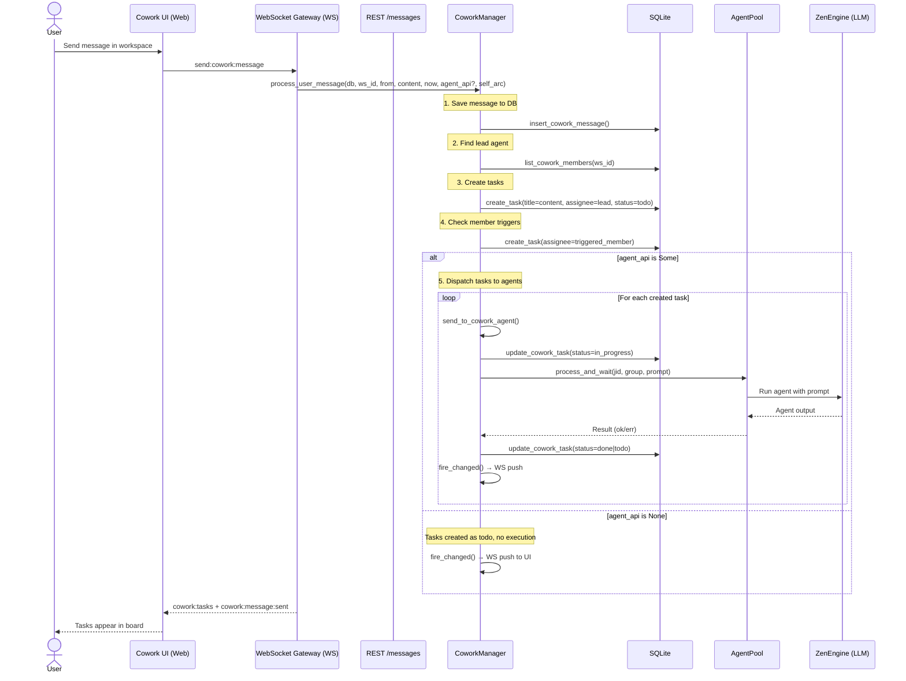
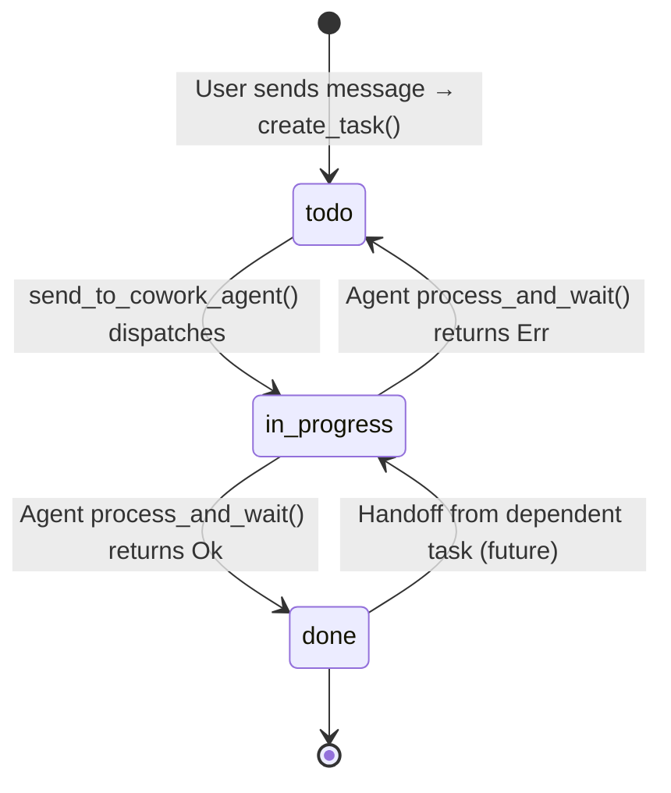
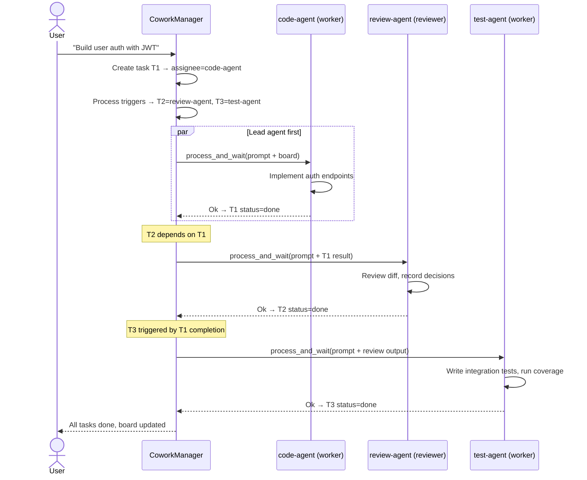
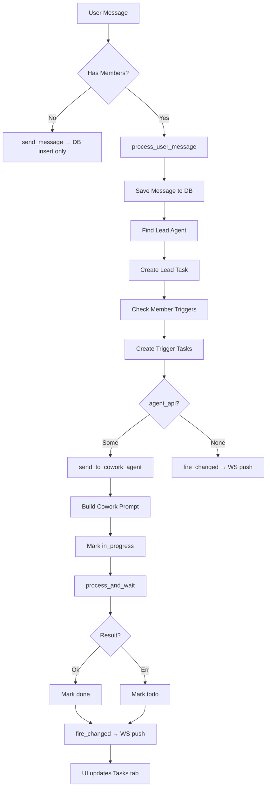

# Cowork Chat Flow — Message → Task Decomposition → Agent Execution

## 1. High-level Architecture



## 2. Entry Points

Messages enter the Cowork system through two paths:

| Path | Protocol | Handler | Orchestration |
|------|----------|---------|---------------|
| WebSocket | `send:cowork:message` | `handle_cowork_message_send` (cowork_handlers.rs) | If workspace has members: `process_user_message` with agent dispatch. Otherwise: simple `send_message` (DB insert only) |
| REST | `POST /api/cowork/{id}/messages` | `cowork_messages_send` (ui_server/cowork.rs) | `process_user_message` with agent dispatch from UiState |

## 3. Task Lifecycle



Status transitions are persisted to DB via `update_cowork_task()` and pushed to WebSocket clients through `fire_changed()`.

## 4. Multi-Agent Pipeline (Software Development Template)



## 5. Agent Prompt Structure

Each dispatched task receives a rich prompt built by `cowork::prompt::build_cowork_task_prompt()`:

```
## Task: {title}
**Description:** {description}
**Priority:** {priority}
**Status:** todo

## Context
### Workspace: {workspace_name}
{workspace_description}

### Board
{board_entries formatted by section}

### Your Role: {member.role}
**Persona:** {member.persona}
**Responsibilities:** {member.responsibilities}
**Acceptance Criteria:** {member.acceptance_criteria}
**Output Format:** {member.output_format}
**SLA:** {member.sla}
**Limits:** {member.limits}

### Dependency Results
{dependent_results formatted with agent output}

## Instructions
Complete the task described above. Follow your persona, responsibilities,
and acceptance criteria. Use the board for shared context.
```

## 6. Key Data Flow



## 7. GroupBinding Construction

`sent_to_cowork_agent` creates a synthetic `GroupBinding` per agent:

| Field | Value |
|-------|-------|
| `jid` | `cowork:{workspace_id}:{member_id}` |
| `folder` | `member.member_id` |
| `channel` | `"web"` |
| `group_type` | `"cowork"` |
| `allowed_work_dirs` | `member.subdir` |

This JID is used by AgentPool to look up/create the ZenEngine session, route replies through broadcast channels, and track per-agent state.
