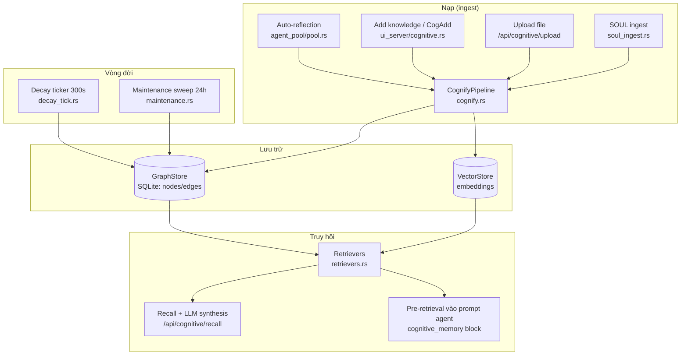
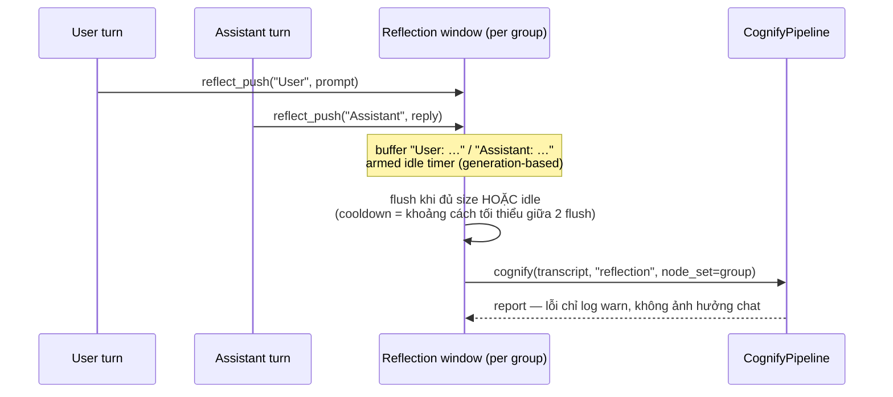

# Knowledge (Cognitive Layer) — Kiến trúc và Luồng dữ liệu

> Tài liệu hoá luồng của hệ thống **Knowledge** (knowledge graph + Hebbian memory, module `src/memory/cognitive/`) — từ lúc một tin nhắn/tài liệu đi vào, qua trích xuất quan hệ (triplet), đến lúc được truy hồi bằng Recall. Bao gồm cả phân tích chi phí token và các khoảng trống hiện tại.

**Phân biệt 3 hệ thống nhớ trong SenClaw** (dễ nhầm vì đều gọi là "memory"):

| Hệ thống | Lưu trữ | Vai trò | Tài liệu |
|---|---|---|---|
| **Knowledge (cognitive)** — tài liệu này | SQLite graph (nodes + edges + vector) | Đồ thị tri thức: entity, quan hệ, Hebbian strengthen/decay | `docs/knowledge-cognitive-flow.md` |
| Curated memory | File `.md` trong `~/.senclaw/agents/<folder>/memory/` + `MEMORY.md` | Ghi nhớ có chọn lọc do agent/user quản lý, recall injection + consolidation khi compaction | `docs/curated-memory-design.md` |
| FTS memory | Bảng FTS5 + vector | Tìm kiếm ngữ nghĩa trên log/tài liệu thô | `docs/memory.md` |

Trên UI (web + desktop), lớp cognitive hiển thị dưới tên **"Knowledge"** (trước đây là "Memory"). Ba năng lực mà UI expose khớp với ba luồng nạp bên dưới: tổng hợp thông tin người dùng từ hội thoại (auto-reflection), mở rộng bằng tài liệu ngoài (upload), và nghiên cứu tổng hợp trả lời chi tiết (Recall).

## Mục lục

1. [Kiến trúc module](#1-kiến-trúc-module)
2. [Luồng 1 — Auto-reflection: cửa sổ hội thoại (P14 v2)](#2-luồng-1--auto-reflection-session-window-p14-v2)
3. [Luồng 2 — Cognify pipeline: từ text thành graph](#3-luồng-2--cognify-pipeline)
4. [Luồng 3 — Các đường nạp khác](#4-luồng-3--các-đường-nạp-khác)
5. [Luồng 4 — Vòng đời graph: Hebbian, decay, maintenance](#5-luồng-4--vòng-đời-graph)
6. [Luồng 5 — Truy vấn: Search & Recall](#6-luồng-5--truy-vấn-search--recall)
7. [Cấu hình & chi phí token](#7-cấu-hình--chi-phí-token)
8. [Lịch sử: các khoảng trống đã lấp](#8-lịch-sử-các-khoảng-trống-đã-lấp-2026-07-11)
9. [File index](#9-file-index)

---

## 1. Kiến trúc module

Thiết kế là **hybrid cognee + shodh-memory**: pipeline trích xuất triplet phẳng kiểu cognee (chunk → LLM → entity → edge) kết hợp lớp "sống" kiểu shodh (Hebbian strengthen, decay theo tick, LTP tiers, spreading activation).



| File | Vai trò |
|---|---|
| `src/memory/cognitive/system.rs` | `CognitiveSystem` singleton — semaphore giới hạn cognify đồng thời, master enable |
| `src/memory/cognitive/cognify.rs` | Pipeline chính: sanitize → chunk → dedupe → LLM triplet → entity resolution → edges |
| `src/memory/cognitive/llm.rs` + `llm_openai.rs` / `llm_anthropic.rs` / `llm_local_mlx.rs` / `llm_local_candle.rs` | Trait `LlmClient` + các backend trích xuất (OpenAI-compat, Anthropic, local MLX/Candle) |
| `src/memory/cognitive/graph_store.rs` | Trait store: upsert node/edge, k-hop, merge duplicates, associative inference |
| `src/memory/cognitive/triplet.rs` | `RelationshipEdge` — strength, Hebbian `strengthen()` |
| `src/memory/cognitive/tiers.rs` + `ltp.rs` + `decay_tick.rs` | Phân tầng edge + long-term potentiation + sweep decay định kỳ |
| `src/memory/cognitive/retrievers.rs` | Các mode search: chunks/triplet/fts/hybrid/graph-completion/spreading |
| `src/memory/cognitive/maintenance.rs` | Sweep bảo trì: cleanup junk, merge entity trùng, suy luận liên kết |
| `src/gateway/ui_server/cognitive.rs` | REST API: search, recall, add, upload, re-extract, decay-log, ops |
| `src/gateway/ui_server/cognitive_config.rs` | GET/PUT config (Settings → Knowledge trên UI) |
| `src/agent/agent_pool/reflection.rs` | Session-window reflection: buffer lượt chat per-group, flush theo size/idle, enforce cooldown |
| `src/agent/agent_pool/pool.rs` (`should_reflect` + các hook `reflect_push`) | Điểm móc: lượt user (trước khi process) + lượt assistant (message_complete) đẩy vào window |

---

## 2. Luồng 1 — Auto-reflection (session window, P14 v2)

Từ 2026-07-11, reflection chạy theo **cửa sổ hội thoại** thay vì từng tin nhắn: mỗi lượt (user **và** assistant) được đẩy vào buffer per-group (`src/agent/agent_pool/reflection.rs`), và cả cửa sổ được cognify bằng **một call duy nhất** khi một trong hai điều kiện xảy ra:

- **Size flush** — buffer đạt `reflect_max_chars` (mặc định 2000);
- **Idle flush** — chat im lặng `reflect_window_idle_ms` (mặc định 2 phút; đặt 0 = flush từng tin như cũ).

Bật/tắt trong Settings → Knowledge ("Auto-reflect on every user message") hoặc env `SENCLAW_COGNITIVE_REFLECTION`.



**Vì sao cửa sổ:** facts trải qua nhiều lượt ("SemaClaw deadline khi nào?" → "tháng 8") nằm chung một prompt nên extractor đủ ngữ cảnh để ra triplet — đường per-message cũ mất trắng các fact này; prefix người nói + transcript guidance trong SYSTEM_PROMPT cho LLM giải coreference xuyên lượt; và một system prompt amortize cho nhiều lượt nên **tổng token giảm** so với per-message.

**Các lớp lọc trước khi tốn token LLM** (theo thứ tự):

| # | Lớp lọc | Vị trí | Mặc định |
|---|---|---|---|
| 1 | Lượt rỗng bị bỏ; lượt quá dài bị **cắt** ở `reflect_max_chars` (không drop cả lượt như trước) | `reflect_push`, reflection.rs | 2000 chars |
| 2 | Cooldown: hai flush của cùng group cách nhau tối thiểu `reflect_cooldown_ms` — flush đến sớm sẽ **chờ**, không mất dữ liệu | `flush_window`, reflection.rs | 2000 ms |
| 3 | Gate mức cửa sổ: tổng ≥ `reflect_min_chars` và không phải một câu hỏi trơ trọi (câu hỏi + câu trả lời trong cùng cửa sổ thì **vẫn chạy**) | `should_reflect`, pool.rs | 20 chars |
| 4 | Sanitize: lột envelope, đổi `<message sender="X">` thành dòng `X: …`, bỏ `<think>`; từ chối text >40% markup | `sanitize_for_cognify`, cognify.rs | — |
| 5 | Dedupe content-hash + `extraction_state`: transcript trùng **không gọi LLM lần hai** — chỉ strengthen edge | cognify.rs | — |
| 6 | Semaphore: tối đa N cognify đồng thời | `CognitiveSystem`, system.rs | 1 (serial) |
| 7 | Cap output: LLM stream quá budget bị cắt | `max_output_chars` | 8 KB |

---

## 3. Luồng 2 — Cognify pipeline

`CognifyPipeline::cognify(text, source, opts)` — dùng chung cho mọi đường nạp.

```text
text ──sanitize──▶ chunk (400 tok, overlap 80) ──content-hash──▶ dedupe gate
                                                                    │ chunk mới
                                                                    ▼
                                                     embed + lưu chunk node
                                                                    │
                                                     extraction_state gate
                                                                    │ cần trích xuất
                                                                    ▼
                                                LLM triplet extraction (1 call/chunk)
                                                                    │
                                                                    ▼
                                        entity resolution (exact-name; fuzzy/vector = P4)
                                                                    │
                                                                    ▼
                              upsert edges: chunk -MENTIONS→ entity (provenance)
                                            subject -pred→ object  (semantic, Hebbian)
                                            entity -is_a→ type     (EntityType)
```

**Từng bước:**

1. **Sanitize** (`sanitize_for_cognify`) — chạy cả ở caller lẫn trong pipeline (defence-in-depth). `<message sender="X">…</message>` được đổi thành dòng transcript `X: …` (giữ "ai nói gì" cho chat nhóm) thay vì lột sạch; sanitize *trước khi* hash để cùng nội dung với `time=` khác nhau vẫn dedupe (cùng text nhưng khác người nói thì cố ý là hai chunk khác nhau).
2. **Chunk** (`src/memory/chunker.rs`) — cắt theo dòng, ~400 token/chunk, overlap 80. Tin nhắn chat thường = 1 chunk; tài liệu dài = nhiều chunk, **mỗi chunk một call LLM độc lập**.
3. **Dedupe hai tầng** — content-hash tìm chunk node có sẵn; nếu có, đọc thêm cột `extraction_state`:
   - `Done` / `SkippedNoFacts` → **skip hẳn LLM** (đã trích xuất, hoặc LLM đã chạy và xác nhận không có facts — không retry vô ích).
   - `Pending` / `SkippedNoLlm` → cho qua để LLM thử lại (backfill — xem mục 4).
4. **LLM triplet extraction** — system prompt đa ngôn ngữ (tune riêng cho tiếng Việt: "tôi tên là Sen" phải ra triplet, giữ nguyên script tên entity, predicate tiếng Anh lowercase), kèm **transcript guidance**: dòng `alice: …` thì fact ngôi thứ nhất gán cho alice, đại từ ("nó", "anh ấy") giải từ các dòng trước, fact trải nhiều dòng vẫn ra triplet. One-shot example + `response_format=json_object` (fallback plain-text khi server local 400). Prompt kèm hint **known entities**: top ~24 entity theo mention_count trong node_set của group (`top_entity_names`) để extractor tái sử dụng tên có sẵn thay vì đẻ alias ("HN" vs "Hà Nội"). Cap `max_triplets_per_chunk=32`.
5. **Entity resolution** — exact-name match (`find_entity_by_name`) tại ingest; alias khác tên được gộp sau bằng **vector alias merge** trong maintenance sweep (mục 5). Đây chính là cơ chế nối quan hệ **xuyên chunk/xuyên tài liệu**: "SemaClaw" ở chunk 1 và chunk 50 resolve về cùng một node nên mọi edge tự hội tụ.
6. **Upsert edges** — mỗi edge mới `strengthen(importance=0.8)`; edge đã có thì strengthen thêm (Hebbian: lặp lại = mạnh lên). Edge semantic giữ provenance `source_episode_id` → chunk gốc. `subject_type`/`object_type` sinh node `EntityType` chung (UUIDv5 theo tên, idempotent) + edge `is_a`.


---

## 4. Luồng 3 — Các đường nạp khác

| Đường nạp | Entry point | Ghi chú |
|---|---|---|
| **Add knowledge** (UI dialog / MCP `cog_add`) | `POST /api/cognitive/add {text, tags}` | Cùng pipeline, tags → node_sets |
| **Upload tài liệu** | `POST /api/cognitive/upload` (multipart `file`) | Daemon extract text → cognify cả tài liệu (chunk tự động). Đây là đường "mở rộng knowledge bằng tài liệu ngoài" |
| **Re-extract** | `POST /api/cognitive/nodes/:id/re-extract` | Chạy lại LLM trên chunk có sẵn — dùng khi đổi prompt, LLM từng dormant, hoặc triplet sai. Content-hash dedupe đảm bảo chỉ sinh edge mới, không nhân đôi chunk |
| **Backfill hàng loạt** | `POST /api/cognitive/re-extract-pending {limit?}` (UI: ⋯ → Re-extract pending) | Quét mọi chunk `Pending`/`SkippedNoLlm` và trích xuất bù chạy nền — dùng sau khi sửa cấu hình LLM. Triệu chứng cần nó: UI hiện "N chunks, 0 edges" |
| **SOUL ingest** | `soul_ingest.rs` | Nạp SOUL.md của agent vào graph |

**Graceful degrade khi không có LLM** (`create_cognitive_llm` trả `DisabledLlm`): pipeline **vẫn embed + lưu chunk** (FTS/vector search vẫn hoạt động), chỉ không có triplet/edge; chunk đánh dấu `SkippedNoLlm` và **tự được trích xuất bù** ở lần cognify/re-extract sau khi LLM được cấu hình. Nghĩa là tắt LLM một thời gian **không mất dữ liệu**.

**Chọn LLM trích xuất** (`create_cognitive_llm`, llm_openai.rs): duyệt config LLM đã lưu theo thứ tự `active_cognitive_id → active_id → active_quick_id`, lấy config đầu tiên có đủ API key + base URL. Tức là có thể gán **model riêng, rẻ/local** cho cognitive trong khi chat chính dùng model lớn.

> **Gotcha gateway SSE (fixed 2026-07-11):** một số gateway OpenAI-compat (antigravity `localhost:20128`) mặc định **stream SSE** khi request không có trường `stream` — body `data: {...chunk...}` làm parse JSON fail và mọi call cognify rơi về `SkippedNoLlm` (triệu chứng: "57 chunks, 0 edges"). `OpenAiCompatLlm` giờ luôn gửi `stream: false` và có fallback ráp SSE nếu gateway vẫn stream.

> **Gotcha embedding & build (fixed 2026-07-12):** (1) embed fail từng làm **hủy cả triplet** sau khi entity đã ghi → graph toàn entity mồ côi không MENTIONS; giờ `add_node` degrade mềm (giữ node, bỏ vector, log warn) và `extraction_state` chỉ ghi **sau** khi triplet đã land (trước đây ghi trước → chunk Done giả, không bao giờ retry). (2) Daemon **phải build bằng `make app-build`** (đủ `DAEMON_FEATURES` + bundle `mlx.metallib`) — `cargo build --release` trần thiếu local-embed/MLX làm embedding "local" fail toàn bộ. (3) Khởi chạy app bằng đường dẫn đầy đủ `open "/Applications/SenClaw Desktop.app"` — `open -a` có thể trúng bundle Debug cũ trong cây dev.

---

## 5. Luồng 4 — Vòng đời graph

Phần "làm cho lớp nhớ sống" — port từ shodh-memory:

- **Hebbian strengthen** — mọi lần một edge được nhắc lại (dedupe, re-extract, spreading activation đi qua) đều tăng strength + refresh `last_seen_at`.
- **Decay ticker** (`decay_tick.rs`) — mỗi **300s** quét các edge **active** (`valid_to IS NULL`): áp decay, **archive** edge phai (không xoá — set `valid_to`, floor strength 0.05, đóng băng; `strengthen()` revive khi được nhắc lại), thăng hạng LTP cho edge sống sót, ghi log vào `cog_decay_log` (UI: nút ⋯ → Decay log; cột `edges_pruned` giờ đếm số archived). Age check tính theo staleness (`now - last_activated`), không theo ngày sinh. Decay **không bao giờ xoá node/edge** — tri thức chỉ mờ đi chứ không mất; entity không còn bị sweep mồ côi theo decay (chỉ `cleanup_junk` của maintenance mới xoá rác thật). Idempotent — sweep dở dang tự resume tick sau.
- **Maintenance sweep** (`maintenance.rs`, mặc định 24h/lần hoặc bấm tay từ UI):
  1. `cleanup_junk` — quét 6 loại rác theo thứ tự (pass trước cascade edge làm mồi cho pass sau): (a) chunk envelope sót; (b) chunk mà `sanitize_for_cognify` hiện tại sẽ từ chối — markup-heavy/quá ngắn, đồng bộ hồi tố với guard lúc nạp; (c) entity tên vô nghĩa — không có ký tự chữ/số nào (thuần ký hiệu; tên thuần số như "2026" được **giữ** vì có thể là object ngày tháng trong triplet); (d) entity mồ côi không có edge; (e) entity chỉ có edge `is_a → entity_type` — không chunk nào MENTIONS, không quan hệ ngữ nghĩa (artifact trích xuất không có căn cứ); (f) node `entity_type` mồ côi sau các pass trên. API `POST /api/cognitive/cleanup` trả đủ số đếm từng loại + `total_removed`; UI hiển thị tổng đã xoá.
  2. `merge_duplicate_entities` — gộp entity trùng tên chuẩn hoá, redirect edges về node canonical, cộng dồn mention count. Merge **tổng hợp chứ không vứt**: union `cog_node_tags` (space membership) của dup sang canonical trước khi xoá dup (không thì FK cascade làm space mất member), adopt summary của dup nếu canonical rỗng.
  3. `merge_alias_entities` — **vector alias merge (0 token LLM)**: quét top-300 entity theo mention_count, cặp nào cùng `type_name` và cosine similarity của embedding (đã trả tiền lúc ingest) ≥ 0.9 thì gộp vào node canonical (mention cao hơn thắng, redirect edges + union tags như merge tên; tên bị nuốt được ghi vào `props.aka` của canonical). Bắt các alias khác chữ như "HN" ↔ "Hà Nội" mà merge tên không thấy.
  4. `infer_associative_edges` — **suy luận liên kết không cần LLM**: hai entity cùng được một chunk nhắc đến (`MENTIONS` chung src) từ `min_cooccurrence` lần trở lên mà chưa có edge nào giữa chúng → tạo edge `ASSOCIATED_WITH` với strength theo tần suất đồng xuất hiện. Edge đoán sai không được củng cố sẽ tự decay — cơ chế tự sửa.

---

## 6. Luồng 5 — Truy vấn: Search & Recall

### Search modes (`retrievers.rs`, wire qua `POST /api/cognitive/search`)

| Mode (wire) | SearchType | Cơ chế |
|---|---|---|
| `chunks` | Chunks | Vector similarity trên chunk |
| `triplet` | Triplet | Khớp trên edge triplet |
| `fts` | Fts | FTS5 keyword |
| `hybrid` | Hybrid | vec + FTS trộn điểm |
| `graph` (default) | GraphCompletion | Seed từ khớp tên/vector → **BFS k-hop** (read-only) — tìm quan hệ gián tiếp xuyên chunk: Ada→compiler→machine với hops=2 |
| `spreading` | SpreadingActivation | Như k-hop nhưng **write-back**: đường đi được kích hoạt sẽ strengthen — càng hỏi càng mạnh |

### Recall (`POST /api/cognitive/recall {query, mode, limit, hops}`)

Pattern GRAPH_COMPLETION của cognee: chạy search theo `mode` → đánh số hit `[1]`,`[2]`,… thành context block → hỏi cognitive LLM với system prompt "trả lời CHỈ từ context, cite `[n]`, cùng ngôn ngữ câu hỏi, không bịa". Desktop/web UI gọi mặc định `limit=6, hops=2`.

**Degrade**: không có LLM (hoặc LLM lỗi) → trả raw matches với `grounded=false` — UI vẫn hiển thị bằng chứng thay vì fail.

### Pre-retrieval vào prompt agent

Trước mỗi lượt agent, context cognitive được query và tiêm vào prompt dạng block `<cognitive_memory>…</cognitive_memory>` (agent_pool/pool.rs), song song với `<memory>` (FTS) và `<memory_recall>` (curated).

---

## 7. Cấu hình & chi phí token

### Knobs (`CognitiveConfig`, config.rs — chỉnh qua Settings → Knowledge hoặc env)

| Knob | Env | Mặc định | Ý nghĩa |
|---|---|---|---|
| `enabled` | `SENCLAW_COGNITIVE_ENABLED` | true | Master switch — false thì cognify no-op mọi nơi |
| (reflection) | `SENCLAW_COGNITIVE_REFLECTION` | true | Bật/tắt riêng auto-reflection (MemoryConfig) |
| `max_concurrent` | `SENCLAW_COGNITIVE_MAX_CONCURRENT` | 1 | Semaphore cognify — local model để 1, API remote tăng được |
| `max_output_chars` | `SENCLAW_COGNITIVE_MAX_OUTPUT_CHARS` | 8192 | Cắt stream LLM (chặn `<think>` chạy dài) |
| `reflect_min_chars` | `SENCLAW_COGNITIVE_REFLECT_MIN_CHARS` | 20 | Cửa sổ tổng ngắn hơn mức này thì bỏ, không flush |
| `reflect_max_chars` | `SENCLAW_COGNITIVE_REFLECT_MAX_CHARS` | 2000 | Kích thước cửa sổ: buffer đạt mức này → size flush; một lượt quá dài bị cắt tại đây |
| `reflect_cooldown_ms` | `SENCLAW_COGNITIVE_REFLECT_COOLDOWN_MS` | 2000 | Khoảng cách tối thiểu giữa 2 flush cùng group (flush sớm sẽ chờ, không drop) |
| `reflect_window_idle_ms` | `SENCLAW_COGNITIVE_REFLECT_WINDOW_IDLE_MS` | 120000 | Chat im lặng bấy nhiêu thì idle-flush cửa sổ; 0 = flush từng tin (legacy) |
| `maintenance_interval_hours` | — | 24 | Cadence sweep bảo trì (0 = tắt, còn bấm tay) |
| Chat model | `SENCLAW_COG_CHAT_MODEL` | `gpt-4o-mini` | Model trích xuất khi đi đường env (đường config.json ưu tiên hơn) |

### Chi phí token mỗi reflection

System prompt ~400 token + tin nhắn ≤ ~500 token + output JSON ~100–200 token ≈ **~1.000 token/tin nhắn**. Với gpt-4o-mini ≈ $0.0002/tin — 100 tin/ngày ≈ $0.02/ngày. Không đáng kể với API rẻ; vấn đề thực tế là **thời gian** khi cognitive LLM là model local có thinking (một lần trích xuất chiếm engine cả phút — lý do các knobs tồn tại).

### Chiến lược tối ưu token (giữ nguyên khả năng tổng hợp)

1. **Trỏ cognitive LLM sang model local** (khuyến nghị chính — 0 token API): gán `active_cognitive_id` trong config LLM sang một model local nhỏ OpenAI-compat (Ollama/LM Studio/MLX). Trích xuất triplet là việc dễ — instruct model 4B tắt thinking là đủ.
2. **Nâng `reflect_min_chars`** lên 80–100 — chỉ cognify câu có nội dung.
3. **Tắt LLM tạm thời vẫn an toàn** — chunk vẫn embed + FTS, backfill khi bật lại (mục 4).
4. **Embedding cũng local được** (provider Ollama/local) → toàn pipeline 0 token remote.

---

## 8. Lịch sử: các khoảng trống đã lấp (2026-07-11)

Nghiên cứu 2026-07 về "tìm relationship qua đoạn văn/hội thoại dài" chỉ ra 4 khoảng trống với hội thoại nhiều lượt. **Cả 4 đã được triển khai** trong cùng ngày:

| # | Khoảng trống cũ | Giải pháp đã ship | Code |
|---|---|---|---|
| 1 | Quan hệ xuyên lượt chat bị mất — reflection cognify từng tin nhắn cô lập ("deadline khi nào?" skip vì câu hỏi thuần; "tháng 8" skip vì <20 chars) | **Session-window reflection (P14 v2)**: buffer lượt user+assistant per-group, flush một call khi đủ `reflect_max_chars` hoặc idle `reflect_window_idle_ms` — bắt fact xuyên lượt, giảm tổng token, và enforce luôn cooldown (mục 2) | `src/agent/agent_pool/reflection.rs` |
| 2 | Coreference xuyên tin nhắn không giải; chat nhóm mất "ai nói gì" | Sanitize đổi `<message sender="X">` thành dòng `X: …`; SYSTEM_PROMPT thêm transcript guidance (gán ngôi thứ nhất cho speaker, giải đại từ từ dòng trước) | `cognify.rs` (`speakerize_message_tags`) |
| 3 | `known_entities` hint luôn truyền rỗng → alias phân mảnh | Prompt nhét top ~24 entity theo mention_count trong node_set của group | `graph_store.rs::top_entity_names` + `cognify.rs` |
| 4 | Alias khác tên không được gộp (entity resolution exact-match only, "P4") | **Vector alias merge** trong maintenance sweep: cùng `type_name` + cosine ≥ 0.9 trên embedding có sẵn → gộp vào canonical. 0 token LLM | `graph_store.rs::merge_alias_entities` |

**Bug cooldown đã fix:** `reflect_cooldown_ms` từng là knob chết (lưu + hiển thị nhưng không enforce); giờ là khoảng cách tối thiểu giữa hai flush của cùng window — flush đến sớm chờ hết cooldown rồi chạy, không mất dữ liệu.

**Hướng phát triển còn mở:**
- Ngưỡng alias merge (0.9) và cap candidates (300) đang là hằng số trong `maintenance.rs` — cân nhắc expose ra Settings nếu cần tinh chỉnh theo embedding model.
- Speaker trong window hiện là "User"/"Assistant" cho chat 1-1; tên thật người dùng (nếu profile có) sẽ cho entity đẹp hơn node "User".
- Flush window khi session kết thúc/compaction (hiện chỉ size + idle) để không bỏ sót đuôi hội thoại trước khi daemon tắt.

---

## 9. File index

```
src/memory/cognitive/
├── mod.rs              # exports, try_get_instance (singleton)
├── system.rs           # CognitiveSystem — semaphore, master enable
├── cognify.rs          # pipeline: sanitize/chunk/dedupe/LLM/entity/edges
├── llm.rs              # trait LlmClient + parse_triplets
├── llm_openai.rs       # OpenAI-compat backend + create_cognitive_llm (chọn model)
├── llm_anthropic.rs    # Anthropic backend
├── llm_local_mlx.rs    # local MLX backend
├── llm_local_candle.rs # local Candle backend
├── graph_store.rs      # trait GraphStore: k-hop, merge, associative inference
├── data_point.rs       # DataPoint (chunk/entity/entity_type nodes), ExtractionState
├── triplet.rs          # RelationshipEdge + Hebbian strengthen
├── tiers.rs / ltp.rs   # edge tiers + long-term potentiation
├── decay_tick.rs       # decay sweep 300s + cog_decay_log
├── maintenance.rs      # cleanup / merge duplicates / infer ASSOCIATED_WITH
├── retrievers.rs       # search modes (chunks/triplet/fts/hybrid/graph/spreading)
├── embed.rs / mlx_embedder.rs / vector_store.rs  # embedding + vector store
├── soul_ingest.rs / soul_editor.rs               # nạp SOUL.md
└── schema.rs           # SQLite schema

src/memory/chunker.rs                     # chunk 400 tok / overlap 80
src/agent/agent_pool/reflection.rs        # session-window reflection (P14 v2)
src/agent/agent_pool/pool.rs              # should_reflect + reflect_push hooks
                                          # + pre-retrieval <cognitive_memory> block
src/gateway/ui_server/cognitive.rs        # REST: search/recall/add/upload/re-extract/ops
src/gateway/ui_server/cognitive_config.rs # GET/PUT config (Settings → Knowledge)
src/config.rs                             # CognitiveConfig + env vars

desktop_app/lib/features/cognitive/cognitive_screen.dart  # UI Knowledge (graph/data/recall)
web/src/pages/CognitivePage.tsx                           # UI web tương ứng
```
