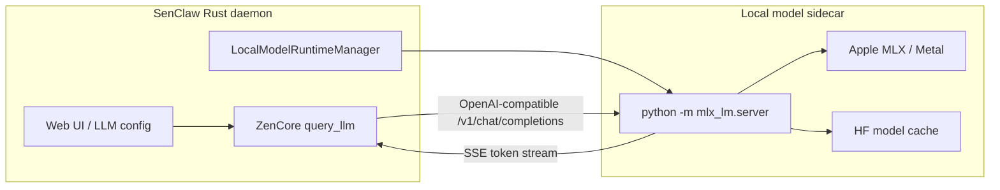

# Local Gemma 4, MLX-LM và TurboQuant

Tài liệu này tổng hợp hướng chạy LLM local cho SenClaw/SemaClaw với Gemma 4, MLX-LM trên
Apple Silicon, cách repo `gemma-chat` vận hành, và vị trí phù hợp để tích hợp vào runtime Rust.
Mục tiêu là có một lộ trình thực dụng: chạy local model trước bằng OpenAI-compatible endpoint,
sau đó mới cân nhắc nhúng inference native vào Rust.

## Kết Luận Ngắn

Hướng nên làm trước là **local runtime sidecar**:

1. Rust daemon quản lý một process `mlx_lm.server`.
2. `mlx_lm.server` tải model MLX 4-bit từ Hugging Face và expose API local.
3. `ZenCore` tiếp tục gọi qua adapter OpenAI hiện có ở `src/zen_core/query_llm.rs`.
4. UI LLM config trỏ `baseURL` về `http://127.0.0.1:<port>/v1`.

Không nên nhúng Gemma 4 trực tiếp vào Rust ngay ở giai đoạn đầu. `mlx-rs` có tồn tại, nhưng là
binding cấp tensor/array cho Apple MLX; nó không tương đương với một runtime LLM hoàn chỉnh như
`mlx_lm`.

## Bức Tranh Tổng Quan



## Vì Sao MLX Hợp Với Mac Silicon

MLX là framework ML của Apple tối ưu cho Apple Silicon:

- CPU và GPU dùng chung unified memory, giảm chi phí copy tensor giữa host/device.
- Compute chạy trên GPU Apple qua Metal.
- Phù hợp local inference cho model nhỏ/vừa đã quantize, ví dụ Gemma 4 E2B/E4B 4-bit.
- Sau khi tải model lần đầu, có thể chạy offline.

Giới hạn quan trọng:

- Chỉ phù hợp macOS Apple Silicon.
- Không giải quyết Linux/NVIDIA/Windows.
- `mlx_lm` là Python package, không phải Rust crate.

Với cross-platform, nên dùng runtime khác như `mistral.rs`, `llama.cpp`, hoặc Candle/GGUF.

## Cách `gemma-chat` Hoạt Động

Repo tham khảo: [ammaarreshi/gemma-chat](https://github.com/ammaarreshi/gemma-chat).

Kiến trúc chính:

1. Electron main process kiểm tra Python 3.10-3.13.
2. Tạo virtualenv riêng trong app data.
3. Cài `mlx-lm>=0.24.0` bằng `pip`.
4. Chạy server:

```bash
python -m mlx_lm.server --model mlx-community/gemma-4-e4b-it-4bit --port 11434
```

5. Set cache env để model tải về thư mục riêng:

```bash
HF_HOME=<app-data>/mlx/models
TRANSFORMERS_CACHE=<app-data>/mlx/models
HF_HUB_DISABLE_TELEMETRY=1
```

6. Poll `GET /v1/models` cho tới khi runtime ready.
7. Gọi `POST /v1/chat/completions` với `stream: true`.
8. Parse SSE theo format OpenAI `data: {...}`.

Điểm đáng học là app không cần biết chi tiết inference. Nó chỉ cần quản lý lifecycle sidecar và gọi
một OpenAI-compatible API local.

## Model Gemma 4 Dùng Cho MLX

`gemma-chat` không dùng checkpoint gốc `google/gemma-4-*` trực tiếp, mà dùng model đã convert sang
MLX 4-bit trên Hugging Face:

| Model | Dung lượng gần đúng | Gợi ý |
| --- | ---: | --- |
| `mlx-community/gemma-4-e2b-it-4bit` | 1.5 GB | Nhanh, nhẹ, hợp máy 8GB+ |
| `mlx-community/gemma-4-e4b-it-4bit` | 3 GB | Mặc định khuyến nghị |
| `mlx-community/gemma-4-26b-a4b-it-4bit` | 16 GB | MoE mạnh hơn, cần RAM lớn |
| `mlx-community/gemma-4-31b-it-4bit` | 18 GB | Chất lượng cao, cần 32GB+ |

Với SenClaw, nên bắt đầu bằng `mlx-community/gemma-4-e4b-it-4bit`.

## Agent Loop Của `gemma-chat`

Ở chế độ code, `gemma-chat` không dùng JSON function calling. Nó yêu cầu model sinh XML action:

```xml
<action name="write_file">
<path>index.html</path>
<content>
<!doctype html>
...
</content>
</action>
```

Luồng mỗi round:

1. Gửi messages tới MLX server.
2. Stream token về UI.
3. Parser tìm `<action name="...">`.
4. Khi action hoàn chỉnh, execute tool.
5. Thêm tool result vào message history.
6. Gọi model tiếp round sau.

Lý do dùng XML: small/local model thường tuân thủ XML action ổn định hơn JSON function calling.
SenClaw hiện đã có tool protocol riêng trong `ZenCore`, nên không cần copy nguyên XML protocol;
tuy nhiên có thể cân nhắc "local model mode" dùng prompt/tool format đơn giản hơn nếu Gemma 4
không ổn định với schema OpenAI tools.

## Vị Trí Tích Hợp Trong SenClaw

Các điểm liên quan hiện có:

- LLM call chính: `src/zen_core/query_llm.rs`.
- Active model profile: `src/zen_core/engine.rs`.
- LLM config API: `src/gateway/ui_server/llm_config.rs`.
- UI model config: Web UI đang lưu `provider`, `baseURL`, `apiKey`, `modelName`, `adapt`.

Vì `query_llm.rs` đã gọi OpenAI-compatible `/chat/completions`, MVP không cần thay đổi conversation
loop. Chỉ cần thêm runtime manager và cấu hình local endpoint.

## Thiết Kế Đề Xuất

Thêm một module mới, ví dụ:

```text
src/local_model/
├── mod.rs
├── mlx_lm.rs          # quản lý Python venv + mlx_lm.server
├── runtime.rs         # trait chung cho local runtime
└── models.rs          # registry model local khuyến nghị
```

Trait runtime tối thiểu:

```rust
pub trait LocalModelRuntime {
    async fn ensure_installed(&self) -> anyhow::Result<()>;
    async fn start(&self, model: &str) -> anyhow::Result<RuntimeEndpoint>;
    async fn stop(&self) -> anyhow::Result<()>;
    async fn health(&self) -> anyhow::Result<RuntimeHealth>;
}
```

`RuntimeEndpoint` trả về:

```text
base_url = http://127.0.0.1:<port>/v1
model_name = mlx-community/gemma-4-e4b-it-4bit
adapt = openai
api_key = local hoặc rỗng
```

## Rust Quản Lý `mlx_lm.server`

Skeleton:

```rust
use std::process::{Child, Command, Stdio};

fn start_mlx_server(python: &str, model: &str, port: u16, cache_dir: &str) -> std::io::Result<Child> {
    Command::new(python)
        .args([
            "-m",
            "mlx_lm.server",
            "--model",
            model,
            "--port",
            &port.to_string(),
        ])
        .env("HF_HOME", cache_dir)
        .env("TRANSFORMERS_CACHE", cache_dir)
        .env("HF_HUB_DISABLE_TELEMETRY", "1")
        .stdout(Stdio::piped())
        .stderr(Stdio::piped())
        .spawn()
}
```

Sau khi spawn:

1. Đọc stdout/stderr để log progress.
2. Poll `GET http://127.0.0.1:<port>/v1/models`.
3. Timeout dài cho lần đầu tải model, ví dụ 10-20 phút.
4. Nếu process exit sớm, surface stderr về UI.

## Tích Hợp UI

Nên thêm một tab hoặc section "Local Models":

- Runtime: `MLX-LM`.
- Model select: danh sách Gemma 4 MLX 4-bit.
- Port: auto/random hoặc mặc định khác `11434` để tránh đụng Ollama.
- Status: `not_installed`, `installing`, `downloading_model`, `starting`, `ready`, `error`.
- Action: install runtime, start model, stop model, set as active LLM.

Khi user chọn "set active", backend có thể tạo/cập nhật LLM config:

```json
{
  "label": "Local Gemma 4 E4B",
  "provider": "local-mlx",
  "baseURL": "http://127.0.0.1:11435/v1",
  "apiKey": "local",
  "modelName": "mlx-community/gemma-4-e4b-it-4bit",
  "adapt": "openai",
  "maxTokens": 8192,
  "contextLength": 131072
}
```

## Rust Native MLX

Có crate `mlx-rs`, một binding Rust không chính thức cho Apple MLX. Nó hữu ích nếu muốn viết kernel,
tensor op, hoặc port model trực tiếp sang Rust.

Tuy nhiên để chạy Gemma 4 native bằng `mlx-rs`, cần tự xử lý:

- tokenizer và chat template;
- loader weight MLX/SafeTensors;
- kiến trúc Gemma 4, bao gồm PLE nếu dùng đúng Gemma 4;
- attention, KV-cache, sampling;
- quantized weight;
- multimodal processor nếu cần image/audio.

Vì vậy `mlx-rs` là hướng dài hạn, không phải đường MVP.

## TurboQuant Có Hợp Với MLX Không?

TurboQuant là kỹ thuật quantize **KV-cache**, không phải quantize weight. Nó giúp giảm memory khi
context dài, nhất là 32K+ tokens.

Tình trạng thực dụng:

- `turboquant-rs` có tích hợp Candle/mistral.rs KV-cache.
- Lợi ích lớn nhất hiện ở CUDA với fused kernel.
- Không phải tính năng mặc định của `mlx_lm`.
- Không thay thế MLX 4-bit weight quantization.

Do đó:

- Nếu mục tiêu là Mac local-first: ưu tiên MLX-LM trước, không chặn bởi TurboQuant.
- Nếu mục tiêu là NVIDIA/Linux và context rất dài: nghiên cứu `mistral.rs` + TurboQuant/PQO3.
- Nếu sau này có MLX KV-cache quantization tương đương, có thể thêm runtime option riêng.

## Lộ Trình Triển Khai

### Phase 1: Dùng config hiện có

Chạy `mlx_lm.server` thủ công và tạo LLM config trỏ vào local endpoint. Không cần sửa code nhiều.

```bash
python -m mlx_lm.server \
  --model mlx-community/gemma-4-e4b-it-4bit \
  --port 11435
```

LLM config:

```text
baseURL = http://127.0.0.1:11435/v1
modelName = mlx-community/gemma-4-e4b-it-4bit
adapt = openai
apiKey = local
```

### Phase 2: Runtime manager trong Rust

Backend tự:

- tìm Python 3.10-3.13;
- tạo venv dưới `~/.senclaw/local-models/mlx`;
- cài `mlx-lm`;
- start/stop sidecar;
- poll health;
- emit progress qua WebSocket hoặc HTTP polling.

### Phase 3: UI local models

Thêm trang quản lý runtime local:

- install/runtime status;
- chọn model;
- progress tải model;
- set active;
- logs rút gọn khi lỗi.

### Phase 4: Runtime abstraction

Trừu tượng hóa để hỗ trợ thêm:

- `mlx_lm` cho Apple Silicon;
- `mistral.rs` cho Rust-native/cross-platform;
- `llama.cpp`/GGUF;
- Candle khi model support đủ ổn định.

## Rủi Ro Và Lưu Ý

- Port `11434` dễ đụng Ollama; nên dùng port riêng hoặc port động.
- Lần đầu tải model có thể rất lâu; UI cần progress và cancel.
- Python 3.14+ có thể chưa có wheel phù hợp cho `mlx-lm`; nên giới hạn 3.10-3.13.
- API OpenAI-compatible của local server có thể không hỗ trợ đủ tool calling như cloud model.
- Gemma 4 local có thể cần prompt/tool format đơn giản hơn.
- Cần cleanup process khi daemon shutdown.
- Cần không commit model/cache/runtime vào repo.

## Checklist MVP

- [ ] Chạy thử `mlx_lm.server` với `mlx-community/gemma-4-e4b-it-4bit`.
- [ ] Tạo LLM config trỏ vào `http://127.0.0.1:<port>/v1`.
- [ ] Kiểm tra chat thường qua `ZenCore`.
- [ ] Kiểm tra streaming SSE trong `query_llm.rs`.
- [ ] Kiểm tra tool calling; nếu kém ổn định, thử prompt/tool protocol đơn giản hơn.
- [ ] Đo latency token đầu tiên, token/s, RAM, context dài.
- [ ] Sau đó mới thêm runtime manager tự động.

## Tham Khảo

- Gemma Chat: <https://github.com/ammaarreshi/gemma-chat>
- MLX-LM: <https://github.com/ml-explore/mlx-lm>
- Apple MLX: <https://github.com/ml-explore/mlx>
- Rust MLX binding: <https://crates.io/crates/mlx-rs>
- TurboQuant Rust: <https://crates.io/crates/turboquant-rs>
