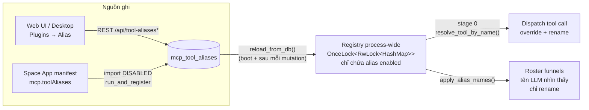

# Cơ chế Alias MCP tool — định danh lại & ghi đè tool (Plugins → Alias)

Alias MCP tool cho phép **đặt tên mới cho một tool** (định danh lại / *rename*) hoặc
**ghi đè một tool đang có bằng tool khác** (*override*) mà không sửa code, không
restart daemon. Quản lý tại **Plugins → Alias** (Web UI và desktop app), lưu trong
bảng SQLite `mcp_tool_aliases`, áp dụng cho **mọi đường gọi tool** của agent.

Use case điển hình:

- Rút gọn một tên tool dài (`mcp__ssh-manager-mcp__ssh_execute_command` → `mcp__ssh__run`)
  để model gọi ổn định hơn và skill docs dễ đọc hơn.
- Thay implementation: trỏ `mcp__senclaw-browser__browser_navigate` sang tool navigate
  của một app khác — mọi skill/persona đang gọi tên cũ tự động chạy tool mới.
- Space App tự đề xuất alias trong manifest (`mcp.toolAliases`), người dùng duyệt rồi mới có hiệu lực.

## 1. Khái niệm

Một alias là một ánh xạ `alias → target`. **Không có cờ chọn chế độ** — hành vi
rename hay override được suy tự động từ việc tên `alias` có trùng với một tool
đang đăng ký hay không:

| Tình huống | Hành vi |
|---|---|
| `alias` là tên **chưa tồn tại** | **Định danh mới (rename)**: roster gửi cho LLM hiển thị tool đích dưới tên `alias` (mô tả có thể thay bằng mô tả của alias). Tên gốc *vẫn gọi được* (qua `Tool::renamed_from`), nên transcript cũ, skill docs, whitelist cũ không hỏng. |
| `alias` **trùng tên một tool đang đăng ký** | **Ghi đè (override)**: mọi lệnh gọi tên đó bị chuyển hướng sang `target` *trước* bước exact-match, tool gốc bị che. Roster không đổi — LLM vẫn thấy tên và mô tả cũ. |
| `target` không tồn tại (app tắt, gõ sai) | Fallback về tool gốc + log warning — alias **không bao giờ làm chết một tool đang chạy**. |
| Chuỗi alias `a → b → c` | Được duyệt đến đích cuối. Có chống vòng lặp: cap 8 bước, vòng lặp (`a → b → a`) thoái hoá về tên gốc. |

Ví dụ hai chiều với cùng một cấu trúc dữ liệu:

```
# Rename — "mcp__ssh__run" chưa tồn tại → roster hiện tên mới
alias  = mcp__ssh__run
target = mcp__ssh-manager-mcp__ssh_execute_command

# Override — alias trùng tên tool thật đang đăng ký → mọi call bị redirect
alias  = mcp__senclaw-browser__browser_navigate
target = mcp__mini-browser-mcp__mb_navigate
```

## 2. Kiến trúc



| Thành phần | File | Vai trò |
|---|---|---|
| Registry in-process | [`src/tools/tool_alias.rs`](../src/tools/tool_alias.rs) | `OnceLock<RwLock<HashMap<alias, AliasEntry>>>` — chỉ nạp alias `enabled`. Nạp lúc boot (`run_daemon`, ngay sau `Db::open`) và nạp lại sau **mỗi** mutation REST / import app → thay đổi có hiệu lực từ turn kế tiếp, **không cần restart daemon**. |
| DB layer | [`src/db/tool_aliases.rs`](../src/db/tool_aliases.rs) | CRUD + import/prune cho app + `enabled_tool_alias_map()` (shape registry tiêu thụ). |
| Resolve (dispatch) | [`src/tools/tool_search.rs`](../src/tools/tool_search.rs) | Stage 0 của `resolve_tool_by_name` — mọi đường gọi tool đi qua đây. |
| Roster decoration | [`src/tools/tool_alias.rs`](../src/tools/tool_alias.rs) `apply_alias_names` + [`src/zen_core/engine.rs`](../src/zen_core/engine.rs) | Áp trong `tools_for_main_agent` + `deferred_tools`; các funnel còn lại (`available_tools`, `tools_for_subagent`, `get_tool_infos`) dẫn xuất từ hai cái này. |
| REST API | [`src/gateway/ui_server/tool_aliases.rs`](../src/gateway/ui_server/tool_aliases.rs) | 5 endpoint, xem §6. |
| Import app | [`src/gateway/ui_server/space_mcp.rs`](../src/gateway/ui_server/space_mcp.rs) `sync_app_tool_aliases` | Chạy trong `run_and_register` — mọi đường install / update / boot / supervisor respawn. |
| Web UI | [`web/src/components/plugins/AliasPanel.tsx`](../web/src/components/plugins/AliasPanel.tsx) | Tab Alias trong trang Plugins (`/plugins?nav=alias`). |
| Desktop app | [`desktop_app/lib/features/plugins/plugins_screen.dart`](../desktop_app/lib/features/plugins/plugins_screen.dart) | Section Alias tương đương (nhãn tiếng Anh). |

## 3. Luồng resolve khi agent gọi tool

`resolve_tool_by_name(name, tools)` ([`src/tools/tool_search.rs`](../src/tools/tool_search.rs)):

1. **Stage 0 — alias map.** Tra `name` trong registry (chỉ alias enabled), duyệt
   chuỗi `a → b → c` với cycle-guard (cap 8 hop; vòng lặp trả về tên gốc). Nếu ra
   target khác `name`: resolve target bằng cascade *bỏ qua alias*
   (`resolve_tool_ignoring_aliases` — tránh tái nhập map). Tìm thấy → trả về tool
   target (đây là cách override che tool gốc). Không tìm thấy (app tắt, gõ sai) →
   log warning, **rơi xuống bước 2 với tên gốc** — alias hỏng không làm chết tool.
2. **Cascade thường** (`resolve_tool_ignoring_aliases`): exact match → normalized
   MCP name → **`renamed_from`** (tool đã bị rename vẫn resolve bằng tên đăng ký
   gốc — transcript cũ, skill docs, hardcoded list không hỏng) → hyphen/underscore
   fold → khớp server + verb suffix.

Mọi caller đều đi qua hàm này: vòng thực thi `run_tools`, `ToolSearch select:`,
whitelist `use_tools`, isolated runner… — nên alias có hiệu lực đồng nhất toàn hệ thống.

## 4. Trang trí roster (chỉ rename)

`apply_alias_names(tools)` chạy trong hai funnel gốc của engine
(`tools_for_main_agent`, `deferred_tools` — [`src/zen_core/engine.rs`](../src/zen_core/engine.rs)):

- Alias **không** trùng tên tool đang đăng ký → tool target trong roster được bọc
  bằng `AliasedTool`: đổi `name()` thành alias, `description()` thay bằng mô tả của
  alias nếu có; mọi thứ khác (schema, `is_read_only`, permission, display title…)
  delegate nguyên vẹn xuống tool gốc. `renamed_from()` trả tên gốc để cascade §3 dùng.
- Alias trùng tên tool đang có (= override) → **bỏ qua**, roster giữ nguyên; việc
  redirect xảy ra ở dispatch (§3).
- Target không đăng ký → bỏ qua entry đó.
- **Mỗi tool chỉ bị rename một lần** (tool đã có `renamed_from` giữ tên hiện tại;
  các alias sau vẫn gọi được ở dispatch).
- Idempotent và deterministic (áp theo thứ tự sort) — funnel gọi lặp không làm
  roster đổi thứ tự, giữ ổn định cho prompt caching.

## 5. Lưu trữ

Bảng trong [`src/db/schema.rs`](../src/db/schema.rs):

```sql
CREATE TABLE IF NOT EXISTS mcp_tool_aliases (
  alias        TEXT PRIMARY KEY,
  target_tool  TEXT NOT NULL,
  description  TEXT,
  enabled      INTEGER NOT NULL DEFAULT 1,
  source       TEXT NOT NULL DEFAULT 'user',   -- 'user' | 'app:<app_id>'
  created_at   INTEGER NOT NULL,
  updated_at   INTEGER NOT NULL
);
```

- `source = 'user'`: tạo từ UI/REST. `source = 'app:<id>'`: nhập từ manifest Space App.
- Registry chỉ nạp hàng `enabled = 1` (`enabled_tool_alias_map()`).

## 6. REST API

Handlers: [`src/gateway/ui_server/tool_aliases.rs`](../src/gateway/ui_server/tool_aliases.rs).
**Mọi mutation đều `reload_from_db()` ngay** — hiệu lực turn kế tiếp.

```
GET    /api/tool-aliases                  → { aliases: [...] }   # mọi source
POST   /api/tool-aliases                  { alias, target, description?, enabled? }
                                          # source=user; enabled mặc định true
PUT    /api/tool-aliases/:alias           { target, description? }
                                          # CHỈ alias source=user
POST   /api/tool-aliases/:alias/enabled   { enabled }             # cổng phê duyệt alias app
DELETE /api/tool-aliases/:alias
```

Ngữ nghĩa lỗi:

| Mã | Khi nào |
|---|---|
| `400` | alias/target rỗng hoặc chứa whitespace; `alias == target`; PUT vào alias do app quản (`source != user`) — target của nó do manifest quyết định, chỉ được bật/tắt hoặc xoá. |
| `404` | alias không tồn tại (PUT / toggle / DELETE). |
| `409` | POST trùng tên alias đã có (create không bao giờ ghi đè). |

```bash
curl -s localhost:18788/api/tool-aliases | jq
```

```bash
curl -s -X POST localhost:18788/api/tool-aliases \
  -H 'Content-Type: application/json' \
  -d '{"alias":"mcp__ssh__run","target":"mcp__ssh-manager-mcp__ssh_execute_command","description":"Chạy lệnh trên host đã lưu"}'
```

## 7. Web UI (Plugins → Alias)

[`web/src/components/plugins/AliasPanel.tsx`](../web/src/components/plugins/AliasPanel.tsx),
route `/plugins?nav=alias`:

- Bảng liệt kê mọi alias: cột alias, tool đích, badge **`ghi đè`** / **`định danh mới`**
  (suy từ danh sách tool thật của `/api/mcp-servers` — alias trùng tên tool đang
  đăng ký là ghi đè), nguồn (`Người dùng` / `App: <id>`), mô tả, switch bật/tắt, sửa/xoá.
- **Add alias**: form 2 ô AutoComplete (alias + tool đích) gợi ý từ danh sách tool
  đã đăng ký, kèm mô tả tuỳ chọn.
- Alias do app khai báo chỉ bật/tắt hoặc xoá được — nút sửa target bị chặn (khớp §6).

## 8. Desktop app (Flutter)

Màn hình tương đương ở **Plugins → Alias** trong `desktop_app`
([lib/features/plugins/plugins_screen.dart](../desktop_app/lib/features/plugins/plugins_screen.dart):
`_AliasTab` / `_AliasRow` / `_AliasEditor`, model `ToolAlias`, provider
`toolAliasesProvider` + `knownToolNamesProvider`). Nhãn tiếng Anh theo các section
anh em trong Plugins; badge `override` / `new name` suy như Web UI. Widget tests:
[test/alias_tab_test.dart](../desktop_app/test/alias_tab_test.dart).
Chạy desktop app trỏ vào harness (không đụng daemon thật):

```bash
cd desktop_app && flutter run -d macos --dart-define=SENCLAW_UI_PORT=18988
```

## 9. Space App khai báo alias trong manifest

`senclaw-manifest.json` → khối `mcp` (cần `autoRegister: true` để daemon đăng ký
MCP của app — import alias chạy cùng bước đó):

```json
"mcp": {
  "name": "ssh-manager-mcp",
  "transport": "http",
  "path": "/api/mcp/sse",
  "autoRegister": true,
  "toolAliases": [
    { "alias": "mcp__ssh__run", "tool": "ssh_execute_command", "description": "Chạy lệnh trên host đã lưu" },
    { "alias": "mcp__senclaw-browser__browser_navigate", "target": "mcp__ssh-manager-mcp__ssh_open_url" }
  ]
}
```

Quy tắc parse (`parse_declared_aliases` — [`src/tools/tool_alias.rs`](../src/tools/tool_alias.rs)):

- `tool` và `target` là synonym. Tên bare được nở thành `mcp__<mcp.name>__<tên>`;
  tên đầy đủ `mcp__*` giữ nguyên (cho phép app ghi đè tool của server khác).
- `alias` **bắt buộc** dạng `mcp__*` — chặn app giả mạo tool builtin (Bash, Read,
  Write…). Entry sai (thiếu trường, có whitespace, alias == target, không `mcp__*`)
  bị bỏ qua kèm warning, **không chặn app chạy**.
- Import (`sync_app_tool_aliases` — [`src/gateway/ui_server/space_mcp.rs`](../src/gateway/ui_server/space_mcp.rs))
  chạy trong `run_and_register` — mọi đường install / update / boot / supervisor
  respawn đều qua đây, nên alias luôn đồng bộ với manifest hiện hành.

**Quy tắc phê duyệt (an toàn):**

1. Alias do app khai báo được nhập ở trạng thái **tắt** (`enabled = 0`).
   Người dùng phải vào **Plugins → Alias** bật lên thì mới có hiệu lực.
2. Re-import (app restart / update) chỉ refresh `target`/`description`,
   **không bao giờ** đụng `enabled` — opt-in của người dùng sống sót qua update.
   (Upsert `ON CONFLICT ... DO UPDATE ... WHERE source = excluded.source`.)
3. App không chiếm được alias thuộc source khác (user hoặc app khác) — guard
   `WHERE source = excluded.source` làm câu upsert thành no-op khi khác chủ.
4. Alias app không còn khai báo trong manifest bị **prune** ở lần import kế;
   gỡ app xoá toàn bộ alias nguồn `app:<id>` và nạp lại registry ngay
   ([`src/gateway/ui_server/space.rs`](../src/gateway/ui_server/space.rs)).
5. Xoá tay một alias app trong UI: nó sẽ **tái nhập ở trạng thái tắt** lần app
   start kế (manifest vẫn khai báo) — muốn tắt hẳn thì cứ để nó disabled.

## 10. Tương tác với phần còn lại của hệ thống

- **Phân loại read-only** (quyết định tool chạy song song hay tuần tự trong
  `run_tools`) đi qua đúng resolver §3 — ghi đè một tool read-only bằng tool có
  side-effect sẽ **không** lọt vào nhánh chạy song song.
- **Permission** lấy theo **tool thực thi sau resolve**: override → key của target;
  rename → key là tên alias (tool trong roster mang tên alias).
- **Whitelist `use_tools`** (persona/group) resolve từng entry qua resolver, nên
  whitelist ghi tên gốc vẫn khớp tool đã rename và ngược lại.
- **ToolSearch / deferred tools** hiển thị tên alias (funnel `deferred_tools` đã
  decorate) — model tìm và nạp schema bằng tên mới.
- **Prompt caching**: decoration deterministic + idempotent nên roster không
  xáo trộn giữa các turn.

## 11. Troubleshooting

| Triệu chứng | Nguyên nhân thường gặp |
|---|---|
| Alias không có hiệu lực | (1) Alias app chưa được bật — mặc định nhập **tắt**, vào Plugins → Alias bật. (2) Thay đổi chỉ áp dụng từ **turn kế tiếp** — session đang giữa turn không đổi. (3) Target chưa đăng ký (app chưa chạy / `autoRegister` thiếu) — xem `GET /api/mcp-servers`. |
| Tool "không hành xử như tài liệu" | Có thể đang bị override — `GET /api/tool-aliases` xem alias trùng tên tool đó không. |
| Alias app biến mất sau update app | Manifest bản mới không còn khai báo → bị prune (chủ ý). |
| Alias app tự quay lại sau khi xoá | App restart tái nhập từ manifest (ở trạng thái tắt) — hành vi chủ ý, xem §9.5. |
| Log warning `target not registered, falling back` | Target gõ sai hoặc app đang tắt — sửa target hoặc bật app; tool gốc vẫn chạy bình thường trong lúc đó. |

## 12. Dev harness & tests

```bash
npm run build:web
cargo build --example alias_ui_harness
./target/debug/examples/alias_ui_harness   # http://127.0.0.1:18988/plugins?nav=alias
```

Harness chạy router UI thật (REST mới + SPA `web/dist`) trên DB tạm có sẵn 2 alias
mẫu — không đụng daemon desktop đang chạy hay dữ liệu `~/.senclaw`. Có sẵn entry
`alias-ui` trong [.claude/launch.json](../.claude/launch.json).

Tests:

- `cargo test --lib tool_alias` — registry (chuỗi/vòng lặp, fallback), parse manifest,
  DB CRUD, bảo toàn `enabled` khi re-import, chống cướp alias khác nguồn, prune,
  rename/override resolution + roster decoration (idempotent).
- `cargo test --test tool_alias_api` — REST end-to-end trên router thật
  (create → 409 → validate → import app → PUT bị chặn → enable gate → update →
  disable → delete).
