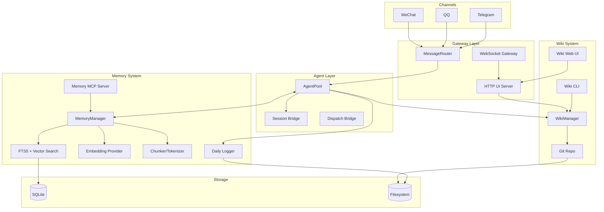
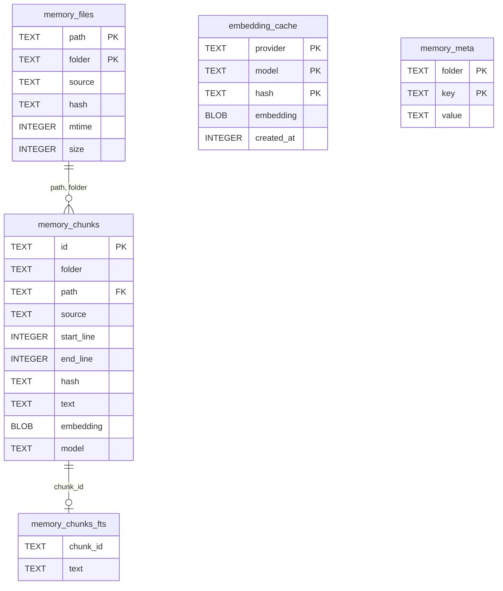
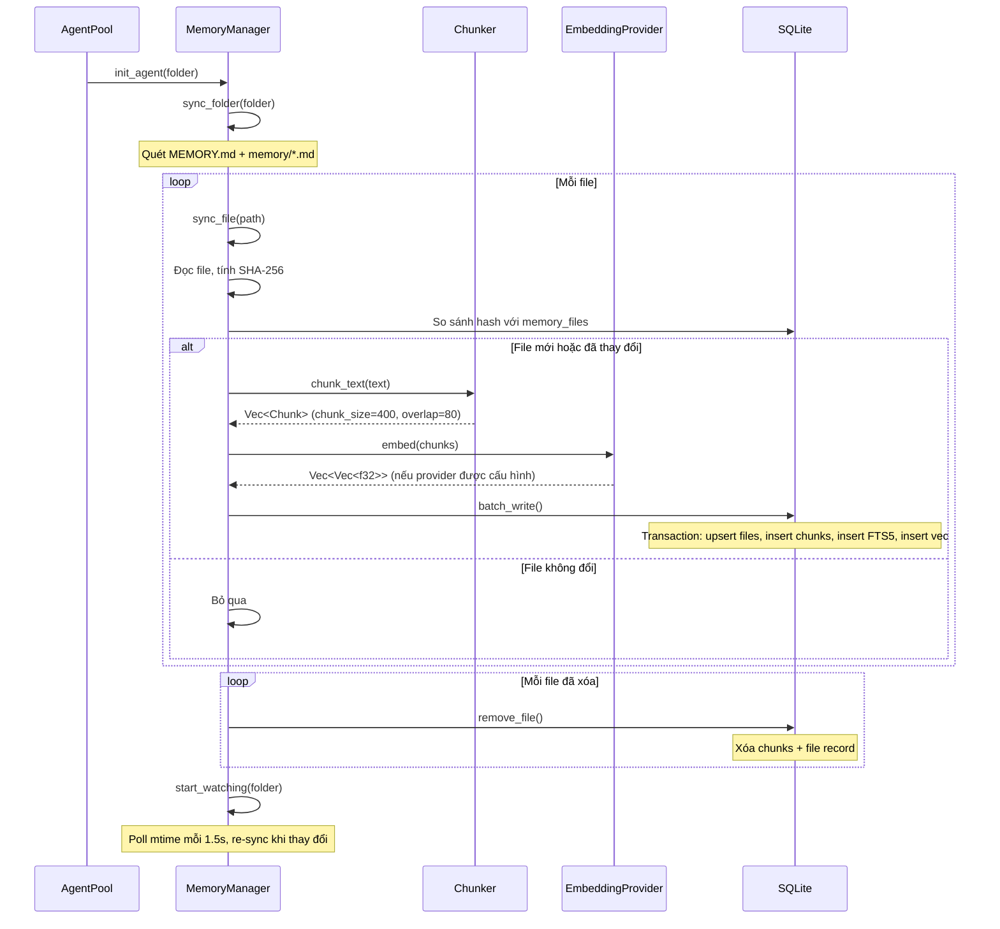
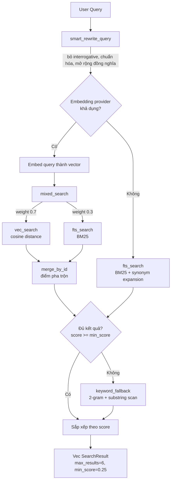
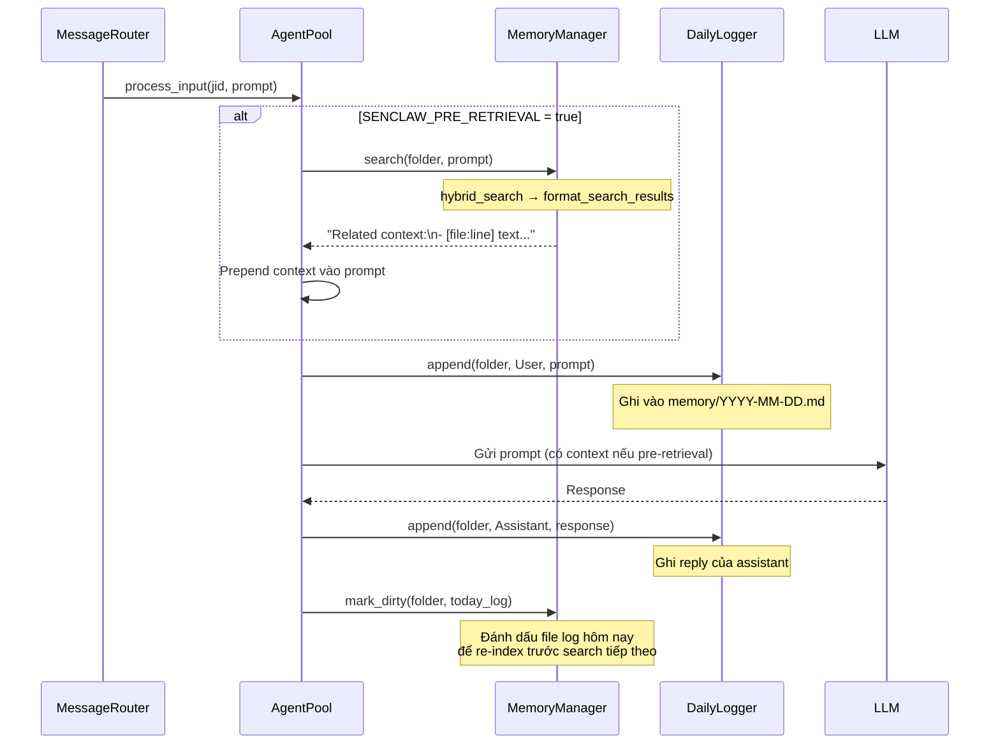
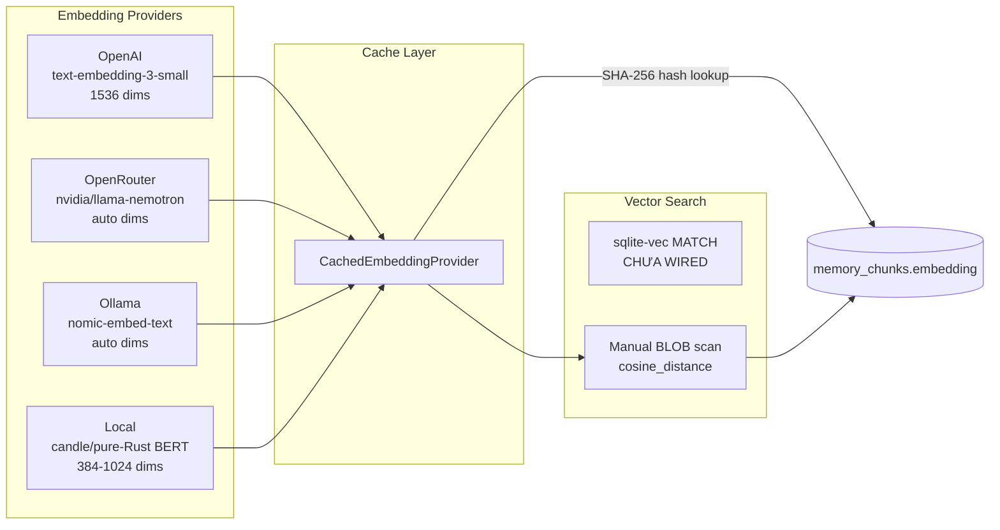
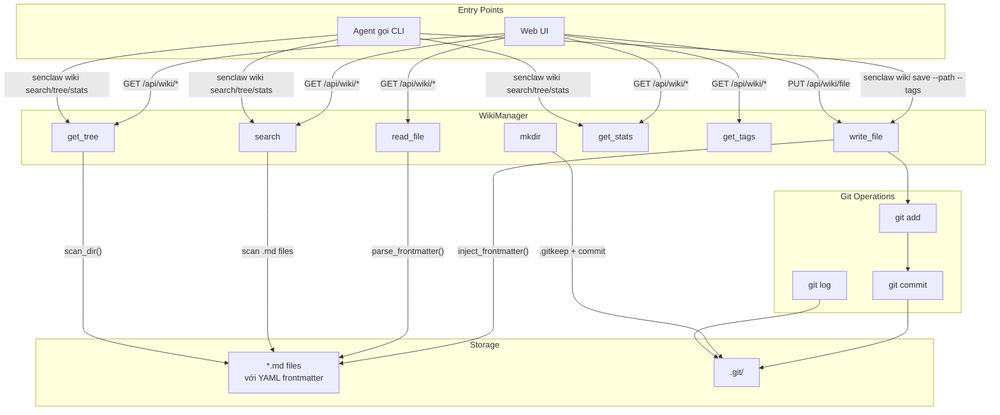
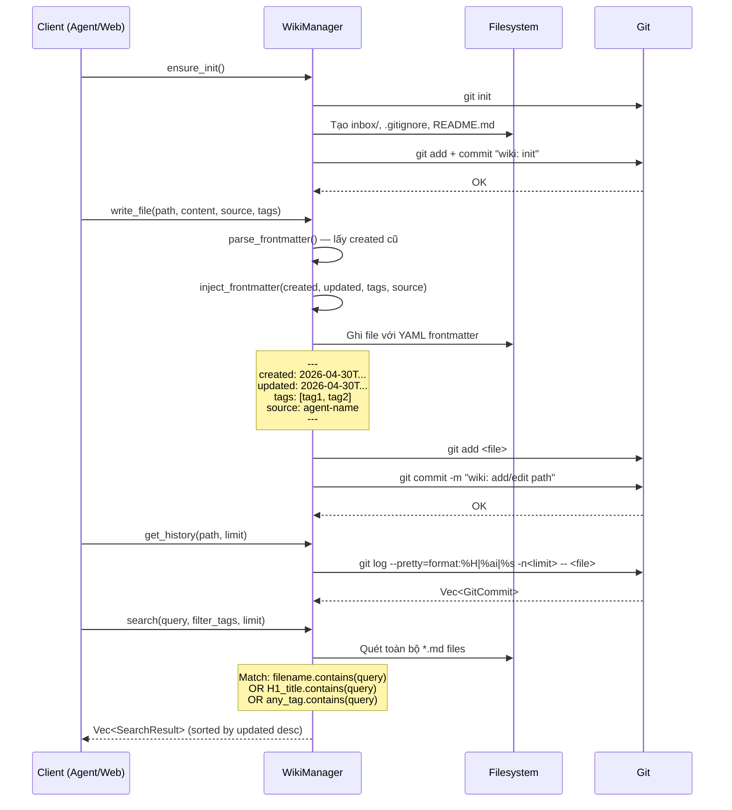
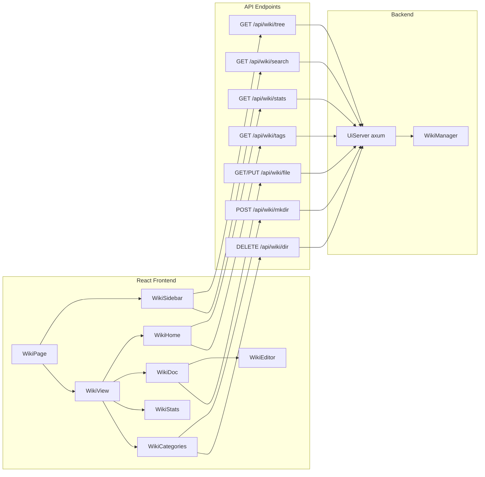
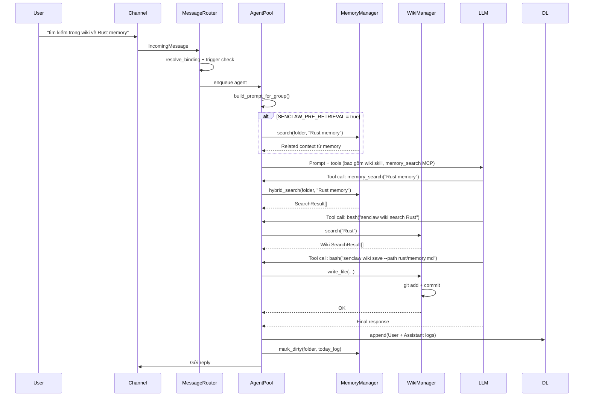

# Memory & Wiki — Kiến trúc và Luồng dữ liệu

Tài liệu chi tiết về hệ thống Memory (bộ nhớ ngữ nghĩa) và Wiki (kho tri thức git-backed) trong SenClaw.

## Mục lục

1. [Tổng quan kiến trúc](#tổng-quan-kiến-trúc)
2. [Memory — Bộ nhớ ngữ nghĩa](#memory--bộ-nhớ-ngữ-nghĩa)
   - [Cấu trúc module](#cấu-trúc-module-memory)
   - [Schema SQLite](#schema-sqlite)
   - [Luồng đồng bộ (Sync)](#luồng-đồng-bộ-sync)
   - [Luồng tìm kiếm (Search)](#luồng-tìm-kiếm-search)
   - [Luồng Pre-retrieval trong Agent](#luồng-pre-retrieval-trong-agent)
   - [Embedding & Vector Search](#embedding--vector-search)
   - [MCP Memory Server](#mcp-memory-server)
3. [Wiki — Kho tri thức](#wiki--kho-tri-thức)
   - [Cấu trúc module](#cấu-trúc-module-wiki)
   - [Luồng tạo/tra cứu tài liệu](#luồng-tạotra-cứu-tài-liệu)
   - [Git-backed Knowledge Base](#git-backed-knowledge-base)
   - [Feishu Wiki MCP Server](#feishu-wiki-mcp-server)
   - [Web UI Wiki Viewer](#web-ui-wiki-viewer)
4. [Tương tác Memory ↔ Wiki ↔ Agent](#tương-tác-memory--wiki--agent)
5. [File index](#file-index)

---

## Tổng quan kiến trúc



---

## Memory — Bộ nhớ ngữ nghĩa

### Cấu trúc module Memory

```
src/memory/
├── mod.rs          (13 dòng)  — Khai báo 11 sub-module
├── schema.rs       (339 dòng) — Schema SQLite: memory_files, memory_chunks, memory_chunks_fts, embedding_cache, memory_meta
├── manager.rs      (629 dòng) — MemoryManager: scan, sync, watch, search (core orchestrator)
├── fts_search.rs   (361 dòng) — Hybrid search: Vector + FTS5 + keyword fallback
├── embedding.rs    (171 dòng) — EmbeddingProvider trait + CachedEmbeddingProvider + factory
├── embedding_providers.rs (326 dòng) — OpenAI, OpenRouter, Ollama, Local providers
├── chunker.rs      (190 dòng) — Line-based text chunking với overlap
├── tokenizer.rs    (182 dòng) — CJK/English mixed tokenizer (jieba-rs)
├── stopwords.rs    (119 dòng) — Chinese + English stopwords
├── query_rewrite.rs (207 dòng) — Query rewriting + từ điển đồng nghĩa
├── search.rs       (391 dòng) — File-based memory search (memories.json + daily logs)
└── daily_logger.rs (209 dòng) — Ghi log hội thoại theo ngày (YYYY-MM-DD.md)
```

### Schema SQLite



**5 bảng chính:**

| Bảng | Mục đích |
|------|----------|
| `memory_files` | Theo dõi file nguồn trên disk (path, hash SHA-256, mtime, size) |
| `memory_chunks` | Text chunks + embedding vectors dạng BLOB |
| `memory_chunks_fts` | FTS5 virtual table — full-text search BM25 |
| `embedding_cache` | Cache embedding API calls theo hash của text |
| `memory_meta` | Key-value store per-folder (phát hiện model switch) |

> **Ghi chú:** `memory_chunks_vec` (sqlite-vec) chưa được wired trong Rust port. Vector search fallback về manual BLOB scan với cosine distance.

**Model switch detection:** Khi đổi embedding provider/model, hệ thống tự xóa toàn bộ embedding cũ:
```
memory_meta["__global__"]["embedding_model"] = "openai:text-embedding-3-small:1536"
                              │
         Nếu khác với key lưu → UPDATE memory_chunks SET embedding=NULL, model=NULL
                                  DELETE memory_meta WHERE key='embedding_model'
                                  DROP TABLE IF EXISTS memory_chunks_vec
```
Files sau đó được re-embed tự động khi watcher trigger sync.

### Luồng đồng bộ (Sync)

Khi AgentPool khởi tạo agent cho một folder, MemoryManager quét và index toàn bộ file memory.



**File watcher:** Poll mtime của `MEMORY.md` và `memory/*.md` mỗi **1.5 giây**. Khi phát hiện thay đổi, gọi `sync_file()` cho file đó.

### Luồng tìm kiếm (Search)

3-tier progressive fallback: **Vector hybrid → FTS5 BM25 → Keyword substring**



**Ba tầng tìm kiếm:**

| Tầng | Phương pháp | Điều kiện |
|------|------------|-----------|
| 1. Mixed Hybrid | Vector similarity (0.7) + FTS5 BM25 (0.3) | Cần embedding provider |
| 2. FTS5 BM25 | Tokenize CJK/EN + mở rộng đồng nghĩa + OR query | Fallback từ tầng 1 |
| 3. Keyword | Substring + 2-gram matching toàn bộ chunks | Kết quả tầng 2 không đủ |

**Query Rewrite pipeline:**
1. Regex loại bỏ interrogative ("làm thế nào", "tại sao", "how to", "why")
2. Tokenize CJK (jieba) + English (whitespace)
3. Lọc stopwords
4. Mở rộng đồng nghĩa 2 chiều (ví dụ: "bộ nhớ" ↔ "memory", "lỗi" ↔ "error")

### Luồng Pre-retrieval trong Agent



**Cấu hình pre-retrieval:** `SENCLAW_PRE_RETRIEVAL=true` (mặc định `false`)

### Embedding & Vector Search



**Các provider embedding:**

| Provider | Model mặc định | Dimensions | Batch | Retry |
|----------|---------------|------------|-------|-------|
| `openai` | `text-embedding-3-small` | 1536 | 8 texts | 3 lần, exponential backoff + jitter |
| `openrouter` | `nvidia/llama-nemotron-embed-vl-1b-v2` | Auto-detect từ response | 1 text | 3 lần |
| `ollama` | `nomic-embed-text` | Auto-detect từ response | 1 text | Không |
| `local` | `paraphrase-multilingual-MiniLM-L12-v2` | 384 | Toàn bộ batch | Không |

**Cache mechanism:** `CachedEmbeddingProvider` bọc mọi provider. Trước khi gọi API, kiểm tra `embedding_cache` table bằng SHA-256 hash của text. Nếu đã có, trả về cached embedding. Cache key bao gồm `(provider, model, hash)` — đổi model tự động bỏ cache cũ.

**Vector search hiện tại:** sqlite-vec chưa được wired (extension chưa load) → fallback về **manual BLOB scan**: deserialize từng embedding từ `memory_chunks.embedding BLOB`, tính `cosine_distance()`, sắp xếp, normalize về 0–1.

### Local Provider — Pure Rust (candle/BERT)

Kích hoạt bằng Cargo feature — **không cần ONNX Runtime hay C++ library**:
```bash
cargo build --features local-embed              # CPU only
cargo build --features local-embed-metal        # + Apple Silicon Metal

SENCLAW_EMBEDDING_PROVIDER=local
SENCLAW_LOCAL_MODEL=paraphrase-multilingual-MiniLM-L12-v2   # optional
SENCLAW_LOCAL_MODEL_PATH=/path/to/model                      # optional — custom model
```

**Cơ chế lazy init:**
```
first embed() call
      │
OnceCell::get_or_try_init()
      │
spawn_blocking (giải phóng tokio thread pool)
      │
      ├─ SENCLAW_LOCAL_MODEL_PATH set? → load_from_path() — thư mục local
      └─ Không → load_from_hub() — download HuggingFace Hub lần đầu
                  cache vào ~/.senclaw/models/
      │
Arc<CandleEngine> { BertModel + Tokenizer + Device }
— lần sau reuse session, không load lại
```

**Pipeline inference (mỗi lần embed):**
1. `encode_batch()` — truncate max 512 tokens, pad to batch-longest
2. `BertModel::forward()` → `[batch, seq_len, hidden_size]`
3. Mean pool (masked, bỏ padding) → `[batch, hidden_size]`
4. L2 normalize → unit vectors cho cosine similarity

**Models được hỗ trợ (HuggingFace Hub):**

| Model | Dimensions | Đặc điểm |
|-------|-----------|----------|
| `paraphrase-multilingual-MiniLM-L12-v2` *(mặc định)* | 384 | Đa ngôn ngữ, phù hợp tiếng Việt/Trung |
| `all-MiniLM-L6-v2` | 384 | Nhanh, English |
| `all-MiniLM-L12-v2` | 384 | Chính xác hơn L6, English |
| `bge-small-en-v1.5` | 384 | English, quality cao |
| `bge-base-en-v1.5` | 768 | English, cân bằng |
| `bge-large-en-v1.5` | 1024 | English, chính xác nhất |
| `multilingual-e5-small` | 384 | Đa ngôn ngữ |
| `multilingual-e5-base` | 768 | Đa ngôn ngữ |
| `multilingual-e5-large` | 1024 | Đa ngôn ngữ, tốt nhất |

**Custom model path:** thư mục phải chứa `model.safetensors` + `tokenizer.json` + `config.json`.

**Heuristic dimensions:** tên chứa "large" → 1024, "base" → 768, còn lại → 384.

### MCP Memory Server

MCP stdio server (`memory-server` subprocess) cung cấp 2 tools cho agent:

| Tool | Params | Mô tả |
|------|--------|-------|
| `memory_search` | `query: String`, `maxResults?: usize`, `source?: String` | Hybrid search (FTS5 + vector) trên toàn bộ memory đã index |
| `memory_get` | `relPath: String`, `startLine?: u32`, `endLine?: u32` | Đọc nội dung file memory theo path + line range |

**Khởi tạo:** Đọc `SENCLAW_DB_PATH`, `SENCLAW_FOLDER`, `SENCLAW_AGENTS_DIR` từ env.

---

## Wiki — Kho tri thức

### Cấu trúc module Wiki

```
src/wiki/
└── mod.rs → manager.rs (845 dòng)

src/cli/commands/wiki.rs (151 dòng) — CLI subcommands

web/src/
├── pages/WikiPage.tsx       (41 dòng)
├── hooks/useWiki.ts         (180 dòng)
├── components/WikiView.tsx   (137 dòng)
├── components/WikiSidebar.tsx(269 dòng)
├── components/WikiHome.tsx   (176 dòng)
├── components/WikiDoc.tsx    (200 dòng)
├── components/WikiEditor.tsx (30 dòng)
├── components/WikiStats.tsx  (102 dòng)
└── components/WikiCategories.tsx (309 dòng)

skills/wiki/SKILL.md (127 dòng) — Skill definition cho Agent
```

### Luồng tạo/tra cứu tài liệu



### Git-backed Knowledge Base



**Mọi thao tác ghi đều tự động commit vào git:**
- `write_file` → `git add <file> && git commit -m "wiki: add/edit <path>"`
- `mkdir` → `git add .gitkeep && git commit -m "wiki: mkdir <path>"`
- `delete_empty_dir` → `git rm -r <dir> && git commit -m "wiki: rmdir <path>"`

**Frontmatter auto-management:**
```yaml
---
created: 2026-04-30T10:00:00.000Z    # Giữ nguyên từ lần tạo đầu
updated: 2026-04-30T15:30:00.000Z    # Luôn cập nhật
tags: [rust, memory, architecture]
source: agent-main
---
# Tiêu đề
Nội dung markdown...
```

**Tìm kiếm:** Không có full-text search nội dung. Chỉ match trên **filename + H1 title + tags** (case-insensitive substring). Kết quả sắp xếp theo `updated` giảm dần, giới hạn 20 kết quả.

### Web UI Wiki Viewer



**Các component Web UI:**

| Component | Chức năng |
|-----------|-----------|
| `WikiPage` | Layout chính: Sidebar + View |
| `WikiSidebar` | Panel trái: tree navigation + search input |
| `WikiHome` | Dashboard: stats, recent files, tag cloud |
| `WikiDoc` | Xem chi tiết document (Markdown render) + edit toggle |
| `WikiEditor` | Textarea chỉnh sửa Markdown |
| `WikiStats` | Thống kê: category bars + tag cloud |
| `WikiCategories` | Quản lý folder tree: tạo/xóa thư mục |

**SPA routing:** `/wiki/*` paths được serve từ `wiki.html` (Vite build riêng).

---

## Tương tác Memory ↔ Wiki ↔ Agent



**Điểm tích hợp chính:**

| Điểm | Mô tả |
|------|-------|
| AgentPool::get_or_create | Gọi `MemoryManager::init_agent(folder)` — quét + index memory files |
| AgentPool::process_input | Nếu `PRE_RETRIEVAL=true`: gọi `MemoryManager::search()` prepend context |
| AgentPool::process_input | Gọi `DailyLogger::append()` ghi log User message |
| AgentPool sau LLM response | Gọi `DailyLogger::append()` ghi log Assistant reply |
| AgentPool sau compaction | Gọi `MemoryManager::mark_dirty()` đánh dấu file thay đổi |
| MCP Tool `memory_search` | Agent gọi trực tiếp qua MCP — hybrid search |
| MCP Tool `memory_get` | Agent đọc file memory cụ thể |
| Skill `wiki` | Agent gọi `senclaw wiki save/search/tree/stats` qua shell |

### Cấu hình Memory

| Env Var | Mặc định | Ý nghĩa |
|---------|----------|---------|
| `SENCLAW_EMBEDDING_PROVIDER` | `none` | `openai`, `openrouter`, `ollama`, `local` |
| `SENCLAW_OPENAI_API_KEY` | — | API key cho OpenAI embeddings |
| `SENCLAW_OPENAI_MODEL` | `text-embedding-3-small` | Model embedding |
| `SENCLAW_OPENROUTER_API_KEY` | — | API key cho OpenRouter |
| `SENCLAW_OLLAMA_BASE_URL` | `http://localhost:11434` | Ollama endpoint |
| `SENCLAW_OLLAMA_MODEL` | `nomic-embed-text` | Model Ollama |
| `SENCLAW_EMBEDDING_DIMENSIONS` | `0` (auto) | Số chiều vector |
| `SENCLAW_CHUNK_SIZE` | `400` | Kích thước chunk (tokens ước lượng) |
| `SENCLAW_CHUNK_OVERLAP` | `80` | Overlap giữa các chunk |
| `SENCLAW_SEARCH_MAX_RESULTS` | `5` | Số kết quả tối đa |
| `SENCLAW_SEARCH_MIN_SCORE` | `0.5` | Ngưỡng score tối thiểu |
| `SENCLAW_PRE_RETRIEVAL` | `false` | Bật pre-retrieval context injection |

### Cấu hình Wiki

| Env Var | Mặc định | Ý nghĩa |
|---------|----------|---------|
| `WIKI_DIR` | `~/.senclaw/wiki` | Thư mục gốc của wiki |

---

## File index

### Rust source

| File | Lines | Mô tả |
|------|-------|-------|
| `src/memory/mod.rs` | 14 | Module declarations |
| `src/memory/schema.rs` | 339 | SQLite schema + migrations |
| `src/memory/manager.rs` | 629 | MemoryManager — scan, sync, watch, search |
| `src/memory/fts_search.rs` | 361 | Hybrid FTS5 + vector + keyword search |
| `src/memory/embedding.rs` | 171 | EmbeddingProvider trait + cache + factory |
| `src/memory/embedding_providers.rs` | 326 | OpenAI, OpenRouter, Ollama, Local |
| `src/memory/chunker.rs` | 190 | Line-based text chunking |
| `src/memory/tokenizer.rs` | 182 | CJK/English mixed tokenizer |
| `src/memory/stopwords.rs` | 119 | Chinese + English stopwords |
| `src/memory/query_rewrite.rs` | 207 | Query rewrite + synonym expansion |
| `src/memory/search.rs` | 391 | File-based search (memories.json + daily logs) |
| `src/memory/daily_logger.rs` | 209 | Daily conversation logger |
| `src/mcp/memory_server.rs` | 277 | MCP memory server (stdio) |
| `src/wiki/manager.rs` | 845 | WikiManager — git-backed knowledge base |
| `src/cli/commands/wiki.rs` | 151 | Wiki CLI subcommands |
| `src/agent/agent_pool.rs` | ~2800 | Agent lifecycle — memory + wiki integration points |
| `src/agent/session_bridge.rs` | 52 | Message formatting (không liên quan memory trực tiếp) |
| `src/config.rs` | ~350 | Config — MemoryConfig + WikiConfig |

### Web UI

| File | Lines | Mô tả |
|------|-------|-------|
| `web/src/pages/WikiPage.tsx` | 41 | Wiki page layout |
| `web/src/hooks/useWiki.ts` | 180 | Wiki API hook |
| `web/src/components/WikiSidebar.tsx` | 269 | Sidebar với tree nav + search |
| `web/src/components/WikiView.tsx` | 137 | View router |
| `web/src/components/WikiHome.tsx` | 176 | Dashboard: stats, recent, tags |
| `web/src/components/WikiDoc.tsx` | 200 | Document view + edit |
| `web/src/components/WikiEditor.tsx` | 30 | Markdown editor |
| `web/src/components/WikiStats.tsx` | 102 | Statistics page |
| `web/src/components/WikiCategories.tsx` | 309 | Folder tree manager |

### Skills & Config

| File | Lines | Mô tả |
|------|-------|-------|
| `skills/wiki/SKILL.md` | 127 | Wiki skill definition cho Agent |

### TypeScript reference (src-old/)

| File | Mô tả |
|------|-------|
| `src-old/memory/` | TS reference: MemoryManager, schema, embedding, search, chunker |
| `src-old/wiki/WikiManager.ts` | TS reference: WikiManager |
