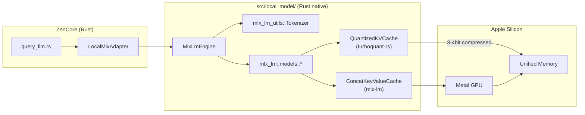
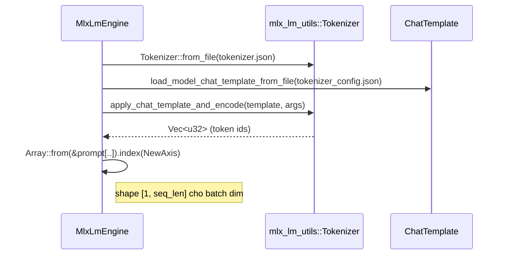
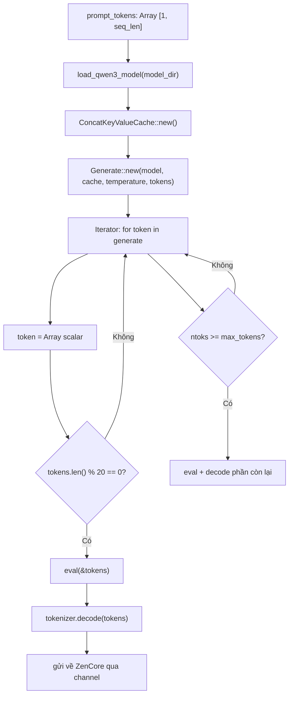
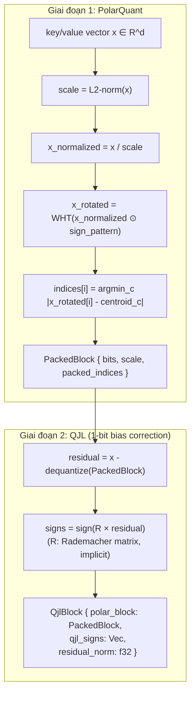
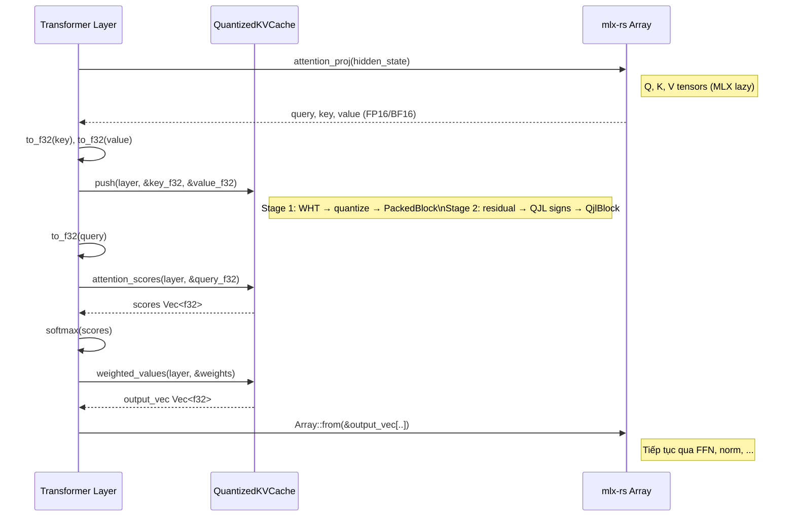
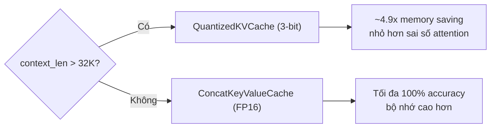

# Native Rust Inference: mlx-rs + turboquant-rs

Tài liệu này mô tả chi tiết luồng kỹ thuật khi dùng `mlx-rs` và `turboquant-rs` để xây dựng
runtime inference LLM native trong Rust cho SenClaw — thay thế Python sidecar ở giai đoạn sau.
Tài liệu bổ sung cho `docs/local-gemma-mlx-runtime.md`, tập trung vào internals của hai crate.

## Bức Tranh Tổng Quan



Hướng này không cần Python runtime. Toàn bộ inference chạy trong process Rust của SenClaw daemon.

## Hai Crate Chính

### mlx-rs (v0.25.3)

[`mlx-rs`](https://crates.io/crates/mlx-rs) là Rust binding cho Apple MLX framework, maintain bởi OxideAI.

Đặc điểm cốt lõi:

| Tính năng | Mô tả |
| --- | --- |
| Lazy evaluation | Array chỉ materialized khi gọi `eval()` |
| Dynamic graphs | Không cần recompile khi đổi shape |
| Unified memory | CPU và GPU dùng chung bộ nhớ, không copy |
| Metal GPU | Compute chạy trên GPU Apple qua Metal |
| MSRV | Rust 1.82.0+ |

Kèm theo là các sub-crate thực tế hơn để inference LLM:

- `mlx-lm` — model loading, generation loop, KV-cache cho Mistral/Qwen3/Gemma.
- `mlx-lm-utils` — tokenizer, chat template, conversation encoding.

Cargo.toml:

```toml
[dependencies]
mlx-rs   = { version = "0.25.3", features = ["metal", "accelerate"] }
mlx-lm   = "0.25"           # companion inference crate (cùng repo)
mlx-lm-utils = "0.25"       # tokenizer helpers
```

### turboquant-rs (v0.4.1)

[`turboquant-rs`](https://crates.io/crates/turboquant-rs) implement thuật toán TurboQuant
(Zandieh et al., ICLR 2026) để nén KV-cache xuống 3-4 bit mà không mất độ chính xác.

Đây là **nén KV-cache runtime**, không phải nén weight model:

| Thứ | Nén bằng gì | Khi nào |
| --- | --- | --- |
| Model weight | MLX 4-bit (safetensors) | Lúc tải model |
| KV-cache | turboquant-rs 3-4 bit | Lúc inference, sau mỗi token |

Cargo.toml:

```toml
[dependencies]
turboquant-rs = "0.4.1"
```

## Luồng mlx-rs: Inference Native

### Khởi Tạo Model

```rust
use std::path::Path;
use mlx_lm::{cache::ConcatKeyValueCache, models::qwen3::load_qwen3_model};
use mlx_lm_utils::tokenizer::{Tokenizer, Conversation, Role, load_model_chat_template_from_file};
use mlx_rs::{ops::indexing::{IndexOp, NewAxis}, transforms::eval, Array};

pub struct MlxLmEngine {
    model_dir: PathBuf,
    model_id: String,
}

impl MlxLmEngine {
    pub fn new(model_dir: &Path, model_id: &str) -> Self {
        Self {
            model_dir: model_dir.to_path_buf(),
            model_id: model_id.to_owned(),
        }
    }
}
```

### Tokenize Prompt



Code:

```rust
let tokenizer_file = self.model_dir.join("tokenizer.json");
let tokenizer_config = self.model_dir.join("tokenizer_config.json");
let mut tokenizer = Tokenizer::from_file(tokenizer_file)?;
let template = load_model_chat_template_from_file(tokenizer_config)?
    .expect("chat template not found");

let conversations = vec![Conversation { role: Role::User, content: prompt }];
let args = ApplyChatTemplateArgs {
    conversations: vec![conversations.into()],
    model_id: &self.model_id,
    add_generation_prompt: Some(true),
    ..Default::default()
};
let encodings = tokenizer.apply_chat_template_and_encode(template, args)?;
let ids: Vec<u32> = encodings.iter()
    .flat_map(|e| e.get_ids())
    .copied()
    .collect();
let prompt_tokens = Array::from(&ids[..]).index(NewAxis); // [1, seq_len]
```

### Generation Loop



Code:

```rust
let mut cache = Vec::new();
let mut model = load_qwen3_model(&self.model_dir)?;
let generate = mlx_lm::models::qwen3::Generate::<f32>::new(
    &mut model,
    &mut cache,
    0.7,          // temperature
    &prompt_tokens,
);

let mut tokens: Vec<Array> = Vec::new();
let mut collected: Vec<u32> = Vec::new();

for (token, ntoks) in generate.zip(0..max_tokens) {
    let token = token?;
    tokens.push(token);

    // Flush batch mỗi 20 token — tránh lazy graph quá lớn
    if ntoks == 0 || tokens.len() % 20 == 0 {
        eval(&tokens)?;
        let slice: Vec<u32> = tokens.drain(..).map(|t| t.item::<u32>()).collect();
        let text = tokenizer.decode(&slice, true)?;
        collected.extend_from_slice(&slice);
        // stream_tx.send(text)?;  // nếu dùng streaming callback
    }
}
// Flush cuối
eval(&tokens)?;
let slice: Vec<u32> = tokens.drain(..).map(|t| t.item::<u32>()).collect();
let final_text = tokenizer.decode(&slice, true)?;
```

Điểm quan trọng:
- `eval()` materializes lazy graph — nên gọi định kỳ (mỗi 20 token) để tránh OOM.
- `ConcatKeyValueCache` là KV-cache chuẩn của `mlx-lm`, dùng Apple unified memory.
- Generation là `Iterator`, có thể zip với max-token limit và early-stop.

## Luồng turboquant-rs: KV-Cache Compression

### Vấn Đề TurboQuant Giải Quyết

Khi context dài (32K+ token), KV-cache chiếm nhiều RAM:

```
FP16 KV-cache = 2 × seq_len × num_heads × head_dim × num_layers × 2 bytes
Ví dụ Gemma 4 E4B: 32 layers × 8 heads × 128 dim × 32K tokens × 2 = ~4 GB chỉ cho cache
```

TurboQuant nén mỗi key/value vector từ FP16 xuống 3-4 bit với sai số rất nhỏ.

### Thuật Toán TURBOQUANTprod (2 giai đoạn)



- **WHT** (Walsh-Hadamard Transform): O(d log d), biến dữ liệu thành phân phối xấp xỉ đồng đều trước quantize.
- **sign_pattern**: vector ngẫu nhiên ±1, deterministic theo seed — đảm bảo rotation là orthogonal.
- **Lloyd-Max codebook**: pre-computed table cho bit width 2/3/4 — không cần calibration data.
- **QJL**: 1-bit "bias correction" bằng Johnson-Lindenstrauss projection — làm unbiased inner product estimate.

### Luồng Inner Product (Query × Key)

Thay vì dequantize key rồi tính dot product:

```
<query, key>_exact = query^T × dequantize(key)   [tốn mem, chậm]
```

TurboQuant tính approximate:

```
<query, key>_est = <query, deq_polar(key)>        // từ PolarQuant
                  + c × <R×query, qjl_signs(key)>  // từ QJL correction
E[<query, key>_est] = <query, key>                // unbiased
```

### API turboquant-rs

**Cấu hình:**

```rust
use turboquant::packed::TurboQuantConfig;

let config = TurboQuantConfig {
    bits: 3,        // 2, 3, hoặc 4 bit per value
    dim: 128,       // head_dim của model
};
```

**Tạo cache và push:**

```rust
use turboquant::attention::QuantizedKVCache;

let mut kv_cache = QuantizedKVCache::new(
    config,
    num_layers,   // số transformer layer
    42,           // qjl_seed (Rademacher matrix seed)
);

// Prefill (batch): hiệu quả hơn loop
kv_cache.push_batch(layer_idx, &keys_batch, &values_batch)?;
// keys_batch: &[&[f32]], mỗi slice dài = head_dim

// Decode (từng token):
kv_cache.push(layer_idx, &key_vec, &value_vec)?;
```

**Attention scores cho query:**

```rust
// Trả về Vec<f32> — approximate inner products với tất cả stored keys
let scores: Vec<f32> = kv_cache.attention_scores(layer_idx, &query_vec)?;

// Softmax + weighted sum values
let weights = softmax(&scores);
let output: Vec<f32> = kv_cache.weighted_values(layer_idx, &weights)?;
```

**Đo tiết kiệm memory:**

```rust
let compressed = kv_cache.memory_usage();       // bytes thực tế
let fp16_equiv = kv_cache.fp16_equivalent_memory(); // bytes nếu FP16
let ratio = fp16_equiv as f64 / compressed as f64;
// 3-bit ≈ 4.9x, 4-bit ≈ 3.5x
```

### Luồng Đầy Đủ Một Transformer Layer (Pseudocode)



## Tích Hợp Vào SenClaw

### Module Structure

```text
src/local_model/
├── mod.rs           # pub mod, trait LocalModelRuntime
├── runtime.rs       # RuntimeEndpoint, RuntimeHealth, RuntimeStatus enum
├── mlx_lm.rs        # MlxLmSidecar (Phase 2 — Python sidecar manager)
├── mlx_native.rs    # MlxNativeEngine (Phase 3 — mlx-rs native)
└── models.rs        # KNOWN_MODELS registry
```

### Trait Chung

```rust
pub trait LocalModelRuntime: Send + Sync {
    async fn ensure_installed(&self) -> anyhow::Result<()>;
    async fn start(&self, model: &str) -> anyhow::Result<RuntimeEndpoint>;
    async fn stop(&self) -> anyhow::Result<()>;
    async fn health(&self) -> anyhow::Result<RuntimeHealth>;

    // Optional: streaming inference cho native runtime
    fn supports_native_stream(&self) -> bool { false }
    async fn generate_stream(
        &self,
        messages: &[ChatMessage],
        tx: tokio::sync::mpsc::Sender<String>,
    ) -> anyhow::Result<()>;
}
```

### MlxNativeEngine (Phase 3)

```rust
pub struct MlxNativeEngine {
    model_dir: PathBuf,
    model_id: String,
    /// None = dùng ConcatKeyValueCache bình thường
    /// Some(bits) = dùng QuantizedKVCache với turboquant-rs
    kv_cache_bits: Option<u8>,
}

impl MlxNativeEngine {
    pub fn new(model_dir: &Path, model_id: &str, kv_cache_bits: Option<u8>) -> Self { ... }
}
```

Khi `kv_cache_bits = Some(3)`, engine thay `ConcatKeyValueCache` bằng `QuantizedKVCache`:

```rust
match self.kv_cache_bits {
    None => {
        let mut cache = Vec::new(); // ConcatKeyValueCache
        // dùng mlx-lm generate loop bình thường
    }
    Some(bits) => {
        let tq_config = TurboQuantConfig { bits, dim: model_head_dim };
        let mut kv_cache = QuantizedKVCache::new(tq_config, model_num_layers, 0xdeadbeef);
        // custom generation loop gọi kv_cache.push + attention_scores
    }
}
```

### Wiring Vào Daemon (`src/lib.rs`)

```rust
// Sau Phase 3 thêm vào run_daemon():
let local_engine = Arc::new(local_model::MlxNativeEngine::new(
    &cfg.paths.local_models_dir.join("mlx"),
    "mlx-community/gemma-4-e4b-it-4bit",
    Some(3), // 3-bit KV-cache
));
agent_pool.set_local_runtime(Arc::clone(&local_engine) as Arc<dyn LocalModelRuntime>);
```

`ZenCore` chọn runtime theo `provider = "local-mlx-native"` trong LLM config.

## So Sánh Sidecar vs Native

| Tiêu chí | Python sidecar (`mlx_lm.server`) | Native (`mlx-rs` + `mlx-lm` crate) |
| --- | --- | --- |
| Độ phức tạp triển khai | Thấp — chỉ cần Python 3.10-3.13 | Cao — build MLX C++ bindings |
| Phụ thuộc Python | Có | Không |
| Thời gian startup | 5-15 giây (Python import) | < 1 giây |
| Tool calling | Qua OpenAI JSON format | Tự xử lý trong Rust |
| KV-cache control | Không thể can thiệp | Có thể swap bằng turboquant |
| Cross-platform | macOS only (mlx) | macOS only (mlx-rs cũng vậy) |
| Model support | Tất cả mlx-lm hỗ trợ | Chỉ model đã port vào mlx-lm Rust |
| Streaming | SSE qua HTTP | Trực tiếp qua Rust channel |
| Debug | Khó (process riêng) | Dễ (same process, tracing!) |

## Khi Nào Dùng turboquant-rs

turboquant-rs mang lại lợi ích rõ nhất khi:

- **Context >= 32K token**: KV-cache FP16 vượt 2-4 GB.
- **Multi-agent dispatch**: nhiều sub-agent chạy song song, mỗi agent giữ KV-cache riêng.
- **Máy 16GB RAM**: cần headroom cho model weight + KV-cache + app.

Với context ngắn (< 8K token), overhead quantize/dequantize không đáng nên dùng `ConcatKeyValueCache` bình thường.



## Lộ Trình Chi Tiết

### Phase 2: mlx-lm crate (ưu tiên)

1. Thêm `mlx-rs`, `mlx-lm`, `mlx-lm-utils` vào `Cargo.toml` với feature flag `local-mlx`.
2. Viết `MlxNativeEngine::generate()` dùng `ConcatKeyValueCache`.
3. Wiring vào `LocalModelRuntime` trait.
4. Test với `mlx-community/Qwen3-4B-bf16` trước (BF16 dễ debug hơn 4-bit).
5. Thêm model `mlx-community/gemma-4-e4b-it-4bit`.

### Phase 3: turboquant-rs KV-cache

1. Thêm `turboquant-rs = "0.4.1"` vào Cargo.toml.
2. Custom generation loop tách K/V ra khỏi `ConcatKeyValueCache`, đưa vào `QuantizedKVCache`.
3. Benchmark memory usage với `kv_cache.memory_usage()` vs `fp16_equivalent_memory()`.
4. Đo TTFT (time-to-first-token) và throughput, so sánh với sidecar.
5. Thêm config option `kv_cache_bits: Option<u8>` vào LLM profile.

### Dependency Cargo.toml (feature-gated)

```toml
[features]
default = []
local-mlx = ["dep:mlx-rs", "dep:mlx-lm", "dep:mlx-lm-utils", "dep:turboquant-rs"]

[dependencies]
mlx-rs       = { version = "0.25.3", features = ["metal","accelerate"], optional = true }
mlx-lm       = { version = "0.25", optional = true }
mlx-lm-utils = { version = "0.25", optional = true }
turboquant-rs = { version = "0.4.1", optional = true }
```

Feature-gate tránh breaking build trên Linux/Windows.

## Rủi Ro Kỹ Thuật

| Rủi ro | Mức độ | Giải pháp |
| --- | --- | --- |
| `mlx-rs` chưa expose đủ API cho custom attention loop | Cao | Dùng mlx-lm `ConcatKeyValueCache` trước, custom sau |
| turboquant-rs CUDA path không relevant trên Mac | N/A | Chỉ dùng CPU path (default, không cần CUDA feature) |
| mlx-rs build phức tạp (link MLX C++ lib) | Trung bình | CI riêng cho `local-mlx` feature |
| Gemma 4 chưa được port sang mlx-lm Rust | Cao | Dùng Qwen3 trước, theo dõi mlx-rs repo |
| Sai số attention từ turboquant ảnh hưởng tool calling | Thấp | Chỉ bật ở 4-bit (MSE 0.009), fallback nếu detect instability |
| `eval()` call pattern gây latency đột biến | Trung bình | Tune batch size (hiện 20 token/batch) |

## Tham Khảo

- TurboQuant paper: [Zandieh et al., ICLR 2026](https://github.com/SaschaOnTour/turboquant)
- `turboquant-rs` docs: <https://docs.rs/turboquant-rs/latest/turboquant/>
- `mlx-rs` crate: <https://crates.io/crates/mlx-rs> (OxideAI/oxideai)
- `mlx-rs` LM example: [examples/lm/src/main.rs](https://github.com/oxideai/mlx-rs/blob/main/examples/lm/src/main.rs)
- Tài liệu gốc: `docs/local-gemma-mlx-runtime.md`
