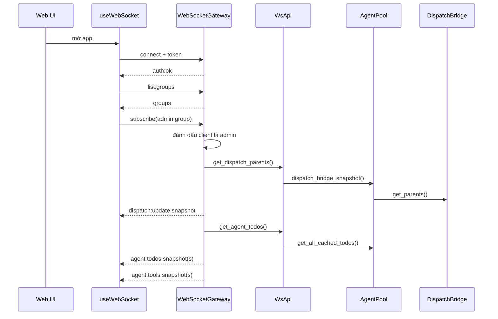
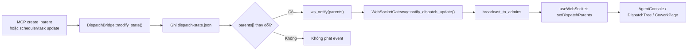
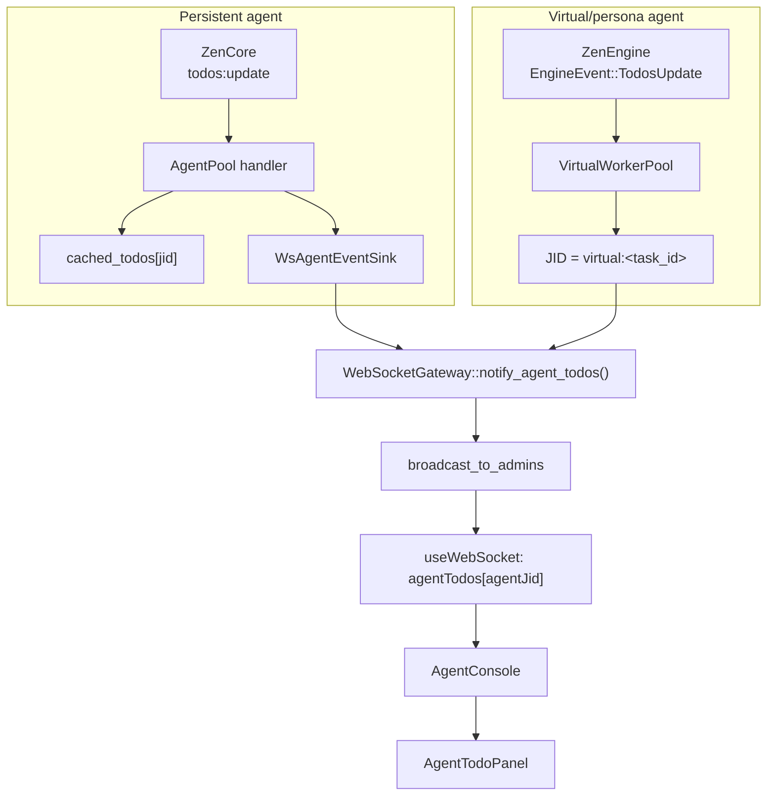
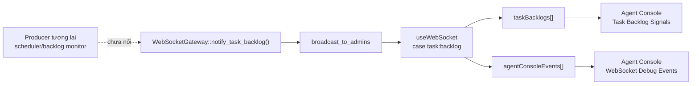
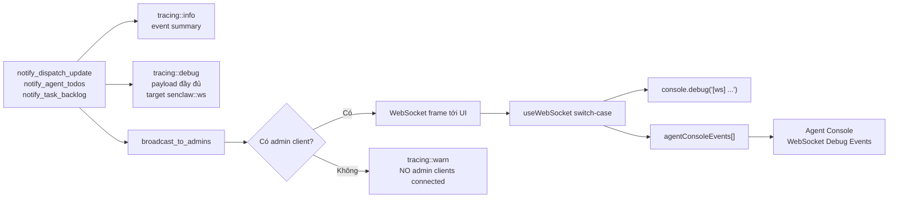
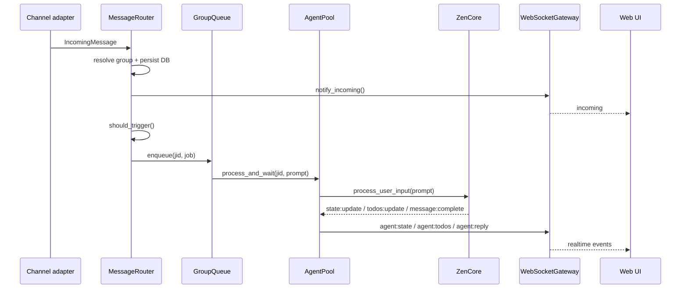
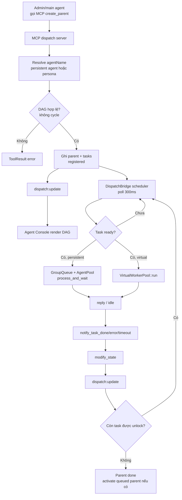
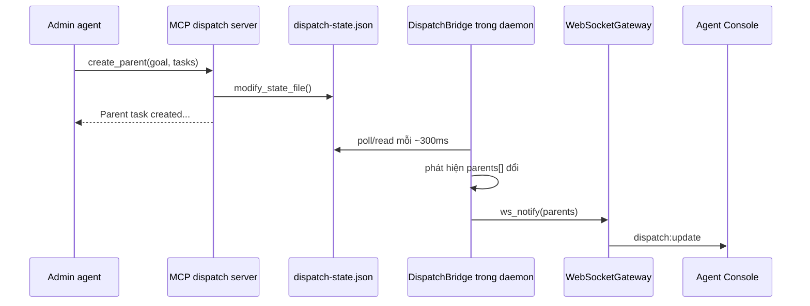

# Luồng notify dispatch và agent todos

Tài liệu này mô tả các event WebSocket liên quan đến Agent Console:
`dispatch:update`, `agent:todos`, `task:backlog`; cách backend sinh event, cách UI nhận/render,
và cách chúng tham gia vào luồng chat thường cùng luồng DAG team.

## Tổng Quan

Web UI dùng một WebSocket duy nhất trong `web/src/hooks/useWebSocket.ts`.
Sau khi auth thành công, hook gọi `list:groups`, `list:channels`, `list:agents`, `list:bindings`.
Khi danh sách group trả về, UI tự động subscribe các admin group. Ở backend, một client được xem là
admin khi `subscribe` vào group có `is_admin = true`; từ đó client mới nhận các broadcast admin như
`dispatch:update`, `agent:todos`, và `task:backlog`.

Khi subscribe vào admin group, gateway đẩy snapshot hiện tại trước khi cho client nghe update live:

1. `dispatch:update` với toàn bộ `parents` hiện có từ `DispatchBridge`.
2. Một `agent:todos` cho mỗi agent có todos cache trong `AgentPool`.
3. Một `agent:tools` cho mỗi agent có tool roster cache.

Sau snapshot, các thay đổi tiếp theo được broadcast live qua `broadcast_to_admins`.



## Event `dispatch:update`

Payload:

```json
{
  "type": "dispatch:update",
  "parents": [
    {
      "id": "p-1",
      "goal": "Mục tiêu parent",
      "adminFolder": "admin",
      "sharedWorkspace": "/path/to/workspace",
      "status": "active",
      "createdAt": "...",
      "completedAt": null,
      "tasks": [
        {
          "id": "d-2",
          "label": "backend",
          "agentId": "web-backend",
          "agentJid": "telegram:...",
          "dependsOn": [],
          "prompt": "...",
          "status": "processing",
          "result": null,
          "createdAt": "...",
          "startedAt": "...",
          "timeoutAt": "...",
          "completedAt": null,
          "isVirtual": false,
          "personaName": null
        }
      ]
    }
  ]
}
```

Nguồn sự thật là file state của `DispatchBridge` (`~/.senclaw/dispatch-state.json` theo config).
Mọi thay đổi vào `parents[]` đi qua `DispatchBridge::modify_state()` sẽ serialize snapshot mới và gọi
callback `ws_notify`. Trong daemon, `lib.rs` wire callback này tới `WebSocketGateway::notify_dispatch_update()`,
nên mỗi mutation của parent/task được đẩy ra admin UI.



Các mutation chính:

- Tạo parent dispatch: MCP dispatch server resolve agent name sang persistent agent hoặc persona, kiểm tra
  DAG cycle, tạo parent `active` hoặc `queued`, và tạo các task `registered`.
- Scheduler trong `DispatchBridge::process_pending()` poll mỗi 300ms, quét timeout, rồi start các task
  `registered` đã thỏa dependency và concurrency.
- Khi task bắt đầu, task chuyển sang `processing`, có `startedAt` và `timeoutAt`.
- Khi agent trả lời xong, `AgentPool` gọi `DispatchBridge::notify_task_done()`; khi lỗi/timeout thì gọi
  `notify_task_error()` hoặc mark timeout. Parent chuyển `done` khi mọi task đều terminal.
- Khi parent active xong, bridge kích hoạt parent `queued` cũ nhất của cùng `adminFolder`.
- Nếu MCP stdio process sửa state file bên ngoài daemon, `process_pending()` so sánh snapshot cũ/mới và
  vẫn phát `dispatch:update` để UI không phải polling.

UI nhận trong `useWebSocket.ts`:

- `setDispatchParents(msg.parents ?? [])`.
- Nếu một task vừa chuyển sang terminal (`done`, `error`, `timeout`), UI xóa todos của `task.agentJid`
  để Agent Console không giữ todo cũ của sub-agent.
- `AppLayout` truyền `dispatchParents` vào `AgentConsole`; `DispatchTree` render parent active/queued,
  tính level theo `dependsOn`, vẽ đường nối DAG, hiển thị status từng task.
- `ChatPage` thấy có dispatch active/queued thì gọi `subscribeAll()` để UI nghe được message của các
  child agent trong quá trình DAG team chạy.
- `CoworkPage` lọc `dispatchParents` theo `sharedWorkspace` của workspace đang chọn và hiển thị trong tab
  `Active Workflow`.

## Event `agent:todos`

Payload:

```json
{
  "type": "agent:todos",
  "agentJid": "telegram:...",
  "agentName": "web-backend",
  "todos": [
    {
      "content": "Đọc task",
      "status": "in_progress",
      "activeForm": "Đang đọc file"
    }
  ]
}
```

Có hai nguồn sinh live:

- Persistent agent: `ZenCore` phát `todos:update` khi agent dùng TodoWrite. `AgentPool` nhận event,
  chuyển thành `TodoSnapshot`, lưu vào `cached_todos`, rồi gọi `AgentEventSink::notify_agent_todos()`.
  `WsAgentEventSink` serialize payload và gọi `WebSocketGateway::notify_agent_todos()`.
- Virtual/persona agent: `VirtualWorkerPool` tạo core tạm thời cho task persona. Khi core phát
  `EngineEvent::TodosUpdate`, pool wrap JID thành `virtual:<task_id>`, tên agent thành `persona.name`,
  rồi gọi callback `todos_notify` đã được daemon wire tới gateway.



Snapshot khi admin subscribe chỉ lấy từ `AgentPool::get_all_cached_todos()`, nên hiện tại chỉ đảm bảo replay
todos của persistent agents. Todos của virtual agents được phát live qua `virtual:<task_id>` nhưng không
đi qua cache của `AgentPool`.

UI nhận trong `useWebSocket.ts`:

- Lưu vào `agentTodos[agentJid] = { agentName, todos }`.
- Nếu tất cả todo có status `completed`, UI hẹn 3 giây rồi xóa entry để người dùng kịp thấy trạng thái done.
- Nếu `dispatch:update` báo task persistent vừa terminal, UI xóa todos theo `task.agentJid`.
- `AgentConsole` hiển thị section `Agent Todos`; `AgentTodoPanel` gom theo JID, lấy tên agent, tính done/total,
  hiển thị progress nhỏ và từng item với `pending`, `in_progress`, `completed`.

Lưu ý: task virtual có `agentJid` rỗng trong dispatch task, còn todos live lại dùng key `virtual:<task_id>`.
Vì vậy việc clear theo terminal task từ `dispatch:update` chỉ áp dụng trực tiếp cho persistent agent; virtual
todos phụ thuộc vào event completed và timer 3 giây của UI.

## Event `task:backlog`

Payload backend đã định nghĩa:

```json
{
  "type": "task:backlog",
  "taskId": "task-id",
  "chatJid": "admin-or-group-jid",
  "prompt": "...",
  "intervalMs": 60000,
  "overdueMs": 30000,
  "suggestedIntervalMs": 90000
}
```

Trạng thái hiện tại: `WebSocketGateway::notify_task_backlog()` đã tồn tại và broadcast tới admin clients.
UI đã có handler trong `web/src/hooks/useWebSocket.ts`: event được lưu vào `taskBacklogs`, đồng thời đẩy
một dòng vào `agentConsoleEvents` để Agent Console hiển thị ở khu `Task Backlog Signals` và
`WebSocket Debug Events`.

Điểm còn thiếu là producer backend: trong repo hiện chưa có call site nào gọi `notify_task_backlog(...)`.
Vì vậy event này đã có đường truyền backend-gateway-UI, nhưng chưa có nơi thật sự sinh backlog signal.



Để hoàn thiện phần sinh backlog, cần:

1. Nối producer backend, ví dụ scheduler hoặc backlog monitor gọi `notify_task_backlog(...)`.
2. Xác định policy khi nào một task bị coi là backlog/overdue.
3. Nếu cần action từ UI, thêm nút xử lý backlog ở Agent Console hoặc trang cowork/scheduler phù hợp.

## Debug Và Observability

Hiện luồng debug được thêm ở cả backend và frontend để biết chính xác event đã sinh, đã broadcast,
và đã đến Agent Console hay chưa.



Backend log:

- `dispatch:update`: log số parent và số task trước khi broadcast.
- `agent:todos`: log `agent_jid`, `agent_name`, số todo và số todo completed.
- `task:backlog`: log `task_id`, `chat_jid`, `prompt_len`, `interval_ms`, `overdue_ms`,
  `suggested_interval_ms`.
- `broadcast_to_admins`: log `type`, số client đã gửi, tổng client; warn nếu event quan trọng đã sinh
  nhưng không có admin client nào đang nhận.

Frontend debug:

- `useWebSocket.ts` gọi `console.debug('[ws] dispatch:update', ...)`,
  `console.debug('[ws] agent:todos', ...)`, và `console.debug('[ws] task:backlog', ...)`.
- Cùng lúc đó hook đẩy một entry vào `agentConsoleEvents[]`; `AgentConsole` render section
  `WebSocket Debug Events`, nên có thể kiểm tra ngay trong UI thay vì chỉ mở browser console.
- Với `task:backlog`, hook còn lưu `taskBacklogs[]`; Agent Console render section
  `Task Backlog Signals`.

Khi không thấy thông tin trên Agent Console, checklist debug nhanh là:

1. Backend có log `emit dispatch:update` / `emit agent:todos` / `emit task:backlog` không.
2. Backend có warn `NO admin clients connected` không. Nếu có, UI chưa subscribe vào group `is_admin`.
3. Browser console có log `[ws] ...` không. Nếu có backend phát và UI nhận rồi.
4. Section `WebSocket Debug Events` có entry không. Nếu không có, kiểm tra `useWebSocket` có đang được
   mount qua `AppLayout` không.

## Khi Chat Chạy

Có hai đường vào chính.



Với message từ channel adapter:

1. Adapter tạo `IncomingMessage` và đưa vào `MessageRouter`.
2. Router resolve group/binding, tự động tạo app group nếu cần, rồi persist message vào DB.
3. Router gọi `WebSocketGateway::notify_incoming()` để client đang subscribe group thấy message realtime.
4. Router kiểm tra trigger. Nếu không trigger thì dừng sau khi đã persist và notify incoming.
5. Nếu là admin command thì `command_dispatcher` xử lý và agent API broadcast reply.
6. Nếu cần agent xử lý, router update `last_active`, build prompt từ history, đưa job vào `GroupQueue`
   theo `jid` để đảm bảo FIFO mỗi group.
7. Job gọi `AgentPool::process_and_wait()`.

Với message từ Web UI:

1. `ChatView` gọi `ws.sendMessage(jid, text)`.
2. `useWebSocket` thêm local optimistic user message và gửi frame `{ type: "message", groupJid, text }`.
3. Backend `handle_message_send()` validate, xử lý admin command nếu có, persist message web vào DB,
   rồi gọi `state.api.enqueue_and_process(...)`.
4. Phần sau quay về cùng đường `AgentPool::process_and_wait()`.

Trong khi agent chạy, `AgentPool` lắng nghe các event core:

- `message:complete`: lấy reply của main agent, gửi ra channel nếu có `send_reply`, đồng thời đẩy `agent:reply`
  qua WebSocket sink để UI thêm bubble agent.
- `state:update`: đẩy `agent:state`; UI dùng để hiển thị Thinking/Paused/Ready và điều khiển nút pause/resume.
- `todos:update`: cập nhật `agent:todos` như mô tả ở trên.
- permission/question events: đẩy card cần user approve/answer.

Nếu chat đang là một dispatch child task, daemon đã set `dispatch_executing` và map `jid -> task_id` trước khi
enqueue. Khi child agent về `idle`, `AgentPool` lấy reply cuối và gọi `DispatchBridge::notify_task_done(task_id, reply)`.
Mutation này lại sinh `dispatch:update`, làm Agent Console cập nhật DAG.

## DAG Team Trong Luồng

DAG team bắt đầu từ admin/main agent khi nó dùng MCP dispatch tools:



1. `create_parent(goal, tasks, timeoutSeconds)` tạo parent và danh sách task. Mỗi task có `label`,
   `agentName`, `prompt`, `dependsOn`. Server resolve `agentName` sang persistent agent từ `agents[]`
   hoặc virtual persona từ config, rồi kiểm tra cycle.
2. Parent được ghi vào state file. Nếu admin chưa có parent active thì status `active`; nếu đã có thì `queued`.
3. Daemon bridge detect state thay đổi và phát `dispatch:update`.
4. Scheduler trong daemon chỉ start task khi:
   - parent là `active`;
   - admin không bị pause;
   - mọi dependency trong `dependsOn` đã terminal;
   - persistent agent JID không có task đang chạy, hoặc persona chưa vượt `max_concurrent`.
5. Persistent task: bridge build augmented prompt, set workspace override, map `jid -> task_id`, mark
   `dispatch_executing`, enqueue vào `GroupQueue`, rồi agent chạy như chat thường.
6. Virtual task: bridge gọi `VirtualWorkerPool::run()` với persona, workspace và timeout. Pool tạo core tạm,
   inject tools/MCP extra, forward todos với JID `virtual:<task_id>`, đợi idle, rồi trả result.
7. Task done/error/timeout cập nhật state, phát `dispatch:update`, gọi lifecycle callback cho CoworkManager,
   và kích hoạt các task mới vừa đủ dependency.
8. `dispatch_task(parentId, taskLabel)` trong MCP server không trực tiếp chạy agent; nó poll state file và
   trả kết quả khi task thành `done`, hoặc trả lỗi nếu `error`/`timeout`.

Kết quả là admin UI thấy được DAG ngay từ lúc parent/task được tạo, thấy task chuyển
`registered -> processing -> done/error/timeout`, thấy todos live của từng agent, và vẫn có chat
transcript riêng nếu UI đã subscribe vào group của child agent.

## MCP Server Có Broadcast Không?

Với `dispatch:update`, MCP dispatch server không broadcast WebSocket trực tiếp.
MCP server chạy như một server/tool process độc lập và không giữ handle tới `WebSocketGateway`.
Nó chỉ đọc/ghi file state chung bằng `modify_state_file()`.



Điểm quan trọng:

- `src/mcp/dispatch_server.rs` ghi state file và log `[McpDispatchServer] wrote dispatch state ...`.
- `src/agent/dispatch_bridge/locks.rs` ghi rõ `modify_state_file()` không fire WS notify, vì MCP server
  không chạm được in-memory bridge/gateway của daemon.
- `src/agent/dispatch_bridge/bridge.rs::process_pending()` là cầu nối: nó phát hiện external file mutation,
  log `External state change detected ...`, rồi gọi `ws_notify`.
- `src/lib.rs` wire `ws_notify` thành `gw.notify_dispatch_update(&parents)`.
- `src/gateway/websocket_gateway/notify.rs` mới là nơi tạo payload WebSocket và gọi `broadcast_to_admins`.

Vì vậy nếu parent được tạo từ MCP mà Agent Console không thấy:

1. Tìm log `[McpDispatchServer] wrote dispatch state`. Nếu không có, MCP tool chưa ghi được state file.
2. Tìm log `[DispatchBridge] External state change detected`. Nếu không có, daemon chưa đọc đúng state path,
   chưa chạy scheduler poll, hoặc `last_notified_parents_json` chưa thấy thay đổi.
3. Tìm log `[WsGateway] emit dispatch:update`. Nếu không có, `ws_notify` chưa được wire hoặc chưa được gọi.
4. Tìm log `[WsGateway] broadcast_to_admins type=dispatch:update sent=...`. Nếu `sent=0`, UI chưa subscribe
   vào admin group.

Với `agent:todos`, nguồn sinh không phải MCP dispatch server. Event này đi từ core runtime:

- Persistent agent: `ZenCore` phát `todos:update` -> `AgentPool` cache -> `WsAgentEventSink`
  -> `WebSocketGateway::notify_agent_todos()`.
- Virtual/persona agent: `ZenEngine` trong `VirtualWorkerPool` phát `EngineEvent::TodosUpdate`
  -> callback `todos_notify` -> `WebSocketGateway::notify_agent_todos()`.

Với `task:backlog`, hiện chưa có producer. Nếu sau này producer nằm trong một MCP server tách rời,
không nên gọi WebSocket trực tiếp từ MCP server; nên dùng cùng pattern state/queue chung hoặc gọi qua
daemon API nội bộ để daemon chính là nơi `broadcast_to_admins`.

## Các File Liên Quan

- Backend notify methods: `src/gateway/websocket_gateway/notify.rs`.
- Admin subscribe snapshot: `src/gateway/websocket_gateway/handlers.rs`.
- Daemon wiring: `src/lib.rs`.
- Dispatch state/scheduler: `src/agent/dispatch_bridge/bridge.rs`.
- Dispatch MCP tool: `src/mcp/dispatch_server.rs`.
- Persistent agent todos/reply/state bridge: `src/agent/agent_pool/pool.rs`.
- Virtual agent todos: `src/agent/virtual_worker_pool.rs`.
- WebSocket hook/state: `web/src/hooks/useWebSocket.ts`.
- Agent Console: `web/src/components/AgentConsole.tsx`, `web/src/components/DispatchTree.tsx`,
  `web/src/components/AgentTodoPanel.tsx`.
- Chat UI: `web/src/pages/ChatPage.tsx`, `web/src/components/ChatView.tsx`.
- Cowork workflow view: `web/src/pages/CoworkPage.tsx`.
