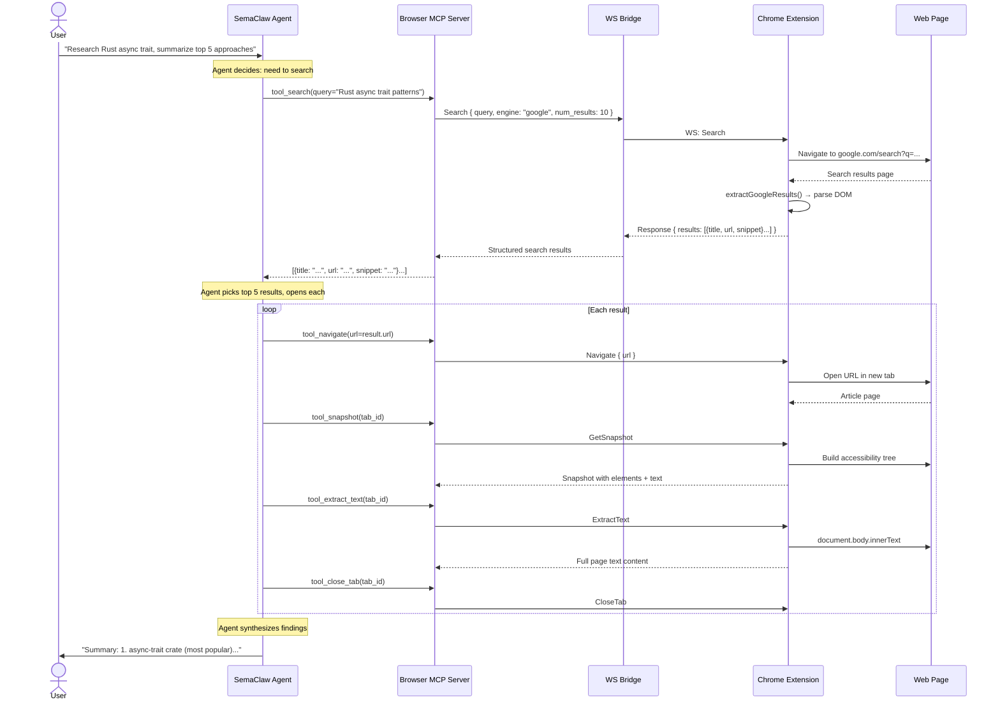

# SenClaw Extension — Thiết kế MCP Server Điều khiển Chrome Từ Xa

> Nghiên cứu từ [alibaba/page-agent](https://github.com/alibaba/page-agent) (17.5k stars, TypeScript, MIT)
>
> Mục tiêu: MCP server cho phép SemaClaw agent điều khiển Chrome từ xa để tìm kiếm, nghiên cứu, kiểm tra và tổng hợp thông tin từ website.

---

## 1. Tổng quan

### 1.1. Bài toán

SemaClaw agent cần khả năng:
- **Tìm kiếm & nghiên cứu**: Search Google, duyệt kết quả, đọc nội dung
- **Deep crawl**: Đi sâu vào nhiều trang từ một trang gốc, theo dõi liên kết
- **Kiểm tra thông tin**: Cross-reference thông tin giữa nhiều nguồn
- **Tổng hợp**: Trích xuất dữ liệu có cấu trúc từ website, tổng hợp thành báo cáo
- **Form filling**: Tự động điền form, đăng nhập, tương tác với web app

### 1.2. Giải pháp

**SenClaw Extension** = Chrome Extension (WXT + React) + MCP Server (Rust, tích hợp vào senclaw daemon)

```
┌─────────────────────────────────────────────────────────────────────────┐
│                        SenClaw Extension Architecture                    │
│                                                                         │
│  ┌──────────────────────┐          ┌──────────────────────────────┐    │
│  │   SemaClaw Agent     │          │   Chrome Browser             │    │
│  │                      │          │                              │    │
│  │  MCP Client          │  stdio   │  ┌────────────────────────┐ │    │
│  │  (sema-core)         │◄────────►│  │  SenClaw Extension     │ │    │
│  │                      │   MCP    │  │  (WXT + React)         │ │    │
│  │  Tools:              │ protocol │  │                        │ │    │
│  │  - browser_navigate  │          │  │  ┌──────────────────┐  │ │    │
│  │  - browser_search    │          │  │  │ Background SW    │  │ │    │
│  │  - browser_click     │          │  │  │ (TabsController) │  │ │    │
│  │  - browser_extract   │          │  │  └────────┬─────────┘  │ │    │
│  │  - browser_fill_form │          │  │           │             │ │    │
│  │  - browser_scroll    │          │  │  ┌────────▼─────────┐  │ │    │
│  │  - browser_execute_js│          │  │  │ Content Script   │  │ │    │
│  │  - browser_crawl     │          │  │  │ (PageController) │  │ │    │
│  │  - browser_snapshot  │          │  │  │ - DOM tree        │  │ │    │
│  │  - browser_screenshot│          │  │  │ - click/type      │  │ │    │
│  │  - browser_wait      │          │  │  │ - extract text    │  │ │    │
│  │  - browser_get_status│          │  │  │ - scroll          │  │ │    │
│  └──────────────────────┘          │  │  └──────────────────┘  │ │    │
│                                    │  └────────────────────────┘ │    │
│  ┌──────────────────────┐          │                              │    │
│  │   SemaClaw Web UI    │          │  Multi-tab control:          │    │
│  │                      │  WS      │  - Tab A: Google Search      │    │
│  │  Real-time preview:  │◄────────►│  - Tab B: Result page 1     │    │
│  │  - Screenshot stream │          │  - Tab C: Result page 2     │    │
│  │  - DOM snapshot      │          │  - Tab D: Data extraction    │    │
│  │  - Crawl progress    │          └──────────────────────────────┘    │
│  └──────────────────────┘                                              │
└─────────────────────────────────────────────────────────────────────────┘
```

### 1.3. So sánh với PageAgent

| Chiều | PageAgent | SenClaw Extension |
|-------|-----------|-------------------|
| **MCP Server** | Node.js, stdio, 3 tools | Rust, tích hợp vào daemon, 13+ tools |
| **Extension** | WXT + React, multi-page | WXT + React (tái sử dụng pattern) |
| **DOM Model** | Text-based (flattened DOM tree) | Text-based + optional screenshot |
| **LLM** | BYO LLM (agent tự think) | Agent là SemaClaw (qua MCP) |
| **Search** | Không có built-in | Tích hợp Google/Bing search |
| **Crawl** | Không có | Deep crawl với depth/breadth control |
| **Extract** | Thủ công qua execute_javascript | Structured extraction với schema |
| **Architecture** | Launcher page → Extension hub → MultiPageAgent | Daemon → MCP → Extension background → Content scripts |

---

## 2. Kiến trúc chi tiết

### 2.1. Component diagram

```
┌──────────────────────────────────────────────────────────────────────────┐
│                         SenClaw Daemon (Rust)                             │
│                                                                          │
│  ┌──────────────────────────────────────────────────────────────────┐   │
│  │                   browser_mcp_server                              │   │
│  │                                                                   │   │
│  │  ┌──────────┐  ┌──────────────┐  ┌─────────────┐                 │   │
│  │  │ MCP      │  │ Bridge       │  │ Task Queue  │                 │   │
│  │  │ Protocol │  │ (HTTP+WS)    │  │ (per-tab)   │                 │   │
│  │  │ Handler  │  │              │  │              │                 │   │
│  │  └────┬─────┘  └──────┬───────┘  └──────┬──────┘                 │   │
│  │       │               │                 │                         │   │
│  │       │         ┌─────▼─────┐     ┌─────▼─────┐                  │   │
│  │       │         │ WebSocket │     │ Scheduler │                  │   │
│  │       │         │ Server    │     │ (crawl)   │                  │   │
│  │       │         └─────┬─────┘     └─────┬─────┘                  │   │
│  │       │               │                 │                         │   │
│  └───────┼───────────────┼─────────────────┼─────────────────────────┘   │
│          │               │                 │                             │
│  ┌───────▼───────────────▼─────────────────▼─────────────────────────┐   │
│  │                      Shared State                                  │   │
│  │  • Tab registry (HashMap<TabId, TabState>)                        │   │
│  │  • Crawl jobs (HashMap<JobId, CrawlJob>)                          │   │
│  │  • Screenshot buffer (ring buffer per tab, last N frames)         │   │
│  │  • DOM snapshot cache (per tab, TTL 5s)                           │   │
│  └────────────────────────────────────────────────────────────────────┘   │
│                                                                          │
│  ┌──────────────────────────────────────────────────────────────────┐   │
│  │                   WebSocket Gateway (existing)                     │   │
│  │  • WS events: browser:tab:update, browser:crawl:progress          │   │
│  │  • WS events: browser:screenshot, browser:dom:snapshot            │   │
│  └──────────────────────────────────────────────────────────────────┘   │
└──────────────────────────────────────────────────────────────────────────┘
                                    │
                                    │ WebSocket (persistent)
                                    │
┌───────────────────────────────────▼──────────────────────────────────────┐
│                        Chrome Browser                                     │
│                                                                          │
│  ┌────────────────────────────────────────────────────────────────┐     │
│  │                 SenClaw Extension (WXT + React)                 │     │
│  │                                                                 │     │
│  │  ┌──────────────────┐  ┌──────────────────────────────────┐   │     │
│  │  │ Background SW     │  │ Side Panel (React)               │   │     │
│  │  │                   │  │                                  │   │     │
│  │  │ • WS client       │  │ • Tab list + status              │   │     │
│  │  │ • TabsController  │  │ • Task progress                  │   │     │
│  │  │ • CrawlCoordinator│  │ • Screenshot preview             │   │     │
│  │  │ • Message routing │  │ • Manual intervention            │   │     │
│  │  └────────┬─────────┘  └──────────────────────────────────┘   │     │
│  │           │                                                     │     │
│  │  ┌────────▼─────────────────────────────────────────────────┐  │     │
│  │  │              Content Scripts (per tab)                    │  │     │
│  │  │                                                           │  │     │
│  │  │  ┌─────────────────┐  ┌──────────────┐  ┌─────────────┐  │  │     │
│  │  │  │ DOM Extractor   │  │ Action       │  │ Screenshot   │  │  │     │
│  │  │  │ - flatten tree  │  │ Executor     │  │ Capture      │  │  │     │
│  │  │  │ - selector map  │  │ - click      │  │ - viewport   │  │  │     │
│  │  │  │ - text extract  │  │ - type       │  │ - full page  │  │  │     │
│  │  │  │ - link collect  │  │ - scroll     │  │ - element    │  │  │     │
│  │  │  └─────────────────┘  │ - select     │  └─────────────┘  │  │     │
│  │  │                       │ - upload     │                    │  │     │
│  │  │                       │ - execute JS │                    │  │     │
│  │  │                       └──────────────┘                    │  │     │
│  │  └───────────────────────────────────────────────────────────┘  │     │
│  └────────────────────────────────────────────────────────────────┘     │
└──────────────────────────────────────────────────────────────────────────┘
```

### 2.2. Rust MCP Server (tích hợp vào daemon)

#### Module structure

```
src/mcp/browser_server.rs          ← MCP server definition (tools)
src/browser/                        ← New module
├── mod.rs
├── bridge.rs                       ← HTTP + WebSocket bridge
├── tab_registry.rs                 ← Tab state management
├── crawl_engine.rs                 ← Deep crawl scheduler
├── protocol.rs                     ← WS message types (senclaw ↔ extension)
└── types.rs                        ← Shared types
```

#### MCP Tools

```rust
// src/mcp/browser_server.rs

impl BrowserMcpServer {
    fn register_tools(&self) -> Vec<McpTool> {
        vec![
            // ===== Navigation =====
            tool_navigate(),       // Mở URL trong tab mới hoặc tab hiện tại
            tool_new_tab(),        // Tạo tab trống mới
            tool_close_tab(),      // Đóng tab
            tool_list_tabs(),      // Liệt kê tất cả tab đang mở
            tool_switch_tab(),     // Chuyển tab active
            tool_go_back(),        // Quay lại trang trước
            tool_go_forward(),     // Tiến tới trang tiếp
            tool_reload(),         // Tải lại trang

            // ===== Tương tác trang =====
            tool_click(),          // Click vào element (theo index hoặc selector)
            tool_type(),           // Gõ text vào input
            tool_select_option(),  // Chọn option trong dropdown
            tool_scroll(),         // Cuộn trang
            tool_hover(),          // Hover vào element
            tool_press_key(),      // Nhấn phím (Enter, Escape, Arrow...)
            tool_upload_file(),    // Upload file
            tool_execute_js(),     // Chạy JavaScript trên trang
            tool_wait(),           // Đợi (thời gian hoặc element xuất hiện)

            // ===== Trích xuất thông tin =====
            tool_snapshot(),       // Chụp accessibility tree (text-based DOM)
            tool_screenshot(),     // Chụp ảnh màn hình (PNG/JPEG)
            tool_extract_text(),   // Trích xuất text từ element hoặc toàn trang
            tool_extract_links(),  // Thu thập tất cả link trên trang
            tool_extract_table(),  // Trích xuất bảng thành JSON/CSV
            tool_extract_structured(), // Trích xuất dữ liệu theo schema

            // ===== Search & Crawl =====
            tool_search(),         // Tìm kiếm Google/Bing và trả về kết quả
            tool_crawl(),          // Deep crawl: bắt đầu từ URL, theo link, depth N
            tool_crawl_status(),   // Kiểm tra trạng thái crawl job

            // ===== Form & Auth =====
            tool_fill_form(),      // Điền nhiều field cùng lúc
            tool_click_and_wait(), // Click và đợi navigation hoàn tất

            // ===== Session =====
            tool_get_status(),     // Trạng thái kết nối extension
            tool_stop_task(),      // Dừng task đang chạy
        ]
    }
}
```

#### Tool Definitions Chi Tiết

```rust
// ===== SEARCH TOOL =====
// Hỗ trợ Google và Bing search, parse kết quả có cấu trúc
tool_search {
    description: "Search on Google/Bing and return structured results.
                  Use this for research, fact-checking, finding documentation.",
    input: {
        query: String,              // "rust async trait example"
        engine: "google" | "bing", // default: google
        num_results: u8,            // default: 10, max: 30
        language: Option<String>,   // "en", "vi", "zh-CN"
        country: Option<String>,    // "us", "vn", "cn"
        safe_search: bool,          // default: true
    },
    output: {
        results: [
            {
                title: String,
                url: String,
                snippet: String,
                position: u8,
            }
        ],
        total_estimated: u64,
        search_url: String,
    }
}

// ===== CRAWL TOOL =====
// Deep crawl: mở trang, thu thập link, mở link tiếp theo pattern, depth N
tool_crawl {
    description: "Deep crawl starting from a URL. Follows links matching patterns
                  up to a configurable depth. Returns structured content from all
                  visited pages. Supports: same-domain only, path patterns,
                  max pages limit, per-page time budget.",
    input: {
        start_url: String,          // URL bắt đầu
        depth: u8,                  // default: 2, max: 5
        max_pages: u16,             // default: 50, max: 200
        link_patterns: Vec<String>, // regex patterns cho link cần follow
        exclude_patterns: Vec<String>, // regex patterns cho link bỏ qua
        same_domain: bool,          // default: true, chỉ crawl cùng domain
        extract_type: "text" | "html" | "structured", // loại nội dung cần trích xuất
        structured_schema: Option<Value>, // JSON schema để extract dữ liệu có cấu trúc
        per_page_timeout_ms: u32,   // default: 10000
        wait_between_pages_ms: u32, // default: 1000, polite crawling
    },
    output: {
        job_id: String,             // ID để poll status nếu async
        status: "running" | "completed",
        pages_crawled: u16,
        pages_total: u16,
        results: [
            {
                url: String,
                title: String,
                text_content: String,
                extracted_data: Option<Value>,
                links_found: u16,
                crawled_at: String,
            }
        ],
    }
}

// ===== SNAPSHOT TOOL =====
// Chụp accessibility tree (text-based DOM) — không cần screenshot
// Học từ PageAgent: flatten DOM tree + selector map
tool_snapshot {
    description: "Capture the accessibility snapshot of the current page.
                  Returns a structured text representation of all interactive
                  elements with their indices. Use this to understand what's
                  on the page before interacting.",
    input: {
        tab_id: Option<String>,     // tab cụ thể hoặc tab active
        depth: Option<u8>,          // độ sâu của tree, default: full
        include_hidden: bool,       // default: false
    },
    output: {
        url: String,
        title: String,
        elements: [
            {
                index: u32,         // dùng với tool_click(index)
                tag: String,        // "button", "a", "input", "select"
                role: String,       // accessibility role
                text: String,       // visible text / aria-label
                attributes: {       // href, placeholder, value, etc.
                    key: String,
                },
                bbox: {             // bounding box
                    x: u32, y: u32, width: u32, height: u32,
                },
                enabled: bool,
                selected: bool,
            }
        ],
        text_content_summary: String, // first 500 chars of visible text
    }
}

// ===== EXTRACT STRUCTURED TOOL =====
// Trích xuất dữ liệu có cấu trúc từ trang web theo schema
tool_extract_structured {
    description: "Extract structured data from the current page using a schema.
                  The LLM analyzes the DOM/text and maps it to the schema fields.
                  Useful for: product listings, article metadata, search results,
                  contact information, pricing tables.",
    input: {
        tab_id: Option<String>,
        schema: Value,              // JSON Schema mô tả cấu trúc cần extract
        // Ví dụ schema:
        // {
        //   "type": "array",
        //   "items": {
        //     "type": "object",
        //     "properties": {
        //       "title": {"type": "string"},
        //       "price": {"type": "string"},
        //       "url": {"type": "string"}
        //     }
        //   }
        // }
        selector: Option<String>,   // CSS selector giới hạn vùng extract
        max_items: Option<u16>,     // default: 100
    },
    output: {
        data: Value,                // Dữ liệu theo schema
        confidence: f32,            // 0.0 - 1.0
        source_url: String,
    }
}

// ===== FILL FORM TOOL =====
tool_fill_form {
    description: "Fill multiple form fields at once. Automatically finds
                  fields by label, placeholder, name, or CSS selector.",
    input: {
        tab_id: Option<String>,
        fields: [
            {
                target: String,     // "search input" hoặc "[name='email']"
                value: String,
                type: "text" | "checkbox" | "radio" | "select",
            }
        ],
        submit: bool,               // default: false, submit sau khi fill?
    },
}

// ===== EXECUTE JS TOOL =====
tool_execute_js {
    description: "Execute JavaScript on the page. Use for complex data
                  extraction, page manipulation, or bypassing limitations.
                  Returns the script's return value as JSON.",
    input: {
        tab_id: Option<String>,
        script: String,             // JavaScript code, supports async/await
        // Ví dụ: "return document.querySelectorAll('.product').length"
        // Ví dụ: "return JSON.parse(document.querySelector('#__NEXT_DATA__').textContent)"
    },
}

// ===== SCREENSHOT TOOL =====
tool_screenshot {
    description: "Take a screenshot of the page. Use for visual verification.",
    input: {
        tab_id: Option<String>,
        full_page: bool,            // default: false (viewport only)
        element_selector: Option<String>, // chụp element cụ thể
        format: "png" | "jpeg",     // default: png
        quality: Option<u8>,        // 1-100, cho JPEG
    },
}
```

### 2.3. Protocol: Daemon ↔ Extension (WebSocket)

```rust
// src/browser/protocol.rs

// === Daemon → Extension ===

#[derive(Serialize)]
#[serde(tag = "type")]
enum DaemonMessage {
    // Tab management
    Navigate {
        request_id: String,
        url: String,
        tab_id: Option<String>,    // None = create new tab
    },
    NewTab {
        request_id: String,
        url: Option<String>,       // None = blank tab
    },
    CloseTab {
        request_id: String,
        tab_id: String,
    },
    SwitchTab {
        request_id: String,
        tab_id: String,
    },
    GoBack { request_id: String, tab_id: Option<String> },
    GoForward { request_id: String, tab_id: Option<String> },
    Reload { request_id: String, tab_id: Option<String> },

    // DOM interaction
    Click {
        request_id: String,
        tab_id: Option<String>,
        index: u32,                // từ snapshot
    },
    Type {
        request_id: String,
        tab_id: Option<String>,
        index: u32,
        text: String,
        submit: bool,              // nhấn Enter sau khi gõ?
    },
    SelectOption {
        request_id: String,
        tab_id: Option<String>,
        index: u32,
        option_text: String,
    },
    Scroll {
        request_id: String,
        tab_id: Option<String>,
        direction: "down" | "up",
        amount: ScrollAmount,
    },
    Hover {
        request_id: String,
        tab_id: Option<String>,
        index: u32,
    },
    PressKey {
        request_id: String,
        tab_id: Option<String>,
        key: String,               // "Enter", "Escape", "ArrowDown", "a"
    },
    UploadFile {
        request_id: String,
        tab_id: Option<String>,
        index: u32,
        file_paths: Vec<String>,
    },
    ExecuteJs {
        request_id: String,
        tab_id: Option<String>,
        script: String,
    },
    Wait {
        request_id: String,
        tab_id: Option<String>,
        condition: WaitCondition,
    },

    // Observation
    GetSnapshot {
        request_id: String,
        tab_id: Option<String>,
        depth: Option<u8>,
    },
    GetScreenshot {
        request_id: String,
        tab_id: Option<String>,
        full_page: bool,
        format: String,
        quality: Option<u8>,
    },
    ExtractText {
        request_id: String,
        tab_id: Option<String>,
        selector: Option<String>,
    },
    ExtractLinks {
        request_id: String,
        tab_id: Option<String>,
        selector: Option<String>,
    },

    // Search
    Search {
        request_id: String,
        query: String,
        engine: String,
        num_results: u8,
        language: Option<String>,
    },

    // Crawl control
    CrawlStart {
        job_id: String,
        start_url: String,
        depth: u8,
        max_pages: u16,
        link_patterns: Vec<String>,
        exclude_patterns: Vec<String>,
        same_domain: bool,
    },
    CrawlPause { job_id: String },
    CrawlResume { job_id: String },
    CrawlStop { job_id: String },

    // Fill form
    FillForm {
        request_id: String,
        tab_id: Option<String>,
        fields: Vec<FormField>,
        submit: bool,
    },
}

#[derive(Serialize)]
#[serde(untagged)]
enum ScrollAmount {
    Pages(f32),                    // 0.5 = half page
    Pixels(u32),                   // 300px
}

#[derive(Serialize)]
#[serde(tag = "type")]
enum WaitCondition {
    Time { ms: u32 },
    Text { text: String, timeout_ms: u32 },
    TextGone { text: String, timeout_ms: u32 },
    Navigation { timeout_ms: u32 },
}

// === Extension → Daemon ===

#[derive(Deserialize)]
#[serde(tag = "type")]
enum ExtensionMessage {
    // Response to requests
    Response {
        request_id: String,
        #[serde(flatten)]
        result: ActionResult,
    },

    // Tab events
    TabCreated {
        tab_id: String,
        url: String,
        window_id: u32,
    },
    TabUpdated {
        tab_id: String,
        url: String,
        title: String,
        status: "loading" | "complete",
    },
    TabClosed {
        tab_id: String,
    },

    // Crawl progress
    CrawlProgress {
        job_id: String,
        pages_crawled: u16,
        pages_total: u16,
        current_url: String,
    },
    CrawlResult {
        job_id: String,
        page_result: CrawlPageResult,
    },
    CrawlComplete {
        job_id: String,
        total_pages: u16,
        duration_ms: u64,
    },

    // Screenshot stream (cho Web UI preview)
    ScreenshotFrame {
        tab_id: String,
        data: String,              // base64
        format: String,
    },

    // Heartbeat
    Heartbeat {
        tab_count: u16,
        active_tab_id: Option<String>,
    },
}

#[derive(Deserialize)]
#[serde(tag = "status")]
enum ActionResult {
    #[serde(rename = "ok")]
    Ok { data: Value },
    #[serde(rename = "error")]
    Error { message: String, code: Option<String> },
}
```

### 2.4. Chrome Extension Architecture

```
packages/extension/
├── src/
│   ├── entrypoints/
│   │   ├── background.ts          ← Service worker: WS client + message routing
│   │   ├── content.ts             ← Content script: DOM extraction + action exec
│   │   ├── main-world.ts          ← Main world: bypass CSP, access page JS
│   │   ├── hub/                    ← Hub page (thay thế launcher page của PageAgent)
│   │   │   └── index.html          ← WS connection management UI
│   │   └── sidepanel/              ← Chrome side panel
│   │       └── App.tsx             ← React UI: tab list, task status, preview
│   ├── agent/
│   │   ├── TabsController.ts       ← Tab lifecycle, multi-tab management
│   │   ├── RemotePageController.ts ← Per-tab DOM control proxy
│   │   ├── CrawlEngine.ts          ← Deep crawl: BFS/DFS, link discovery, rate limit
│   │   ├── SearchEngine.ts         ← Google/Bing search parser
│   │   ├── DomExtractor.ts         ← Flatten DOM, build selector map
│   │   ├── ScreenshotCapture.ts    ← Viewport/full-page/element screenshot
│   │   └── StructuredExtractor.ts  ← Schema-based data extraction
│   ├── lib/
│   │   ├── ws-client.ts            ← WebSocket client (auto-reconnect, heartbeat)
│   │   ├── message-bridge.ts       ← Message routing: daemon ↔ tabs
│   │   └── storage.ts             ← chrome.storage wrapper
│   ├── types/
│   │   └── protocol.ts            ← TypeScript mirror of Rust protocol types
│   └── assets/
├── wxt.config.ts
├── package.json
└── tsconfig.json
```

#### Background Service Worker (chi tiết)

```typescript
// entrypoints/background.ts

import { TabsController } from '../agent/TabsController'
import { CrawlEngine } from '../agent/CrawlEngine'
import { SearchEngine } from '../agent/SearchEngine'
import { WSClient } from '../lib/ws-client'

// Persistent WebSocket connection to senclaw daemon
const ws = new WSClient({
    url: `ws://localhost:${SENCLAW_WS_PORT}/browser`,
    reconnect: { maxAttempts: Infinity, backoff: [1, 2, 4, 8, 16, 30] },
    heartbeat: { interval: 15_000 },
})

const tabs = new TabsController()
const crawler = new CrawlEngine(tabs)
const searcher = new SearchEngine()

ws.onMessage(async (msg: DaemonMessage) => {
    switch (msg.type) {
        // Tab management
        case 'Navigate': {
            const tab = await tabs.navigate(msg.url, msg.tab_id)
            ws.send({ type: 'Response', request_id: msg.request_id,
                      status: 'ok', data: { tab_id: tab.id, url: tab.url } })
            break
        }
        case 'NewTab': {
            const tab = await tabs.create(msg.url)
            ws.send({ type: 'Response', request_id: msg.request_id,
                      status: 'ok', data: { tab_id: tab.id } })
            break
        }

        // DOM interaction — relay to content script
        case 'Click':
        case 'Type':
        case 'SelectOption':
        case 'Scroll':
        case 'Hover':
        case 'PressKey': {
            const result = await tabs.sendToTab(msg.tab_id, msg)
            ws.send({ type: 'Response', request_id: msg.request_id, ...result })
            break
        }

        // Observation
        case 'GetSnapshot': {
            const snapshot = await tabs.sendToTab(msg.tab_id, {
                type: 'GetSnapshot', depth: msg.depth,
            })
            ws.send({ type: 'Response', request_id: msg.request_id,
                      status: 'ok', data: snapshot })
            break
        }

        // Search
        case 'Search': {
            const tab = await tabs.create() // blank tab
            const results = await searcher.search(tab.id, msg)
            ws.send({ type: 'Response', request_id: msg.request_id,
                      status: 'ok', data: results })
            break
        }

        // Crawl
        case 'CrawlStart': {
            crawler.start(msg)
            break
        }
        case 'CrawlStop': {
            crawler.stop(msg.job_id)
            break
        }
    }
})

// Forward tab lifecycle events
tabs.onTabCreated(tab => ws.send({ type: 'TabCreated', ...tab }))
tabs.onTabUpdated(tab => ws.send({ type: 'TabUpdated', ...tab }))
tabs.onTabClosed(tab => ws.send({ type: 'TabClosed', tab_id: tab.id }))

// Forward crawl events
crawler.onProgress(p => ws.send({ type: 'CrawlProgress', ...p }))
crawler.onResult(r => ws.send({ type: 'CrawlResult', ...r }))
crawler.onComplete(c => ws.send({ type: 'CrawlComplete', ...c }))
```

#### Content Script (chi tiết)

```typescript
// entrypoints/content.ts

// Lắng nghe message từ background script
chrome.runtime.onMessage.addListener((msg, sender, sendResponse) => {
    switch (msg.type) {
        case 'GetSnapshot':
            sendResponse(buildSnapshot(msg.depth))
            break
        case 'Click':
            sendResponse(clickElement(msg.index))
            break
        case 'Type':
            sendResponse(typeText(msg.index, msg.text, msg.submit))
            break
        case 'Scroll':
            sendResponse(scrollPage(msg.direction, msg.amount))
            break
        case 'GetScreenshot':
            captureScreenshot(msg.full_page).then(sendResponse)
            return true  // async response
        case 'ExtractText':
            sendResponse(extractText(msg.selector))
            break
        case 'ExtractLinks':
            sendResponse(extractLinks(msg.selector))
            break
        case 'ExecuteJs':
            try {
                const result = eval(msg.script)
                sendResponse({ success: true, data: JSON.stringify(result) })
            } catch (e) {
                sendResponse({ success: false, message: e.message })
            }
            break
    }
})

function buildSnapshot(depth?: number): SnapshotResult {
    const elements: SnapshotElement[] = []
    const interactive = document.querySelectorAll(
        'a, button, input, select, textarea, [role="button"], [role="link"], ' +
        '[role="textbox"], [role="combobox"], [role="checkbox"], [role="radio"], ' +
        '[tabindex]:not([tabindex="-1"]), [contenteditable="true"], ' +
        'details, summary, [onclick]'
    )

    interactive.forEach((el, i) => {
        const rect = el.getBoundingClientRect()
        if (rect.width === 0 || rect.height === 0) return // skip invisible

        elements.push({
            index: i,
            tag: el.tagName.toLowerCase(),
            role: el.getAttribute('role') || implicitRole(el),
            text: el.textContent?.trim().slice(0, 200) || el.getAttribute('aria-label') || '',
            attributes: getAttributes(el),
            bbox: { x: rect.x, y: rect.y, width: rect.width, height: rect.height },
            enabled: !(el as any).disabled,
            selected: (el as any).checked || el.getAttribute('aria-selected') === 'true',
        })
    })

    return {
        url: location.href,
        title: document.title,
        elements: elements.slice(0, 500), // cap at 500 elements
        text_content_summary: document.body.innerText?.slice(0, 1000) || '',
    }
}
```

### 2.5. Crawl Engine (chi tiết)

```typescript
// agent/CrawlEngine.ts

interface CrawlJob {
    jobId: string
    config: CrawlConfig
    state: {
        status: 'running' | 'paused' | 'completed' | 'stopped'
        visited: Set<string>          // URLs đã crawl
        queue: string[]               // URLs đang chờ (BFS)
        results: CrawlPageResult[]
        pagesCrawled: number
        startTime: number
    }
}

class CrawlEngine {
    private jobs = new Map<string, CrawlJob>()

    async start(config: CrawlConfig) {
        const job: CrawlJob = {
            jobId: config.job_id,
            config,
            state: {
                status: 'running',
                visited: new Set(),
                queue: [config.start_url],
                results: [],
                pagesCrawled: 0,
                startTime: Date.now(),
            },
        }

        this.jobs.set(job.jobId, job)
        await this.runLoop(job)
    }

    private async runLoop(job: CrawlJob) {
        while (job.state.queue.length > 0 && job.state.status === 'running') {
            // Check limits
            if (job.state.pagesCrawled >= job.config.max_pages) {
                job.state.status = 'completed'
                break
            }

            // Get next URL (BFS)
            const url = job.state.queue.shift()!
            if (job.state.visited.has(url)) continue

            // Same-domain check
            if (job.config.same_domain) {
                const startHost = new URL(job.config.start_url).host
                const currentHost = new URL(url).host
                if (startHost !== currentHost) continue
            }

            // Exclude pattern check
            if (job.config.exclude_patterns?.some(p => new RegExp(p).test(url))) continue

            // Crawl page
            try {
                const result = await this.crawlPage(job, url)
                job.state.visited.add(url)
                job.state.results.push(result)
                job.state.pagesCrawled++

                this.emit('result', { job_id: job.jobId, page_result: result })
                this.emit('progress', {
                    job_id: job.jobId,
                    pages_crawled: job.state.pagesCrawled,
                    pages_total: Math.min(job.config.max_pages, job.state.queue.length + job.state.pagesCrawled),
                    current_url: url,
                })

                // Discover new links if not at max depth
                if (result.depth < job.config.depth) {
                    const newLinks = result.links.filter(link => {
                        return job.config.link_patterns?.some(p => new RegExp(p).test(link))
                            || job.config.link_patterns?.length === 0
                    })
                    job.state.queue.push(...newLinks)
                }

            } catch (e) {
                console.error(`[CrawlEngine] Error crawling ${url}:`, e)
                // Continue with next URL
            }

            // Polite delay between requests
            await sleep(job.config.wait_between_pages_ms || 1000)
        }

        if (job.state.status === 'running') {
            job.state.status = 'completed'
        }
        this.emit('complete', {
            job_id: job.jobId,
            total_pages: job.state.pagesCrawled,
            duration_ms: Date.now() - job.state.startTime,
        })
    }
}
```

### 2.6. Search Engine (chi tiết)

```typescript
// agent/SearchEngine.ts

class SearchEngine {
    /**
     * Tìm kiếm Google và parse kết quả có cấu trúc.
     * KHÔNG dùng Google Custom Search API (cần key + limit).
     * Thay vào đó: mở Google search page, đọc DOM, extract kết quả.
     */
    async search(tabId: string, config: SearchConfig): Promise<SearchResult> {
        const url = this.buildSearchUrl(config)

        // Navigate to search page
        await chrome.tabs.update(tabId, { url })
        await this.waitForTabLoad(tabId)

        // Extract results from DOM via content script
        const results = await chrome.tabs.sendMessage(tabId, {
            type: 'ExtractSearchResults',
            engine: config.engine,
        })

        return {
            results: results.slice(0, config.num_results),
            total_estimated: results.estimated_total || results.length,
            search_url: url,
        }
    }

    private buildSearchUrl(config: SearchConfig): string {
        const params = new URLSearchParams({
            q: config.query,
            num: String(Math.min(config.num_results, 100)),
            hl: config.language || 'en',
            safe: config.safe_search ? 'active' : 'off',
        })

        if (config.engine === 'google') {
            return `https://www.google.com/search?${params}`
        } else {
            return `https://www.bing.com/search?${params}`
        }
    }

    private async waitForTabLoad(tabId: string): Promise<void> {
        return new Promise(resolve => {
            const listener = (updatedTabId: number, changeInfo: any) => {
                if (updatedTabId === parseInt(tabId) && changeInfo.status === 'complete') {
                    chrome.tabs.onUpdated.removeListener(listener)
                    setTimeout(resolve, 1000) // extra wait for dynamic content
                }
            }
            chrome.tabs.onUpdated.addListener(listener)
        })
    }
}
```

#### Content Script — Search Result Extraction

```typescript
// Google search result extraction (thêm vào content.ts)
function extractGoogleResults(): SearchResultItem[] {
    const results: SearchResultItem[] = []

    // Google search result selectors (cập nhật theo DOM hiện tại của Google)
    const containers = document.querySelectorAll('div.g, div[data-sokoban-container]')

    containers.forEach((container, i) => {
        const link = container.querySelector('a[href]')
        const title = container.querySelector('h3')
        const snippet = container.querySelector('div.VwiC3b, span.aCOpRe, div[data-sncf]')

        if (link && title) {
            results.push({
                position: i + 1,
                title: title.textContent?.trim() || '',
                url: link.getAttribute('href') || '',
                snippet: snippet?.textContent?.trim() || '',
            })
        }
    })

    return results
}

function extractBingResults(): SearchResultItem[] {
    const results: SearchResultItem[] = []
    const containers = document.querySelectorAll('li.b_algo')

    containers.forEach((container, i) => {
        const link = container.querySelector('a[href]')
        const title = container.querySelector('h2')
        const snippet = container.querySelector('div.b_caption p, p.b_lineclamp2')

        if (link && title) {
            results.push({
                position: i + 1,
                title: title.textContent?.trim() || '',
                url: link.getAttribute('href') || '',
                snippet: snippet?.textContent?.trim() || '',
            })
        }
    })

    return results
}
```

---

## 3. Luồng hoạt động chính

### 3.1. Luồng Search & Research



### 3.2. Luồng Deep Crawl

```mermaid
sequenceDiagram
    actor User
    participant Agent as SemaClaw Agent
    participant MCP as Browser MCP Server
    participant Crawl as CrawlEngine
    participant Ext as Chrome Extension
    participant Pages as Web Pages

    User->>Agent: "Crawl Rust doc for all Error types and create a reference table"
    
    Agent->>MCP: tool_crawl(start_url="https://doc.rust-lang.org/std/error/",
                            depth=2, max_pages=50,
                            link_patterns=["/std/error/.*"],
                            same_domain=true,
                            extract_type="structured",
                            structured_schema={...})
    
    MCP->>Crawl: crawl_start(config)
    Crawl->>Ext: CrawlStart { job_id, start_url, ... }
    
    Note over Ext: Background SW starts crawl loop
    
    loop BFS crawl
        Ext->>Pages: Navigate to URL in tab
        Pages-->>Ext: Page loaded
        
        Ext->>Pages: GetSnapshot + ExtractText + ExtractLinks
        Pages-->>Ext: DOM snapshot + text + links
        
        Ext->>Ext: Filter links by pattern
        Ext->>Ext: Enqueue new links (BFS queue)
        
        Ext->>Crawl: CrawlProgress { pages_crawled, pages_total }
        Crawl->>MCP: Push progress update
        MCP->>Agent: WebSocket: crawl progress event
        
        Ext->>Crawl: CrawlResult { page_result }
    end
    
    Ext->>Crawl: CrawlComplete { total_pages, duration_ms }
    Crawl->>MCP: Crawl job complete
    MCP-->>Agent: Full crawl results with all pages
    
    Note over Agent: Agent processes crawl results
    Agent->>Agent: Create reference table from structured data
    Agent->>User: "Error Type Reference Table: [table with 30+ error types, descriptions, examples]"
```

### 3.3. Luồng Form Interaction

```mermaid
sequenceDiagram
    actor User
    participant Agent as SemaClaw Agent
    participant MCP as Browser MCP Server
    participant Ext as Chrome Extension
    participant Page as Web App

    User->>Agent: "Login to admin panel and download the monthly report"
    
    Agent->>MCP: tool_navigate(url="https://admin.example.com/login")
    MCP->>Ext: Navigate
    Ext->>Page: Open login page
    Page-->>Ext: Login form
    
    Agent->>MCP: tool_snapshot()
    MCP->>Ext: GetSnapshot
    Ext-->>MCP: [{index:1, tag:"input", type:"email", placeholder:"Email"},
                  {index:2, tag:"input", type:"password", placeholder:"Password"},
                  {index:3, tag:"button", text:"Sign In"}]
    
    Agent->>MCP: tool_fill_form(fields=[
                    {target: "1", value: "admin@example.com", type: "text"},
                    {target: "2", value: "${ADMIN_PASSWORD}", type: "text"}
                  ], submit=false)
    MCP->>Ext: FillForm
    Ext->>Page: Fill email + password fields
    
    Agent->>MCP: tool_click(index=3)  # Click "Sign In"
    MCP->>Ext: Click
    Ext->>Page: Click sign in button
    Page-->>Ext: Redirect to dashboard
    
    Agent->>MCP: tool_wait(condition={type:"Navigation", timeout_ms:5000})
    MCP->>Ext: Wait for navigation
    Ext-->>MCP: Navigation complete, URL: /dashboard
    
    Agent->>MCP: tool_snapshot()
    MCP-->>Agent: Dashboard DOM: [Reports section, Download button...]
    
    Agent->>MCP: tool_click(index=15)  # Click "Monthly Report"
    MCP->>Ext: Click monthly report link
    Page-->>Ext: Report page
    
    Agent->>MCP: tool_click(index=8)  # Click "Download CSV"
    MCP->>Ext: Click download
    Ext->>Page: Trigger download
    Page-->>Ext: File downloaded
    
    Agent->>User: "Monthly report downloaded successfully."
```

### 3.4. Luồng Kết nối Extension

```
Extension Connection Flow:
═══════════════════════════════════════════════════════════════

1. SenClaw daemon starts
   ├── Browser MCP Server registered (stdio transport)
   ├── WS Bridge starts listening on ws://localhost:{port}/browser
   └── Side panel server serves extension UI assets

2. User installs SenClaw Extension
   ├── From Chrome Web Store or sideloaded
   └── Extension ID: fixed (configured in manifest.json)

3. Extension connects to daemon
   ├── Background SW starts
   ├── WS client connects to ws://localhost:{port}/browser
   ├── Sends heartbeat every 15s
   └── Ready to receive commands

4. Agent uses browser tools
   ├── Tool call → MCP server → WS → Extension → Content Script → DOM
   └── Response flows back: DOM → Content Script → Extension → WS → MCP → Agent

5. Web UI preview
   ├── Web UI subscribes to WS browser:* events
   ├── Receives real-time: tab updates, crawl progress, screenshots
   └── Side panel in Chrome shows same info
```

---

## 4. Rust Implementation Plan

### 4.1. Module dependencies

```
browser_server.rs
├── bridge.rs          (WebSocket server, tab connections)
├── tab_registry.rs    (Tab state tracking)
├── crawl_engine.rs    (Crawl job scheduler, BFS/DFS)
└── protocol.rs        (Message types, serde)

Integration points:
├── src/mcp/mod.rs           → register browser_mcp_server
├── src/gateway/websocket_gateway.rs → add /browser WS endpoint
└── src/config.rs            → SENCLAW_BROWSER_* env vars
```

### 4.2. Config

```rust
// In Config struct
pub struct BrowserConfig {
    pub ws_port: u16,              // SENCLAW_BROWSER_WS_PORT, default: 38401
    pub extension_id: String,      // SENCLAW_BROWSER_EXTENSION_ID
    pub max_tabs: usize,           // default: 10
    pub crawl_max_pages: usize,    // default: 200
    pub crawl_max_depth: u8,       // default: 5
    pub crawl_delay_ms: u64,       // default: 1000
    pub screenshot_dir: PathBuf,   // default: ~/.senclaw/screenshots/
    pub enable_browser: bool,      // SENCLAW_ENABLE_BROWSER, default: false
}
```

### 4.3. Bridge implementation sketch

```rust
// src/browser/bridge.rs

pub struct BrowserBridge {
    config: BrowserConfig,
    tabs: Arc<TabRegistry>,
    crawl_engine: Arc<CrawlEngine>,
    ws_clients: Mutex<HashMap<String, WsSender>>,
}

impl BrowserBridge {
    pub async fn start(&self) -> Result<()> {
        // Start WebSocket server for extension connections
        let listener = tokio::net::TcpListener::bind(
            format!("127.0.0.1:{}", self.config.ws_port)
        ).await?;

        tracing::info!("[BrowserBridge] Listening on ws://127.0.0.1:{}", self.config.ws_port);

        loop {
            let (stream, addr) = listener.accept().await?;
            let ws = tokio_tungstenite::accept_async(stream).await?;
            let (tx, rx) = ws.split();
            
            let client_id = Uuid::new_v4().to_string();
            self.ws_clients.lock().await.insert(client_id.clone(), tx);
            
            tokio::spawn(self.handle_client(client_id, rx));
        }
    }

    async fn handle_client(&self, client_id: String, rx: WsReceiver) {
        while let Some(msg) = rx.next().await {
            match msg {
                Ok(Message::Text(text)) => {
                    let msg: ExtensionMessage = serde_json::from_str(&text)?;
                    self.handle_message(&client_id, msg).await;
                }
                Ok(Message::Close(_)) => break,
                Err(e) => {
                    tracing::error!("[BrowserBridge] WS error: {e}");
                    break;
                }
                _ => {}
            }
        }
        self.ws_clients.lock().await.remove(&client_id);
        tracing::info!("[BrowserBridge] Client {client_id} disconnected");
    }

    async fn handle_message(&self, client_id: &str, msg: ExtensionMessage) {
        match msg {
            ExtensionMessage::Response { request_id, result } => {
                // Resolve pending request
                if let Some(tx) = self.pending_requests.lock().await.remove(&request_id) {
                    let _ = tx.send(result);
                }
            }
            ExtensionMessage::TabCreated { tab_id, url, window_id } => {
                self.tabs.register(tab_id, url).await;
                self.push_ws_event(BrowserEvent::TabCreated { tab_id, url });
            }
            ExtensionMessage::TabUpdated { tab_id, url, title, status } => {
                self.tabs.update(&tab_id, url, title, status).await;
                self.push_ws_event(BrowserEvent::TabUpdated { tab_id, url, title, status });
            }
            ExtensionMessage::TabClosed { tab_id } => {
                self.tabs.remove(&tab_id).await;
                self.push_ws_event(BrowserEvent::TabClosed { tab_id });
            }
            ExtensionMessage::CrawlProgress { job_id, pages_crawled, pages_total, current_url } => {
                self.crawl_engine.update_progress(&job_id, pages_crawled, pages_total);
                self.push_ws_event(BrowserEvent::CrawlProgress { job_id, pages_crawled, pages_total, current_url });
            }
            ExtensionMessage::CrawlResult { job_id, page_result } => {
                self.crawl_engine.add_result(&job_id, page_result);
            }
            ExtensionMessage::CrawlComplete { job_id, total_pages, duration_ms } => {
                self.crawl_engine.mark_complete(&job_id);
                self.push_ws_event(BrowserEvent::CrawlComplete { job_id, total_pages, duration_ms });
            }
            ExtensionMessage::ScreenshotFrame { tab_id, data, format } => {
                self.push_ws_event(BrowserEvent::Screenshot { tab_id, data, format });
            }
            ExtensionMessage::Heartbeat { tab_count, active_tab_id } => {
                // Update liveness timestamp
                self.tabs.update_heartbeat(client_id, tab_count);
            }
        }
    }
}
```

---

## 5. Tích hợp với hệ thống hiện có

### 5.1. MCP Server Registration

```rust
// In src/mcp/mod.rs or daemon startup

// Register browser MCP server
if config.browser.enable_browser {
    let browser_server = BrowserMcpServer::new(
        config.browser.clone(),
        ws_gateway.clone(),
    );
    mcp_registry.register("browser", browser_server).await;
    tracing::info!("[MCP] Browser server registered");
}
```

### 5.2. Web UI Integration

```typescript
// Web UI: new Cowork tools for browser preview
// web/src/components/BrowserPreview.tsx

// Subscribe to browser events via existing WebSocket
ws.subscribe(['browser:tab:update', 'browser:crawl:progress',
              'browser:screenshot', 'browser:dom:snapshot'])

// Browser preview panel in Web UI:
// ┌─────────────────────────────────────────────┐
// │  Browser Preview                    [Tabs]  │
// ├─────────────────────────────────────────────┤
// │  Tab 1: Google Search                        │
// │  Tab 2: docs.rs/async-trait                  │
// │  Tab 3: Stack Overflow                      │
// ├─────────────────────────────────────────────┤
// │  [Screenshot preview]                       │
// │  ┌─────────────────────────────────────┐    │
// │  │                                     │    │
// │  │     Current tab screenshot           │    │
// │  │                                     │    │
// │  └─────────────────────────────────────┘    │
// │  URL: https://docs.rs/async-trait/0.1/...    │
// │  Status: Loading...                           │
// └─────────────────────────────────────────────┘
```

### 5.3. Security considerations

```
Browser Security Model:
═══════════════════════════════════════════════════════════════

1. Connection security
   ├── WS bridge chỉ listen trên 127.0.0.1 (localhost only)
   ├── Không expose ra network
   └── Extension ID verified

2. Permission model (tích hợp với SemaClaw permission)
   ├── browser_navigate: always allowed (read-only view)
   ├── browser_search: always allowed
   ├── browser_snapshot: always allowed
   ├── browser_screenshot: always allowed
   ├── browser_extract_*: always allowed
   ├── browser_click: require permission (có thể thay đổi page state)
   ├── browser_type: require permission (nhập liệu)
   ├── browser_fill_form: require permission (có thể submit)
   ├── browser_execute_js: require explicit permission (nguy hiểm)
   ├── browser_crawl: require permission (có thể gửi nhiều request)
   └── browser_upload_file: require permission (đọc local filesystem)

3. Domain restrictions
   ├── Allowed domains list (config: browser.allowed_domains)
   ├── Blocked domains list (config: browser.blocked_domains)
   └── Default: allow all except localhost, 127.0.0.1, internal IPs

4. Rate limiting
   ├── Max requests per second per agent
   ├── Max concurrent tabs per agent
   └── Crawl delay minimum: 500ms (polite crawling)

5. Sensitive data
   ├── Screenshots stored in ~/.senclaw/screenshots/ (local only)
   ├── Screenshots auto-deleted after session end (configurable)
   ├── Never screenshot password fields (detect type="password")
   └── Redact API keys, tokens from extracted text
```

---

## 6. So sánh: PageAgent vs SenClaw Extension

| Chiều | PageAgent | SenClaw Extension |
|-------|-----------|-------------------|
| **MCP Server** | Node.js, 3 tools, stdio | Rust, 25+ tools, tích hợp daemon |
| **LLM** | Agent tự chứa LLM (BYO) | LLM là SemaClaw agent (MCP client) |
| **DOM model** | Text-based flattened tree | Text-based + screenshot hybrid |
| **Multi-tab** | MultiPageAgent + TabsController | TabsController + tab registry |
| **Search** | Không có (phải tự navigate) | Built-in Google/Bing parser |
| **Crawl** | Không có | BFS crawl engine với depth/pattern control |
| **Extract** | execute_javascript thủ công | Structured extraction với JSON schema |
| **Screenshot** | Không có (text-only) | Viewport, full-page, element screenshots |
| **Integration** | Độc lập (npx @page-agent/mcp) | Tích hợp sâu: Cowork, Memory, Web UI |
| **Permission** | Không có | Tích hợp SemaClaw permission system |
| **Recording** | Không có | Tích hợp Cowork session recording |
| **Memory** | Không có | Auto-index crawl results vào shared memory |
| **Web UI** | Side panel | Side panel + Web UI dashboard |

---

## 7. Roadmap

### Phase 1 — Foundation (4 tuần)
- [ ] Rust `BrowserBridge` (WebSocket server, tab registry)
- [ ] Rust `BrowserMcpServer` với 10 tools cơ bản (navigate, snapshot, click, type, scroll, extract_text, extract_links, search, screenshot, wait)
- [ ] Chrome Extension skeleton (WXT + background SW + content script)
- [ ] WebSocket protocol daemon ↔ extension
- [ ] DOM extraction (flattened tree + selector map)
- [ ] Cơ chế click, type, scroll cơ bản
- [ ] Kết nối extension → daemon tự động

### Phase 2 — Search & Crawl (3 tuần)
- [ ] Google Search parser (DOM-based, không cần API key)
- [ ] Bing Search parser
- [ ] Crawl Engine: BFS, depth/breadth control, rate limiting
- [ ] Crawl job management (start, pause, resume, stop)
- [ ] Structured data extraction với JSON schema
- [ ] Link discovery + pattern filtering
- [ ] WebSocket events: crawl progress, page results

### Phase 3 — Advanced Features (3 tuần)
- [ ] Form filling: multi-field, auto-detect labels
- [ ] File upload support
- [ ] Execute JavaScript tool (với permission)
- [ ] Screenshot capture (viewport, full-page, element)
- [ ] Screenshot streaming cho Web UI preview
- [ ] Auto-redact sensitive fields trong screenshot
- [ ] Extract table (HTML table → JSON/CSV)
- [ ] Press key, hover tools

### Phase 4 — Integration (2 tuần)
- [ ] Tích hợp SemaClaw permission system
- [ ] Tích hợp Cowork: browser tools available trong workspace
- [ ] Auto-index crawl results vào shared memory
- [ ] Session recording cho browser interactions
- [ ] Web UI: Browser Preview panel
- [ ] Web UI: Crawl job dashboard
- [ ] Config UI: allowed/blocked domains

---

*Nghiên cứu từ PageAgent (alibaba/page-agent, MIT license) — tài liệu thiết kế cho SemaClaw, ngày 2026-05-01.*
