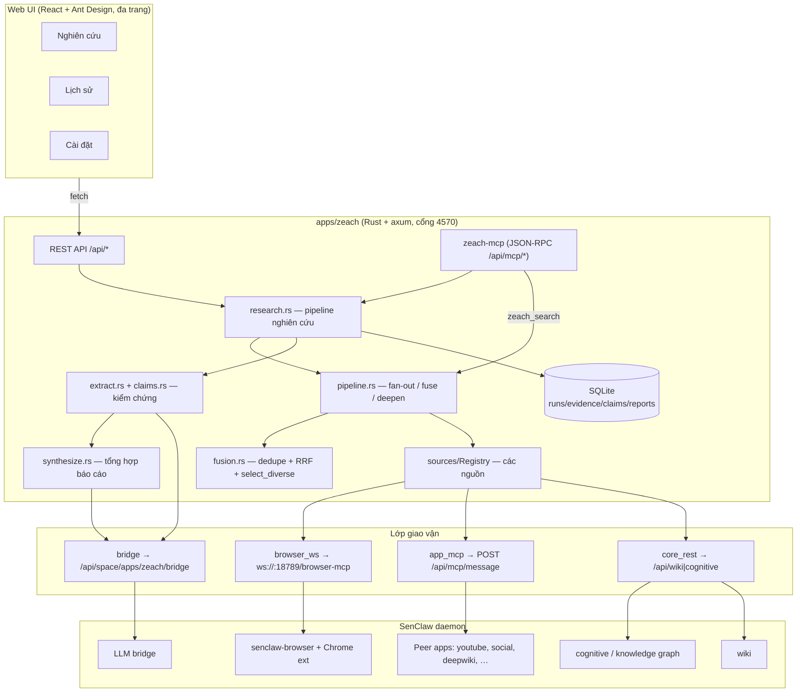
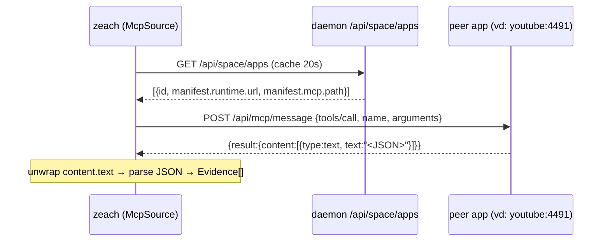
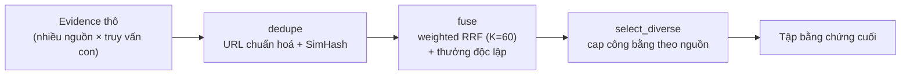
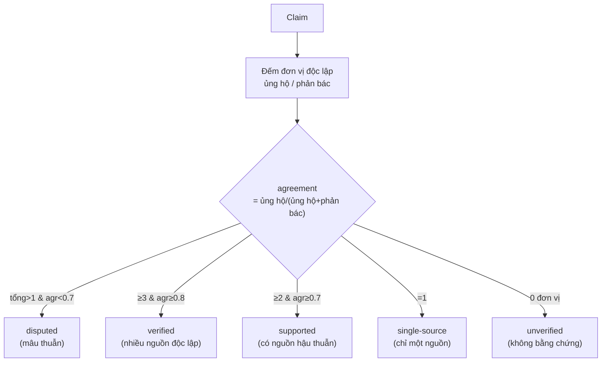
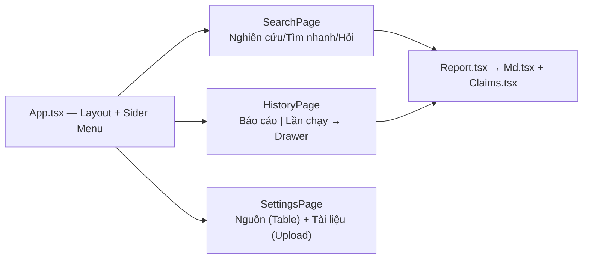

# Zeach — Nghiên cứu tổng hợp đa nguồn & báo cáo có trích dẫn

**Trạng thái:** đã dựng + kiểm chứng chạy độc lập (136 test xanh, UI đã verify qua trình duyệt), chưa e2e với daemon sống · **App:** `apps/zeach` · **Cổng:** 4570 · **MCP:** `zeach-mcp`
**Ngày:** 2026-07-21

> Zeach kế thừa toàn bộ lớp federation của [`apps/search`](search-app-design.md) (port 4530) và
> thêm một **pipeline nghiên cứu nhiều lượt + kiểm chứng chéo + tổng hợp báo cáo**. Nếu `search`
> trả lời câu hỏi bằng *một danh sách bằng chứng đã xếp hạng*, thì `zeach` trả lời bằng *một báo
> cáo có trích dẫn, đã kiểm chứng đủ để tin được*.

---

## 1. Mục tiêu

Một app nhận **một câu hỏi** rồi:

1. Gom bằng chứng từ **mọi nguồn SenClaw với tới được** (web, knowledge graph, wiki, tài liệu,
   mạng xã hội, và bất kỳ MCP nào khác) trong cùng một lần chạy.
2. **Kiểm chứng chéo** — đếm số *nguồn độc lập* xác nhận từng khẳng định, thay vì tin lời mô hình.
3. **Tổng hợp** thành báo cáo Markdown có trích dẫn `[n]` tra ngược được về từng nguồn.
4. Mở lại năng lực này cho mọi agent/app/skill khác qua **MCP dùng chung** (`zeach_search`,
   `zeach_research`).

Ba nguyên tắc bất biến, kế thừa từ `search`:

- **Nguồn hỏng ≠ không có thông tin.** Mọi lần chạy đều kèm nhật ký nguồn nào chạy/lỗi/hết giờ.
- **Độ tin cậy = độ chứng thực, KHÔNG phải xác suất đúng.** Ba nguồn cùng chép một tin sai vẫn cho
  điểm cao mà nội dung vẫn sai.
- **Mâu thuẫn thì nêu cả hai phía**, không tự chọn.

---

## 2. Kiến trúc tổng thể



- **Nhị phân:** `zeach` (Rust). Cài dạng Space App phẳng: `zeach` + `senclaw-manifest.json` +
  `web_dist/` (+ `senclaw-hub.json`). Đóng gói bằng `apps/zeach/scripts/pack.sh` → `zeach-app.zip`.
- **Dữ liệu:** `~/.senclaw/space-app-data/zeach/app.sqlite` (ngoài thư mục cài, vì cài lại xoá sạch thư mục cài).

---

## 3. Luồng nghiên cứu (`zeach_research`)

Đây là năng lực cốt lõi. Một lần chạy đi qua 5 giai đoạn; giai đoạn 4 chỉ chạy ở độ sâu `deep`.

```mermaid
flowchart LR
  Q["Câu hỏi"] --> PLAN
  PLAN["1· Plan<br/>LLM → truy vấn con"] --> GATHER
  GATHER["2· Gather<br/>fan-out mọi nguồn<br/>(song song)"] --> MERGE["dedupe + RRF<br/>+ select_diverse"]
  MERGE --> DEEPEN["Deepen<br/>tải toàn văn top web"]
  DEEPEN --> VERIFY
  VERIFY["3· Verify<br/>rút claim + đếm<br/>nguồn độc lập"] --> FOLLOW{"deep?"}
  FOLLOW -- "có, claim yếu" --> GATHER2["4· Follow-up<br/>gom thêm cho<br/>claim yếu/nhạy cảm"]
  GATHER2 --> REVERIFY["re-verify trên<br/>bằng chứng gộp"]
  REVERIFY --> SYNTH
  FOLLOW -- "không" --> SYNTH
  SYNTH["5· Synthesize<br/>LLM → báo cáo<br/>(có fallback tự dựng)"] --> OUT["Báo cáo + claims<br/>+ nhật ký nguồn"]
  OUT --> SAVE["Lưu DB<br/>(+ wiki/knowledge tuỳ chọn)"]
```



### 3.1 Plan — tách truy vấn con
`research::plan` gọi `llm.request` để tách câu hỏi thành nhiều truy vấn con phủ nhiều khía cạnh
(định nghĩa, số liệu, các bên tranh cãi, cập nhật mới). **Câu gốc luôn là truy vấn con đầu tiên**;
LLM chỉ thêm góc nhìn. LLM lỗi → chỉ dùng câu gốc (ghi vào `warnings`, không chặn).

### 3.2 Gather — fan-out & gộp
Mỗi truy vấn con chạy qua `pipeline::run` (fan-out mọi nguồn đang bật, mỗi nguồn có error-boundary
riêng — nguồn hỏng chỉ *làm mỏng* kết quả, không *làm hỏng* lần chạy). Các truy vấn con chạy **song
song** rồi gộp bằng `fusion::{dedupe, fuse, select_diverse}`. Vì fan-out của mỗi truy vấn con đã
song song sẵn, đây là song song hai lớp.

### 3.3 Deepen — đọc sâu
`pipeline::deepen` tải toàn văn `deepen_top` trang web đầu bảng qua browser WS, mỗi lần một *lane*
(`agent_id` khác nhau) để các tab đồng thời không đè nhau. Toàn văn giúp bước kiểm chứng bám vào
trang thật thay vì đoạn trích SERP.

### 3.4 Verify — kiểm chứng chéo
`extract::extract_claims` (một `llm.request`) rút các **khẳng định nguyên tử**, mỗi khẳng định gắn
số hiệu bằng chứng `[E1]…`. `claims::assess_all` chấm điểm **bằng số học**, không phải ý kiến mô hình
(xem §5). Đây chính là bước kiểm chứng chéo.

### 3.5 Follow-up (chỉ `deep`) — truy chứng
`research::follow_up_queries` chọn *tất định* (không tốn LLM) các claim yếu: `single-source`,
`unverified`, hoặc `high_stakes` mà `< 2` nguồn độc lập. Dùng nội dung claim làm truy vấn mới → gom
thêm → gộp vào bằng chứng cũ → **rút & chấm lại** trên tập lớn hơn. Bó gọn 1 vòng.

### 3.6 Synthesize — tổng hợp báo cáo
`synthesize::synthesize` **luôn dựng trước một báo cáo tất định** từ claims (nhóm theo mức chứng
thực + phụ lục nguồn), rồi gọi LLM để nâng lên bản văn xuôi. LLM lỗi / rỗng / bị cắt (`finish=="length"`)
→ trả bản tất định. Báo cáo luôn có phụ lục `## Nguồn dẫn` để mọi `[n]` tra ngược được.

### 3.7 Thang độ sâu

| Độ sâu | Truy vấn con | Cap/nguồn | Đọc sâu top | Vòng follow-up |
|---|---|---|---|---|
| `quick` | 1 | 8 | 0 | không |
| `standard` (mặc định) | 3 | 10 | 4 | không |
| `deep` | 5 | 12 | 6 | có |

---

## 4. Lớp federation

### 4.1 Bốn giao vận (`src/transport/`)

`mcp.call` trên bridge là **stub** (luôn `pending`), nên Zeach không định tuyến mọi thứ qua
`agent.run` (đặt một LLM vào giữa một luồng fan-out cơ học). Thay vào đó có bốn đường tất định:

| Giao vận | Đích | Dùng cho |
|---|---|---|
| `browser_ws` | `ws://127.0.0.1:18789/browser-mcp` | tìm web (SERP), tải toàn văn |
| `app_mcp` | `POST {origin}/api/mcp/message` | gọi MCP của app khác (peer) |
| `core_rest` | `/api/wiki/*`, `/api/cognitive/*` | wiki + knowledge graph |
| `bridge` | `POST /api/space/apps/zeach/bridge` | `llm.request`, `agent.run`, `knowledge.save` |

**Khám phá peer:** `GET {daemon}/api/space/apps` → đọc `manifest.runtime.url` (hoặc `port`) +
`manifest.mcp.path`; đường `/api/mcp/sse` được ánh xạ sang sibling `/api/mcp/message` mang `tools/call`.
Cache 20s.



### 4.2 Nguồn (`src/sources/`)

| Nguồn | Loại (kind) | Đường | Ghi chú |
|---|---|---|---|
| `web` | Web | browser_ws (google→bing failover) | tìm SERP không cần LLM |
| `knowledge` | Internal | REST `POST /api/cognitive/search` | **`space:None` = toàn cục**, `mode:"hybrid"` (bắt buộc) |
| `wiki` | Internal | REST `GET /api/wiki/search` | FTS **AND-join** → phải truyền biến thể *hẹp* |
| `corpus` | Docs | SQLite FTS5 (tự sở hữu) | tài liệu do người dùng tải lên |
| `memory` | Internal | `agent.run` (MCP-only) | không có REST cho `memory_search` |
| MCP tuỳ ý | tuỳ khai báo | app_mcp | `McpSource` biến *một công cụ MCP bất kỳ* thành nguồn, tự dò trường title/url/snippet |

> **Vì sao knowledge đi REST chứ không đi bridge?** Bridge `knowledge.search` mặc định `space` =
> id của app gọi (bó kết quả vào không gian `zeach`). Endpoint REST coi `space:None` là **toàn
> cục** — đúng thứ federated search cần.

Presets sẵn: `youtube`, `deepwiki`. Template cần cấu hình: `social` (cần `platform` + `handle` vì
tìm bằng phiên đăng nhập của một tài khoản cụ thể — đoán sai là tìm dưới danh nghĩa người khác).

### 4.3 Gộp & xếp hạng (`fusion.rs`)



- `dedupe`: gộp trùng theo URL chuẩn hoá, rồi SimHash (Hamming ≤ 3). **URL khác nhau đã biết không
  bao giờ gộp** (bản sao đăng lại phải giữ riêng để đếm độc lập đúng).
- `fuse`: `score = Σ_s w_s/(K+rank_s)`, rồi nhân hệ số thưởng theo *số loại nguồn* độc lập. Luôn hợp
  nhất theo **hạng**, không theo điểm thô (thang điểm mỗi nguồn không so được).
- `select_diverse`: cap mỗi nguồn `ceil(limit/số_nguồn)` để một nguồn trọng số cao không quét sạch
  mọi ô; phần dôi ra để dành rồi lấp lại — không bao giờ vứt.

---

## 5. Mô hình kiểm chứng (`claims.rs`)

Mô hình đề xuất claim + gắn số hiệu bằng chứng. **Mọi thứ sau đó là số học** — một mức tin cậy do
mô hình quyết là ý kiến; một mức do *đếm nguồn độc lập* quyết là sự thật về những gì đã lấy được.

- **Đơn vị độc lập** = cặp `(loại nguồn, tên miền)` khác nhau — KHÔNG phải theo `source_id`. Ba nền
  mạng xã hội chép lại một thông cáo báo chí ≠ ba xác nhận. Bằng chứng nội bộ không có tên miền
  (wiki, node graph) gộp về một đơn vị/loại: wiki đồng ý với graph của bạn là *bạn tự đồng ý với
  mình*.
- **Chống claim ma:** một claim chỉ được trích bằng chứng *có thật trong lần chạy*. Số hiệu bịa bị
  bỏ và **ghi lại dấu vết** (`dropped_citations`), không âm thầm biến mất.



Điểm tin cậy `= (1 − e^(−n/2)) × agreement` — tăng theo độ độc lập nhưng **không bao giờ đạt 1**
(chứng thực không phải chắc chắn). Claim bị một mâu thuẫn chạm tới không được ở lại `verified/supported`
→ hạ thành `disputed`. `high_stakes` (số liệu tiền/pháp lý/y tế/tài chính, hoặc quy kết phát ngôn)
được đánh dấu để ưu tiên vòng follow-up.

---

## 6. Tổng hợp báo cáo (`synthesize.rs`)

- Đánh số bằng chứng **1-based đúng theo thứ tự tập bằng chứng trả cho người gọi** → mọi `[n]` tra
  được cả ở UI lẫn trong Markdown. Số hiệu do hệ tính, không để mô hình bịa.
- Prompt đưa claim đã phân tầng + bằng chứng đánh số + mâu thuẫn; yêu cầu văn xuôi có `[n]`, không
  thêm thông tin ngoài danh sách.
- **Sàn tất định:** nếu LLM lỗi/rỗng/`finish=="length"`, trả báo cáo tự dựng từ claims. Zeach không
  bao giờ trả "không có báo cáo", chỉ trả bản đơn giản hơn.

---

## 7. Lưu trữ (`schema.sql`)

```
runs ─┬─ run_sources     (nhật ký nguồn: ok/timeout/error/skipped)
      ├─ evidence        (bằng chứng + provenance hits_json)
      ├─ claims ─── claim_evidence (stance: supports/refutes)
      ├─ contradictions
      └─ reports         (báo cáo, version tăng dần theo run)
corpus_docs ─ corpus_chunks (FTS5)     mcp_sources     source_config
```

`db.save_report` bump `version` mỗi lần tổng hợp lại cùng một run (giữ lịch sử, không đè). `get_report`
gộp sẵn run summary + claims + contradictions để đọc lại đủ tin.

---

## 8. Bề mặt MCP (`zeach-mcp`) — kênh dùng chung

| Công cụ | Vai trò |
|---|---|
| **`zeach_search`** | Tìm liên nguồn **không LLM** → bằng chứng đã fuse. Kênh tra cứu nhanh, rẻ cho app/agent khác. |
| **`zeach_research`** | Pipeline sâu → báo cáo có trích dẫn (`depth`, `save_wiki`, `save_knowledge`). |
| **`zeach_report`** | Đọc lại báo cáo đã lưu; bỏ `run_id` để liệt kê. |
| `zeach_ask` | Tìm + rút claim (mức trung gian, có LLM). |
| `zeach_claims` / `zeach_runs` / `zeach_run` | Đọc lại claims / danh sách run / một run. |
| `zeach_sources` / `zeach_source_config` | Trạng thái nguồn / bật-tắt-cân trọng số. |
| `zeach_source_add` / `_remove` / `_templates` / `zeach_mcp_tools` / `zeach_sync` | Đăng ký nguồn MCP không cần code. |
| `zeach_corpus_add` / `_list` / `_remove` | Kho tài liệu. |
| `zeach_status` | Tình trạng app. |

REST phản chiếu: `/api/{search,ask,research,reports,reports/:id,runs,runs/:id,sources,...}` — UI và
mọi thành phần khác chạy **đúng cùng một pipeline**.

---

## 9. Web UI — đa trang (React + Ant Design)



- **Theme:** `theme.ts` — token nhà (`colorPrimary #5e4ae3`, viVN, bo góc 8), `useThemeMode` đồng bộ
  sáng/tối qua handshake `senclaw:init/theme` + `prefers-color-scheme`.
- **Trạng thái dùng chung:** `sources` + `selected` nâng lên `App` để trang Nghiên cứu và Cài đặt
  cùng dùng.
- `Claims.tsx` chuẩn hoá được cả dữ liệu lịch sử (`run_claims` không lưu `tier_label`/`dropped_citations`).

---

## 10. Cấu hình (`config.rs`)

| Biến | Mặc định | Ý nghĩa |
|---|---|---|
| `PORT` | `4570` | cổng HTTP (daemon tiêm) |
| `SENCLAW_SPACE_APP_ID` | `zeach` | id không gian (scope knowledge/bridge) |
| `SENCLAW_BASE_URL` | `http://127.0.0.1:18788` | UI server + bridge |
| `SENCLAW_WS_PORT` | `18789` | gateway WS (`/browser-mcp`) |
| `SENCLAW_AGENT_ID` | `space-app-zeach` | định danh tab trình duyệt |
| `ZEACH_FANOUT_CONCURRENCY` | `8` | số (nguồn×truy vấn con) chạy đồng thời |
| `ZEACH_SOURCE_TIMEOUT_MS` | `20000` | timeout mỗi nguồn |
| `ZEACH_DATA_DIR` | `~/.senclaw/space-app-data/zeach` | thư mục dữ liệu |

---

## 11. Ràng buộc & bẫy đã biết

- **Bridge `llm.request` không có `temperature`** — quyết định luận phải đến từ prompt + validation.
- **Trần đầu ra:** `finish=="length"` là *lỗi*, không phải câu ngắn — phải thu nhỏ input/retry.
- **`mcp.call` là stub** → dùng `app_mcp` (POST `/api/mcp/message`) để gọi peer.
- **knowledge:** đi REST với `space:None` (toàn cục) + `mode:"hybrid"`; đừng đi bridge (bị bó vào space).
- **wiki FTS AND-join** → truyền biến thể truy vấn hẹp, nếu không im lặng trả rỗng.
- **UI:** `base:'./'` bắt buộc (chạy dưới proxy `/api/space/apps/zeach/proxy/`). AntD CSS-in-JS +
  icon SVG chạy dưới proxy không cần cấu hình. Sider `breakpoint`/`useBreakpoint` bắt sai trong iframe
  preview → dùng width cố định + nút gập thủ công.
- **Vận hành:** `pkill -f zeach` giết luôn shell của chính mình (đường dẫn chứa 'zeach') — kill theo
  `lsof -ti tcp:PORT`; process cũ còn giữ cổng khiến UI vừa build ra vẫn hiện bản cũ (asset hash cũ).

---

## 12. Còn lại

- Chạy **end-to-end với daemon sống** (LLM bridge + browser WS) cho một lần `zeach_research` thật.
- Cân nhắc code-split bundle web (hiện ~1.28MB / 403KB gz do AntD).
